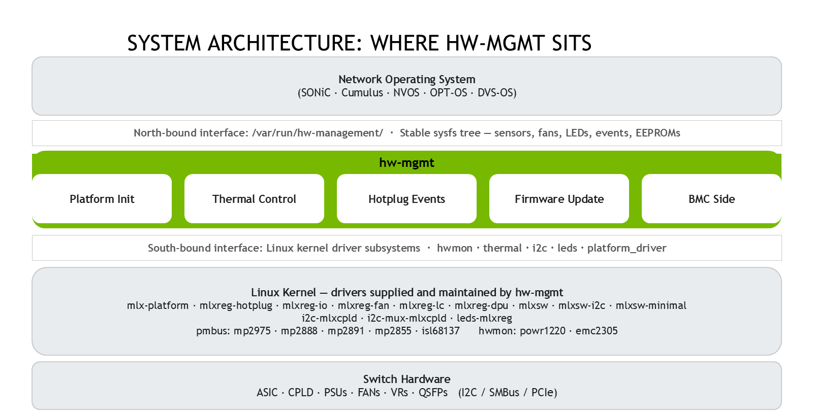
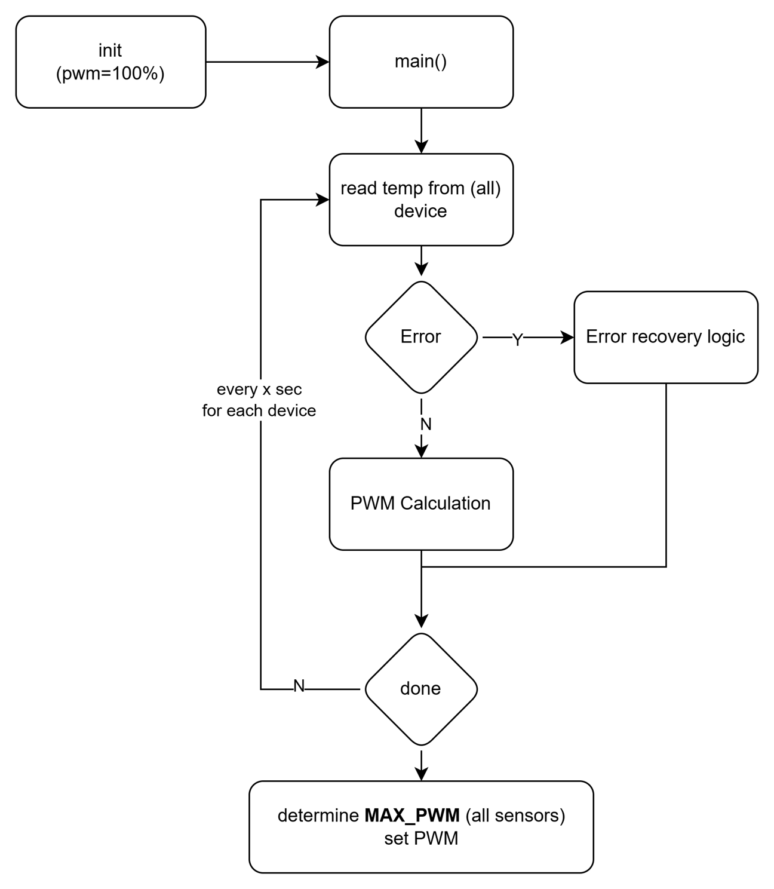

# Release Notes Update History

| Revision | Date | Description |
|----------|------|-------------|
| 3.2.8 | August 2026 | §3.1.61 `config/cable_cartridge<n>_valid`: IPMI FRU check result per cable cartridge (N51XX_LD / N61XX_LD) |
| 3.2.7 | August 2026 | §3.1.60 `config/led_control_type` platform LED owner map; §3.16.28 `led/led_<name>_control` (`led_sw` / `led_hw` / `led_hw_sw`); glob masks `*` and `?` |
| 3.2.6 | June 2026 | §3.1.59 and §3.4 PDB hotswap scale (SN6600_LD / lm5066i); §3.24 AST2700 BMC reset cause tree; §3.25 BMC A2D leakage runtime layout; N6300_LD (HI185) platform notes; §3.18 cpu_shutdown_req hw-mgmt polling note |
| 3.2.5 | June 2026 | §2.2 HI189 BMC peripheral table; §3.3.7–§3.3.8 BMC EEPROM bodies; §3.20 BMC stack tags and CPU-on-BMC thermal cross-refs; §3.23 BMC status bodies (present, bmc_to_cpu_ctrl, MCTP) |
| 3.2.4 | June 2026 | Added §2.2 **Host and BMC software stacks**: separate repo paths (`usr/` vs `bmc/usr/`), packages, handlers, and examples; stack notes in §3 intro and §3.20 Thermal |
| 3.2.3 | June 2026 | §3.20 thermal: filled missing section bodies; TOC aligned; per-HID BMC examples under `bmc/examples/<HID>/examples/` |
| 3.2.2 | June 2026 | BMC thermal sysfs (HI189 / `lm75`): documented `bmc_temp_input` and `bmc_temp`; removed obsolete TOC entries for `bmc_crit` / `bmc_min` (not created on BMC stack) |
| 3.2.1 | May 2026 | Corrected N51XX_LD platform family reset-cause list in **Get Reset Cause** (#5014001)<br>• Documented 22 CPLD-supported reset causes for N51XX_LD/GB200 systems<br>• Removed unsupported causes: `reset_ac_pwr_fail`, `reset_aux_pwr_or_ref`, `reset_from_asic`, `reset_reload_bios` |
| 3.2 | March 2026 | Added SN6600_LD (SN66XX_LD family, SKU HI193) liquid-cooled platform support<br>• Validation: `usr/etc/hw-management-sensors/sn66xxld_sensors.conf`, `hw-management.sh` / event scripts<br>**Platform notes:**<br>• Single ASIC (`asic_num`=1), 4 CPLDs, `hotplug_pdbs`=2, `pdb_hotswap1/2` and `pdb_pwr_conv1/2`<br>• ASIC voltmons: 19 sysfs indexes (`voltmon1`-`14`, `voltmon16`-`20` on captured tree)<br>• SODIMM temp: JC42 at 0x52/0x53 on I2C bus 10<br>• Watchdog: `watchdog/main/` and `watchdog/aux/` hierarchy<br>• PDB hot-plug events: `events/pdb1`, `events/pdb2`<br>**Updated Sections:**<br>• Liquid-cooled applicability notes extended to SN66XX_LD across environment, alarms, thermal, and leakage-related text<br>• Config: documented optional `psu<X>_i2c_bus` (hw-management internal; OS must not require it) |
| 3.1 | January 2026 | Added N6100_LD (N61XX_LD family) liquid-cooled multi-ASIC platform support<br>**New Sections for N6100_LD:**<br>• Multi-ASIC Health (asic_health, asic2_health, asic3_health, asic4_health)<br>• MCU Reset Control (mcu1_reset, mcu2_reset)<br>• Cable Cartridge EEPROM (cable_cartridge1-4_eeprom)<br>• Cartridge Counter (config/cartridge_counter)<br>• Cartridge Status (cartridge1-4)<br>• eRoT Events (erot1_ap, erot1_error)<br>• Config: asic_num=4, erot_count=1<br>**Updated Sections:**<br>• Power Converters: Added pwr_conv naming (vs pdb_pwr_conv for SN58XX_LD)<br>• Updated all liquid-cooled references to include N61XX_LD family<br>• Extended voltmon support for 16 PMICs (voltmon1-16)<br>• SODIMM Temperature Sensors: Updated to include both SN58XX_LD and N61XX_LD |
| 3.0 | September 2025 | Complete document alignment with Word document source<br>• Updated title and branding to NVIDIA<br>• Complete sysfs hierarchy coverage with 300+ attributes<br>• Professional markdown formatting throughout<br>• Added comprehensive examples for all attributes<br>• Updated all 22 major sections (3.1-3.22)<br>• Added Watchdog, JTAG, and BMC sections<br>• Complete thermal monitoring documentation<br>• Enterprise-grade documentation ready for production |
| 2.8 | April 1st 2024 | Added temperature, BMC and power related attributes |
| 2.6 | July 1st 2024 | Added DPU related attributes |
| 2.4 | Aug 31, 2023 | Adding 'asics_init_done' and 'asic_chipup_completed' |
| 2.3 | July 11, 2023 | Update LEDs colors to be either red or amber for FAN LED, PSU LED and status LED |
| 2.2 | Feb 15, 2022 | Add many SN4800 related attributes Add PSU FW version related attributes |
| 2.1 | Sept 15, 2021 | Add PSU MIN/MAX fan speed. Added the following sections:<br>• Get psu sensors value.<br>• Get psu sensors thresholds.<br>• Get psu sensors capability. |
| 2.0 | May 25, 2021 | Edit reset causes - page 31-32 Add spectrum 3<br>Remove comex_wd reason which is disabled. |
| 1.9 | Dec 30, 2020 | Added updates for Fan Direction JTAG |
| 1.8 | July 01, 2020 | Added the following sections:<br>• Read PSU VPD Info<br>• Get Hot-plug Fan Number<br>• Get Hot-plug PSU Number<br>• Get Hot-plug PWR Number<br>• Get FAN hot-plug event status<br>• Get PSU hot-plug event status<br>• PWR hot-plug event status<br>• Read PSU min/max Fan Speed<br>• Read/write Time Window for Thermal Control Periodic Log Report |
| 1.7 | Apr 13, 2020 | Added the following sections:<br>• 2.2.3 Read SFP Counter<br>• 2.2.4 Read Module Counter<br>• 2.2.5 Read Max System Fans (rotors)<br>• 2.2.6 Read Fan Drawer Number<br>• 2.6.3 Get CPLD Part Number<br>• 2.6.4 Get CPLD Minor Version<br>• 2.6.5 Get CPLD Full Version<br>Modified the following sections:<br>• 2.3.2 Read Fan Module EEPROM Data<br>• 2.6.2 Get CPLD Major Version<br>• 2.7.19 Read PSU Temperature<br>• 2.7.26 Read Temperature Critical Module<br>• 2.7.27 Read Temperature Emergency Module<br>• 2.7.28 Read Temperature Fault Module<br>• 2.7.29 Read Temperature Input Module |
| 1.6 | Apr 12, 2020 | Modified "2.6.8 Get Reset Cause" |
| 1.5 | Nov 27, 2019 | Modified "2.6.8 Get Reset Cause" |
| 1.4 | Sept 23, 2019 | Added "2.6.3 Fan_Dir"<br>Modified "2.6.8 Get Reset Cause" |
| 1.3 | June 13, 2019 | Added:<br>• Thermal<br>• Watchdog |
| 1.2 | April 12, 2019 | Updated Sysfs |
| 1.1 | December 18, 2018 | Added support for new systems |
| 1.0 | September 8, 2015 | First release |

# Introduction

NVIDIA hw-management package uses a virtual file system provided by the Linux kernel called sysfs.

The sysfs file system enumerates the devices and buses attached to the system in a file system hierarchy that can be accessed from the user space.

The major advantage of working with sysfs is that it makes HW hierarchy easy to understand and control without having to learn about HW component location and the buses through which they are connected.

## Software Components

Figure 1 presents the system architecture and layer separation for sysfs support.

##### Figure 1 - Sysfs Layout



## Host and BMC software stacks

The **hw-mgmt** repository ships two Debian packages that both expose the same virtual
hierarchy under **`/var/run/hw-management/`** (`$bsp_path` in this manual), but they are built
from **different source trees** and run on **different processors**:

| | **Host stack** | **BMC stack** |
|---|----------------|---------------|
| **Role** | Switch CPU / NOS (SONiC, ONL, Cumulus, …) | Dedicated BMC SoC (for example AST2700 on Microsoft Sonic BMC OS) |
| **Debian package** | `hw-management` | `hw-management-bmc` |
| **Repository source** | `usr/` (scripts under `usr/usr/bin/`, platform data under `usr/etc/`) | `bmc/usr/` (mirrors host layout; platform data under `bmc/usr/etc/<HID>/`) |
| **Installed on target** | `/usr/bin/hw-management*.sh`, `/usr/bin/hw_management_thermal_control*.py`, `/lib/udev/rules.d/50-hw-management-events.rules`, … | `/usr/bin/hw-management-bmc*.sh`, `/lib/udev/rules.d/5-hw-management-bmc-events.rules`, `/etc/<HID>/`, … |
| **Primary event handlers** | `hw-management-chassis-events.sh`, `hw-management-thermal-events.sh` | `hw-management-bmc-events.sh` (and helpers under the same prefix) |
| **Init / systemd** | `hw-management.service` | `hw-management-bmc-init.service` and related BMC units (see `bmc/README.md`) |
| **Examples / reference layouts** | Platform sensors in `usr/etc/hw-management-sensors/`; scripts under `usr/usr/bin/` | Flat files under `bmc/examples/`; per-HID template at `bmc/examples/HIxxx/examples/` |
| **Developer guide** | Repository root `README.md` | `bmc/README.md`, `bmc/DEVELOPER_GUIDE.md` |

**How to use this manual**

- **§3.x attribute sections** describe **`$bsp_path` nodes** as seen by applications on either
  CPU or BMC when that node is created on the platform.
- Sections that name **host-only** handlers (for example `hw-management-thermal-events.sh`,
  `hw_management_thermal_control.py`) apply to the **host package** unless stated otherwise.
- Sections that name **`hw-management-bmc-*`** or **HI189 / BMC thermal stack** apply to the
  **BMC package** on systems that ship it.
- Some nodes exist on **one stack only** (for example host ASIC/voltmon thermal vs BMC
  `bmc_temp_input` from `hw-management-bmc-events.sh`). Check the platform or the validated
  system tree for your SKU.

Both stacks may be present on the same product (CPU + BMC each running their own package);
they do **not** share the same `/usr/bin` install tree on a single root filesystem.

**Stack column (used in §3.x):**

| Label | Meaning |
|-------|---------|
| **Host** | Node created by `hw-management` on the switch CPU (`hw-management-thermal-events.sh`, `hw-management-chassis-events.sh`, `hw-management.sh`) |
| **BMC** | Node created by `hw-management-bmc` on the BMC SoC (`hw-management-bmc-events.sh` and related BMC scripts) |
| **Host + BMC** | Same logical name may exist on both images; paths/handlers differ — see section note |

**BMC stack — HI189 reference (`hw-management-bmc-events.sh`, validated against
`bmc/usr/etc/HI189/5-hw-management-bmc-events.rules` and
`hw-management-bmc-early-i2c-devices.json`):**

| `$bsp_path` subtree | Symlinks / behaviour | Peripheral / driver | Stack |
|--------------------|----------------------|----------------------|-------|
| `thermal/cpu_temp_input`, `cpu_temp`, `cpu_min` | Host **CPU** temperature via BMC-side I2C | **sbtsi** | BMC |
| `thermal/bmc_temp_input`, `bmc_temp` | **BMC board** ambient (`bmc_min` not created — **lm75** has no `temp1_min`) | **lm75** | BMC |
| `eeprom/eeprom_system` | System VPD EEPROM | **24c512** | BMC |
| `eeprom/eeprom_bmc` | BMC FRU EEPROM | **24c02** | BMC |
| `system/*` (many attrs) | **mlxreg-io** / **mlxreg-hotplug** register files | CPLD / platform control on BMC | BMC |
| `leakage/<N>/<j>/…` | A2D leak-detector tree (input, thresholds, type) | ADS1015 / ADS7924 / MAX1363 per JSON config | BMC |
| `bmc/reset_*`, `bmc/domains/reset_*`, `bmc/raw_scu*` | AST2700 BMC reset-cause exporter | `hw-management-bmc-get-reset-cause.sh` | BMC |

Example layouts: **`bmc/examples/hw-management-bmc-thermal-sysfs.txt`** (delivered path),
`bmc/examples/hw-management-bmc-eeprom-sysfs.txt`, `bmc/examples/hw-management-bmc-system-sysfs.txt`,
`bmc/examples/hw-management-bmc-leakage-sysfs.txt`.

**Host stack — BMC-related nodes (CPU image, not the BMC package):**

| Node | Implementation | Stack |
|------|----------------|-------|
| `system/bmc_present` | GPIO symlink (host `hw-management.sh` platform GPIO mapping) | Host |
| `system/bmc_to_cpu_ctrl` | **mlxreg-io** on CPU (`mlxplat`; same tree) | Host |
| `system/cpu_mctp_ready` | **mlxreg-io** on CPU (same tree) | Host |
| `config/mctp_addr`, `config/mctp_bus` | Written by `hw-management.sh` when platform defines MCTP (e.g. N5110) | Host |

Do not assume host ASIC/PSU/fan thermal nodes exist on the BMC image, or that BMC `cpu_temp_*`
nodes exist on the CPU image — check `$bsp_path` on the target root filesystem.

**Virtual / SimX platforms (no production sysfs tree in repo):** HI194 (N7200_LD), HI199 (N7300_LD), HI200 (N7400_LD) and other SimX
SKUs may exit early from `hw-management-ready.sh` with mock values only (`check_simx` paths in
`hw-management.sh`). Do not use these for production attribute validation.

## Hierarchy and Structure

The package uses the Linux default hierarchy structure of sysfs under the directory /var/run/hw-management.

This path is used by existing applications that use auto-discovery to find existing HW components. Two examples for such applications are:

- libsysfs – the libraries provide a consistent and stable interface for querying system device information exposed through sysfs.

- systool – a utility built upon libsysfs that lists devices by bus, class, and topology.

The disadvantage of using this path is that the hierarchy model includes the BUS type and location model which is subject to change between different system types.

To resolve this limitation, the virtual hierarchy structure that is not HW dependent is supported. This hierarchy is a collection of soft links to the default sysfs structure. This document describes the way to work with this hierarchy in order to control the HW.

Chassis attributes information exported through sysfs can be utilized by a number of standard Linux tools. So, for example, the following are tools from the Linux packages lm-sensors and fancontrol, which are capable of operating on top of sysfs infrastructure:

- pwmconfig – tests the pulse width modulation (PWM) outputs of sensors and configures fancontrol

- fancontrol – automated software-based fan speed regulation

- sensors – print sensors information
## Sysfs Initialization and Driver Registration

As described in the previous sections, sysfs structure provides access to HW drivers. These
drivers need to be initialized before using sysfs. In addition, NVIDIA virtual hierarchy also
needs to be created in order to use it.

The following applies to the **host** package (`hw-management`). For the **BMC** package,
see **§2.2** and `bmc/README.md` (systemd units, udev rules, and scripts under
`hw-management-bmc-*`).

The package provides a simple way to initialize the drivers using the set of shell scripts. These scripts support initialization and de-initialization of driver, virtual hierarchy structure, udev events handling, based on a set of NVIDIA system specific udev rules.

Package contains the following files, used within the workload:

- /lib/systemd/system/hw-management.service: system entries for thermal control activation and de-activation.

- /lib/udev/rules.d/50-hw-management-events.rules: udev rules defining the triggers on which events should be handled. When trigger is matched, rule data is to be passed to the event handler (see below file /usr/bin/hw-management-events.sh).

- /usr/bin/hw_management_thermal_control.py: contains thermal algorithm implementation (TC v2.0).
 /usr/bin/hw_management_thermal_control_2_5.py: contains thermal algorithm implementation (TC v2.5).

- /usr/bin/hw-management-chassis-events.sh and /usr/bin/hw-management-thermal-events.sh: handle udev triggers, according to the received data, it creates or destroys symbolic links to sysfs entries. It allows to create system independent entries, and it allows thermal controls to work over this system independent model. Raises signal to thermal control service in case of fast temperature decreasing. It could happen in case one or few very hot port cables have been removed. Sets PS units internal FAN speed to default value when unit is connected to power source.

- /usr/bin/hw-management.sh: performs initialization and de-initialization, detects the system type, connects thermal drivers according to the system topology, activates and deactivates thermal algorithm.

- /usr/bin/hw-management-led-state-conversion.sh and /usr/bin/hw-management-power- helper.sh: helper scripts.

- /etc/modprobe.d/hw-management.conf and /etc/modules-load.d/hw-management- modules.conf: configuration for kernel modules loading.

For more details follow package README file (`README.md` for host, `bmc/README.md` for BMC).

**Thermal management overview**

Thermal control is split into two cooperating layers. A data-collection layer (driven by
udev events and periodic polling) reads temperature, fan, and power sensors and publishes
them through the sysfs hierarchy described in this manual. A thermal control layer then
reads that sysfs data, calculates the required fan PWM (duty cycle) per component, and
applies the highest PWM demanded by any sensor to keep every monitored component within
its safe operating range. Two thermal control implementations exist — TC v2.0 and TC v2.5
— selected automatically based on the hardware platform; see **Thermal Control** later in
this manual for version details, and the companion
[Thermal Monitoring for NVIDIA Systems with Third Party OS](Thermal_Monitoring_for_NVIDIA_Systems_with_third_party_OS.md)
document for the full algorithm description.

##### Figure 2 - Thermal Management Flow



# Virtual SysFS Hierarchy

NVIDIA virtual hierarchy supports the following HW control ($bsp_path below is a location of virtual SysFS hierarchy, in standard Linux distributions, like Debian, RedHat, Fedora, etcetera this is
/var/run/hw-management folder).

##### Table 1 - NVIDIA Hierarchy Node Support

| Node Path | Purpose |
|-----------|---------|
| $bsp_path/config | Internal system specific configuration data |
| $bsp_path/eeprom | Gets raw data from EEPROM in system modules |
| $bsp_path/environment | Gets information on environmental sensors (A2D, Volt, Curr) |
| $bsp_path/led | Gets/sets LED color (see **LED_Control_API.md** for runtime `led_<func>` naming and CPLD behaviour) |
| $bsp_path/bin |  |
| $bsp_path/events |  |
| $bsp_path/firmware |  |
| $bsp_path/ui | Textual labels for sensors |
| $bsp_path/power | Gets information from power sensors |
| $bsp_path/system | Gets/sets system variables and settings (CPLD version, fan dir, reset, pwr cycle) |
| $bsp_path/thermal | Gets variant thermal sensors in systems and gets/sets fan attributes |
| $bsp_path/watchdog | Standard watchdog sysfs attributes |
| $bsp_path/alarm | Get System chassis |
| $bsp_path/jtag | Provides interface for JTAG CPLD burn |
| $bsp_path/sysfs_labels_rdy |  |
| $bsp_path/fast_sysfs_labels_rdy |  |

Detailed information on each of these nodes can be found in the following sections.

**Stack applicability:** Most §3.x nodes are created by the **host** stack
(`hw-management-thermal-events.sh` / `hw-management-chassis-events.sh`). Sections tagged
**Stack: BMC** or naming **`hw-management-bmc-events.sh`** apply to the **BMC package** only
(see **§2.2**). §3.23 documents host-visible BMC status; BMC `system/` register layout is in
`bmc/examples/hw-management-bmc-system-sysfs.txt`.

Note: some of the attributes described below are not relevant to all platforms and will exist only on the platforms which support this attribute.
## Config Control

### Get ASIC Bus

```{=latex}
\begin{minipage}{\linewidth}
\small
\begin{tabular}{@{}>{\bfseries}p{0.20\linewidth} p{0.245\linewidth} p{0.245\linewidth} p{0.245\linewidth}@{}}
\toprule
Node name & \multicolumn{3}{p{0.735\linewidth}}{\texttt{\small \$bsp\_path/config/asic\_bus}} \\
\midrule
Description & \multicolumn{3}{p{0.735\linewidth}}{Get system ASIC bus number} \\
Access & \multicolumn{3}{p{0.735\linewidth}}{Read only} \\
Release version & \multicolumn{3}{p{0.735\linewidth}}{1.0} \\
\multirow{2}{*}{Arguments} & \textbf{Name} & \textbf{Data type} & \textbf{Values} \\
 & Status & Integer & 1-99 \\
Example & \multicolumn{3}{p{0.735\linewidth}}{Get asic bus number: \texttt{\small cat \$bsp\_path/config/asic\_bus}} \\
\bottomrule
\end{tabular}
\end{minipage}
\vspace{3mm}
```

### Get ASIC I2C Bus

```{=latex}
\begin{minipage}{\linewidth}
\small
\begin{tabular}{@{}>{\bfseries}p{0.20\linewidth} p{0.245\linewidth} p{0.245\linewidth} p{0.245\linewidth}@{}}
\toprule
Node name & \multicolumn{3}{p{0.735\linewidth}}{\texttt{\small \$bsp\_path/config/asic\textless{}index\textgreater{}\_i2c\_bus\_id}} \\
\midrule
Description & \multicolumn{3}{p{0.735\linewidth}}{Get ASIC \textless{}index\textgreater{} I2C bus} \\
Access & \multicolumn{3}{p{0.735\linewidth}}{Read only} \\
Release version & \multicolumn{3}{p{0.735\linewidth}}{V.7.0030.2930} \\
\multirow{2}{*}{Arguments} & \textbf{Name} & \textbf{Data type} & \textbf{Values} \\
 &  &  &  \\
Example & \multicolumn{3}{p{0.735\linewidth}}{Get ASIC I2C bus address: \texttt{\small cat \$bsp\_path/config/asic1\_i2c\_bus\_id}} \\
\bottomrule
\end{tabular}
\end{minipage}
\vspace{3mm}
```

### Get ASIC PCI Bus

```{=latex}
\begin{minipage}{\linewidth}
\small
\begin{tabular}{@{}>{\bfseries}p{0.20\linewidth} p{0.245\linewidth} p{0.245\linewidth} p{0.245\linewidth}@{}}
\toprule
Node name & \multicolumn{3}{p{0.735\linewidth}}{\texttt{\small \$bsp\_path/config/asic\textless{}index\textgreater{}\_pci\_bus\_id}} \\
\midrule
Description & \multicolumn{3}{p{0.735\linewidth}}{Get ASIC PCI bus ID} \\
Access & \multicolumn{3}{p{0.735\linewidth}}{Read only} \\
Release version & \multicolumn{3}{p{0.735\linewidth}}{V.7.0020.1338} \\
\multirow{2}{*}{Arguments} & \textbf{Name} & \textbf{Data type} & \textbf{Values} \\
 &  &  &  \\
Example & \multicolumn{3}{p{0.735\linewidth}}{Get asic PCI bus number: \texttt{\small cat \$bsp\_path/config/asic1\_pci\_bus\_id}} \\
\bottomrule
\end{tabular}
\end{minipage}
\vspace{3mm}
```

### Get ASIC Chip-up completed

```{=latex}
\begin{minipage}{\linewidth}
\small
\begin{tabular}{@{}>{\bfseries}p{0.20\linewidth} p{0.245\linewidth} p{0.245\linewidth} p{0.245\linewidth}@{}}
\toprule
Node name & \multicolumn{3}{p{0.735\linewidth}}{\texttt{\small \$bsp\_path/config/asic\_chipup\_completed}} \\
\midrule
Description & \multicolumn{3}{p{0.735\linewidth}}{Get ASIC count which has already initialized. When asic\_chipup\_completed == asic\_num, asics\_init\_done should be set to "1'} \\
Access & \multicolumn{3}{p{0.735\linewidth}}{Read} \\
Release version & \multicolumn{3}{p{0.735\linewidth}}{1.0} \\
\multirow{2}{*}{Arguments} & \textbf{Name} & \textbf{Data type} & \textbf{Values} \\
 & Status & Integer & 0..asic\_count \\
Example & \multicolumn{3}{p{0.735\linewidth}}{Get already initialized asic count: \texttt{\small cat \$bsp\_path/config/asic\_chipup\_completed}} \\
\bottomrule
\end{tabular}
\end{minipage}
\vspace{3mm}
```

### Get ASIC init done

```{=latex}
\begin{minipage}{\linewidth}
\small
\begin{tabular}{@{}>{\bfseries}p{0.20\linewidth} p{0.245\linewidth} p{0.245\linewidth} p{0.245\linewidth}@{}}
\toprule
Node name & \multicolumn{3}{p{0.735\linewidth}}{\texttt{\small \$bsp\_path/config/asics\_init\_done}} \\
\midrule
Description & \multicolumn{3}{p{0.735\linewidth}}{Get ASIC init done status. 1 – All asic initialized and ready. 0 – One or more ASICs not ready When asic\_chipup\_completed == asic\_num, asics\_init\_done should be set to "1'} \\
Access & \multicolumn{3}{p{0.735\linewidth}}{Read} \\
Release version & \multicolumn{3}{p{0.735\linewidth}}{1.0} \\
\multirow{2}{*}{Arguments} & \textbf{Name} & \textbf{Data type} & \textbf{Values} \\
 & Status & Integer & 1 – ALL ASICs ready\textless{}br\textgreater{}0 – One or more ASICs not ready \\
Example & \multicolumn{3}{p{0.735\linewidth}}{Get asics init ready: \texttt{\small cat \$bsp\_path/config/asics\_init\_done}} \\
\bottomrule
\end{tabular}
\end{minipage}
\vspace{3mm}
```

### Set Chip-down/Chip-up Delay

```{=latex}
\begin{minipage}{\linewidth}
\small
\begin{tabular}{@{}>{\bfseries}p{0.20\linewidth} p{0.245\linewidth} p{0.245\linewidth} p{0.245\linewidth}@{}}
\toprule
Node name & \multicolumn{3}{p{0.735\linewidth}}{\texttt{\small \$bsp\_path/config/chipdown\_delay}\newline \texttt{\small \$bsp\_path/config/chipup\_delay}} \\
\midrule
Description & \multicolumn{3}{p{0.735\linewidth}}{Set delay duration in seconds for hw mgmt service from the chip down/up event.} \\
Access & \multicolumn{3}{p{0.735\linewidth}}{Write/Read} \\
Release version & \multicolumn{3}{p{0.735\linewidth}}{1.0} \\
\multirow{2}{*}{Arguments} & \textbf{Name} & \textbf{Data type} & \textbf{Values} \\
 & Status & Integer (seconds) & 0 – no delay other – delay \\
Example & \multicolumn{3}{p{0.735\linewidth}}{Get chipdown value: \texttt{\small cat \$bsp\_path/config/chipdown\_delay} Set 5 seconds delay in chipup value: \texttt{\small echo 5 \textgreater{} \$bsp\_path/config/chipup\_delay}} \\
\bottomrule
\end{tabular}
\end{minipage}
\vspace{3mm}
```

### Read CPLD Number

```{=latex}
\begin{minipage}{\linewidth}
\small
\begin{tabular}{@{}>{\bfseries}p{0.20\linewidth} p{0.245\linewidth} p{0.245\linewidth} p{0.245\linewidth}@{}}
\toprule
Node name & \multicolumn{3}{p{0.735\linewidth}}{\texttt{\small \$bsp\_path/config/cpld\_num}} \\
\midrule
Description & \multicolumn{3}{p{0.735\linewidth}}{Get the number of CPLD modules in the system} \\
Access & \multicolumn{3}{p{0.735\linewidth}}{Read only} \\
Release version & \multicolumn{3}{p{0.735\linewidth}}{1.0} \\
\multirow{2}{*}{Arguments} & \textbf{Name} & \textbf{Data type} & \textbf{Values} \\
 & Status & Integer & 1-X \\
Example & \multicolumn{3}{p{0.735\linewidth}}{Get CPLD number: \texttt{\small cat \$bsp\_path/config/cpld\_num}} \\
\bottomrule
\end{tabular}
\end{minipage}
\vspace{3mm}
```

### Read PSU VPD Info

```{=latex}
\begin{minipage}{\linewidth}
\small
\begin{tabular}{@{}>{\bfseries}p{0.20\linewidth} p{0.245\linewidth} p{0.245\linewidth} p{0.245\linewidth}@{}}
\toprule
Node name & \multicolumn{3}{p{0.735\linewidth}}{\texttt{\small \$bsp\_path/eeprom/psu\{n\}\_vpd}} \\
\midrule
Description & \multicolumn{3}{p{0.735\linewidth}}{Get PSU VPD info in human readable format} \\
Access & \multicolumn{3}{p{0.735\linewidth}}{Read only} \\
Release version & \multicolumn{3}{p{0.735\linewidth}}{V.7.0010.1300} \\
\multirow{2}{*}{Arguments} & \textbf{Name} & \textbf{Data type} & \textbf{Values} \\
 & Status & ASCII & EEPROM info \\
Example & \multicolumn{3}{p{0.735\linewidth}}{Get PSU VPD info: \texttt{\small cat \$bsp\_path/eeprom/psu\{n\}\_vpd}} \\
\bottomrule
\end{tabular}
\end{minipage}
\vspace{3mm}
```

### Get Hot-plug Fan Number

```{=latex}
\begin{minipage}{\linewidth}
\small
\begin{tabular}{@{}>{\bfseries}p{0.20\linewidth} p{0.245\linewidth} p{0.245\linewidth} p{0.245\linewidth}@{}}
\toprule
Node name & \multicolumn{3}{p{0.735\linewidth}}{\texttt{\small \$bsp\_path/config/hotplug\_fans}} \\
\midrule
Description & \multicolumn{3}{p{0.735\linewidth}}{Get hot-plug FAN number in the system} \\
Access & \multicolumn{3}{p{0.735\linewidth}}{Read only It can be zero on fixed system.} \\
Release version & \multicolumn{3}{p{0.735\linewidth}}{V.7.0010.1300} \\
\multirow{2}{*}{Arguments} & \textbf{Name} & \textbf{Data type} & \textbf{Values} \\
 & Status & Integer & 0-X \\
Example & \multicolumn{3}{p{0.735\linewidth}}{Get hot-plug fan number: \texttt{\small cat \$bsp\_path/config/hotplug\_fans}} \\
\bottomrule
\end{tabular}
\end{minipage}
\vspace{3mm}
```

### Get Hot-plug PSU Number

```{=latex}
\begin{minipage}{\linewidth}
\small
\begin{tabular}{@{}>{\bfseries}p{0.20\linewidth} p{0.245\linewidth} p{0.245\linewidth} p{0.245\linewidth}@{}}
\toprule
Node name & \multicolumn{3}{p{0.735\linewidth}}{\texttt{\small \$bsp\_path/config/hotplug\_psus}} \\
\midrule
Description & \multicolumn{3}{p{0.735\linewidth}}{Get hot-plug PSU number in the system. It can be zero on fixed system.} \\
Access & \multicolumn{3}{p{0.735\linewidth}}{Read only} \\
Release version & \multicolumn{3}{p{0.735\linewidth}}{V.7.0010.1300} \\
\multirow{2}{*}{Arguments} & \textbf{Name} & \textbf{Data type} & \textbf{Values} \\
 & Status & Integer & 0-X \\
Example & \multicolumn{3}{p{0.735\linewidth}}{Get hot-plug psu number: \texttt{\small cat \$bsp\_path/config/hotplug\_psus}} \\
\bottomrule
\end{tabular}
\end{minipage}
\vspace{3mm}
```

### Get Hot-plug PDB Number

```{=latex}
\begin{minipage}{\linewidth}
\small
\begin{tabular}{@{}>{\bfseries}p{0.20\linewidth} p{0.245\linewidth} p{0.245\linewidth} p{0.245\linewidth}@{}}
\toprule
Node name & \multicolumn{3}{p{0.735\linewidth}}{\texttt{\small \$bsp\_path/config/hotplug\_pdbs}} \\
\midrule
Description & \multicolumn{3}{p{0.735\linewidth}}{Get the number of hot-pluggable Power Distribution Boards (PDB) in the system.\newline Note: This attribute is primarily for liquid-cooled systems (SN58XX\_LD family: SN5810\_LD, SN5800\_LD; N61XX\_LD family: N6100\_LD, N6300\_LD; SN66XX\_LD family: SN6600\_LD). PDBs manage power distribution in liquid-cooled systems where traditional PSUs are not present. It can be zero on air-cooled systems or systems without hot-pluggable PDBs. Note: N6100\_LD has hotplug\_pdbs=0 (PDB is not hot-pluggable). Note: N6300\_LD (SKU HI185) has hotplug\_pdbs=2. Note: SN6600\_LD (SKU HI193) has hotplug\_pdbs=2 with \texttt{\small events/pdb1} and \texttt{\small events/pdb2}.} \\
Access & \multicolumn{3}{p{0.735\linewidth}}{Read only} \\
Release version & \multicolumn{3}{p{0.735\linewidth}}{V.7.0040.3930} \\
\multirow{2}{*}{Arguments} & \textbf{Name} & \textbf{Data type} & \textbf{Values} \\
 & Status & Integer & 0-X (number of hot-pluggable PDBs) \\
Example & \multicolumn{3}{p{0.735\linewidth}}{Get hot-plug PDB number: \texttt{\small cat \$bsp\_path/config/hotplug\_pdbs}} \\
\bottomrule
\end{tabular}
\end{minipage}
\vspace{3mm}
```

### Get Hot-plug PWR Number

```{=latex}
\begin{minipage}{\linewidth}
\small
\begin{tabular}{@{}>{\bfseries}p{0.20\linewidth} p{0.245\linewidth} p{0.245\linewidth} p{0.245\linewidth}@{}}
\toprule
Node name & \multicolumn{3}{p{0.735\linewidth}}{\texttt{\small \$bsp\_path/config/hotplug\_pwrs}} \\
\midrule
Description & \multicolumn{3}{p{0.735\linewidth}}{Get hot-plug Power cable number in the system. It can be zero on fixed system.} \\
Access & \multicolumn{3}{p{0.735\linewidth}}{Read only} \\
Release version & \multicolumn{3}{p{0.735\linewidth}}{V.7.0010.1300} \\
\multirow{2}{*}{Arguments} & \textbf{Name} & \textbf{Data type} & \textbf{Values} \\
 & Status & Integer & 0-X \\
\bottomrule
\end{tabular}
\end{minipage}
\vspace{3mm}
```

### Get Hot-plug Linecards

```{=latex}
\begin{minipage}{\linewidth}
\small
\begin{tabular}{@{}>{\bfseries}p{0.20\linewidth} p{0.245\linewidth} p{0.245\linewidth} p{0.245\linewidth}@{}}
\toprule
Node name & \multicolumn{3}{p{0.735\linewidth}}{\texttt{\small \$bsp\_path/config/hotplug\_linecards}} \\
\midrule
Description & \multicolumn{3}{p{0.735\linewidth}}{Get the number of Linecards} \\
Access & \multicolumn{3}{p{0.735\linewidth}}{} \\
Release version & \multicolumn{3}{p{0.735\linewidth}}{} \\
\multirow{2}{*}{Arguments} & \textbf{Name} & \textbf{Data type} & \textbf{Values} \\
 &  &  &  \\
Example & \multicolumn{3}{p{0.735\linewidth}}{Get the number of hot-plug linecards: \texttt{\small cat \$bsp\_path/config/hotplug\_linecards}} \\
\bottomrule
\end{tabular}
\end{minipage}
\vspace{3mm}
```

### Read Gearbox Counter

```{=latex}
\begin{minipage}{\linewidth}
\small
\begin{tabular}{@{}>{\bfseries}p{0.20\linewidth} p{0.245\linewidth} p{0.245\linewidth} p{0.245\linewidth}@{}}
\toprule
Node name & \multicolumn{3}{p{0.735\linewidth}}{\texttt{\small \$bsp\_path/config/gearbox\_counter}} \\
\midrule
Description & \multicolumn{3}{p{0.735\linewidth}}{Get the number of gearboxes in the system.} \\
Access & \multicolumn{3}{p{0.735\linewidth}}{} \\
Release version & \multicolumn{3}{p{0.735\linewidth}}{V.7.0010.3000} \\
\multirow{2}{*}{Arguments} & \textbf{Name} & \textbf{Data type} & \textbf{Values} \\
 &  & Integer & 0-X \\
Example & \multicolumn{3}{p{0.735\linewidth}}{\texttt{\small cat \$bsp\_path/config/gearbox\_counter}} \\
\bottomrule
\end{tabular}
\end{minipage}
\vspace{3mm}
```

### Read Module Counter

```{=latex}
\begin{minipage}{\linewidth}
\small
\begin{tabular}{@{}>{\bfseries}p{0.20\linewidth} p{0.245\linewidth} p{0.245\linewidth} p{0.245\linewidth}@{}}
\toprule
Node name & \multicolumn{3}{p{0.735\linewidth}}{\texttt{\small \$bsp\_path/config/module\_counter}} \\
\midrule
Description & \multicolumn{3}{p{0.735\linewidth}}{Get the number of sfp modules in the system Note: this is attribue is valid only for I2C ASIC driver} \\
Access & \multicolumn{3}{p{0.735\linewidth}}{Read only} \\
Release version & \multicolumn{3}{p{0.735\linewidth}}{1.0} \\
\multirow{2}{*}{Arguments} & \textbf{Name} & \textbf{Data type} & \textbf{Values} \\
 & Status & Integer & 1-X \\
Example & \multicolumn{3}{p{0.735\linewidth}}{Get sfp module: \texttt{\small cat \$bsp\_path/config/module\_counter}} \\
\bottomrule
\end{tabular}
\end{minipage}
\vspace{3mm}
```

### Read ASIC Chipup Counter

```{=latex}
\begin{minipage}{\linewidth}
\small
\begin{tabular}{@{}>{\bfseries}p{0.20\linewidth} p{0.245\linewidth} p{0.245\linewidth} p{0.245\linewidth}@{}}
\toprule
Node name & \multicolumn{3}{p{0.735\linewidth}}{\texttt{\small \$bsp\_path/config/asic\_chipup\_counter}} \\
\midrule
Description & \multicolumn{3}{p{0.735\linewidth}}{Number of remaining ASIC chip-up retry attempts. This counter is decremented with each chip-up attempt and reset to the initial retry count when all attempts are exhausted.} \\
Access & \multicolumn{3}{p{0.735\linewidth}}{Read only} \\
Release version & \multicolumn{3}{p{0.735\linewidth}}{3.0} \\
\multirow{2}{*}{Arguments} & \textbf{Name} & \textbf{Data type} & \textbf{Values} \\
 &  &  &  \\
Example & \multicolumn{3}{p{0.735\linewidth}}{Get asic chipup completed: \texttt{\small cat \$bsp\_path/config/asic\_chipup\_counter}} \\
\bottomrule
\end{tabular}
\end{minipage}
\vspace{3mm}
```

### Read ASIC Chipup Completed

```{=latex}
\begin{minipage}{\linewidth}
\small
\begin{tabular}{@{}>{\bfseries}p{0.20\linewidth} p{0.245\linewidth} p{0.245\linewidth} p{0.245\linewidth}@{}}
\toprule
Node name & \multicolumn{3}{p{0.735\linewidth}}{\texttt{\small \$bsp\_path/config/asic\_chipup\_completed}} \\
\midrule
Description & \multicolumn{3}{p{0.735\linewidth}}{counter of successful ASIC driver initialization completions: 0 - no successful initialization completion. 1 - one ASIC device has been successful initialized. n – 'n' ASIC devices has been successful initialized.} \\
Access & \multicolumn{3}{p{0.735\linewidth}}{Read only} \\
Release version & \multicolumn{3}{p{0.735\linewidth}}{1.0} \\
\multirow{2}{*}{Arguments} & \textbf{Name} & \textbf{Data type} & \textbf{Values} \\
 & Status & Integer & 1-X \\
Example & \multicolumn{3}{p{0.735\linewidth}}{Get asic chipup completed: \texttt{\small cat \$bsp\_path/config/asic\_chipup\_completed}} \\
\bottomrule
\end{tabular}
\end{minipage}
\vspace{3mm}
```

### Read Init Done

```{=latex}
\begin{minipage}{\linewidth}
\small
\begin{tabular}{@{}>{\bfseries}p{0.20\linewidth} p{0.245\linewidth} p{0.245\linewidth} p{0.245\linewidth}@{}}
\toprule
Node name & \multicolumn{3}{p{0.735\linewidth}}{\texttt{\small \$bsp\_path/config/asics\_init\_done}} \\
\midrule
Description & \multicolumn{3}{p{0.735\linewidth}}{is to be set to one, when 'asic\_chipup\_completed' attribute matches 'asic\_num' attribute (old static attribute /var/run/hw-management/config/asic\_num)} \\
Access & \multicolumn{3}{p{0.735\linewidth}}{Read only} \\
Release version & \multicolumn{3}{p{0.735\linewidth}}{1.0} \\
\multirow{2}{*}{Arguments} & \textbf{Name} & \textbf{Data type} & \textbf{Values} \\
 & Status & Integer & 1-X \\
Example & \multicolumn{3}{p{0.735\linewidth}}{Get asics init done: \texttt{\small cat \$bsp\_path/config/asics\_init\_done}} \\
\bottomrule
\end{tabular}
\end{minipage}
\vspace{3mm}
```

### Read Max System Fans (rotors)

```{=latex}
\begin{minipage}{\linewidth}
\small
\begin{tabular}{@{}>{\bfseries}p{0.20\linewidth} p{0.245\linewidth} p{0.245\linewidth} p{0.245\linewidth}@{}}
\toprule
Node name & \multicolumn{3}{p{0.735\linewidth}}{\texttt{\small \$bsp\_path/config/max\_tachos}} \\
\midrule
Description & \multicolumn{3}{p{0.735\linewidth}}{Get max number of system fans.} \\
Access & \multicolumn{3}{p{0.735\linewidth}}{Read only} \\
Release version & \multicolumn{3}{p{0.735\linewidth}}{1.0} \\
\multirow{2}{*}{Arguments} & \textbf{Name} & \textbf{Data type} & \textbf{Values} \\
 & Status & Integer & 1-X \\
Example & \multicolumn{3}{p{0.735\linewidth}}{Get fans max value: \texttt{\small cat \$bsp\_path/config/max\_tachos}} \\
\bottomrule
\end{tabular}
\end{minipage}
\vspace{3mm}
```

### Read Fan Drawer Number

```{=latex}
\begin{minipage}{\linewidth}
\small
\begin{tabular}{@{}>{\bfseries}p{0.20\linewidth} p{0.245\linewidth} p{0.245\linewidth} p{0.245\linewidth}@{}}
\toprule
Node name & \multicolumn{3}{p{0.735\linewidth}}{\texttt{\small \$bsp\_path/config/fan\_drwr\_num}} \\
\midrule
Description & \multicolumn{3}{p{0.735\linewidth}}{Get number of system FAN drawers} \\
Access & \multicolumn{3}{p{0.735\linewidth}}{Read only} \\
Release version & \multicolumn{3}{p{0.735\linewidth}}{1.0} \\
\multirow{2}{*}{Arguments} & \textbf{Name} & \textbf{Data type} & \textbf{Values} \\
 & Status & Integer & 1-X \\
Example & \multicolumn{3}{p{0.735\linewidth}}{Get number of system FAN drawers: \texttt{\small cat \$bsp\_path/config/fan\_drwr\_num}} \\
\bottomrule
\end{tabular}
\end{minipage}
\vspace{3mm}
```

### Read Fan Command

```{=latex}
\begin{minipage}{\linewidth}
\small
\begin{tabular}{@{}>{\bfseries}p{0.20\linewidth} p{0.245\linewidth} p{0.245\linewidth} p{0.245\linewidth}@{}}
\toprule
Node name & \multicolumn{3}{p{0.735\linewidth}}{\texttt{\small \$bsp\_path/config/fan\_command}} \\
\midrule
Description & \multicolumn{3}{p{0.735\linewidth}}{Get PMBUS command for PSU config} \\
Access & \multicolumn{3}{p{0.735\linewidth}}{Read only} \\
Release version & \multicolumn{3}{p{0.735\linewidth}}{1.0} \\
\multirow{2}{*}{Arguments} & \textbf{Name} & \textbf{Data type} & \textbf{Values} \\
 & Status & Hex & 0xhh \\
Example & \multicolumn{3}{p{0.735\linewidth}}{Get fan command: \texttt{\small cat \$bsp\_path/config/fan\_command}} \\
\bottomrule
\end{tabular}
\end{minipage}
\vspace{3mm}
```

### Read Fan Max/Min Speed

```{=latex}
\begin{minipage}{\linewidth}
\small
\begin{tabular}{@{}>{\bfseries}p{0.20\linewidth} p{0.245\linewidth} p{0.245\linewidth} p{0.245\linewidth}@{}}
\toprule
Node name & \multicolumn{3}{p{0.735\linewidth}}{\texttt{\small \$bsp\_path/config/fan\_max\_speed}\newline \texttt{\small \$bsp\_path/config/fan\_min\_speed}} \\
\midrule
Description & \multicolumn{3}{p{0.735\linewidth}}{Get the absolute system fan max/min speed} \\
Access & \multicolumn{3}{p{0.735\linewidth}}{Read only} \\
Release version & \multicolumn{3}{p{0.735\linewidth}}{1.0} \\
\multirow{2}{*}{Arguments} & \textbf{Name} & \textbf{Data type} & \textbf{Values} \\
 & Status & Integer & X \\
Example & \multicolumn{3}{p{0.735\linewidth}}{Get fan max speed: \texttt{\small cat \$bsp\_path/config/fan\_max\_speed} Get fan min speed: \texttt{\small cat \$bsp\_path/config/fan\_min\_speed}} \\
\bottomrule
\end{tabular}
\end{minipage}
\vspace{3mm}
```

### Read Fan Max/Min Speed for front/rear FAN

```{=latex}
\begin{minipage}{\linewidth}
\small
\begin{tabular}{@{}>{\bfseries}p{0.20\linewidth} p{0.245\linewidth} p{0.245\linewidth} p{0.245\linewidth}@{}}
\toprule
Node name & \multicolumn{3}{p{0.735\linewidth}}{\texttt{\small \$bsp\_path/config/fan\_front\_max\_speed}\newline \texttt{\small \$bsp\_path/config/fan\_front\_min\_speed}\newline \texttt{\small \$bsp\_path/config/fan\_rear\_max\_speed}\newline \texttt{\small \$bsp\_path/config/fan\_rear\_min\_speed}} \\
\midrule
Description & \multicolumn{3}{p{0.735\linewidth}}{Get the absolute system fan max/min speed for front/rear FAN. These attributes can be present on some switch types. If not present  - fan\_max\_speed/fan\_min\_speed should be used instead.} \\
Access & \multicolumn{3}{p{0.735\linewidth}}{Read only} \\
Release version & \multicolumn{3}{p{0.735\linewidth}}{1.0} \\
\multirow{2}{*}{Arguments} & \textbf{Name} & \textbf{Data type} & \textbf{Values} \\
 & Status & Integer & X \\
Example & \multicolumn{3}{p{0.735\linewidth}}{Get front fan max speed: \texttt{\small cat \$bsp\_path/config/fan\_front\_max\_speed} Get front fan min speed: \texttt{\small cat \$bsp\_path/config/fan\_front\_min\_speed}} \\
\bottomrule
\end{tabular}
\end{minipage}
\vspace{3mm}
```

### Fan Speed Tolerance

```{=latex}
\begin{minipage}{\linewidth}
\small
\begin{tabular}{@{}>{\bfseries}p{0.20\linewidth} p{0.245\linewidth} p{0.245\linewidth} p{0.245\linewidth}@{}}
\toprule
Node name & \multicolumn{3}{p{0.735\linewidth}}{\texttt{\small \$bsp\_path/config/fan\_speed\_tolerance}} \\
\midrule
Description & \multicolumn{3}{p{0.735\linewidth}}{Max tolerance for measured FAN min/max speed compared to reference defined in fan\_max\_speed/fan\_min\_speed} \\
Access & \multicolumn{3}{p{0.735\linewidth}}{Read only} \\
Release version & \multicolumn{3}{p{0.735\linewidth}}{V.7.0040.1032} \\
\multirow{2}{*}{Arguments} & \textbf{Name} & \textbf{Data type} & \textbf{Values} \\
 &  & int (percent) & 0..90 (default 15) \\
Example & \multicolumn{3}{p{0.735\linewidth}}{\texttt{\small cat \$bsp\_path/config/fan\_speed\_tolerance}} \\
\bottomrule
\end{tabular}
\end{minipage}
\vspace{3mm}
```

### Fan Speed Units

```{=latex}
\begin{minipage}{\linewidth}
\small
\begin{tabular}{@{}>{\bfseries}p{0.20\linewidth} p{0.245\linewidth} p{0.245\linewidth} p{0.245\linewidth}@{}}
\toprule
Node name & \multicolumn{3}{p{0.735\linewidth}}{\texttt{\small \$bsp\_path/config/fan\_speed\_units}} \\
\midrule
Description & \multicolumn{3}{p{0.735\linewidth}}{Value to write PSU PMBUS register FAN\_CONFIG\_1\_2 Set FAN Commanded in Duty Cycle. Used for PSU fan SET configuration} \\
Access & \multicolumn{3}{p{0.735\linewidth}}{Read only} \\
Release version & \multicolumn{3}{p{0.735\linewidth}}{V.7.10.3000} \\
\multirow{2}{*}{Arguments} & \textbf{Name} & \textbf{Data type} & \textbf{Values} \\
 & Status & Integer & X (default 0x90) \\
Example & \multicolumn{3}{p{0.735\linewidth}}{\texttt{\small cat \$bsp\_path/config/fan\_speed\_units i2cset -f -y "\$bus" "\$addr" "\$fan\_config\_command" "\$fan\_speed\_units" bp}} \\
\bottomrule
\end{tabular}
\end{minipage}
\vspace{3mm}
```

### Number of Leakage Sensors

```{=latex}
\begin{minipage}{\linewidth}
\small
\begin{tabular}{@{}>{\bfseries}p{0.20\linewidth} p{0.245\linewidth} p{0.245\linewidth} p{0.245\linewidth}@{}}
\toprule
Node name & \multicolumn{3}{p{0.735\linewidth}}{\texttt{\small \$bsp\_path/config/leakage\_counter}} \\
\midrule
Description & \multicolumn{3}{p{0.735\linewidth}}{Get the number of leakage sensors installed in the switch.} \\
Access & \multicolumn{3}{p{0.735\linewidth}}{RO} \\
Release version & \multicolumn{3}{p{0.735\linewidth}}{3.0} \\
\multirow{2}{*}{Arguments} & \textbf{Name} & \textbf{Data type} & \textbf{Values} \\
 & Status & Integer & 1-8 \\
Example & \multicolumn{3}{p{0.735\linewidth}}{\texttt{\small cat \$bsp\_path/config/leakage\_counter}\newline Note: On SN6600\_LD (SKU HI193), \texttt{\small sn66xxld\_specific()} in \texttt{\small hw-management.sh} sets \texttt{\small leakage\_count} to \textbf{2}, which becomes \texttt{\small config/leakage\_counter}. The same script initializes \texttt{\small events/leakage1} and \texttt{\small events/leakage2} only. Additional \texttt{\small system/leakage\textless{}N\textgreater{}} symlinks (for example \texttt{\small leakage3} through \texttt{\small leakage5} in the validated tree) can appear when mlxreg-io exposes those hwmon attributes; \texttt{\small hw-management-thermal-events.sh} links each present \texttt{\small leakageN} up to its \texttt{\small max\_leakage} limit (\textbf{8}). Consumers should treat \texttt{\small leakage\_counter} as the supported event and policy count unless platform documentation states otherwise.} \\
\bottomrule
\end{tabular}
\end{minipage}
\vspace{3mm}
```

### Number of Cable Cartridges

```{=latex}
\begin{minipage}{\linewidth}
\small
\begin{tabular}{@{}>{\bfseries}p{0.20\linewidth} p{0.245\linewidth} p{0.245\linewidth} p{0.245\linewidth}@{}}
\toprule
Node name & \multicolumn{3}{p{0.735\linewidth}}{\texttt{\small \$bsp\_path/config/cartridge\_counter}} \\
\midrule
Description & \multicolumn{3}{p{0.735\linewidth}}{Get the number of cable cartridges in the system. Cable cartridges are used in liquid-cooled multi-ASIC systems for connecting external cables.\newline Note: This attribute is primarily for liquid-cooled systems with cable cartridges (N61XX\_LD family: N6100\_LD, N6300\_LD). N6100\_LD and N6300\_LD (SKU HI185) have 4 cable cartridges (\texttt{\small config/cartridge\_counter} = 4).} \\
Access & \multicolumn{3}{p{0.735\linewidth}}{Read only} \\
Release version & \multicolumn{3}{p{0.735\linewidth}}{V.7.0060.1000} \\
\multirow{2}{*}{Arguments} & \textbf{Name} & \textbf{Data type} & \textbf{Values} \\
 & Count & Integer & 0-X (number of cartridges) \\
Example & \multicolumn{3}{p{0.735\linewidth}}{Get cartridge count: \texttt{\small cat \$bsp\_path/config/cartridge\_counter}} \\
\bottomrule
\end{tabular}
\end{minipage}
\vspace{3mm}
```

### Read/write Time Window for Thermal Control Periodic Log Report

```{=latex}
\begin{minipage}{\linewidth}
\small
\begin{tabular}{@{}>{\bfseries}p{0.20\linewidth} p{0.245\linewidth} p{0.245\linewidth} p{0.245\linewidth}@{}}
\toprule
Node name & \multicolumn{3}{p{0.735\linewidth}}{\texttt{\small \$bsp\_path/config/periodic\_report}} \\
\midrule
Description & \multicolumn{3}{p{0.735\linewidth}}{Get/Set time for thermal control periodic log report (sec, default 7200)} \\
Access & \multicolumn{3}{p{0.735\linewidth}}{Read/Write} \\
Release version & \multicolumn{3}{p{0.735\linewidth}}{V.7.0010.1300} \\
\multirow{2}{*}{Arguments} & \textbf{Name} & \textbf{Data type} & \textbf{Values} \\
 & Status & Integer & X \\
Example & \multicolumn{3}{p{0.735\linewidth}}{Set periodic log report time: \texttt{\small echo 3000 \textgreater{} \$bsp\_path/config/periodic\_report}} \\
\bottomrule
\end{tabular}
\end{minipage}
\vspace{3mm}
```

### Read PSU I2C Address

```{=latex}
\begin{minipage}{\linewidth}
\small
\begin{tabular}{@{}>{\bfseries}p{0.20\linewidth} p{0.245\linewidth} p{0.245\linewidth} p{0.245\linewidth}@{}}
\toprule
Node name & \multicolumn{3}{p{0.735\linewidth}}{\texttt{\small \$bsp\_path/config/psu\textless{}power supply module number\textgreater{}\_i2c\_addr}} \\
\midrule
Description & \multicolumn{3}{p{0.735\linewidth}}{Get the I2C address of PSU for direct connection} \\
Access & \multicolumn{3}{p{0.735\linewidth}}{Read only} \\
Release version & \multicolumn{3}{p{0.735\linewidth}}{1.0} \\
\multirow{2}{*}{Arguments} & \textbf{Name} & \textbf{Data type} & \textbf{Values} \\
 & Status & Hex & 0xhh \\
Example & \multicolumn{3}{p{0.735\linewidth}}{Get PSU1 I2C address: \texttt{\small cat \$bsp\_path/config/psu1\_i2c\_addr}} \\
\bottomrule
\end{tabular}
\end{minipage}
\vspace{3mm}
```

### Read PSU I2C Bus

```{=latex}
\begin{minipage}{\linewidth}
\small
\begin{tabular}{@{}>{\bfseries}p{0.20\linewidth} p{0.245\linewidth} p{0.245\linewidth} p{0.245\linewidth}@{}}
\toprule
Node name & \multicolumn{3}{p{0.735\linewidth}}{\texttt{\small \$bsp\_path/config/psu\textless{}X\textgreater{}\_i2c\_bus}\newline Where \texttt{\small \textless{}X\textgreater{}} is the power supply module index (for example \texttt{\small psu1\_i2c\_bus}, \texttt{\small psu2\_i2c\_bus}).} \\
\midrule
Description & \multicolumn{3}{p{0.735\linewidth}}{Contains the I2C bus number of PSU\textless{}X\textgreater{} used for direct connection to that power supply module.\newline This configuration parameter is \textbf{optional} and is \textbf{not mandatory} on all platforms. It is created and used by the hw-management package for internal purposes (for example dummy PSU detection and mapping on supported switch systems). The OS and user-space applications \textbf{must not} assume that \texttt{\small psu\textless{}X\textgreater{}\_i2c\_bus} is always present; check for the file before reading it.} \\
Access & \multicolumn{3}{p{0.735\linewidth}}{Read only\newline \textbf{Mandatory:} No} \\
Release version & \multicolumn{3}{p{0.735\linewidth}}{3.2} \\
\multirow{2}{*}{Arguments} & \textbf{Name} & \textbf{Data type} & \textbf{Values} \\
 & Bus index & Integer & Platform-specific I2C bus number (for example \texttt{\small 3}, \texttt{\small 4}) \\
Example & \multicolumn{3}{p{0.735\linewidth}}{Get PSU1 I2C bus when the file exists: \texttt{\small if [ -f \$bsp\_path/config/psu1\_i2c\_bus ]; then 	cat \$bsp\_path/config/psu1\_i2c\_bus fi}} \\
\bottomrule
\end{tabular}
\end{minipage}
\vspace{3mm}
```

### Read Thermal Delay

```{=latex}
\begin{minipage}{\linewidth}
\small
\begin{tabular}{@{}>{\bfseries}p{0.20\linewidth} p{0.245\linewidth} p{0.245\linewidth} p{0.245\linewidth}@{}}
\toprule
Node name & \multicolumn{3}{p{0.735\linewidth}}{\texttt{\small \$bsp\_path/config/thermal\_delay}} \\
\midrule
Description & \multicolumn{3}{p{0.735\linewidth}}{Get the delay duration (seconds) since the HW mgmt service starts until thermal control init} \\
Access & \multicolumn{3}{p{0.735\linewidth}}{Read only} \\
Release version & \multicolumn{3}{p{0.735\linewidth}}{1.0} \\
\multirow{2}{*}{Arguments} & \textbf{Name} & \textbf{Data type} & \textbf{Values} \\
 & Status & Integer (seconds) & X \\
Example & \multicolumn{3}{p{0.735\linewidth}}{Get thermal delay: \texttt{\small cat \$bsp\_path/config/thermal\_delay}} \\
\bottomrule
\end{tabular}
\end{minipage}
\vspace{3mm}
```

### Dummy PSUs Supported

```{=latex}
\begin{minipage}{\linewidth}
\small
\begin{tabular}{@{}>{\bfseries}p{0.20\linewidth} p{0.245\linewidth} p{0.245\linewidth} p{0.245\linewidth}@{}}
\toprule
Node name & \multicolumn{3}{p{0.735\linewidth}}{\texttt{\small \$bsp\_path/config/dummy\_psus\_supported}} \\
\midrule
Description & \multicolumn{3}{p{0.735\linewidth}}{Indicates whether the system supports dummy PSUs for power management. Set to "1" for systems that support dummy PSU functionality, "0" otherwise.} \\
Access & \multicolumn{3}{p{0.735\linewidth}}{Read only} \\
Release version & \multicolumn{3}{p{0.735\linewidth}}{3.0} \\
\multirow{2}{*}{Arguments} & \textbf{Name} & \textbf{Data type} & \textbf{Values} \\
 &  & Integer & 0 or 1 \\
Example & \multicolumn{3}{p{0.735\linewidth}}{\texttt{\small cat \$bsp\_path/config/dummy\_psus\_supported 1}} \\
\bottomrule
\end{tabular}
\end{minipage}
\vspace{3mm}
```

### Read PSU power capacity

```{=latex}
\begin{minipage}{\linewidth}
\small
\begin{tabular}{@{}>{\bfseries}p{0.20\linewidth} p{0.245\linewidth} p{0.245\linewidth} p{0.245\linewidth}@{}}
\toprule
Node name & \multicolumn{3}{p{0.735\linewidth}}{\texttt{\small \$bsp\_path/config/psu[x]\_power\_capacity}} \\
\midrule
Description & \multicolumn{3}{p{0.735\linewidth}}{Get the maximum power capacity for the psu.} \\
Access & \multicolumn{3}{p{0.735\linewidth}}{Read only\newline This attribute is present only in SN5600 and SN5400 platforms.} \\
Release version & \multicolumn{3}{p{0.735\linewidth}}{1.0} \\
\multirow{2}{*}{Arguments} & \textbf{Name} & \textbf{Data type} & \textbf{Values} \\
 & Constant & Milli watt & X \\
Example & \multicolumn{3}{p{0.735\linewidth}}{Get power capacity of the psu \texttt{\small cat \$bsp\_path/config/psu[x]\_power\_capacity}} \\
\bottomrule
\end{tabular}
\end{minipage}
\vspace{3mm}
```

### Read PSU power slope

```{=latex}
\begin{minipage}{\linewidth}
\small
\begin{tabular}{@{}>{\bfseries}p{0.20\linewidth} p{0.245\linewidth} p{0.245\linewidth} p{0.245\linewidth}@{}}
\toprule
Node name & \multicolumn{3}{p{0.735\linewidth}}{\texttt{\small \$bsp\_path/config/psu[x]\_power\_slope}} \\
\midrule
Description & \multicolumn{3}{p{0.735\linewidth}}{Get the power slope value for the psu. This is a hardware defined constant and will be used in power calculation} \\
Access & \multicolumn{3}{p{0.735\linewidth}}{Read only\newline This attribute is present only in SN5600 and SN5400 platforms.} \\
Release version & \multicolumn{3}{p{0.735\linewidth}}{1.0} \\
\multirow{2}{*}{Arguments} & \textbf{Name} & \textbf{Data type} & \textbf{Values} \\
 & Constant & Integer & X \\
Example & \multicolumn{3}{p{0.735\linewidth}}{Get power slope for the psu \texttt{\small cat \$bsp\_path/config/psu[x]\_power\_slope}} \\
\bottomrule
\end{tabular}
\end{minipage}
\vspace{3mm}
```

### Read DPU Number

```{=latex}
\begin{minipage}{\linewidth}
\small
\begin{tabular}{@{}>{\bfseries}p{0.20\linewidth} p{0.245\linewidth} p{0.245\linewidth} p{0.245\linewidth}@{}}
\toprule
Node name & \multicolumn{3}{p{0.735\linewidth}}{\texttt{\small \$bsp\_path/config/dpu\_num}} \\
\midrule
Description & \multicolumn{3}{p{0.735\linewidth}}{Number of DPUs (1-4)} \\
Access & \multicolumn{3}{p{0.735\linewidth}}{Read only} \\
Release version & \multicolumn{3}{p{0.735\linewidth}}{1.0} \\
\multirow{2}{*}{Arguments} & \textbf{Name} & \textbf{Data type} & \textbf{Values} \\
 & Status & Integer (number) & X \\
Example & \multicolumn{3}{p{0.735\linewidth}}{Get dpu number: \texttt{\small cat \$bsp\_path/config/dpu\_num}} \\
\bottomrule
\end{tabular}
\end{minipage}
\vspace{3mm}
```

### Read DPU Board type

```{=latex}
\begin{minipage}{\linewidth}
\small
\begin{tabular}{@{}>{\bfseries}p{0.20\linewidth} p{0.245\linewidth} p{0.245\linewidth} p{0.245\linewidth}@{}}
\toprule
Node name & \multicolumn{3}{p{0.735\linewidth}}{\texttt{\small \$bsp\_path/config/dpu\_board\_type}} \\
\midrule
Description & \multicolumn{3}{p{0.735\linewidth}}{Whether DPU sensors are loaded static or dynamic} \\
Access & \multicolumn{3}{p{0.735\linewidth}}{Read only} \\
Release version & \multicolumn{3}{p{0.735\linewidth}}{1.0} \\
\multirow{2}{*}{Arguments} & \textbf{Name} & \textbf{Data type} & \textbf{Values} \\
 & Status & String & Static / dynamic \\
Example & \multicolumn{3}{p{0.735\linewidth}}{Get dpu board type: \texttt{\small cat \$bsp\_path/config/dpu\_board\_type}} \\
\bottomrule
\end{tabular}
\end{minipage}
\vspace{3mm}
```

### Read DPU board bus offset

```{=latex}
\begin{minipage}{\linewidth}
\small
\begin{tabular}{@{}>{\bfseries}p{0.20\linewidth} p{0.245\linewidth} p{0.245\linewidth} p{0.245\linewidth}@{}}
\toprule
Node name & \multicolumn{3}{p{0.735\linewidth}}{\texttt{\small \$bsp\_path/config/dpu\_brd\_bus\_offset}} \\
\midrule
Description & \multicolumn{3}{p{0.735\linewidth}}{DPU i2c bus offset} \\
Access & \multicolumn{3}{p{0.735\linewidth}}{Read only} \\
Release version & \multicolumn{3}{p{0.735\linewidth}}{1.0} \\
\multirow{2}{*}{Arguments} & \textbf{Name} & \textbf{Data type} & \textbf{Values} \\
 & Status & Integer (number) & X \\
Example & \multicolumn{3}{p{0.735\linewidth}}{Get dpu i2c bus offset \texttt{\small cat \$bsp\_path/config/dpu\_brd\_bus\_offset}} \\
\bottomrule
\end{tabular}
\end{minipage}
\vspace{3mm}
```

### Read DPU bus offset

```{=latex}
\begin{minipage}{\linewidth}
\small
\begin{tabular}{@{}>{\bfseries}p{0.20\linewidth} p{0.245\linewidth} p{0.245\linewidth} p{0.245\linewidth}@{}}
\toprule
Node name & \multicolumn{3}{p{0.735\linewidth}}{\texttt{\small \$bsp\_path/config/dpu\_bus\_off}} \\
\midrule
Description & \multicolumn{3}{p{0.735\linewidth}}{I2c bus offset for the dpu} \\
Access & \multicolumn{3}{p{0.735\linewidth}}{Read only} \\
Release version & \multicolumn{3}{p{0.735\linewidth}}{1.0} \\
\multirow{2}{*}{Arguments} & \textbf{Name} & \textbf{Data type} & \textbf{Values} \\
 & Status & Integer (number) & X \\
Example & \multicolumn{3}{p{0.735\linewidth}}{Get dpu bus offset number: \texttt{\small cat \$bsp\_path/config/dpu\_bus\_off}} \\
\bottomrule
\end{tabular}
\end{minipage}
\vspace{3mm}
```

### Read DPU events

```{=latex}
\begin{minipage}{\linewidth}
\small
\begin{tabular}{@{}>{\bfseries}p{0.20\linewidth} p{0.245\linewidth} p{0.245\linewidth} p{0.245\linewidth}@{}}
\toprule
Node name & \multicolumn{3}{p{0.735\linewidth}}{\texttt{\small \$bsp\_path/config/dpu\_events}} \\
\midrule
Description & \multicolumn{3}{p{0.735\linewidth}}{Events supported by DPUs} \\
Access & \multicolumn{3}{p{0.735\linewidth}}{Read only} \\
Release version & \multicolumn{3}{p{0.735\linewidth}}{1.0} \\
\multirow{2}{*}{Arguments} & \textbf{Name} & \textbf{Data type} & \textbf{Values} \\
 & Status & String & Ev1, ev2, etc. \\
Example & \multicolumn{3}{p{0.735\linewidth}}{Get the events supported by DPU \texttt{\small cat \$bsp\_path/config/dpu\_events}} \\
\bottomrule
\end{tabular}
\end{minipage}
\vspace{3mm}
```

### Read DPU events to host

```{=latex}
\begin{minipage}{\linewidth}
\small
\begin{tabular}{@{}>{\bfseries}p{0.20\linewidth} p{0.245\linewidth} p{0.245\linewidth} p{0.245\linewidth}@{}}
\toprule
Node name & \multicolumn{3}{p{0.735\linewidth}}{\texttt{\small \$bsp\_path/config/dpu\_to\_host\_events}} \\
\midrule
Description & \multicolumn{3}{p{0.735\linewidth}}{DPU events to host} \\
Access & \multicolumn{3}{p{0.735\linewidth}}{Read only} \\
Release version & \multicolumn{3}{p{0.735\linewidth}}{1.0} \\
\multirow{2}{*}{Arguments} & \textbf{Name} & \textbf{Data type} & \textbf{Values} \\
 & Status & String & X \\
Example & \multicolumn{3}{p{0.735\linewidth}}{Get dpu events to host \texttt{\small cat \$bsp\_path/config/dpu\_to\_host\_events}} \\
\bottomrule
\end{tabular}
\end{minipage}
\vspace{3mm}
```

### Labels Ready

```{=latex}
\begin{minipage}{\linewidth}
\small
\begin{tabular}{@{}>{\bfseries}p{0.20\linewidth} p{0.245\linewidth} p{0.245\linewidth} p{0.245\linewidth}@{}}
\toprule
Node name & \multicolumn{3}{p{0.735\linewidth}}{\texttt{\small \$bsp\_path/config/labels\_ready}} \\
\midrule
Description & \multicolumn{3}{p{0.735\linewidth}}{Label folder \$bsp\_path/ui\_tree ready to use} \\
Access & \multicolumn{3}{p{0.735\linewidth}}{Read only} \\
Release version & \multicolumn{3}{p{0.735\linewidth}}{V.7.0030.0958} \\
\multirow{2}{*}{Arguments} & \textbf{Name} & \textbf{Data type} & \textbf{Values} \\
 &  &  & 0 – labels init in progress\textless{}br\textgreater{}1 – labels init ready \\
Example & \multicolumn{3}{p{0.735\linewidth}}{} \\
\bottomrule
\end{tabular}
\end{minipage}
\vspace{3mm}
```

### CPU Type

```{=latex}
\begin{minipage}{\linewidth}
\small
\begin{tabular}{@{}>{\bfseries}p{0.20\linewidth} p{0.245\linewidth} p{0.245\linewidth} p{0.245\linewidth}@{}}
\toprule
Node name & \multicolumn{3}{p{0.735\linewidth}}{\texttt{\small \$bsp\_path/config/cpu\_type}} \\
\midrule
Description & \multicolumn{3}{p{0.735\linewidth}}{CPU type ID. Extracted from /proc/cpuinfo. Format: 0xXXYY XX – model num YY - cpu family} \\
Access & \multicolumn{3}{p{0.735\linewidth}}{Read Only} \\
Release version & \multicolumn{3}{p{0.735\linewidth}}{} \\
\multirow{2}{*}{Arguments} & \textbf{Name} & \textbf{Data type} & \textbf{Values} \\
 &  & Hex &  \\
Example & \multicolumn{3}{p{0.735\linewidth}}{\texttt{\small cat \$bsp\_path/config/cpu\_type 0x656 cpu family	: 6 model		: 86 model name	: Intel(R) Xeon(R) CPU D-1527 @ 2.20GHz}} \\
\bottomrule
\end{tabular}
\end{minipage}
\vspace{3mm}
```

### Named Busses

```{=latex}
\begin{minipage}{\linewidth}
\small
\begin{tabular}{@{}>{\bfseries}p{0.20\linewidth} p{0.245\linewidth} p{0.245\linewidth} p{0.245\linewidth}@{}}
\toprule
Node name & \multicolumn{3}{p{0.735\linewidth}}{\texttt{\small \$bsp\_path/config/named\_busses}} \\
\midrule
Description & \multicolumn{3}{p{0.735\linewidth}}{List of I2C bus idx/bus names separated by 'space'. Contains meaningful names for I2C busses on main board Present on some systems.} \\
Access & \multicolumn{3}{p{0.735\linewidth}}{Read Only} \\
Release version & \multicolumn{3}{p{0.735\linewidth}}{V.7.0020.3100} \\
\multirow{2}{*}{Arguments} & \textbf{Name} & \textbf{Data type} & \textbf{Values} \\
 &  &  &  \\
Example & \multicolumn{3}{p{0.735\linewidth}}{asic1 2 pwr 4 vr1 5 amb1 7 vpd 8} \\
\bottomrule
\end{tabular}
\end{minipage}
\vspace{3mm}
```

### I2C Bus Offset

```{=latex}
\begin{minipage}{\linewidth}
\small
\begin{tabular}{@{}>{\bfseries}p{0.20\linewidth} p{0.245\linewidth} p{0.245\linewidth} p{0.245\linewidth}@{}}
\toprule
Node name & \multicolumn{3}{p{0.735\linewidth}}{\texttt{\small \$bsp\_path/config/i2c\_bus\_offset}} \\
\midrule
Description & \multicolumn{3}{p{0.735\linewidth}}{Base i2c bus idx. used for internal purposes} \\
Access & \multicolumn{3}{p{0.735\linewidth}}{} \\
Release version & \multicolumn{3}{p{0.735\linewidth}}{} \\
\multirow{2}{*}{Arguments} & \textbf{Name} & \textbf{Data type} & \textbf{Values} \\
 &  &  &  \\
Example & \multicolumn{3}{p{0.735\linewidth}}{\texttt{\small cat \$bsp\_path/config/i2c\_bus\_offset 2}} \\
\bottomrule
\end{tabular}
\end{minipage}
\vspace{3mm}
```

### I2C Bus Connect Devices

```{=latex}
\begin{minipage}{\linewidth}
\small
\begin{tabular}{@{}>{\bfseries}p{0.20\linewidth} p{0.245\linewidth} p{0.245\linewidth} p{0.245\linewidth}@{}}
\toprule
Node name & \multicolumn{3}{p{0.735\linewidth}}{\texttt{\small \$bsp\_path/config/i2c\_bus\_connect\_devices}} \\
\midrule
Description & \multicolumn{3}{p{0.735\linewidth}}{List of i2c devices/names/bus/add\newline used for internal purposes} \\
Access & \multicolumn{3}{p{0.735\linewidth}}{Read only} \\
Release version & \multicolumn{3}{p{0.735\linewidth}}{} \\
\multirow{2}{*}{Arguments} & \textbf{Name} & \textbf{Data type} & \textbf{Values} \\
 &  &  &  \\
Example & \multicolumn{3}{p{0.735\linewidth}}{xdpe12284 0x62 5 voltmon1 xdpe12284 0x64 5 voltmon2 …} \\
\bottomrule
\end{tabular}
\end{minipage}
\vspace{3mm}
```

### I2C Bus Default Off EEPROM CPU

```{=latex}
\begin{minipage}{\linewidth}
\small
\begin{tabular}{@{}>{\bfseries}p{0.20\linewidth} p{0.245\linewidth} p{0.245\linewidth} p{0.245\linewidth}@{}}
\toprule
Node name & \multicolumn{3}{p{0.735\linewidth}}{\texttt{\small \$bsp\_path/config/i2c\_bus\_def\_off\_eeprom\_cpu}} \\
\midrule
Description & \multicolumn{3}{p{0.735\linewidth}}{Offset of i2c bus for CPU VPD eeprom} \\
Access & \multicolumn{3}{p{0.735\linewidth}}{Read only} \\
Release version & \multicolumn{3}{p{0.735\linewidth}}{} \\
\multirow{2}{*}{Arguments} & \textbf{Name} & \textbf{Data type} & \textbf{Values} \\
 &  &  &  \\
Example & \multicolumn{3}{p{0.735\linewidth}}{} \\
\bottomrule
\end{tabular}
\end{minipage}
\vspace{3mm}
```

### I2C Comex Mon Bus Default

```{=latex}
\begin{minipage}{\linewidth}
\small
\begin{tabular}{@{}>{\bfseries}p{0.20\linewidth} p{0.245\linewidth} p{0.245\linewidth} p{0.245\linewidth}@{}}
\toprule
Node name & \multicolumn{3}{p{0.735\linewidth}}{\texttt{\small \$bsp\_path/config/i2c\_comex\_mon\_bus\_default}} \\
\midrule
Description & \multicolumn{3}{p{0.735\linewidth}}{Default I2C bus number for COMEX monitoring devices. Used for voltage monitoring and other COMEX-related sensor readings.} \\
Access & \multicolumn{3}{p{0.735\linewidth}}{Read only} \\
Release version & \multicolumn{3}{p{0.735\linewidth}}{3.0} \\
\multirow{2}{*}{Arguments} & \textbf{Name} & \textbf{Data type} & \textbf{Values} \\
 &  & Integer & Bus number \\
Example & \multicolumn{3}{p{0.735\linewidth}}{} \\
\bottomrule
\end{tabular}
\end{minipage}
\vspace{3mm}
```

### I2C SWB Bus

```{=latex}
\begin{minipage}{\linewidth}
\small
\begin{tabular}{@{}>{\bfseries}p{0.20\linewidth} p{0.245\linewidth} p{0.245\linewidth} p{0.245\linewidth}@{}}
\toprule
Node name & \multicolumn{3}{p{0.735\linewidth}}{\texttt{\small \$bsp\_path/config/i2c\_swb\_bus}} \\
\midrule
Description & \multicolumn{3}{p{0.735\linewidth}}{Absolute I2C adapter number for the switch-board (SWB) CPLD used for cartridge identity registers (rack id, topology id, tray id, slot id) at slave address \texttt{\small 0x31}. Platform-specific (for example HI176 CPU bus 18, HI180 CPU bus 53). Created from platform.json \texttt{\small variables.i2c\_swb\_bus} or from legacy \texttt{\small *\_specific()} init. Used by \texttt{\small hw-management-generate-dump.sh} to produce archive member \texttt{\small cpld\_swb\_cartridge\_dump} when the node exists (rack\_id 13 bytes + ASCII, topology/tray/slot).} \\
Access & \multicolumn{3}{p{0.735\linewidth}}{Read only} \\
Release version & \multicolumn{3}{p{0.735\linewidth}}{} \\
\multirow{2}{*}{Arguments} & \textbf{Name} & \textbf{Data type} & \textbf{Values} \\
 &  & Integer & Bus number \\
Example & \multicolumn{3}{p{0.735\linewidth}}{\texttt{\small cat \$bsp\_path/config/i2c\_swb\_bus 53}\newline Example \texttt{\small cpld\_swb\_cartridge\_dump} (from \texttt{\small /tmp/hw-mgmt-dump.tar.gz}): ``\texttt{\small text i2c\_swb\_bus=53 addr=0x31 rack\_id: 0x31 0x38 0x32 0x34 0x32 0x32 0x35 0x34 0x31 0x30 0x30 0x31 0x33 rack\_id\_ascii: 1824225410013 topology\_id: 0x00 tray\_id: 0x00 slot\_id: 0x01 }``} \\
\bottomrule
\end{tabular}
\end{minipage}
\vspace{3mm}
```

### LM Sensors Configuration

```{=latex}
\begin{minipage}{\linewidth}
\small
\begin{tabular}{@{}>{\bfseries}p{0.20\linewidth} p{0.245\linewidth} p{0.245\linewidth} p{0.245\linewidth}@{}}
\toprule
Node name & \multicolumn{3}{p{0.735\linewidth}}{\texttt{\small \$bsp\_path/config/lm\_sensors\_config}} \\
\midrule
Description & \multicolumn{3}{p{0.735\linewidth}}{Configuration file for sensor tool from lm\_sensors package. Contains sensors definition for the system} \\
Access & \multicolumn{3}{p{0.735\linewidth}}{} \\
Release version & \multicolumn{3}{p{0.735\linewidth}}{} \\
\multirow{2}{*}{Arguments} & \textbf{Name} & \textbf{Data type} & \textbf{Values} \\
 &  & Text file &  \\
Example & \multicolumn{3}{p{0.735\linewidth}}{\texttt{\small sensors -c \$bsp\_path/config/lm\_sensors\_config}} \\
\bottomrule
\end{tabular}
\end{minipage}
\vspace{3mm}
```

### LM Sensor Labels

```{=latex}
\begin{minipage}{\linewidth}
\small
\begin{tabular}{@{}>{\bfseries}p{0.20\linewidth} p{0.245\linewidth} p{0.245\linewidth} p{0.245\linewidth}@{}}
\toprule
Node name & \multicolumn{3}{p{0.735\linewidth}}{\texttt{\small \$bsp\_path/config/lm\_sensors\_labels}} \\
\midrule
Description & \multicolumn{3}{p{0.735\linewidth}}{Path to JSON file containing sensor labels for lm-sensors configuration. Provides human-readable names for various temperature, voltage, and fan sensors.} \\
Access & \multicolumn{3}{p{0.735\linewidth}}{Read only} \\
Release version & \multicolumn{3}{p{0.735\linewidth}}{3.0} \\
\multirow{2}{*}{Arguments} & \textbf{Name} & \textbf{Data type} & \textbf{Values} \\
 &  & Text file &  \\
Example & \multicolumn{3}{p{0.735\linewidth}}{\texttt{\small cat \$bsp\_path/config/lm\_sensors\_labels /etc/hw-management-sensors/msn2700\_sensors\_labels.json}} \\
\bottomrule
\end{tabular}
\end{minipage}
\vspace{3mm}
```

### Events Ready

```{=latex}
\begin{minipage}{\linewidth}
\small
\begin{tabular}{@{}>{\bfseries}p{0.20\linewidth} p{0.245\linewidth} p{0.245\linewidth} p{0.245\linewidth}@{}}
\toprule
Node name & \multicolumn{3}{p{0.735\linewidth}}{\texttt{\small \$bsp\_path/config/events\_ready}} \\
\midrule
Description & \multicolumn{3}{p{0.735\linewidth}}{Provides indication that VPD parsing was completed.} \\
Access & \multicolumn{3}{p{0.735\linewidth}}{Read only} \\
Release version & \multicolumn{3}{p{0.735\linewidth}}{3.0} \\
\multirow{2}{*}{Arguments} & \textbf{Name} & \textbf{Data type} & \textbf{Values} \\
 & Status & Integer & 0/1 \\
Example & \multicolumn{3}{p{0.735\linewidth}}{Check whether VPD parsing has been completed \texttt{\small cat \$bsp\_path/config/events\_ready}} \\
\bottomrule
\end{tabular}
\end{minipage}
\vspace{3mm}
```

### Minimal Driver Unsupported

```{=latex}
\begin{minipage}{\linewidth}
\small
\begin{tabular}{@{}>{\bfseries}p{0.20\linewidth} p{0.245\linewidth} p{0.245\linewidth} p{0.245\linewidth}@{}}
\toprule
Node name & \multicolumn{3}{p{0.735\linewidth}}{\texttt{\small \$bsp\_path/config/minimal\_unsupported}} \\
\midrule
Description & \multicolumn{3}{p{0.735\linewidth}}{Provides indication for whether ASIC I2C ('minimal') driver is supported.} \\
Access & \multicolumn{3}{p{0.735\linewidth}}{Read Only} \\
Release version & \multicolumn{3}{p{0.735\linewidth}}{3.0} \\
\multirow{2}{*}{Arguments} & \textbf{Name} & \textbf{Data type} & \textbf{Values} \\
 & Status & Integer & 0/1 \\
Example & \multicolumn{3}{p{0.735\linewidth}}{Get indication on whether minimal driver is supported: \texttt{\small \$bsp\_path/config/minimal\_unsupported}} \\
\bottomrule
\end{tabular}
\end{minipage}
\vspace{3mm}
```

### SGMII PHY

```{=latex}
\begin{minipage}{\linewidth}
\small
\begin{tabular}{@{}>{\bfseries}p{0.20\linewidth} p{0.245\linewidth} p{0.245\linewidth} p{0.245\linewidth}@{}}
\toprule
Node name & \multicolumn{3}{p{0.735\linewidth}}{\texttt{\small \$bsp\_path/system/sgmii\_phy}} \\
\midrule
Description & \multicolumn{3}{p{0.735\linewidth}}{SGMII (Serial Gigabit Media Independent Interface) PHY status and configuration. Provides information about the physical layer interface for gigabit Ethernet connections.} \\
Access & \multicolumn{3}{p{0.735\linewidth}}{Read only} \\
Release version & \multicolumn{3}{p{0.735\linewidth}}{3.0} \\
\multirow{2}{*}{Arguments} & \textbf{Name} & \textbf{Data type} & \textbf{Values} \\
 &  &  &  \\
Example & \multicolumn{3}{p{0.735\linewidth}}{\texttt{\small cat \$bsp\_path/system/sgmii\_phy}} \\
\bottomrule
\end{tabular}
\end{minipage}
\vspace{3mm}
```

### System Flow Capability

```{=latex}
\begin{minipage}{\linewidth}
\small
\begin{tabular}{@{}>{\bfseries}p{0.20\linewidth} p{0.245\linewidth} p{0.245\linewidth} p{0.245\linewidth}@{}}
\toprule
Node name & \multicolumn{3}{p{0.735\linewidth}}{\texttt{\small \$bsp\_path/config/system\_flow\_capability}} \\
\midrule
Description & \multicolumn{3}{p{0.735\linewidth}}{Indicates system flow capability for thermal management. Set to "C2P" (Cold to Power) for systems that support this flow direction.} \\
Access & \multicolumn{3}{p{0.735\linewidth}}{Read only} \\
Release version & \multicolumn{3}{p{0.735\linewidth}}{3.0} \\
\multirow{2}{*}{Arguments} & \textbf{Name} & \textbf{Data type} & \textbf{Values} \\
 &  &  &  \\
Example & \multicolumn{3}{p{0.735\linewidth}}{\texttt{\small cat \$bsp\_path/config/system\_flow\_capability C2P}} \\
\bottomrule
\end{tabular}
\end{minipage}
\vspace{3mm}
```

### Fan Direction EEPROM

```{=latex}
\begin{minipage}{\linewidth}
\small
\begin{tabular}{@{}>{\bfseries}p{0.20\linewidth} p{0.245\linewidth} p{0.245\linewidth} p{0.245\linewidth}@{}}
\toprule
Node name & \multicolumn{3}{p{0.735\linewidth}}{\texttt{\small \$bsp\_path/config/fan\_dir\_eeprom}} \\
\midrule
Description & \multicolumn{3}{p{0.735\linewidth}}{Enables fan direction detection from EEPROM. Set to "1" for systems that support fan direction detection via EEPROM. On these systems, each fan drawer direction (\texttt{\small thermal/fan\textless{}index\textgreater{}\_dir}) is taken from the fan module EEPROM VPD. When the fan is removed, the corresponding \texttt{\small fan\textless{}index\textgreater{}\_dir} attribute may also be removed. See Read Fan Direction.} \\
Access & \multicolumn{3}{p{0.735\linewidth}}{Read only} \\
Release version & \multicolumn{3}{p{0.735\linewidth}}{3.0} \\
\multirow{2}{*}{Arguments} & \textbf{Name} & \textbf{Data type} & \textbf{Values} \\
 &  &  &  \\
Example & \multicolumn{3}{p{0.735\linewidth}}{\texttt{\small cat \$bsp\_path/config/fan\_dir\_eeprom 1}} \\
\bottomrule
\end{tabular}
\end{minipage}
\vspace{3mm}
```

### Global Write Protection Wait Step

```{=latex}
\begin{minipage}{\linewidth}
\small
\begin{tabular}{@{}>{\bfseries}p{0.20\linewidth} p{0.245\linewidth} p{0.245\linewidth} p{0.245\linewidth}@{}}
\toprule
Node name & \multicolumn{3}{p{0.735\linewidth}}{\texttt{\small \$bsp\_path/config/global\_wp\_wait\_step}} \\
\midrule
Description & \multicolumn{3}{p{0.735\linewidth}}{Write protection wait step configuration in seconds. Used by global write protection mechanism.} \\
Access & \multicolumn{3}{p{0.735\linewidth}}{Read only} \\
Release version & \multicolumn{3}{p{0.735\linewidth}}{3.0} \\
\multirow{2}{*}{Arguments} & \textbf{Name} & \textbf{Data type} & \textbf{Values} \\
 &  &  &  \\
Example & \multicolumn{3}{p{0.735\linewidth}}{\texttt{\small cat \$bsp\_path/config/global\_wp\_wait\_step 1}} \\
\bottomrule
\end{tabular}
\end{minipage}
\vspace{3mm}
```

### Global Write Protection Timeout

```{=latex}
\begin{minipage}{\linewidth}
\small
\begin{tabular}{@{}>{\bfseries}p{0.20\linewidth} p{0.245\linewidth} p{0.245\linewidth} p{0.245\linewidth}@{}}
\toprule
Node name & \multicolumn{3}{p{0.735\linewidth}}{\texttt{\small \$bsp\_path/config/global\_wp\_timeout}} \\
\midrule
Description & \multicolumn{3}{p{0.735\linewidth}}{Write protection timeout configuration in seconds. Used by global write protection mechanism.} \\
Access & \multicolumn{3}{p{0.735\linewidth}}{Read only} \\
Release version & \multicolumn{3}{p{0.735\linewidth}}{3.0} \\
\multirow{2}{*}{Arguments} & \textbf{Name} & \textbf{Data type} & \textbf{Values} \\
 &  &  &  \\
Example & \multicolumn{3}{p{0.735\linewidth}}{\texttt{\small cat \$bsp\_path/config/global\_wp\_timeout 20}} \\
\bottomrule
\end{tabular}
\end{minipage}
\vspace{3mm}
```

### ConnectX Default I2C Bus

```{=latex}
\begin{minipage}{\linewidth}
\small
\begin{tabular}{@{}>{\bfseries}p{0.20\linewidth} p{0.245\linewidth} p{0.245\linewidth} p{0.245\linewidth}@{}}
\toprule
Node name & \multicolumn{3}{p{0.735\linewidth}}{\texttt{\small \$bsp\_path/config/cx\_default\_i2c\_bus}} \\
\midrule
Description & \multicolumn{3}{p{0.735\linewidth}}{Default I2C bus number for ConnectX devices. Used for ConnectX device communication.} \\
Access & \multicolumn{3}{p{0.735\linewidth}}{Read only} \\
Release version & \multicolumn{3}{p{0.735\linewidth}}{3.0} \\
\multirow{2}{*}{Arguments} & \textbf{Name} & \textbf{Data type} & \textbf{Values} \\
 &  &  &  \\
Example & \multicolumn{3}{p{0.735\linewidth}}{\texttt{\small cat \$bsp\_path/config/cx\_default\_i2c\_bus 15}} \\
\bottomrule
\end{tabular}
\end{minipage}
\vspace{3mm}
```

### JTAG Bridge Offset

```{=latex}
\begin{minipage}{\linewidth}
\small
\begin{tabular}{@{}>{\bfseries}p{0.20\linewidth} p{0.245\linewidth} p{0.245\linewidth} p{0.245\linewidth}@{}}
\toprule
Node name & \multicolumn{3}{p{0.735\linewidth}}{\texttt{\small \$bsp\_path/config/jtag\_bridge\_offset}} \\
\midrule
Description & \multicolumn{3}{p{0.735\linewidth}}{JTAG bridge memory offset for debugging purposes. Extracted from /proc/iomem mlxplat\_jtag\_bridge entry.} \\
Access & \multicolumn{3}{p{0.735\linewidth}}{Read only} \\
Release version & \multicolumn{3}{p{0.735\linewidth}}{3.0} \\
\multirow{2}{*}{Arguments} & \textbf{Name} & \textbf{Data type} & \textbf{Values} \\
 &  &  &  \\
Example & \multicolumn{3}{p{0.735\linewidth}}{\texttt{\small cat \$bsp\_path/config/jtag\_bridge\_offset 0x40000000}} \\
\bottomrule
\end{tabular}
\end{minipage}
\vspace{3mm}
```

### Core 0 Temperature ID

```{=latex}
\begin{minipage}{\linewidth}
\small
\begin{tabular}{@{}>{\bfseries}p{0.20\linewidth} p{0.245\linewidth} p{0.245\linewidth} p{0.245\linewidth}@{}}
\toprule
Node name & \multicolumn{3}{p{0.735\linewidth}}{\texttt{\small \$bsp\_path/config/core0\_temp\_id}} \\
\midrule
Description & \multicolumn{3}{p{0.735\linewidth}}{Temperature sensor ID for CPU core 0. Used for thermal monitoring of the first CPU core.} \\
Access & \multicolumn{3}{p{0.735\linewidth}}{Read only} \\
Release version & \multicolumn{3}{p{0.735\linewidth}}{3.0} \\
\multirow{2}{*}{Arguments} & \textbf{Name} & \textbf{Data type} & \textbf{Values} \\
 &  &  &  \\
Example & \multicolumn{3}{p{0.735\linewidth}}{\texttt{\small cat \$bsp\_path/config/core0\_temp\_id 2}} \\
\bottomrule
\end{tabular}
\end{minipage}
\vspace{3mm}
```

### Core 1 Temperature ID

```{=latex}
\begin{minipage}{\linewidth}
\small
\begin{tabular}{@{}>{\bfseries}p{0.20\linewidth} p{0.245\linewidth} p{0.245\linewidth} p{0.245\linewidth}@{}}
\toprule
Node name & \multicolumn{3}{p{0.735\linewidth}}{\texttt{\small \$bsp\_path/config/core1\_temp\_id}} \\
\midrule
Description & \multicolumn{3}{p{0.735\linewidth}}{Temperature sensor ID for CPU core 1. Used for thermal monitoring of the second CPU core.} \\
Access & \multicolumn{3}{p{0.735\linewidth}}{Read only} \\
Release version & \multicolumn{3}{p{0.735\linewidth}}{3.0} \\
\multirow{2}{*}{Arguments} & \textbf{Name} & \textbf{Data type} & \textbf{Values} \\
 &  &  &  \\
Example & \multicolumn{3}{p{0.735\linewidth}}{\texttt{\small cat \$bsp\_path/config/core1\_temp\_id 3}} \\
\bottomrule
\end{tabular}
\end{minipage}
\vspace{3mm}
```

### Read PDB Hotswap Scale Factor

```{=latex}
\begin{minipage}{\linewidth}
\small
\begin{tabular}{@{}>{\bfseries}p{0.20\linewidth} p{0.245\linewidth} p{0.245\linewidth} p{0.245\linewidth}@{}}
\toprule
Stack & \multicolumn{3}{p{0.735\linewidth}}{Host} \\
Node name & \multicolumn{3}{p{0.735\linewidth}}{\texttt{\small \$bsp\_path/config/pdb\_hotswap\_scale}} \\
\midrule
Description & \multicolumn{3}{p{0.735\linewidth}}{LM5066I PDB hot-swap input power and current scaling factor. Written by \texttt{\small sn66xxld\_specific()} in \texttt{\small hw-management.sh} for SN6600\_LD (SKU HI193). The same value is symlinked under each lm5066i PDB hotswap environment node as \texttt{\small *\_power1\_scale} and \texttt{\small *\_curr1\_scale} (see §3.4). lm-sensors applies the same factor via \texttt{\small compute} rules in \texttt{\small usr/etc/hw-management-sensors/sn66xxld\_sensors.conf}.} \\
Access & \multicolumn{3}{p{0.735\linewidth}}{Read only} \\
Release version & \multicolumn{3}{p{0.735\linewidth}}{V.7.0070.1000} \\
\multirow{2}{*}{Arguments} & \textbf{Name} & \textbf{Data type} & \textbf{Values} \\
 & Scale & Float & \textbf{5.333} on SN6600\_LD (validated in \texttt{\small hw-management.sh}) \\
Example & \multicolumn{3}{p{0.735\linewidth}}{\texttt{\small cat \$bsp\_path/config/pdb\_hotswap\_scale}} \\
\bottomrule
\end{tabular}
\end{minipage}
\vspace{3mm}
```

### Read LED Control Type Map

```{=latex}
\begin{minipage}{\linewidth}
\small
\begin{tabular}{@{}>{\bfseries}p{0.20\linewidth} p{0.245\linewidth} p{0.245\linewidth} p{0.245\linewidth}@{}}
\toprule
Stack & \multicolumn{3}{p{0.735\linewidth}}{Host} \\
Node name & \multicolumn{3}{p{0.735\linewidth}}{\texttt{\small \$bsp\_path/config/led\_control\_type}} \\
\midrule
Description & \multicolumn{3}{p{0.735\linewidth}}{Optional platform map of LED name (or glob mask) to control owner. Written by \texttt{\small set\_config\_data()} in \texttt{\small hw-management.sh} when a \texttt{\small *\_specific()} function sets the \texttt{\small led\_control\_type} array. Space-separated pairs: \texttt{\small name type [name type ...]}.\newline If the node is absent, or a given LED name is not listed, LED add uses the default owner \texttt{\small led\_hw\_sw} (see §3.16.28).\newline Name matching (in \texttt{\small hw-management-chassis-events.sh} \texttt{\small get\_led\_control\_type()}):\newline 1. Exact match of the udev LED name (\texttt{\small status}, \texttt{\small fan}, \texttt{\small fan1}) or \texttt{\small led\_\textless{}name\textgreater{}}.    \texttt{\small fan} and \texttt{\small fan1} are different names. 2. Glob mask: \texttt{\small *} matches any string, \texttt{\small ?} matches one character. First matching    mask wins. Masks must be quoted in the platform array (\texttt{\small "fan*"}, \texttt{\small "led?"})    so the shell does not expand them. 3. Otherwise \texttt{\small led\_hw\_sw}.} \\
Access & \multicolumn{3}{p{0.735\linewidth}}{Read only} \\
Release version & \multicolumn{3}{p{0.735\linewidth}}{3.2.7} \\
\multirow{3}{*}{Arguments} & \textbf{Name} & \textbf{Data type} & \textbf{Values} \\
 & name & String & LED name (\texttt{\small fan}, \texttt{\small status}) or mask (\texttt{\small fan*}, \texttt{\small led\_psu?}, \texttt{\small led*}) \\
 & type & String & \texttt{\small led\_sw}, \texttt{\small led\_hw}, \texttt{\small led\_hw\_sw} \\
Example & \multicolumn{3}{p{0.735\linewidth}}{\texttt{\small cat \$bsp\_path/config/led\_control\_type \# fan led\_sw psu led\_sw status led\_sw}} \\
\bottomrule
\end{tabular}
\end{minipage}
\vspace{3mm}
```

### Cable Cartridge FRU Validity

```{=latex}
\begin{minipage}{\linewidth}
\small
\begin{tabular}{@{}>{\bfseries}p{0.20\linewidth} p{0.245\linewidth} p{0.245\linewidth} p{0.245\linewidth}@{}}
\toprule
Stack & \multicolumn{3}{p{0.735\linewidth}}{Host} \\
Node name & \multicolumn{3}{p{0.735\linewidth}}{\texttt{\small \$bsp\_path/config/cable\_cartridge\textless{}cartridge number\textgreater{}\_valid}} \\
\midrule
Description & \multicolumn{3}{p{0.735\linewidth}}{Result of the IPMI FRU check run on the cable cartridge EEPROM at init. The BMC reads the same EEPROM and programs the rack id, topology id, switch tray id and slot id into the switch board CPLD without validating it, so this node reports whether that source data can be trusted.\newline Written by \texttt{\small validate\_cartridge\_fru()} in \texttt{\small hw-management-chassis-events.sh} after \texttt{\small ipmi-fru} parses \texttt{\small eeprom/cable\_cartridge\textless{}n\textgreater{}\_eeprom}. \texttt{\small ipmi-fru} exits 0 even for a broken FRU, so the verdict comes from its output: a \texttt{\small FRU Error} line, or a missing board serial number or chassis custom info field, gives 0. Failures are also reported to syslog.\newline Created on the N51XX\_LD and N61XX\_LD families only. Other platforms that have cable cartridge EEPROMs parse them through a different path and do not get this node. It is also absent when \texttt{\small ipmi-fru} is not installed.\newline The node is created when the cartridge EEPROM appears and removed when the cartridge is removed, so it never reports a verdict for an empty slot.\newline One node per cartridge, so the count follows \texttt{\small config/cartridge\_counter}, which is platform dependent: 4 on N6100\_LD (HI180), N6300\_LD (HI185), N5110\_LD (HI166) and N5100\_LD (HI167/HI170), and 2 on N5112\_LD (HI169).} \\
Access & \multicolumn{3}{p{0.735\linewidth}}{Read only} \\
Release version & \multicolumn{3}{p{0.735\linewidth}}{3.2.8} \\
\multirow{2}{*}{Arguments} & \textbf{Name} & \textbf{Data type} & \textbf{Values} \\
 & Validity & Integer & 1 - FRU valid, 0 - FRU invalid \\
Example & \multicolumn{3}{p{0.735\linewidth}}{Check cable cartridge 1 FRU validity: \texttt{\small cat \$bsp\_path/config/cable\_cartridge1\_valid}} \\
\bottomrule
\end{tabular}
\end{minipage}
\vspace{3mm}
```

## BIOS Control

### BIOS Active Image

```{=latex}
\begin{minipage}{\linewidth}
\small
\begin{tabular}{@{}>{\bfseries}p{0.20\linewidth} p{0.245\linewidth} p{0.245\linewidth} p{0.245\linewidth}@{}}
\toprule
Node name & \multicolumn{3}{p{0.735\linewidth}}{\texttt{\small \$bsp\_path/system/bios\_active\_image}} \\
\midrule
Description & \multicolumn{3}{p{0.735\linewidth}}{Currently active BIOS image identifier. Indicates which BIOS image is currently running on the system.} \\
Access & \multicolumn{3}{p{0.735\linewidth}}{Read only} \\
Release version & \multicolumn{3}{p{0.735\linewidth}}{3.0} \\
\multirow{2}{*}{Arguments} & \textbf{Name} & \textbf{Data type} & \textbf{Values} \\
 &  & Text & Image identifier \\
Example & \multicolumn{3}{p{0.735\linewidth}}{\texttt{\small cat \$bsp\_path/system/bios\_active\_image primary}} \\
\bottomrule
\end{tabular}
\end{minipage}
\vspace{3mm}
```

## EEPROM Control

### Read CPU EEPROM Data

```{=latex}
\begin{minipage}{\linewidth}
\small
\begin{tabular}{@{}>{\bfseries}p{0.20\linewidth} p{0.245\linewidth} p{0.245\linewidth} p{0.245\linewidth}@{}}
\toprule
Node name & \multicolumn{3}{p{0.735\linewidth}}{\texttt{\small \$bsp\_path/eeprom/cpu\_info}} \\
\midrule
Description & \multicolumn{3}{p{0.735\linewidth}}{Read CPU raw data in hexadecimal format} \\
Access & \multicolumn{3}{p{0.735\linewidth}}{Read only} \\
Release version & \multicolumn{3}{p{0.735\linewidth}}{1.0} \\
\multirow{2}{*}{Arguments} & \textbf{Name} & \textbf{Data type} & \textbf{Values} \\
 & EEPROM information & Hex & Hex dump format of memory \\
Example & \multicolumn{3}{p{0.735\linewidth}}{Get CPU EEPROM information: \texttt{\small cat \$bsp\_path/eeprom/cpu\_info}} \\
\bottomrule
\end{tabular}
\end{minipage}
\vspace{3mm}
```

### Read Fan Module EEPROM Data

```{=latex}
\begin{minipage}{\linewidth}
\small
\begin{tabular}{@{}>{\bfseries}p{0.20\linewidth} p{0.245\linewidth} p{0.245\linewidth} p{0.245\linewidth}@{}}
\toprule
Node name & \multicolumn{3}{p{0.735\linewidth}}{\texttt{\small \$bsp\_path/eeprom/fan\textless{}fan module number\textgreater{}\_info}} \\
\midrule
Description & \multicolumn{3}{p{0.735\linewidth}}{Read fan module raw data in hexadecimal format Note: This attribute is not supported on Comex CPU systems.} \\
Access & \multicolumn{3}{p{0.735\linewidth}}{Read only} \\
Release version & \multicolumn{3}{p{0.735\linewidth}}{1.0} \\
\multirow{2}{*}{Arguments} & \textbf{Name} & \textbf{Data type} & \textbf{Values} \\
 & EEPROM information & Hex & Hex dump format of memory \\
Example & \multicolumn{3}{p{0.735\linewidth}}{Get fan module 1 EEPROM information: \texttt{\small hexdump -C \$bsp\_path/eeprom/fan1\_info}} \\
\bottomrule
\end{tabular}
\end{minipage}
\vspace{3mm}
```

### Read Power Supply Module EEPROM Data

```{=latex}
\begin{minipage}{\linewidth}
\small
\begin{tabular}{@{}>{\bfseries}p{0.20\linewidth} p{0.245\linewidth} p{0.245\linewidth} p{0.245\linewidth}@{}}
\toprule
Node name & \multicolumn{3}{p{0.735\linewidth}}{\texttt{\small \$bsp\_path/eeprom/psu\textless{}power supply module number\textgreater{}\_info}} \\
\midrule
Description & \multicolumn{3}{p{0.735\linewidth}}{Read power supply module raw data in hexadecimal format} \\
Access & \multicolumn{3}{p{0.735\linewidth}}{Read only} \\
Release version & \multicolumn{3}{p{0.735\linewidth}}{1.0} \\
\multirow{2}{*}{Arguments} & \textbf{Name} & \textbf{Data type} & \textbf{Values} \\
 & EEPROM information & Hex & Hex dump format of memory \\
Example & \multicolumn{3}{p{0.735\linewidth}}{Get power supply module 1 EEPROM information: \texttt{\small cat \$bsp\_path/eeprom/psu1\_info}} \\
\bottomrule
\end{tabular}
\end{minipage}
\vspace{3mm}
```

### Read System Chassis EEPROM Data

```{=latex}
\begin{minipage}{\linewidth}
\small
\begin{tabular}{@{}>{\bfseries}p{0.20\linewidth} p{0.245\linewidth} p{0.245\linewidth} p{0.245\linewidth}@{}}
\toprule
Node name & \multicolumn{3}{p{0.735\linewidth}}{\texttt{\small \$bsp\_path/eeprom/vpd\_info}} \\
\midrule
Description & \multicolumn{3}{p{0.735\linewidth}}{Read system chassis raw data in hexadecimal format} \\
Access & \multicolumn{3}{p{0.735\linewidth}}{Read only} \\
Release version & \multicolumn{3}{p{0.735\linewidth}}{1.0} \\
\multirow{2}{*}{Arguments} & \textbf{Name} & \textbf{Data type} & \textbf{Values} \\
 & EEPROM information & Hex & Hex dump format of memory \\
Example & \multicolumn{3}{p{0.735\linewidth}}{Get system chassis EEPROM information: \texttt{\small cat \$bsp\_path/eeprom/vpd\_info}} \\
\bottomrule
\end{tabular}
\end{minipage}
\vspace{3mm}
```

### Read System Chassis EEPROM Parsed Data

```{=latex}
\begin{minipage}{\linewidth}
\small
\begin{tabular}{@{}>{\bfseries}p{0.20\linewidth} p{0.245\linewidth} p{0.245\linewidth} p{0.245\linewidth}@{}}
\toprule
Node name & \multicolumn{3}{p{0.735\linewidth}}{\texttt{\small \$bsp\_path/eeprom/vpd\_data}} \\
\midrule
Description & \multicolumn{3}{p{0.735\linewidth}}{Read system chassis parsed data in text format} \\
Access & \multicolumn{3}{p{0.735\linewidth}}{Read only} \\
Release version & \multicolumn{3}{p{0.735\linewidth}}{1.0} \\
\multirow{2}{*}{Arguments} & \textbf{Name} & \textbf{Data type} & \textbf{Values} \\
 & EEPROM information & string & string format of memory \\
Example & \multicolumn{3}{p{0.735\linewidth}}{Get system chassis EEPROM information: \texttt{\small cat \$bsp\_path/eeprom/vpd\_data}} \\
\bottomrule
\end{tabular}
\end{minipage}
\vspace{3mm}
```

### Read Cable Cartridge EEPROM Data

```{=latex}
\begin{minipage}{\linewidth}
\small
\begin{tabular}{@{}>{\bfseries}p{0.20\linewidth} p{0.245\linewidth} p{0.245\linewidth} p{0.245\linewidth}@{}}
\toprule
Node name & \multicolumn{3}{p{0.735\linewidth}}{\texttt{\small \$bsp\_path/eeprom/cable\_cartridge\textless{}index\textgreater{}\_eeprom}\newline \texttt{\small \$bsp\_path/eeprom/cable\_cartridge\textless{}index\textgreater{}\_eeprom\_data}} \\
\midrule
Description & \multicolumn{3}{p{0.735\linewidth}}{Read cable cartridge EEPROM raw data or parsed data. Cable cartridges are used in liquid-cooled multi-ASIC systems for connecting external cables.\newline Note: This attribute is for systems with cable cartridges (N61XX\_LD family: N6100\_LD, N6300\_LD). N6100\_LD has 4 cable cartridges (index 1-4) on I2C buses 68, 69, 70, 71. N6300\_LD (SKU HI185) uses the same cartridge EEPROM connect table as N6100\_LD (\texttt{\small n61xxld\_cartridge\_eeprom\_connect\_table} in \texttt{\small hw-management.sh}).} \\
Access & \multicolumn{3}{p{0.735\linewidth}}{Read only} \\
Release version & \multicolumn{3}{p{0.735\linewidth}}{V.7.0060.1000} \\
\multirow{3}{*}{Arguments} & \textbf{Name} & \textbf{Data type} & \textbf{Values} \\
 & index & Integer & 1-4 (N6100\_LD) \\
 & EEPROM data & Binary/String & Raw or parsed EEPROM content \\
Example & \multicolumn{3}{p{0.735\linewidth}}{Get cable cartridge EEPROM data: \texttt{\small cat \$bsp\_path/eeprom/cable\_cartridge1\_eeprom\_data cat \$bsp\_path/eeprom/cable\_cartridge2\_eeprom\_data cat \$bsp\_path/eeprom/cable\_cartridge3\_eeprom\_data cat \$bsp\_path/eeprom/cable\_cartridge4\_eeprom\_data}} \\
\bottomrule
\end{tabular}
\end{minipage}
\vspace{3mm}
```

### Read system EEPROM (BMC stack)

```{=latex}
\begin{minipage}{\linewidth}
\small
\begin{tabular}{@{}>{\bfseries}p{0.20\linewidth} p{0.245\linewidth} p{0.245\linewidth} p{0.245\linewidth}@{}}
\toprule
Stack & \multicolumn{3}{p{0.735\linewidth}}{BMC (\texttt{\small hw-management-bmc-events.sh}, event \texttt{\small eeprom\_system})} \\
Node name & \multicolumn{3}{p{0.735\linewidth}}{\texttt{\small \$bsp\_path/eeprom/eeprom\_system}} \\
\midrule
Description & \multicolumn{3}{p{0.735\linewidth}}{Raw system VPD EEPROM on the \textbf{BMC} image. HI189 udev matches I2C \texttt{\small 5-0051} (\texttt{\small hw-management-bmc-early-i2c-devices.json}: bus 5 / \texttt{\small 0x51}, \textbf{24c512}). Symlink points at the kernel \texttt{\small eeprom} attribute for that device.} \\
Access & \multicolumn{3}{p{0.735\linewidth}}{Read only} \\
Release version & \multicolumn{3}{p{0.735\linewidth}}{1.0} \\
Example & \multicolumn{3}{p{0.735\linewidth}}{\texttt{\small cat \$bsp\_path/eeprom/eeprom\_system}} \\
\bottomrule
\end{tabular}
\end{minipage}
\vspace{3mm}
```

### Read BMC board EEPROM (BMC stack)

```{=latex}
\begin{minipage}{\linewidth}
\small
\begin{tabular}{@{}>{\bfseries}p{0.20\linewidth} p{0.245\linewidth} p{0.245\linewidth} p{0.245\linewidth}@{}}
\toprule
Stack & \multicolumn{3}{p{0.735\linewidth}}{BMC (\texttt{\small hw-management-bmc-events.sh}, event \texttt{\small eeprom\_bmc})} \\
Node name & \multicolumn{3}{p{0.735\linewidth}}{\texttt{\small \$bsp\_path/eeprom/eeprom\_bmc}} \\
\midrule
Description & \multicolumn{3}{p{0.735\linewidth}}{BMC FRU EEPROM on the \textbf{BMC} image. HI189 udev matches I2C \texttt{\small 4-0050} (bus 4 / \texttt{\small 0x50}, \textbf{24c02} per early-I2C JSON).} \\
Access & \multicolumn{3}{p{0.735\linewidth}}{Read only} \\
Release version & \multicolumn{3}{p{0.735\linewidth}}{1.0} \\
Example & \multicolumn{3}{p{0.735\linewidth}}{\texttt{\small cat \$bsp\_path/eeprom/eeprom\_bmc}\newline \textbf{Reference:} \texttt{\small bmc/examples/hw-management-bmc-eeprom-sysfs.txt}} \\
\bottomrule
\end{tabular}
\end{minipage}
\vspace{3mm}
```

## Environment Control

### Get A2D Voltage

```{=latex}
\begin{minipage}{\linewidth}
\small
\begin{tabular}{@{}>{\bfseries}p{0.20\linewidth} p{0.245\linewidth} p{0.245\linewidth} p{0.245\linewidth}@{}}
\toprule
Node name & \multicolumn{3}{p{0.735\linewidth}}{\texttt{\small \$bsp\_path/environment/a2d\_iio:device\textless{}number\textgreater{}\_raw\textless{}index\textgreater{}}} \\
\midrule
Description & \multicolumn{3}{p{0.735\linewidth}}{Get raw voltage input from A2D sensor} \\
Access & \multicolumn{3}{p{0.735\linewidth}}{Read only} \\
Release version & \multicolumn{3}{p{0.735\linewidth}}{1.0} \\
\multirow{2}{*}{Arguments} & \textbf{Name} & \textbf{Data type} & \textbf{Values} \\
 & Voltage & Integer & X \\
Example & \multicolumn{3}{p{0.735\linewidth}}{Get voltage input from A2D1: \texttt{\small cat \$bsp\_path/environment/a2d\_iio:device0\_raw\_1}} \\
\bottomrule
\end{tabular}
\end{minipage}
\vspace{3mm}
```

### Get Comex Voltage Current

```{=latex}
\begin{minipage}{\linewidth}
\small
\begin{tabular}{@{}>{\bfseries}p{0.20\linewidth} p{0.245\linewidth} p{0.245\linewidth} p{0.245\linewidth}@{}}
\toprule
Node name & \multicolumn{3}{p{0.735\linewidth}}{\texttt{\small \$bsp\_path/environment/comex\_voltmon\textless{}index\textgreater{}\_curr\textless{}index\textgreater{}\_input}} \\
\midrule
Description & \multicolumn{3}{p{0.735\linewidth}}{Get raw voltage input from Comex\newline Note: This attribute is for Comex based system only} \\
Access & \multicolumn{3}{p{0.735\linewidth}}{Read only} \\
Release version & \multicolumn{3}{p{0.735\linewidth}}{1.0} \\
\multirow{2}{*}{Arguments} & \textbf{Name} & \textbf{Data type} & \textbf{Values} \\
 & Voltage & Integer & X \\
Example & \multicolumn{3}{p{0.735\linewidth}}{Get comex voltage monitor 1 current2 reading: \texttt{\small cat \$bsp\_path/environment/comex\_voltmon1\_curr2\_input}} \\
\bottomrule
\end{tabular}
\end{minipage}
\vspace{3mm}
```

### Get Comex Voltage Input

```{=latex}
\begin{minipage}{\linewidth}
\small
\begin{tabular}{@{}>{\bfseries}p{0.20\linewidth} p{0.245\linewidth} p{0.245\linewidth} p{0.245\linewidth}@{}}
\toprule
Node name & \multicolumn{3}{p{0.735\linewidth}}{\texttt{\small \$bsp\_path/environment/comex\_voltmon\textless{}index\textgreater{}\_in\textless{}index\textgreater{}\_input}} \\
\midrule
Description & \multicolumn{3}{p{0.735\linewidth}}{Get raw voltage input from Comex Note: This attribute is for Comex based system only} \\
Access & \multicolumn{3}{p{0.735\linewidth}}{Read only} \\
Release version & \multicolumn{3}{p{0.735\linewidth}}{1.0} \\
\multirow{2}{*}{Arguments} & \textbf{Name} & \textbf{Data type} & \textbf{Values} \\
 & Voltage & Integer & X \\
Example & \multicolumn{3}{p{0.735\linewidth}}{Get Comex voltage monitor 1 input reading: \texttt{\small cat \$bsp\_path/environment/comex\_voltmon1\_in1\_input}} \\
\bottomrule
\end{tabular}
\end{minipage}
\vspace{3mm}
```

### Get Comex Voltage Power

```{=latex}
\begin{minipage}{\linewidth}
\small
\begin{tabular}{@{}>{\bfseries}p{0.20\linewidth} p{0.245\linewidth} p{0.245\linewidth} p{0.245\linewidth}@{}}
\toprule
Node name & \multicolumn{3}{p{0.735\linewidth}}{\texttt{\small \$bsp\_path/environment/comex\_voltmon\textless{}index\textgreater{}\_power\textless{}index\textgreater{}\_input}} \\
\midrule
Description & \multicolumn{3}{p{0.735\linewidth}}{Get raw voltage input from Comex Note: This attribute is for Comex based system only} \\
Access & \multicolumn{3}{p{0.735\linewidth}}{Read only} \\
Release version & \multicolumn{3}{p{0.735\linewidth}}{1.0} \\
\multirow{2}{*}{Arguments} & \textbf{Name} & \textbf{Data type} & \textbf{Values} \\
 & Voltage & Integer & X \\
Example & \multicolumn{3}{p{0.735\linewidth}}{Get Comex voltage monitor 1 power reading: \texttt{\small cat \$bsp\_path/environment/comex\_power2\_input}} \\
\bottomrule
\end{tabular}
\end{minipage}
\vspace{3mm}
```

### Get System Voltage Current

```{=latex}
\begin{minipage}{\linewidth}
\small
\begin{tabular}{@{}>{\bfseries}p{0.20\linewidth} p{0.245\linewidth} p{0.245\linewidth} p{0.245\linewidth}@{}}
\toprule
Node name & \multicolumn{3}{p{0.735\linewidth}}{\texttt{\small \$bsp\_path/environment/voltmon\textless{}index\textgreater{}\_curr\textless{}index\textgreater{}\_input}} \\
\midrule
Description & \multicolumn{3}{p{0.735\linewidth}}{Get raw voltage input from system} \\
Access & \multicolumn{3}{p{0.735\linewidth}}{Read only} \\
Release version & \multicolumn{3}{p{0.735\linewidth}}{1.0} \\
\multirow{2}{*}{Arguments} & \textbf{Name} & \textbf{Data type} & \textbf{Values} \\
 & Voltage & Integer & X \\
Example & \multicolumn{3}{p{0.735\linewidth}}{Get voltage monitor 1 current2 reading: \texttt{\small cat \$bsp\_path/environment/voltmon1\_curr2\_input}} \\
\bottomrule
\end{tabular}
\end{minipage}
\vspace{3mm}
```

### Get System Voltage Input

```{=latex}
\begin{minipage}{\linewidth}
\small
\begin{tabular}{@{}>{\bfseries}p{0.20\linewidth} p{0.245\linewidth} p{0.245\linewidth} p{0.245\linewidth}@{}}
\toprule
Node name & \multicolumn{3}{p{0.735\linewidth}}{\texttt{\small \$bsp\_path/environment/voltmon\textless{}index\textgreater{}\_in\textless{}index\textgreater{}\_input}} \\
\midrule
Description & \multicolumn{3}{p{0.735\linewidth}}{Get raw voltage input from system} \\
Access & \multicolumn{3}{p{0.735\linewidth}}{Read only} \\
Release version & \multicolumn{3}{p{0.735\linewidth}}{1.0} \\
\multirow{2}{*}{Arguments} & \textbf{Name} & \textbf{Data type} & \textbf{Values} \\
 & Voltage & Integer & X \\
Example & \multicolumn{3}{p{0.735\linewidth}}{Get voltage monitor 1 input reading: \texttt{\small cat \$bsp\_path/environment/voltmon1\_in1\_input}} \\
\bottomrule
\end{tabular}
\end{minipage}
\vspace{3mm}
```

### Get System Voltage Power

```{=latex}
\begin{minipage}{\linewidth}
\small
\begin{tabular}{@{}>{\bfseries}p{0.20\linewidth} p{0.245\linewidth} p{0.245\linewidth} p{0.245\linewidth}@{}}
\toprule
Node name & \multicolumn{3}{p{0.735\linewidth}}{\texttt{\small \$bsp\_path/environment/voltmon\textless{}index\textgreater{}\_power\textless{}index\textgreater{}\_input}} \\
\midrule
Description & \multicolumn{3}{p{0.735\linewidth}}{Get raw voltage input from system} \\
Access & \multicolumn{3}{p{0.735\linewidth}}{Read only} \\
Release version & \multicolumn{3}{p{0.735\linewidth}}{1.0} \\
\multirow{2}{*}{Arguments} & \textbf{Name} & \textbf{Data type} & \textbf{Values} \\
 & Voltage & Integer & X \\
Example & \multicolumn{3}{p{0.735\linewidth}}{Get voltage monitor 1 power reading: \texttt{\small cat \$bsp\_path/environment/voltmon1\_power2\_input}} \\
\bottomrule
\end{tabular}
\end{minipage}
\vspace{3mm}
```

### Get PDB Hotswap Controller Current

```{=latex}
\begin{minipage}{\linewidth}
\small
\begin{tabular}{@{}>{\bfseries}p{0.20\linewidth} p{0.245\linewidth} p{0.245\linewidth} p{0.245\linewidth}@{}}
\toprule
Node name & \multicolumn{3}{p{0.735\linewidth}}{\texttt{\small \$bsp\_path/environment/pdb\_hotswap\textless{}index\textgreater{}\_curr\textless{}index\textgreater{}\_input}} \\
\midrule
Description & \multicolumn{3}{p{0.735\linewidth}}{Get PDB (Power Distribution Board) hot-swap controller current measurement\newline Note: This attribute is for liquid-cooled systems only (SN58XX\_LD family: SN5810\_LD, SN5800\_LD; N61XX\_LD family: N6100\_LD; SN66XX\_LD family: SN6600\_LD)} \\
Access & \multicolumn{3}{p{0.735\linewidth}}{Read only} \\
Release version & \multicolumn{3}{p{0.735\linewidth}}{V.7.0050.3000} \\
\multirow{2}{*}{Arguments} & \textbf{Name} & \textbf{Data type} & \textbf{Values} \\
 & Current & Integer & Value in milliamps (mA) \\
Example & \multicolumn{3}{p{0.735\linewidth}}{Get PDB hotswap 1 current input: \texttt{\small cat \$bsp\_path/environment/pdb\_hotswap1\_curr1\_input}} \\
\bottomrule
\end{tabular}
\end{minipage}
\vspace{3mm}
```

### Get PDB Hotswap Controller Voltage

```{=latex}
\begin{minipage}{\linewidth}
\small
\begin{tabular}{@{}>{\bfseries}p{0.20\linewidth} p{0.245\linewidth} p{0.245\linewidth} p{0.245\linewidth}@{}}
\toprule
Node name & \multicolumn{3}{p{0.735\linewidth}}{\texttt{\small \$bsp\_path/environment/pdb\_hotswap\textless{}index\textgreater{}\_in\textless{}index\textgreater{}\_input}} \\
\midrule
Description & \multicolumn{3}{p{0.735\linewidth}}{Get PDB hot-swap controller voltage measurement\newline Note: This attribute is for liquid-cooled systems only (SN58XX\_LD family, N61XX\_LD family, SN66XX\_LD family)} \\
Access & \multicolumn{3}{p{0.735\linewidth}}{Read only} \\
Release version & \multicolumn{3}{p{0.735\linewidth}}{V.7.0050.3000} \\
\multirow{2}{*}{Arguments} & \textbf{Name} & \textbf{Data type} & \textbf{Values} \\
 & Voltage & Integer & Value in millivolts (mV) \\
Example & \multicolumn{3}{p{0.735\linewidth}}{Get PDB hotswap 1 input voltage: \texttt{\small cat \$bsp\_path/environment/pdb\_hotswap1\_in1\_input}} \\
\bottomrule
\end{tabular}
\end{minipage}
\vspace{3mm}
```

### Get PDB Hotswap Controller Power

```{=latex}
\begin{minipage}{\linewidth}
\small
\begin{tabular}{@{}>{\bfseries}p{0.20\linewidth} p{0.245\linewidth} p{0.245\linewidth} p{0.245\linewidth}@{}}
\toprule
Node name & \multicolumn{3}{p{0.735\linewidth}}{\texttt{\small \$bsp\_path/environment/pdb\_hotswap\textless{}index\textgreater{}\_power\textless{}index\textgreater{}\_input}} \\
\midrule
Description & \multicolumn{3}{p{0.735\linewidth}}{Get PDB hot-swap controller power measurement\newline Note: This attribute is for liquid-cooled systems only (SN58XX\_LD family, N61XX\_LD family, SN66XX\_LD family)} \\
Access & \multicolumn{3}{p{0.735\linewidth}}{Read only} \\
Release version & \multicolumn{3}{p{0.735\linewidth}}{V.7.0050.3000} \\
\multirow{2}{*}{Arguments} & \textbf{Name} & \textbf{Data type} & \textbf{Values} \\
 & Power & Integer & Value in microwatts (µW) \\
Example & \multicolumn{3}{p{0.735\linewidth}}{Get PDB hotswap 1 power input: \texttt{\small cat \$bsp\_path/environment/pdb\_hotswap1\_power1\_input}\newline Note: On SN6600\_LD, when the underlying hwmon device is \textbf{lm5066i}, \texttt{\small hw-management-chassis-events.sh} creates scale-factor symlinks for input power and current (see following sections). lm-sensors also applies factor \textbf{5.333} to the lm5066i PDB hotswap \texttt{\small power1} and \texttt{\small curr1} labels in \texttt{\small sn66xxld\_sensors.conf}.} \\
\bottomrule
\end{tabular}
\end{minipage}
\vspace{3mm}
```

### Get PDB Hotswap Power Scale

```{=latex}
\begin{minipage}{\linewidth}
\small
\begin{tabular}{@{}>{\bfseries}p{0.20\linewidth} p{0.245\linewidth} p{0.245\linewidth} p{0.245\linewidth}@{}}
\toprule
Stack & \multicolumn{3}{p{0.735\linewidth}}{Host} \\
Node name & \multicolumn{3}{p{0.735\linewidth}}{\texttt{\small \$bsp\_path/environment/pdb\_hotswap\textless{}index\textgreater{}\_power1\_scale}} \\
\midrule
Description & \multicolumn{3}{p{0.735\linewidth}}{Scaling factor symlink for PDB hot-swap controller input power. Created when the hotswap hwmon driver name is \textbf{lm5066i}; the symlink targets \texttt{\small \$bsp\_path/config/pdb\_hotswap\_scale}.\newline Note: SN6600\_LD (SKU HI193) only. Not created for other hotswap driver types (for example mp5926).} \\
Access & \multicolumn{3}{p{0.735\linewidth}}{Read only} \\
Release version & \multicolumn{3}{p{0.735\linewidth}}{V.7.0070.1000} \\
Example & \multicolumn{3}{p{0.735\linewidth}}{\texttt{\small cat \$bsp\_path/environment/pdb\_hotswap1\_power1\_scale}} \\
\bottomrule
\end{tabular}
\end{minipage}
\vspace{3mm}
```

### Get PDB Hotswap Current Scale

```{=latex}
\begin{minipage}{\linewidth}
\small
\begin{tabular}{@{}>{\bfseries}p{0.20\linewidth} p{0.245\linewidth} p{0.245\linewidth} p{0.245\linewidth}@{}}
\toprule
Stack & \multicolumn{3}{p{0.735\linewidth}}{Host} \\
Node name & \multicolumn{3}{p{0.735\linewidth}}{\texttt{\small \$bsp\_path/environment/pdb\_hotswap\textless{}index\textgreater{}\_curr1\_scale}} \\
\midrule
Description & \multicolumn{3}{p{0.735\linewidth}}{Scaling factor symlink for PDB hot-swap controller input current. Created when the hotswap hwmon driver name is \textbf{lm5066i}; the symlink targets \texttt{\small \$bsp\_path/config/pdb\_hotswap\_scale}.\newline Note: SN6600\_LD (SKU HI193) only.} \\
Access & \multicolumn{3}{p{0.735\linewidth}}{Read only} \\
Release version & \multicolumn{3}{p{0.735\linewidth}}{V.7.0070.1000} \\
Example & \multicolumn{3}{p{0.735\linewidth}}{\texttt{\small cat \$bsp\_path/environment/pdb\_hotswap1\_curr1\_scale}} \\
\bottomrule
\end{tabular}
\end{minipage}
\vspace{3mm}
```

### Get PDB Hotswap Controller Thresholds

```{=latex}
\begin{minipage}{\linewidth}
\small
\begin{tabular}{@{}>{\bfseries}p{0.20\linewidth} p{0.245\linewidth} p{0.245\linewidth} p{0.245\linewidth}@{}}
\toprule
Node name & \multicolumn{3}{p{0.735\linewidth}}{\texttt{\small \$bsp\_path/environment/pdb\_hotswap\textless{}index\textgreater{}\_\textless{}sensor\textgreater{}\_\textless{}threshold\textgreater{}}} \\
\midrule
Description & \multicolumn{3}{p{0.735\linewidth}}{Get PDB hot-swap controller threshold values (crit, lcrit, max, min)\newline Note: This attribute is for liquid-cooled systems only (SN58XX\_LD family, N61XX\_LD family, SN66XX\_LD family)} \\
Access & \multicolumn{3}{p{0.735\linewidth}}{Read only} \\
Release version & \multicolumn{3}{p{0.735\linewidth}}{V.7.0050.3000} \\
\multirow{2}{*}{Arguments} & \textbf{Name} & \textbf{Data type} & \textbf{Values} \\
 & Threshold & Integer & Varies by sensor type \\
Example & \multicolumn{3}{p{0.735\linewidth}}{Get PDB hotswap 1 current max threshold: \texttt{\small cat \$bsp\_path/environment/pdb\_hotswap1\_curr1\_max cat \$bsp\_path/environment/pdb\_hotswap1\_in1\_crit cat \$bsp\_path/environment/pdb\_hotswap1\_in1\_lcrit}} \\
\bottomrule
\end{tabular}
\end{minipage}
\vspace{3mm}
```

### Get PDB Power Converter Current

```{=latex}
\begin{minipage}{\linewidth}
\small
\begin{tabular}{@{}>{\bfseries}p{0.20\linewidth} p{0.245\linewidth} p{0.245\linewidth} p{0.245\linewidth}@{}}
\toprule
Node name & \multicolumn{3}{p{0.735\linewidth}}{\texttt{\small \$bsp\_path/environment/pdb\_pwr\_conv\textless{}index\textgreater{}\_curr\textless{}index\textgreater{}\_input} (SN58XX\_LD, SN66XX\_LD)\newline \texttt{\small \$bsp\_path/environment/pwr\_conv\textless{}index\textgreater{}\_curr\textless{}index\textgreater{}\_input} (N61XX\_LD)} \\
\midrule
Description & \multicolumn{3}{p{0.735\linewidth}}{Get PDB power converter current measurement (input or output)\newline Note: This attribute is for liquid-cooled systems only. - SN58XX\_LD family uses: \texttt{\small pdb\_pwr\_conv\textless{}N\textgreater{}\_...} naming (1 power converter on SN5810\_LD; more on SN5800\_LD) - SN66XX\_LD family (SN6600\_LD) uses: \texttt{\small pdb\_pwr\_conv\textless{}N\textgreater{}\_...} with N = 1..2 - N61XX\_LD family uses: \texttt{\small pwr\_conv\textless{}N\textgreater{}\_...} naming (2 power converters)} \\
Access & \multicolumn{3}{p{0.735\linewidth}}{Read only} \\
Release version & \multicolumn{3}{p{0.735\linewidth}}{V.7.0050.3000 (SN58XX\_LD), V.7.0060.1000 (N61XX\_LD)} \\
\multirow{2}{*}{Arguments} & \textbf{Name} & \textbf{Data type} & \textbf{Values} \\
 & Current & Integer & Value in milliamps (mA) \\
Example & \multicolumn{3}{p{0.735\linewidth}}{Get power converter current readings: \texttt{\small \# SN58XX\_LD systems cat \$bsp\_path/environment/pdb\_pwr\_conv1\_curr1\_input cat \$bsp\_path/environment/pdb\_pwr\_conv1\_curr2\_input \# SN6600\_LD systems (2 PDB converters) cat \$bsp\_path/environment/pdb\_pwr\_conv1\_curr1\_input cat \$bsp\_path/environment/pdb\_pwr\_conv1\_curr2\_input cat \$bsp\_path/environment/pdb\_pwr\_conv2\_curr1\_input cat \$bsp\_path/environment/pdb\_pwr\_conv2\_curr2\_input \# N6100\_LD systems (2 power converters) cat \$bsp\_path/environment/pwr\_conv1\_curr1\_input cat \$bsp\_path/environment/pwr\_conv1\_curr2\_input cat \$bsp\_path/environment/pwr\_conv2\_curr1\_input cat \$bsp\_path/environment/pwr\_conv2\_curr2\_input}} \\
\bottomrule
\end{tabular}
\end{minipage}
\vspace{3mm}
```

### Get PDB Power Converter Voltage

```{=latex}
\begin{minipage}{\linewidth}
\small
\begin{tabular}{@{}>{\bfseries}p{0.20\linewidth} p{0.245\linewidth} p{0.245\linewidth} p{0.245\linewidth}@{}}
\toprule
Node name & \multicolumn{3}{p{0.735\linewidth}}{\texttt{\small \$bsp\_path/environment/pdb\_pwr\_conv\textless{}index\textgreater{}\_in\textless{}index\textgreater{}\_input} (SN58XX\_LD, SN66XX\_LD)\newline \texttt{\small \$bsp\_path/environment/pwr\_conv\textless{}index\textgreater{}\_in\textless{}index\textgreater{}\_input} (N61XX\_LD)} \\
\midrule
Description & \multicolumn{3}{p{0.735\linewidth}}{Get PDB power converter voltage measurement (input or output)\newline Note: This attribute is for liquid-cooled systems only. - SN58XX\_LD and SN66XX\_LD families use: \texttt{\small pdb\_pwr\_conv\textless{}N\textgreater{}\_...} naming - N61XX\_LD family uses: \texttt{\small pwr\_conv\textless{}N\textgreater{}\_...} naming} \\
Access & \multicolumn{3}{p{0.735\linewidth}}{Read only} \\
Release version & \multicolumn{3}{p{0.735\linewidth}}{V.7.0050.3000 (SN58XX\_LD), V.7.0060.1000 (N61XX\_LD)} \\
\multirow{2}{*}{Arguments} & \textbf{Name} & \textbf{Data type} & \textbf{Values} \\
 & Voltage & Integer & Value in millivolts (mV) \\
Example & \multicolumn{3}{p{0.735\linewidth}}{Get power converter voltage readings: \texttt{\small \# SN58XX\_LD systems cat \$bsp\_path/environment/pdb\_pwr\_conv1\_in1\_input cat \$bsp\_path/environment/pdb\_pwr\_conv1\_in2\_input \# SN6600\_LD systems cat \$bsp\_path/environment/pdb\_pwr\_conv1\_in1\_input cat \$bsp\_path/environment/pdb\_pwr\_conv1\_in2\_input cat \$bsp\_path/environment/pdb\_pwr\_conv2\_in1\_input cat \$bsp\_path/environment/pdb\_pwr\_conv2\_in2\_input \# N6100\_LD systems cat \$bsp\_path/environment/pwr\_conv1\_in1\_input cat \$bsp\_path/environment/pwr\_conv1\_in2\_input cat \$bsp\_path/environment/pwr\_conv2\_in1\_input cat \$bsp\_path/environment/pwr\_conv2\_in2\_input}} \\
\bottomrule
\end{tabular}
\end{minipage}
\vspace{3mm}
```

### Get PDB Power Converter Power

```{=latex}
\begin{minipage}{\linewidth}
\small
\begin{tabular}{@{}>{\bfseries}p{0.20\linewidth} p{0.245\linewidth} p{0.245\linewidth} p{0.245\linewidth}@{}}
\toprule
Node name & \multicolumn{3}{p{0.735\linewidth}}{\texttt{\small \$bsp\_path/environment/pdb\_pwr\_conv\textless{}index\textgreater{}\_power\textless{}index\textgreater{}\_input} (SN58XX\_LD, SN66XX\_LD)\newline \texttt{\small \$bsp\_path/environment/pwr\_conv\textless{}index\textgreater{}\_power\textless{}index\textgreater{}\_input} (N61XX\_LD)} \\
\midrule
Description & \multicolumn{3}{p{0.735\linewidth}}{Get PDB power converter power measurement (input or output)\newline Note: This attribute is for liquid-cooled systems only. - SN58XX\_LD and SN66XX\_LD families use: \texttt{\small pdb\_pwr\_conv\textless{}N\textgreater{}\_...} naming - N61XX\_LD family uses: \texttt{\small pwr\_conv\textless{}N\textgreater{}\_...} naming} \\
Access & \multicolumn{3}{p{0.735\linewidth}}{Read only} \\
Release version & \multicolumn{3}{p{0.735\linewidth}}{V.7.0050.3000 (SN58XX\_LD), V.7.0060.1000 (N61XX\_LD)} \\
\multirow{2}{*}{Arguments} & \textbf{Name} & \textbf{Data type} & \textbf{Values} \\
 & Power & Integer & Value in microwatts (µW) \\
Example & \multicolumn{3}{p{0.735\linewidth}}{Get power converter power readings: \texttt{\small \# SN58XX\_LD systems cat \$bsp\_path/environment/pdb\_pwr\_conv1\_power1\_input \# SN6600\_LD systems cat \$bsp\_path/environment/pdb\_pwr\_conv1\_power1\_input cat \$bsp\_path/environment/pdb\_pwr\_conv2\_power1\_input \# N6100\_LD systems cat \$bsp\_path/environment/pwr\_conv1\_power1\_input cat \$bsp\_path/environment/pwr\_conv2\_power1\_input}} \\
\bottomrule
\end{tabular}
\end{minipage}
\vspace{3mm}
```

### Get PDB Power Converter Thresholds

```{=latex}
\begin{minipage}{\linewidth}
\small
\begin{tabular}{@{}>{\bfseries}p{0.20\linewidth} p{0.245\linewidth} p{0.245\linewidth} p{0.245\linewidth}@{}}
\toprule
Node name & \multicolumn{3}{p{0.735\linewidth}}{\texttt{\small \$bsp\_path/environment/pdb\_pwr\_conv\textless{}index\textgreater{}\_\textless{}sensor\textgreater{}\_\textless{}threshold\textgreater{}}} \\
\midrule
Description & \multicolumn{3}{p{0.735\linewidth}}{Get PDB power converter threshold values (crit, lcrit, max, min)\newline Note: This attribute is for liquid-cooled systems only (SN58XX\_LD family, N61XX\_LD family, SN66XX\_LD family)} \\
Access & \multicolumn{3}{p{0.735\linewidth}}{Read only} \\
Release version & \multicolumn{3}{p{0.735\linewidth}}{V.7.0050.3000} \\
\multirow{2}{*}{Arguments} & \textbf{Name} & \textbf{Data type} & \textbf{Values} \\
 & Threshold & Integer & Varies by sensor type \\
Example & \multicolumn{3}{p{0.735\linewidth}}{Get PDB power converter 1 thresholds: \texttt{\small cat \$bsp\_path/environment/pdb\_pwr\_conv1\_curr1\_crit cat \$bsp\_path/environment/pdb\_pwr\_conv1\_in1\_max cat \$bsp\_path/environment/pdb\_pwr\_conv1\_in1\_min}} \\
\bottomrule
\end{tabular}
\end{minipage}
\vspace{3mm}
```

## Events

### Get FAN hot-plug event status

```{=latex}
\begin{minipage}{\linewidth}
\small
\begin{tabular}{@{}>{\bfseries}p{0.20\linewidth} p{0.245\linewidth} p{0.245\linewidth} p{0.245\linewidth}@{}}
\toprule
Node name & \multicolumn{3}{p{0.735\linewidth}}{\texttt{\small \$bsp\_path/events/fan\textless{}index\textgreater{}}} \\
\midrule
Description & \multicolumn{3}{p{0.735\linewidth}}{Get hot-plug event status of FAN\textless{}index\textgreater{} Index max value corresponds to \$bsp\_path/config/hotplug\_fans 0 – FAN\textless{}index\textgreater{} was removed, 1 – FAN\textless{}index\textgreater{} was inserted.} \\
Access & \multicolumn{3}{p{0.735\linewidth}}{Read} \\
Release version & \multicolumn{3}{p{0.735\linewidth}}{V.7.0010.1300} \\
\multirow{2}{*}{Arguments} & \textbf{Name} & \textbf{Data type} & \textbf{Values} \\
 & Thermal & Integer & 0 / 1 \\
Example & \multicolumn{3}{p{0.735\linewidth}}{Get FAN3 hot-plug status: \texttt{\small cat \$bsp\_path/events/fan3}} \\
\bottomrule
\end{tabular}
\end{minipage}
\vspace{3mm}
```

### Get PSU hot-plug event status

```{=latex}
\begin{minipage}{\linewidth}
\small
\begin{tabular}{@{}>{\bfseries}p{0.20\linewidth} p{0.245\linewidth} p{0.245\linewidth} p{0.245\linewidth}@{}}
\toprule
Node name & \multicolumn{3}{p{0.735\linewidth}}{\texttt{\small \$bsp\_path/events/psu\textless{}index\textgreater{}}} \\
\midrule
Description & \multicolumn{3}{p{0.735\linewidth}}{Get hot-plug event status of PSU\textless{}index\textgreater{} Index max value corresponds to \$bsp\_path/config/hotplug\_psus 0 – PSU\textless{}index\textgreater{} was removed, 1 – PSU\textless{}index\textgreater{} was inserted.} \\
Access & \multicolumn{3}{p{0.735\linewidth}}{Read} \\
Release version & \multicolumn{3}{p{0.735\linewidth}}{V.7.0010.1300} \\
\multirow{2}{*}{Arguments} & \textbf{Name} & \textbf{Data type} & \textbf{Values} \\
 & Thermal & Integer & 0 / 1 \\
Example & \multicolumn{3}{p{0.735\linewidth}}{Get PSU2 hot-plug status: \texttt{\small cat \$bsp\_path/events/psu2}} \\
\bottomrule
\end{tabular}
\end{minipage}
\vspace{3mm}
```

### PWR hot-plug event status

```{=latex}
\begin{minipage}{\linewidth}
\small
\begin{tabular}{@{}>{\bfseries}p{0.20\linewidth} p{0.245\linewidth} p{0.245\linewidth} p{0.245\linewidth}@{}}
\toprule
Node name & \multicolumn{3}{p{0.735\linewidth}}{\texttt{\small \$bsp\_path/events/pwr\textless{}index\textgreater{}}} \\
\midrule
Description & \multicolumn{3}{p{0.735\linewidth}}{Get latest hot-plug event status of PWR\textless{}index\textgreater{} Index max value corresponds to \$bsp\_path/config/hotplug\_pwrs 0 – PWR\textless{}index\textgreater{} cable was plugged-out, 1 – PWR\textless{}index\textgreater{} cable was plugged-in.} \\
Access & \multicolumn{3}{p{0.735\linewidth}}{Read} \\
Release version & \multicolumn{3}{p{0.735\linewidth}}{V.7.0010.1300} \\
\multirow{2}{*}{Arguments} & \textbf{Name} & \textbf{Data type} & \textbf{Values} \\
 & Thermal & Integer & 0 / 1 \\
Example & \multicolumn{3}{p{0.735\linewidth}}{Get Power1 cable hot-plug status: \texttt{\small cat \$bsp\_path/events/pwr1}} \\
\bottomrule
\end{tabular}
\end{minipage}
\vspace{3mm}
```

### PDB hot-plug event status

```{=latex}
\begin{minipage}{\linewidth}
\small
\begin{tabular}{@{}>{\bfseries}p{0.20\linewidth} p{0.245\linewidth} p{0.245\linewidth} p{0.245\linewidth}@{}}
\toprule
Node name & \multicolumn{3}{p{0.735\linewidth}}{\texttt{\small \$bsp\_path/events/pdb\textless{}index\textgreater{}}} \\
\midrule
Description & \multicolumn{3}{p{0.735\linewidth}}{Get hot-plug event status of PDB (Power Distribution Board) \textless{}index\textgreater{} Index max value corresponds to \$bsp\_path/config/hotplug\_pdbs 0 – PDB\textless{}index\textgreater{} was removed, 1 – PDB\textless{}index\textgreater{} was inserted.\newline Note: This attribute is for liquid-cooled systems only (SN58XX\_LD family, N61XX\_LD family, SN66XX\_LD family)} \\
Access & \multicolumn{3}{p{0.735\linewidth}}{Read} \\
Release version & \multicolumn{3}{p{0.735\linewidth}}{V.7.0050.3000} \\
\multirow{2}{*}{Arguments} & \textbf{Name} & \textbf{Data type} & \textbf{Values} \\
 & Event & Integer & 0 / 1 \\
Example & \multicolumn{3}{p{0.735\linewidth}}{Get PDB1 hot-plug status: \texttt{\small cat \$bsp\_path/events/pdb1}} \\
\bottomrule
\end{tabular}
\end{minipage}
\vspace{3mm}
```

### DPU Ready event

```{=latex}
\begin{minipage}{\linewidth}
\small
\begin{tabular}{@{}>{\bfseries}p{0.20\linewidth} p{0.245\linewidth} p{0.245\linewidth} p{0.245\linewidth}@{}}
\toprule
Node name & \multicolumn{3}{p{0.735\linewidth}}{\texttt{\small \$bsp\_path/events/dpu[1-8]\_ready}} \\
\midrule
Description & \multicolumn{3}{p{0.735\linewidth}}{Get dpu ready event} \\
Access & \multicolumn{3}{p{0.735\linewidth}}{Read} \\
Release version & \multicolumn{3}{p{0.735\linewidth}}{V.7.0030.4000} \\
\multirow{2}{*}{Arguments} & \textbf{Name} & \textbf{Data type} & \textbf{Values} \\
 & dpu & Integer & 0 / 1 \\
Example & \multicolumn{3}{p{0.735\linewidth}}{Get dpu[1-8] ready status \texttt{\small cat \$bsp\_path/events/dpu1\_ready}} \\
\bottomrule
\end{tabular}
\end{minipage}
\vspace{3mm}
```

### DPU Shutdown event

```{=latex}
\begin{minipage}{\linewidth}
\small
\begin{tabular}{@{}>{\bfseries}p{0.20\linewidth} p{0.245\linewidth} p{0.245\linewidth} p{0.245\linewidth}@{}}
\toprule
Node name & \multicolumn{3}{p{0.735\linewidth}}{\texttt{\small \$bsp\_path/events/dpu[1-8]\_shtdn\_ready}} \\
\midrule
Description & \multicolumn{3}{p{0.735\linewidth}}{Get dpu shutdown ready event} \\
Access & \multicolumn{3}{p{0.735\linewidth}}{Read} \\
Release version & \multicolumn{3}{p{0.735\linewidth}}{V.7.0030.4000} \\
\multirow{2}{*}{Arguments} & \textbf{Name} & \textbf{Data type} & \textbf{Values} \\
 & dpu & Integer & 0 / 1 \\
Example & \multicolumn{3}{p{0.735\linewidth}}{Get dpu[1-8] shut down ready status \texttt{\small cat \$bsp\_path/events/dpu1\_shtdn\_ready}} \\
\bottomrule
\end{tabular}
\end{minipage}
\vspace{3mm}
```

### EROT (External Root of Trust) AP event

```{=latex}
\begin{minipage}{\linewidth}
\small
\begin{tabular}{@{}>{\bfseries}p{0.20\linewidth} p{0.245\linewidth} p{0.245\linewidth} p{0.245\linewidth}@{}}
\toprule
Node name & \multicolumn{3}{p{0.735\linewidth}}{\texttt{\small \$bsp\_path/events/erot\textless{}index\textgreater{}\_ap}} \\
\midrule
Description & \multicolumn{3}{p{0.735\linewidth}}{EROT Application Processor event status. Indicates the state of the External Root of Trust application processor at the specified index.\newline Note: This attribute is for systems with eRoT support (N61XX\_LD family: N6100\_LD). N6100\_LD has 1 eRoT (index=1).} \\
Access & \multicolumn{3}{p{0.735\linewidth}}{Read only} \\
Release version & \multicolumn{3}{p{0.735\linewidth}}{V.7.0060.1000} \\
\multirow{3}{*}{Arguments} & \textbf{Name} & \textbf{Data type} & \textbf{Values} \\
 & index & Integer & 1 (N6100\_LD) \\
 & Status & Integer & 0 (inactive), 1 (active) \\
Example & \multicolumn{3}{p{0.735\linewidth}}{Get eRoT AP status: \texttt{\small cat \$bsp\_path/events/erot1\_ap}} \\
\bottomrule
\end{tabular}
\end{minipage}
\vspace{3mm}
```

### EROT (External Root of Trust) Error Event

```{=latex}
\begin{minipage}{\linewidth}
\small
\begin{tabular}{@{}>{\bfseries}p{0.20\linewidth} p{0.245\linewidth} p{0.245\linewidth} p{0.245\linewidth}@{}}
\toprule
Node name & \multicolumn{3}{p{0.735\linewidth}}{\texttt{\small \$bsp\_path/events/erot\textless{}index\textgreater{}\_error}} \\
\midrule
Description & \multicolumn{3}{p{0.735\linewidth}}{EROT error event status. Indicates error conditions detected by the External Root of Trust at the specified index.\newline Note: This attribute is for systems with eRoT support (N61XX\_LD family: N6100\_LD). N6100\_LD has 1 eRoT (index=1).} \\
Access & \multicolumn{3}{p{0.735\linewidth}}{Read only} \\
Release version & \multicolumn{3}{p{0.735\linewidth}}{V.7.0060.1000} \\
\multirow{3}{*}{Arguments} & \textbf{Name} & \textbf{Data type} & \textbf{Values} \\
 & index & Integer & 1 (N6100\_LD) \\
 & Status & Integer & 0 (no error), 1 (error detected) \\
Example & \multicolumn{3}{p{0.735\linewidth}}{Get eRoT error status: \texttt{\small cat \$bsp\_path/events/erot1\_error}} \\
\bottomrule
\end{tabular}
\end{minipage}
\vspace{3mm}
```

### Graceful Power Off Event

```{=latex}
\begin{minipage}{\linewidth}
\small
\begin{tabular}{@{}>{\bfseries}p{0.20\linewidth} p{0.245\linewidth} p{0.245\linewidth} p{0.245\linewidth}@{}}
\toprule
Node name & \multicolumn{3}{p{0.735\linewidth}}{\texttt{\small \$bsp\_path/events/graceful\_pwr\_off}} \\
\midrule
Description & \multicolumn{3}{p{0.735\linewidth}}{Graceful power off event status. Indicates when the system is performing a graceful shutdown sequence.} \\
Access & \multicolumn{3}{p{0.735\linewidth}}{Read only} \\
Release version & \multicolumn{3}{p{0.735\linewidth}}{3.0} \\
\multirow{2}{*}{Arguments} & \textbf{Name} & \textbf{Data type} & \textbf{Values} \\
 &  & Integer & 0 (normal), 1 (graceful shutdown) \\
Example & \multicolumn{3}{p{0.735\linewidth}}{} \\
\bottomrule
\end{tabular}
\end{minipage}
\vspace{3mm}
```

### Power Button Event

```{=latex}
\begin{minipage}{\linewidth}
\small
\begin{tabular}{@{}>{\bfseries}p{0.20\linewidth} p{0.245\linewidth} p{0.245\linewidth} p{0.245\linewidth}@{}}
\toprule
Node name & \multicolumn{3}{p{0.735\linewidth}}{\texttt{\small \$bsp\_path/events/power\_button}} \\
\midrule
Description & \multicolumn{3}{p{0.735\linewidth}}{Power button event status. Indicates when the system power button has been pressed.} \\
Access & \multicolumn{3}{p{0.735\linewidth}}{Read only} \\
Release version & \multicolumn{3}{p{0.735\linewidth}}{3.0} \\
\multirow{2}{*}{Arguments} & \textbf{Name} & \textbf{Data type} & \textbf{Values} \\
 &  & Integer & 0 (not pressed), 1 (pressed) \\
Example & \multicolumn{3}{p{0.735\linewidth}}{} \\
\bottomrule
\end{tabular}
\end{minipage}
\vspace{3mm}
```

### Power Events

```{=latex}
\begin{minipage}{\linewidth}
\small
\begin{tabular}{@{}>{\bfseries}p{0.20\linewidth} p{0.245\linewidth} p{0.245\linewidth} p{0.245\linewidth}@{}}
\toprule
Node name & \multicolumn{3}{p{0.735\linewidth}}{\texttt{\small \$bsp\_path/config/power\_events}} \\
\midrule
Description & \multicolumn{3}{p{0.735\linewidth}}{Power events configuration file. Contains settings and thresholds for power-related event handling.} \\
Access & \multicolumn{3}{p{0.735\linewidth}}{Read only} \\
Release version & \multicolumn{3}{p{0.735\linewidth}}{3.0} \\
\multirow{2}{*}{Arguments} & \textbf{Name} & \textbf{Data type} & \textbf{Values} \\
 &  & Text file & Configuration data \\
Example & \multicolumn{3}{p{0.735\linewidth}}{} \\
\bottomrule
\end{tabular}
\end{minipage}
\vspace{3mm}
```

### Power Button Event

```{=latex}
\begin{minipage}{\linewidth}
\small
\begin{tabular}{@{}>{\bfseries}p{0.20\linewidth} p{0.245\linewidth} p{0.245\linewidth} p{0.245\linewidth}@{}}
\toprule
Node name & \multicolumn{3}{p{0.735\linewidth}}{\texttt{\small \$bsp\_path/system/power\_button\_evt}} \\
\midrule
Description & \multicolumn{3}{p{0.735\linewidth}}{Power button event status. Indicates the current state of power button events in the system.} \\
Access & \multicolumn{3}{p{0.735\linewidth}}{Read only} \\
Release version & \multicolumn{3}{p{0.735\linewidth}}{3.0} \\
\multirow{2}{*}{Arguments} & \textbf{Name} & \textbf{Data type} & \textbf{Values} \\
 &  & Integer & Event status \\
Example & \multicolumn{3}{p{0.735\linewidth}}{\texttt{\small cat \$bsp\_path/system/power\_button\_evt}} \\
\bottomrule
\end{tabular}
\end{minipage}
\vspace{3mm}
```

## Alarms

### Get PMBUS voltmon alarm status.

```{=latex}
\begin{minipage}{\linewidth}
\small
\begin{tabular}{@{}>{\bfseries}p{0.20\linewidth} p{0.245\linewidth} p{0.245\linewidth} p{0.245\linewidth}@{}}
\toprule
Node name & \multicolumn{3}{p{0.735\linewidth}}{\texttt{\small \$bsp\_path/alarm/voltmon\textless{}index\textgreater{}\_\textless{}sensor\_name\textgreater{}\_alarm}} \\
\midrule
Description & \multicolumn{3}{p{0.735\linewidth}}{Get voltmonitor alarm status of voltmon\textless{}index\textgreater{} sensor\_name one of: in, curr, power, temp. sensor count can be different for different voltmonitor types/configuration. Alarm set by voltmon sensor itself (hw controlled attribute) 1 – alarm set 0 – alarm clear} \\
Access & \multicolumn{3}{p{0.735\linewidth}}{Read} \\
Release version & \multicolumn{3}{p{0.735\linewidth}}{V.7.0010.1000} \\
\multirow{2}{*}{Arguments} & \textbf{Name} & \textbf{Data type} & \textbf{Values} \\
 & Thermal & Integer & 0 / 1 \\
Example & \multicolumn{3}{p{0.735\linewidth}}{Get voltmon1\_in1\_alarm: \texttt{\small cat \$bsp\_path/alarm/voltmon1\_in1\_alarm}} \\
\bottomrule
\end{tabular}
\end{minipage}
\vspace{3mm}
```

### Get COMEX PMBUS voltmon alarm status.

```{=latex}
\begin{minipage}{\linewidth}
\small
\begin{tabular}{@{}>{\bfseries}p{0.20\linewidth} p{0.245\linewidth} p{0.245\linewidth} p{0.245\linewidth}@{}}
\toprule
Node name & \multicolumn{3}{p{0.735\linewidth}}{\texttt{\small \$bsp\_path/alarm/comex\_voltmon\textless{}index\textgreater{}\_\textless{}sensor\_name\textgreater{}\_alarm}} \\
\midrule
Description & \multicolumn{3}{p{0.735\linewidth}}{Get voltmonitor alarm status of comex\_voltmon\textless{}index\textgreater{} sensor\_name one of: in, curr, power, temp. sensor count can be different for different voltmonitor types/configuration. Alarm set by voltmon sensor itself (hw controlled attribute) 1 – alarm set 0 – alarm clear} \\
Access & \multicolumn{3}{p{0.735\linewidth}}{Read} \\
Release version & \multicolumn{3}{p{0.735\linewidth}}{V.7.0010.1000} \\
\multirow{2}{*}{Arguments} & \textbf{Name} & \textbf{Data type} & \textbf{Values} \\
 & Thermal & Integer & 0 / 1 \\
Example & \multicolumn{3}{p{0.735\linewidth}}{Get comex\_voltmon1\_in1\_alarm: \texttt{\small cat \$bsp\_path/alarm/comex\_voltmon1\_in1\_alarm}} \\
\bottomrule
\end{tabular}
\end{minipage}
\vspace{3mm}
```

### Get PSU PMBUS alarm status.

```{=latex}
\begin{minipage}{\linewidth}
\small
\begin{tabular}{@{}>{\bfseries}p{0.20\linewidth} p{0.245\linewidth} p{0.245\linewidth} p{0.245\linewidth}@{}}
\toprule
Node name & \multicolumn{3}{p{0.735\linewidth}}{\texttt{\small \$bsp\_path/alarm/psu\textless{}index\textgreater{}\_\textless{}sensor\_name\textgreater{}\_alarm}} \\
\midrule
Description & \multicolumn{3}{p{0.735\linewidth}}{Get PSU PMBUS alarm status of PSU\textless{}index\textgreater{} sensor\_name: in, curr, power, temp. sensor count can be different for different PSU types/configuration. Alarm set by PSU sensor itself (hw controlled attribute) 1 – alarm set 0 – alarm clear} \\
Access & \multicolumn{3}{p{0.735\linewidth}}{Read} \\
Release version & \multicolumn{3}{p{0.735\linewidth}}{V.7.0010.1000} \\
\multirow{2}{*}{Arguments} & \textbf{Name} & \textbf{Data type} & \textbf{Values} \\
 & Thermal & Integer & 0 / 1 \\
Example & \multicolumn{3}{p{0.735\linewidth}}{Get psu1\_power1\_alarm: \texttt{\small cat \$bsp\_path/alarm/psu1\_power1\_alarm}} \\
\bottomrule
\end{tabular}
\end{minipage}
\vspace{3mm}
```

### Get PDB Hotswap Controller alarm status

```{=latex}
\begin{minipage}{\linewidth}
\small
\begin{tabular}{@{}>{\bfseries}p{0.20\linewidth} p{0.245\linewidth} p{0.245\linewidth} p{0.245\linewidth}@{}}
\toprule
Node name & \multicolumn{3}{p{0.735\linewidth}}{\texttt{\small \$bsp\_path/alarm/pdb\_hotswap\textless{}index\textgreater{}\_\textless{}sensor\_name\textgreater{}\_alarm}} \\
\midrule
Description & \multicolumn{3}{p{0.735\linewidth}}{Get PDB (Power Distribution Board) hot-swap controller alarm status sensor\_name: in, curr, power, temp. Alarm set by PDB hotswap controller sensor itself (hardware-controlled attribute) 1 – alarm set 0 – alarm clear\newline Note: This attribute is for liquid-cooled systems only (SN58XX\_LD family: SN5810\_LD, SN5800\_LD; N61XX\_LD family: N6100\_LD; SN66XX\_LD family: SN6600\_LD)} \\
Access & \multicolumn{3}{p{0.735\linewidth}}{Read} \\
Release version & \multicolumn{3}{p{0.735\linewidth}}{V.7.0050.3000} \\
\multirow{2}{*}{Arguments} & \textbf{Name} & \textbf{Data type} & \textbf{Values} \\
 & Alarm & Integer & 0 / 1 \\
Example & \multicolumn{3}{p{0.735\linewidth}}{Get PDB hotswap 1 alarms: \texttt{\small cat \$bsp\_path/alarm/pdb\_hotswap1\_curr1\_alarm cat \$bsp\_path/alarm/pdb\_hotswap1\_in1\_alarm cat \$bsp\_path/alarm/pdb\_hotswap1\_power1\_alarm cat \$bsp\_path/alarm/pdb\_hotswap1\_temp1\_crit\_alarm cat \$bsp\_path/alarm/pdb\_hotswap1\_temp1\_max\_alarm}} \\
\bottomrule
\end{tabular}
\end{minipage}
\vspace{3mm}
```

### Get PDB Power Converter alarm status

```{=latex}
\begin{minipage}{\linewidth}
\small
\begin{tabular}{@{}>{\bfseries}p{0.20\linewidth} p{0.245\linewidth} p{0.245\linewidth} p{0.245\linewidth}@{}}
\toprule
Node name & \multicolumn{3}{p{0.735\linewidth}}{\texttt{\small \$bsp\_path/alarm/pdb\_pwr\_conv\textless{}index\textgreater{}\_\textless{}sensor\_name\textgreater{}\_alarm}} \\
\midrule
Description & \multicolumn{3}{p{0.735\linewidth}}{Get PDB power converter alarm status sensor\_name: in, curr, power, temp. Alarm set by PDB power converter sensor itself (hardware-controlled attribute) 1 – alarm set 0 – alarm clear\newline Note: This attribute is for liquid-cooled systems only (SN58XX\_LD family, N61XX\_LD family, SN66XX\_LD family)} \\
Access & \multicolumn{3}{p{0.735\linewidth}}{Read} \\
Release version & \multicolumn{3}{p{0.735\linewidth}}{V.7.0050.3000} \\
\multirow{2}{*}{Arguments} & \textbf{Name} & \textbf{Data type} & \textbf{Values} \\
 & Alarm & Integer & 0 / 1 \\
Example & \multicolumn{3}{p{0.735\linewidth}}{Get PDB power converter 1 alarms: \texttt{\small cat \$bsp\_path/alarm/pdb\_pwr\_conv1\_curr1\_alarm cat \$bsp\_path/alarm/pdb\_pwr\_conv1\_curr2\_alarm cat \$bsp\_path/alarm/pdb\_pwr\_conv1\_in1\_alarm cat \$bsp\_path/alarm/pdb\_pwr\_conv1\_in2\_alarm cat \$bsp\_path/alarm/pdb\_pwr\_conv1\_power1\_alarm cat \$bsp\_path/alarm/pdb\_pwr\_conv1\_temp1\_crit\_alarm cat \$bsp\_path/alarm/pdb\_pwr\_conv1\_temp1\_max\_alarm}} \\
\bottomrule
\end{tabular}
\end{minipage}
\vspace{3mm}
```

### Get CPU temp alarm status.

```{=latex}
\begin{minipage}{\linewidth}
\small
\begin{tabular}{@{}>{\bfseries}p{0.20\linewidth} p{0.245\linewidth} p{0.245\linewidth} p{0.245\linewidth}@{}}
\toprule
Node name & \multicolumn{3}{p{0.735\linewidth}}{\texttt{\small \$bsp\_path/alarm/cpu\_core\textless{}idx\textgreater{}\_crit\_alarm}} \\
\midrule
Description & \multicolumn{3}{p{0.735\linewidth}}{Get CPU core overtemperature alarm status. idx – 0…cpu\_core\_num cpu\_core\_num can be different for different CPU type Alarm set by CPU sensor itself (hw controlled attribute) 1 – alarm set 0 – alarm clear} \\
Access & \multicolumn{3}{p{0.735\linewidth}}{Read} \\
Release version & \multicolumn{3}{p{0.735\linewidth}}{V.7.0010.1000} \\
\multirow{2}{*}{Arguments} & \textbf{Name} & \textbf{Data type} & \textbf{Values} \\
 & Thermal & Integer & 0 / 1 \\
Example & \multicolumn{3}{p{0.735\linewidth}}{Get cpu\_core0\_crit\_alarm: \texttt{\small cat \$bsp\_path/alarm/cpu\_core0\_crit\_alarm}} \\
\bottomrule
\end{tabular}
\end{minipage}
\vspace{3mm}
```

## PSU FW

### Get Secondary FW version of PSU

```{=latex}
\begin{minipage}{\linewidth}
\small
\begin{tabular}{@{}>{\bfseries}p{0.20\linewidth} p{0.245\linewidth} p{0.245\linewidth} p{0.245\linewidth}@{}}
\toprule
Node name & \multicolumn{3}{p{0.735\linewidth}}{\texttt{\small \$bsp\_path/firmware/psu\textless{}index\textgreater{}\_fw\_ver}} \\
\midrule
Description & \multicolumn{3}{p{0.735\linewidth}}{Get secondary FW version of PSU\textless{}index\textgreater{} For Murata 1500/2000 and Delta 550 the contents of the file is the relevant FW version For all other PSUs - the contents is string "N/A"} \\
Access & \multicolumn{3}{p{0.735\linewidth}}{Read} \\
Release version & \multicolumn{3}{p{0.735\linewidth}}{V.7.0020.2000} \\
\multirow{2}{*}{Arguments} & \textbf{Name} & \textbf{Data type} & \textbf{Values} \\
 & version & string &  \\
Example & \multicolumn{3}{p{0.735\linewidth}}{Get secondary FW version of PSU1 \texttt{\small \$bsp\_path/firmware/psu1\_fw\_ver}} \\
\bottomrule
\end{tabular}
\end{minipage}
\vspace{3mm}
```

### Get Primary FW version of PSU

```{=latex}
\begin{minipage}{\linewidth}
\small
\begin{tabular}{@{}>{\bfseries}p{0.20\linewidth} p{0.245\linewidth} p{0.245\linewidth} p{0.245\linewidth}@{}}
\toprule
Node name & \multicolumn{3}{p{0.735\linewidth}}{\texttt{\small \$bsp\_path/firmware/psu\textless{}index\textgreater{}\_fw\_primary\_ver}} \\
\midrule
Description & \multicolumn{3}{p{0.735\linewidth}}{Get primary FW version of PSU\textless{}index\textgreater{} Primary files exist only for Murata. For all other PSUs - the contents is string "N/A"} \\
Access & \multicolumn{3}{p{0.735\linewidth}}{Read} \\
Release version & \multicolumn{3}{p{0.735\linewidth}}{V.7.0020.2000} \\
\multirow{2}{*}{Arguments} & \textbf{Name} & \textbf{Data type} & \textbf{Values} \\
 & version & string &  \\
Example & \multicolumn{3}{p{0.735\linewidth}}{Get primary FW version of PSU1 \texttt{\small \$bsp\_path/firmware/psu1\_fw\_primary\_ver}} \\
\bottomrule
\end{tabular}
\end{minipage}
\vspace{3mm}
```

## DPU system attributes

### Get DPU id

```{=latex}
\begin{minipage}{\linewidth}
\small
\begin{tabular}{@{}>{\bfseries}p{0.20\linewidth} p{0.245\linewidth} p{0.245\linewidth} p{0.245\linewidth}@{}}
\toprule
Node name & \multicolumn{3}{p{0.735\linewidth}}{\texttt{\small \$bsp\_path/system/dpu\textless{}index\textgreater{}\_id}} \\
\midrule
Description & \multicolumn{3}{p{0.735\linewidth}}{Get DPU\textless{}index\textgreater{} id} \\
Access & \multicolumn{3}{p{0.735\linewidth}}{Read} \\
Release version & \multicolumn{3}{p{0.735\linewidth}}{V.7.0030.4000} \\
\multirow{2}{*}{Arguments} & \textbf{Name} & \textbf{Data type} & \textbf{Values} \\
 & dpu & Integer &  \\
Example & \multicolumn{3}{p{0.735\linewidth}}{Get dpu1 id \texttt{\small \$bsp\_path/system/dpu1\_id}} \\
\bottomrule
\end{tabular}
\end{minipage}
\vspace{3mm}
```

### Get DPU boot progress

```{=latex}
\begin{minipage}{\linewidth}
\small
\begin{tabular}{@{}>{\bfseries}p{0.20\linewidth} p{0.245\linewidth} p{0.245\linewidth} p{0.245\linewidth}@{}}
\toprule
Node name & \multicolumn{3}{p{0.735\linewidth}}{\texttt{\small \$bsp\_path/system/dpu\textless{}index\textgreater{}\_boot\_progress}} \\
\midrule
Description & \multicolumn{3}{p{0.735\linewidth}}{Get DPU\textless{}index\textgreater{} boot progress} \\
Access & \multicolumn{3}{p{0.735\linewidth}}{Read} \\
Release version & \multicolumn{3}{p{0.735\linewidth}}{V.7.0030.4000} \\
\multirow{2}{*}{Arguments} & \textbf{Name} & \textbf{Data type} & \textbf{Values} \\
 & dpu & Integer &  \\
Example & \multicolumn{3}{p{0.735\linewidth}}{Get dpu1 boot progress \texttt{\small \$bsp\_path/system/dpu1\_boot\_progress}} \\
\bottomrule
\end{tabular}
\end{minipage}
\vspace{3mm}
```

### Get DPU cpld version

```{=latex}
\begin{minipage}{\linewidth}
\small
\begin{tabular}{@{}>{\bfseries}p{0.20\linewidth} p{0.245\linewidth} p{0.245\linewidth} p{0.245\linewidth}@{}}
\toprule
Node name & \multicolumn{3}{p{0.735\linewidth}}{\texttt{\small \$bsp\_path/system/dpu\textless{}index\textgreater{}\_cpld\_version}} \\
\midrule
Description & \multicolumn{3}{p{0.735\linewidth}}{Get DPU\textless{}index\textgreater{} CPLD version} \\
Access & \multicolumn{3}{p{0.735\linewidth}}{Read} \\
Release version & \multicolumn{3}{p{0.735\linewidth}}{V.7.0030.4000} \\
\multirow{2}{*}{Arguments} & \textbf{Name} & \textbf{Data type} & \textbf{Values} \\
 & dpu & Integer &  \\
Example & \multicolumn{3}{p{0.735\linewidth}}{Get dpu1 cpld version \texttt{\small \$bsp\_path/system/dpu1\_cpld\_version}} \\
\bottomrule
\end{tabular}
\end{minipage}
\vspace{3mm}
```

### Get DPU cpld base version

```{=latex}
\begin{minipage}{\linewidth}
\small
\begin{tabular}{@{}>{\bfseries}p{0.20\linewidth} p{0.245\linewidth} p{0.245\linewidth} p{0.245\linewidth}@{}}
\toprule
Node name & \multicolumn{3}{p{0.735\linewidth}}{\texttt{\small \$bsp\_path/system/dpu\textless{}index\textgreater{}\_cpld\_base\_version}} \\
\midrule
Description & \multicolumn{3}{p{0.735\linewidth}}{Get DPU\textless{}index\textgreater{} CPLD base version} \\
Access & \multicolumn{3}{p{0.735\linewidth}}{Read} \\
Release version & \multicolumn{3}{p{0.735\linewidth}}{V.7.0030.4000} \\
\multirow{2}{*}{Arguments} & \textbf{Name} & \textbf{Data type} & \textbf{Values} \\
 & dpu & Integer &  \\
Example & \multicolumn{3}{p{0.735\linewidth}}{Get dpu1 cpld base version \texttt{\small \$bsp\_path/system/dpu1\_cpld\_base\_version}} \\
\bottomrule
\end{tabular}
\end{minipage}
\vspace{3mm}
```

### Get DPU auxiliary power reset reason

```{=latex}
\begin{minipage}{\linewidth}
\small
\begin{tabular}{@{}>{\bfseries}p{0.20\linewidth} p{0.245\linewidth} p{0.245\linewidth} p{0.245\linewidth}@{}}
\toprule
Node name & \multicolumn{3}{p{0.735\linewidth}}{\texttt{\small \$bsp\_path/system/dpu\textless{}index\textgreater{}\_aux\_pwr\_rst\_reason}} \\
\midrule
Description & \multicolumn{3}{p{0.735\linewidth}}{Get DPU\textless{}index\textgreater{} auxiliary power reset reason} \\
Access & \multicolumn{3}{p{0.735\linewidth}}{Read} \\
Release version & \multicolumn{3}{p{0.735\linewidth}}{V.7.0030.4000} \\
\multirow{2}{*}{Arguments} & \textbf{Name} & \textbf{Data type} & \textbf{Values} \\
 & dpu & Integer &  \\
Example & \multicolumn{3}{p{0.735\linewidth}}{Get dpu1 auxiliary power reset reason \texttt{\small \$bsp\_path/system/dpu1\_aux\_pwr\_rst\_reason}} \\
\bottomrule
\end{tabular}
\end{minipage}
\vspace{3mm}
```

### Get DPU main board reset reason

```{=latex}
\begin{minipage}{\linewidth}
\small
\begin{tabular}{@{}>{\bfseries}p{0.20\linewidth} p{0.245\linewidth} p{0.245\linewidth} p{0.245\linewidth}@{}}
\toprule
Node name & \multicolumn{3}{p{0.735\linewidth}}{\texttt{\small \$bsp\_path/system/dpu\textless{}index\textgreater{}\_main\_brd\_rst\_reason}} \\
\midrule
Description & \multicolumn{3}{p{0.735\linewidth}}{Get DPU\textless{}index\textgreater{} main board reset reason} \\
Access & \multicolumn{3}{p{0.735\linewidth}}{Read} \\
Release version & \multicolumn{3}{p{0.735\linewidth}}{V.7.0030.4000} \\
\multirow{2}{*}{Arguments} & \textbf{Name} & \textbf{Data type} & \textbf{Values} \\
 & dpu & Integer &  \\
Example & \multicolumn{3}{p{0.735\linewidth}}{Get dpu1 main board reset reason \texttt{\small \$bsp\_path/system/dpu1\_main\_brd\_rst\_reason}} \\
\bottomrule
\end{tabular}
\end{minipage}
\vspace{3mm}
```

### Get DPU comex power failure

```{=latex}
\begin{minipage}{\linewidth}
\small
\begin{tabular}{@{}>{\bfseries}p{0.20\linewidth} p{0.245\linewidth} p{0.245\linewidth} p{0.245\linewidth}@{}}
\toprule
Node name & \multicolumn{3}{p{0.735\linewidth}}{\texttt{\small \$bsp\_path/system/dpu\textless{}index\textgreater{}\_comex\_pwr\_fail}} \\
\midrule
Description & \multicolumn{3}{p{0.735\linewidth}}{Get DPU\textless{}index\textgreater{} comex power failure} \\
Access & \multicolumn{3}{p{0.735\linewidth}}{Read} \\
Release version & \multicolumn{3}{p{0.735\linewidth}}{V.7.0030.4000} \\
\multirow{2}{*}{Arguments} & \textbf{Name} & \textbf{Data type} & \textbf{Values} \\
 & dpu & Integer &  \\
Example & \multicolumn{3}{p{0.735\linewidth}}{Get dpu1 comex power failure \texttt{\small \$bsp\_path/system/dpu1\_comex\_pwr\_fail}} \\
\bottomrule
\end{tabular}
\end{minipage}
\vspace{3mm}
```

### Get DPU power reset reason

```{=latex}
\begin{minipage}{\linewidth}
\small
\begin{tabular}{@{}>{\bfseries}p{0.20\linewidth} p{0.245\linewidth} p{0.245\linewidth} p{0.245\linewidth}@{}}
\toprule
Node name & \multicolumn{3}{p{0.735\linewidth}}{\texttt{\small \$bsp\_path/system/dpu\textless{}index\textgreater{}\_pwr\_rst\_reason}} \\
\midrule
Description & \multicolumn{3}{p{0.735\linewidth}}{Get DPU\textless{}index\textgreater{} power reset reason} \\
Access & \multicolumn{3}{p{0.735\linewidth}}{Read} \\
Release version & \multicolumn{3}{p{0.735\linewidth}}{V.7.0030.4000} \\
\multirow{2}{*}{Arguments} & \textbf{Name} & \textbf{Data type} & \textbf{Values} \\
 & dpu & Integer &  \\
Example & \multicolumn{3}{p{0.735\linewidth}}{Get dpu1 power reset reason \texttt{\small \$bsp\_path/system/dpu1\_pwr\_rst\_reason}} \\
\bottomrule
\end{tabular}
\end{minipage}
\vspace{3mm}
```

### Get DPU thermal shutdown reason

```{=latex}
\begin{minipage}{\linewidth}
\small
\begin{tabular}{@{}>{\bfseries}p{0.20\linewidth} p{0.245\linewidth} p{0.245\linewidth} p{0.245\linewidth}@{}}
\toprule
Node name & \multicolumn{3}{p{0.735\linewidth}}{\texttt{\small \$bsp\_path/system/dpu\textless{}index\textgreater{}\_thermal\_shtdn\_reason}} \\
\midrule
Description & \multicolumn{3}{p{0.735\linewidth}}{Get DPU\textless{}index\textgreater{} thermal shutdown reason} \\
Access & \multicolumn{3}{p{0.735\linewidth}}{Read} \\
Release version & \multicolumn{3}{p{0.735\linewidth}}{V.7.0030.4000} \\
\multirow{2}{*}{Arguments} & \textbf{Name} & \textbf{Data type} & \textbf{Values} \\
 & dpu & Integer &  \\
Example & \multicolumn{3}{p{0.735\linewidth}}{Get dpu1 thermal shutdown reason \texttt{\small \$bsp\_path/system/dpu1\_thermal\_shtdn\_reason}} \\
\bottomrule
\end{tabular}
\end{minipage}
\vspace{3mm}
```

### Get DPU tpm reset reason

```{=latex}
\begin{minipage}{\linewidth}
\small
\begin{tabular}{@{}>{\bfseries}p{0.20\linewidth} p{0.245\linewidth} p{0.245\linewidth} p{0.245\linewidth}@{}}
\toprule
Node name & \multicolumn{3}{p{0.735\linewidth}}{\texttt{\small \$bsp\_path/system/dpu\textless{}index\textgreater{}\_tpm\_rst\_reason}} \\
\midrule
Description & \multicolumn{3}{p{0.735\linewidth}}{Get DPU\textless{}index\textgreater{} tpm reset reason} \\
Access & \multicolumn{3}{p{0.735\linewidth}}{Read} \\
Release version & \multicolumn{3}{p{0.735\linewidth}}{V.7.0030.4000} \\
\multirow{2}{*}{Arguments} & \textbf{Name} & \textbf{Data type} & \textbf{Values} \\
 & dpu & Integer &  \\
Example & \multicolumn{3}{p{0.735\linewidth}}{Get dpu1 tpm reset reason \texttt{\small \$bsp\_path/system/dpu1\_tpm\_rst\_reason}} \\
\bottomrule
\end{tabular}
\end{minipage}
\vspace{3mm}
```

### Get DPU perst reset reason

```{=latex}
\begin{minipage}{\linewidth}
\small
\begin{tabular}{@{}>{\bfseries}p{0.20\linewidth} p{0.245\linewidth} p{0.245\linewidth} p{0.245\linewidth}@{}}
\toprule
Node name & \multicolumn{3}{p{0.735\linewidth}}{\texttt{\small \$bsp\_path/system/dpu\textless{}index\textgreater{}\_perst\_rst\_reason}} \\
\midrule
Description & \multicolumn{3}{p{0.735\linewidth}}{Get DPU\textless{}index\textgreater{} perst reset reason} \\
Access & \multicolumn{3}{p{0.735\linewidth}}{Read} \\
Release version & \multicolumn{3}{p{0.735\linewidth}}{V.7.0030.4000} \\
\multirow{2}{*}{Arguments} & \textbf{Name} & \textbf{Data type} & \textbf{Values} \\
 & dpu & Integer &  \\
Example & \multicolumn{3}{p{0.735\linewidth}}{Get dpu1 perst reset reason \texttt{\small \$bsp\_path/system/dpu1\_perst\_rst\_reason}} \\
\bottomrule
\end{tabular}
\end{minipage}
\vspace{3mm}
```

### Get DPU phy reset reason

```{=latex}
\begin{minipage}{\linewidth}
\small
\begin{tabular}{@{}>{\bfseries}p{0.20\linewidth} p{0.245\linewidth} p{0.245\linewidth} p{0.245\linewidth}@{}}
\toprule
Node name & \multicolumn{3}{p{0.735\linewidth}}{\texttt{\small \$bsp\_path/system/dpu\textless{}index\textgreater{}\_phy\_rst\_reason}} \\
\midrule
Description & \multicolumn{3}{p{0.735\linewidth}}{Get DPU\textless{}index\textgreater{} phy reset reason} \\
Access & \multicolumn{3}{p{0.735\linewidth}}{Read} \\
Release version & \multicolumn{3}{p{0.735\linewidth}}{V.7.0030.4000} \\
\multirow{2}{*}{Arguments} & \textbf{Name} & \textbf{Data type} & \textbf{Values} \\
 & dpu & Integer &  \\
Example & \multicolumn{3}{p{0.735\linewidth}}{Get dpu1 phy reset reason \texttt{\small \$bsp\_path/system/dpu1\_phy\_rst\_reason}} \\
\bottomrule
\end{tabular}
\end{minipage}
\vspace{3mm}
```

### Get DPU usb phy reset reason

```{=latex}
\begin{minipage}{\linewidth}
\small
\begin{tabular}{@{}>{\bfseries}p{0.20\linewidth} p{0.245\linewidth} p{0.245\linewidth} p{0.245\linewidth}@{}}
\toprule
Node name & \multicolumn{3}{p{0.735\linewidth}}{\texttt{\small \$bsp\_path/system/dpu\textless{}index\textgreater{}\_usb\_phy\_rst\_reason}} \\
\midrule
Description & \multicolumn{3}{p{0.735\linewidth}}{Get DPU\textless{}index\textgreater{} usb phy reset reason} \\
Access & \multicolumn{3}{p{0.735\linewidth}}{Read} \\
Release version & \multicolumn{3}{p{0.735\linewidth}}{V.7.0030.4000} \\
\multirow{2}{*}{Arguments} & \textbf{Name} & \textbf{Data type} & \textbf{Values} \\
 & dpu & Integer &  \\
Example & \multicolumn{3}{p{0.735\linewidth}}{Get dpu1 usb phy reset reason \texttt{\small \$bsp\_path/system/dpu1\_usb\_phy\_rst\_reason}} \\
\bottomrule
\end{tabular}
\end{minipage}
\vspace{3mm}
```

### Get DPU fpga part number

```{=latex}
\begin{minipage}{\linewidth}
\small
\begin{tabular}{@{}>{\bfseries}p{0.20\linewidth} p{0.245\linewidth} p{0.245\linewidth} p{0.245\linewidth}@{}}
\toprule
Node name & \multicolumn{3}{p{0.735\linewidth}}{\texttt{\small \$bsp\_path/system/dpu\textless{}index\textgreater{}\_fpga\_part\_number}} \\
\midrule
Description & \multicolumn{3}{p{0.735\linewidth}}{Get DPU\textless{}index\textgreater{} fpga part number} \\
Access & \multicolumn{3}{p{0.735\linewidth}}{Read} \\
Release version & \multicolumn{3}{p{0.735\linewidth}}{V.7.0030.4000} \\
\multirow{2}{*}{Arguments} & \textbf{Name} & \textbf{Data type} & \textbf{Values} \\
 & dpu & Integer &  \\
Example & \multicolumn{3}{p{0.735\linewidth}}{Get dpu1 fpga part number \texttt{\small \$bsp\_path/system/dpu1\_fpga\_part\_number}} \\
\bottomrule
\end{tabular}
\end{minipage}
\vspace{3mm}
```

### Get DPU fpga minor version

```{=latex}
\begin{minipage}{\linewidth}
\small
\begin{tabular}{@{}>{\bfseries}p{0.20\linewidth} p{0.245\linewidth} p{0.245\linewidth} p{0.245\linewidth}@{}}
\toprule
Node name & \multicolumn{3}{p{0.735\linewidth}}{\texttt{\small \$bsp\_path/system/dpu\textless{}index\textgreater{}\_fpga\_minor\_version}} \\
\midrule
Description & \multicolumn{3}{p{0.735\linewidth}}{Get DPU\textless{}index\textgreater{} fpga minor version} \\
Access & \multicolumn{3}{p{0.735\linewidth}}{Read} \\
Release version & \multicolumn{3}{p{0.735\linewidth}}{V.7.0030.4000} \\
\multirow{2}{*}{Arguments} & \textbf{Name} & \textbf{Data type} & \textbf{Values} \\
 & dpu & Integer &  \\
Example & \multicolumn{3}{p{0.735\linewidth}}{Get dpu1 fpga minor version \texttt{\small \$bsp\_path/system/dpu1\_fpga\_minor\_version}} \\
\bottomrule
\end{tabular}
\end{minipage}
\vspace{3mm}
```

### Get DPU ufm upgrade status

```{=latex}
\begin{minipage}{\linewidth}
\small
\begin{tabular}{@{}>{\bfseries}p{0.20\linewidth} p{0.245\linewidth} p{0.245\linewidth} p{0.245\linewidth}@{}}
\toprule
Node name & \multicolumn{3}{p{0.735\linewidth}}{\texttt{\small \$bsp\_path/system/dpu\textless{}index\textgreater{}\_ufm\_upgrade\_status}} \\
\midrule
Description & \multicolumn{3}{p{0.735\linewidth}}{Get DPU\textless{}index\textgreater{} ufm upgrade status} \\
Access & \multicolumn{3}{p{0.735\linewidth}}{Read} \\
Release version & \multicolumn{3}{p{0.735\linewidth}}{V.7.0030.4000} \\
\multirow{2}{*}{Arguments} & \textbf{Name} & \textbf{Data type} & \textbf{Values} \\
 & dpu & Integer &  \\
Example & \multicolumn{3}{p{0.735\linewidth}}{Get dpu1 ufm upgrade status \texttt{\small \$bsp\_path/system/dpu1\_ufm\_upgrade\_status}} \\
\bottomrule
\end{tabular}
\end{minipage}
\vspace{3mm}
```

### Get DPU VR update status

```{=latex}
\begin{minipage}{\linewidth}
\small
\begin{tabular}{@{}>{\bfseries}p{0.20\linewidth} p{0.245\linewidth} p{0.245\linewidth} p{0.245\linewidth}@{}}
\toprule
Node name & \multicolumn{3}{p{0.735\linewidth}}{\texttt{\small \$bsp\_path/system/dpu\textless{}index\textgreater{}\_vr\_update\_status}} \\
\midrule
Description & \multicolumn{3}{p{0.735\linewidth}}{Get DPU\textless{}index\textgreater{} VR update status} \\
Access & \multicolumn{3}{p{0.735\linewidth}}{Read} \\
Release version & \multicolumn{3}{p{0.735\linewidth}}{V.7.0030.4000} \\
\multirow{2}{*}{Arguments} & \textbf{Name} & \textbf{Data type} & \textbf{Values} \\
 & dpu & Integer &  \\
Example & \multicolumn{3}{p{0.735\linewidth}}{Get dpu1 VR update status \texttt{\small \$bsp\_path/system/dpu1\_vr\_update\_status}} \\
\bottomrule
\end{tabular}
\end{minipage}
\vspace{3mm}
```

## DPU events

### Get DPU PLL power good indication

```{=latex}
\begin{minipage}{\linewidth}
\small
\begin{tabular}{@{}>{\bfseries}p{0.20\linewidth} p{0.245\linewidth} p{0.245\linewidth} p{0.245\linewidth}@{}}
\toprule
Node name & \multicolumn{3}{p{0.735\linewidth}}{\texttt{\small \$bsp\_path/events/dpu\textless{}index\textgreater{}\_pll\_pwr\_good}} \\
\midrule
Description & \multicolumn{3}{p{0.735\linewidth}}{Get DPU\textless{}index\textgreater{} PLL power good indication} \\
Access & \multicolumn{3}{p{0.735\linewidth}}{Read} \\
Release version & \multicolumn{3}{p{0.735\linewidth}}{V.7.0030.4000} \\
\multirow{2}{*}{Arguments} & \textbf{Name} & \textbf{Data type} & \textbf{Values} \\
 & dpu & Integer &  \\
Example & \multicolumn{3}{p{0.735\linewidth}}{Get dpu1 PLL power good indication \texttt{\small \$bsp\_path/events/dpu1\_pll\_pwr\_good}} \\
\bottomrule
\end{tabular}
\end{minipage}
\vspace{3mm}
```

### Get DPU input power indication

```{=latex}
\begin{minipage}{\linewidth}
\small
\begin{tabular}{@{}>{\bfseries}p{0.20\linewidth} p{0.245\linewidth} p{0.245\linewidth} p{0.245\linewidth}@{}}
\toprule
Node name & \multicolumn{3}{p{0.735\linewidth}}{\texttt{\small \$bsp\_path/events/dpu\textless{}index\textgreater{}\_input\_pwr}} \\
\midrule
Description & \multicolumn{3}{p{0.735\linewidth}}{Get DPU\textless{}index\textgreater{} input power indication} \\
Access & \multicolumn{3}{p{0.735\linewidth}}{Read} \\
Release version & \multicolumn{3}{p{0.735\linewidth}}{V.7.0030.4000} \\
\multirow{2}{*}{Arguments} & \textbf{Name} & \textbf{Data type} & \textbf{Values} \\
 & dpu & Integer &  \\
Example & \multicolumn{3}{p{0.735\linewidth}}{Get dpu1 input power indication \texttt{\small \$bsp\_path/events/dpu1\_input\_pwr}} \\
\bottomrule
\end{tabular}
\end{minipage}
\vspace{3mm}
```

### Get DPU serdes power indication

```{=latex}
\begin{minipage}{\linewidth}
\small
\begin{tabular}{@{}>{\bfseries}p{0.20\linewidth} p{0.245\linewidth} p{0.245\linewidth} p{0.245\linewidth}@{}}
\toprule
Node name & \multicolumn{3}{p{0.735\linewidth}}{\texttt{\small \$bsp\_path/events/dpu\textless{}index\textgreater{}\_serdes\_pwr}} \\
\midrule
Description & \multicolumn{3}{p{0.735\linewidth}}{Get DPU\textless{}index\textgreater{} serdes power indication} \\
Access & \multicolumn{3}{p{0.735\linewidth}}{Read} \\
Release version & \multicolumn{3}{p{0.735\linewidth}}{V.7.0030.4000} \\
\multirow{2}{*}{Arguments} & \textbf{Name} & \textbf{Data type} & \textbf{Values} \\
 & dpu & Integer &  \\
Example & \multicolumn{3}{p{0.735\linewidth}}{Get dpu1 serdes power indication \texttt{\small \$bsp\_path/events/dpu1\_serdes\_pwr}} \\
\bottomrule
\end{tabular}
\end{minipage}
\vspace{3mm}
```

### Get DPU serdes analog power indication

```{=latex}
\begin{minipage}{\linewidth}
\small
\begin{tabular}{@{}>{\bfseries}p{0.20\linewidth} p{0.245\linewidth} p{0.245\linewidth} p{0.245\linewidth}@{}}
\toprule
Node name & \multicolumn{3}{p{0.735\linewidth}}{\texttt{\small \$bsp\_path/events/dpu\textless{}index\textgreater{}\_serdes\_analog\_pwr}} \\
\midrule
Description & \multicolumn{3}{p{0.735\linewidth}}{Get DPU\textless{}index\textgreater{} serdes analog power indication} \\
Access & \multicolumn{3}{p{0.735\linewidth}}{Read} \\
Release version & \multicolumn{3}{p{0.735\linewidth}}{V.7.0030.4000} \\
\multirow{2}{*}{Arguments} & \textbf{Name} & \textbf{Data type} & \textbf{Values} \\
 & dpu & Integer &  \\
Example & \multicolumn{3}{p{0.735\linewidth}}{Get dpu1 serdes analog power indication \texttt{\small \$bsp\_path/events/dpu1\_serdes\_analog\_pwr}} \\
\bottomrule
\end{tabular}
\end{minipage}
\vspace{3mm}
```

### Get DPU core power indication

```{=latex}
\begin{minipage}{\linewidth}
\small
\begin{tabular}{@{}>{\bfseries}p{0.20\linewidth} p{0.245\linewidth} p{0.245\linewidth} p{0.245\linewidth}@{}}
\toprule
Node name & \multicolumn{3}{p{0.735\linewidth}}{\texttt{\small \$bsp\_path/events/dpu\textless{}index\textgreater{}\_core\_pwr}} \\
\midrule
Description & \multicolumn{3}{p{0.735\linewidth}}{Get DPU\textless{}index\textgreater{} core power indication} \\
Access & \multicolumn{3}{p{0.735\linewidth}}{Read} \\
Release version & \multicolumn{3}{p{0.735\linewidth}}{V.7.0030.4000} \\
\multirow{2}{*}{Arguments} & \textbf{Name} & \textbf{Data type} & \textbf{Values} \\
 & dpu & Integer &  \\
Example & \multicolumn{3}{p{0.735\linewidth}}{Get dpu1 core power indication \texttt{\small \$bsp\_path/events/dpu1\_core\_pwr}} \\
\bottomrule
\end{tabular}
\end{minipage}
\vspace{3mm}
```

### Get DPU cpu power indication

```{=latex}
\begin{minipage}{\linewidth}
\small
\begin{tabular}{@{}>{\bfseries}p{0.20\linewidth} p{0.245\linewidth} p{0.245\linewidth} p{0.245\linewidth}@{}}
\toprule
Node name & \multicolumn{3}{p{0.735\linewidth}}{\texttt{\small \$bsp\_path/events/dpu\textless{}index\textgreater{}\_cpu\_pwr}} \\
\midrule
Description & \multicolumn{3}{p{0.735\linewidth}}{Get DPU\textless{}index\textgreater{} cpu power indication} \\
Access & \multicolumn{3}{p{0.735\linewidth}}{Read} \\
Release version & \multicolumn{3}{p{0.735\linewidth}}{V.7.0030.4000} \\
\multirow{2}{*}{Arguments} & \textbf{Name} & \textbf{Data type} & \textbf{Values} \\
 & dpu & Integer &  \\
Example & \multicolumn{3}{p{0.735\linewidth}}{Get dpu1 cpu power indication \texttt{\small \$bsp\_path/events/dpu1\_cpu\_pwr}} \\
\bottomrule
\end{tabular}
\end{minipage}
\vspace{3mm}
```

### Get DPU digital interfaces power

```{=latex}
\begin{minipage}{\linewidth}
\small
\begin{tabular}{@{}>{\bfseries}p{0.20\linewidth} p{0.245\linewidth} p{0.245\linewidth} p{0.245\linewidth}@{}}
\toprule
Node name & \multicolumn{3}{p{0.735\linewidth}}{\texttt{\small \$bsp\_path/events/dpu\textless{}index\textgreater{}\_digital\_if\_pwr}} \\
\midrule
Description & \multicolumn{3}{p{0.735\linewidth}}{Get DPU\textless{}index\textgreater{} digital interfaces power} \\
Access & \multicolumn{3}{p{0.735\linewidth}}{Read} \\
Release version & \multicolumn{3}{p{0.735\linewidth}}{V.7.0030.4000} \\
\multirow{2}{*}{Arguments} & \textbf{Name} & \textbf{Data type} & \textbf{Values} \\
 & dpu & Integer &  \\
Example & \multicolumn{3}{p{0.735\linewidth}}{Get dpu1 digital interfaces power \texttt{\small \$bsp\_path/events/dpu1\_digital\_if\_pwr}} \\
\bottomrule
\end{tabular}
\end{minipage}
\vspace{3mm}
```

### Get DPU ddr5 power indication

```{=latex}
\begin{minipage}{\linewidth}
\small
\begin{tabular}{@{}>{\bfseries}p{0.20\linewidth} p{0.245\linewidth} p{0.245\linewidth} p{0.245\linewidth}@{}}
\toprule
Node name & \multicolumn{3}{p{0.735\linewidth}}{\texttt{\small \$bsp\_path/events/dpu\textless{}index\textgreater{}\_ddr5\_pwr}} \\
\midrule
Description & \multicolumn{3}{p{0.735\linewidth}}{Get DPU\textless{}index\textgreater{} ddr5 power indication} \\
Access & \multicolumn{3}{p{0.735\linewidth}}{Read} \\
Release version & \multicolumn{3}{p{0.735\linewidth}}{V.7.0030.4000} \\
\multirow{2}{*}{Arguments} & \textbf{Name} & \textbf{Data type} & \textbf{Values} \\
 & dpu & Integer &  \\
Example & \multicolumn{3}{p{0.735\linewidth}}{Get dpu1 ddr5 power indication \texttt{\small \$bsp\_path/events/dpu1\_ddr5\_pwr}} \\
\bottomrule
\end{tabular}
\end{minipage}
\vspace{3mm}
```

### Get DPU thermal trip indication

```{=latex}
\begin{minipage}{\linewidth}
\small
\begin{tabular}{@{}>{\bfseries}p{0.20\linewidth} p{0.245\linewidth} p{0.245\linewidth} p{0.245\linewidth}@{}}
\toprule
Node name & \multicolumn{3}{p{0.735\linewidth}}{\texttt{\small \$bsp\_path/events/dpu\textless{}index\textgreater{}\_thermal\_trip}} \\
\midrule
Description & \multicolumn{3}{p{0.735\linewidth}}{Get DPU\textless{}index\textgreater{} thermal trip indication} \\
Access & \multicolumn{3}{p{0.735\linewidth}}{Read} \\
Release version & \multicolumn{3}{p{0.735\linewidth}}{V.7.0030.4000} \\
\multirow{2}{*}{Arguments} & \textbf{Name} & \textbf{Data type} & \textbf{Values} \\
 & dpu & Integer &  \\
Example & \multicolumn{3}{p{0.735\linewidth}}{Get dpu1 thermal trip indication \texttt{\small \$bsp\_path/events/dpu1\_thermal\_trip}} \\
\bottomrule
\end{tabular}
\end{minipage}
\vspace{3mm}
```

### Get DPU tps upgrade status

```{=latex}
\begin{minipage}{\linewidth}
\small
\begin{tabular}{@{}>{\bfseries}p{0.20\linewidth} p{0.245\linewidth} p{0.245\linewidth} p{0.245\linewidth}@{}}
\toprule
Node name & \multicolumn{3}{p{0.735\linewidth}}{\texttt{\small \$bsp\_path/events/dpu\textless{}index\textgreater{}\_tps\_upgrade}} \\
\midrule
Description & \multicolumn{3}{p{0.735\linewidth}}{Get DPU\textless{}index\textgreater{} tps upgrade status} \\
Access & \multicolumn{3}{p{0.735\linewidth}}{Read} \\
Release version & \multicolumn{3}{p{0.735\linewidth}}{V.7.0030.4000} \\
\multirow{2}{*}{Arguments} & \textbf{Name} & \textbf{Data type} & \textbf{Values} \\
 & dpu & Integer &  \\
Example & \multicolumn{3}{p{0.735\linewidth}}{Get dpu1 tps upgrade status \texttt{\small \$bsp\_path/events/dpu1\_tps\_upgrade}} \\
\bottomrule
\end{tabular}
\end{minipage}
\vspace{3mm}
```

### Get DPU cpu power fault indication

```{=latex}
\begin{minipage}{\linewidth}
\small
\begin{tabular}{@{}>{\bfseries}p{0.20\linewidth} p{0.245\linewidth} p{0.245\linewidth} p{0.245\linewidth}@{}}
\toprule
Node name & \multicolumn{3}{p{0.735\linewidth}}{\texttt{\small \$bsp\_path/events/dpu\textless{}index\textgreater{}\_cpu\_pwr\_fault}} \\
\midrule
Description & \multicolumn{3}{p{0.735\linewidth}}{Get DPU\textless{}index\textgreater{} cpu power fault indication} \\
Access & \multicolumn{3}{p{0.735\linewidth}}{Read} \\
Release version & \multicolumn{3}{p{0.735\linewidth}}{V.7.0030.4000} \\
\multirow{2}{*}{Arguments} & \textbf{Name} & \textbf{Data type} & \textbf{Values} \\
 & dpu & Integer &  \\
Example & \multicolumn{3}{p{0.735\linewidth}}{Get dpu1 cpu power fault indication \texttt{\small \$bsp\_path/events/dpu1\_cpu\_pwr\_fault}} \\
\bottomrule
\end{tabular}
\end{minipage}
\vspace{3mm}
```

### Get DPU cpu VR hot alert

```{=latex}
\begin{minipage}{\linewidth}
\small
\begin{tabular}{@{}>{\bfseries}p{0.20\linewidth} p{0.245\linewidth} p{0.245\linewidth} p{0.245\linewidth}@{}}
\toprule
Node name & \multicolumn{3}{p{0.735\linewidth}}{\texttt{\small \$bsp\_path/events/dpu\textless{}index\textgreater{}\_cpu\_vr\_hot}} \\
\midrule
Description & \multicolumn{3}{p{0.735\linewidth}}{Get DPU\textless{}index\textgreater{} cpu VR hot alert} \\
Access & \multicolumn{3}{p{0.735\linewidth}}{Read} \\
Release version & \multicolumn{3}{p{0.735\linewidth}}{V.7.0030.4000} \\
\multirow{2}{*}{Arguments} & \textbf{Name} & \textbf{Data type} & \textbf{Values} \\
 & dpu & Integer &  \\
Example & \multicolumn{3}{p{0.735\linewidth}}{Get dpu1 cpu VR hot alert \texttt{\small \$bsp\_path/events/dpu1\_cpu\_vr\_hot}} \\
\bottomrule
\end{tabular}
\end{minipage}
\vspace{3mm}
```

### Get DPU ddr5 fault indication

```{=latex}
\begin{minipage}{\linewidth}
\small
\begin{tabular}{@{}>{\bfseries}p{0.20\linewidth} p{0.245\linewidth} p{0.245\linewidth} p{0.245\linewidth}@{}}
\toprule
Node name & \multicolumn{3}{p{0.735\linewidth}}{\texttt{\small \$bsp\_path/events/dpu\textless{}index\textgreater{}\_ddr5\_fault}} \\
\midrule
Description & \multicolumn{3}{p{0.735\linewidth}}{Get DPU\textless{}index\textgreater{} ddr5 fault indication} \\
Access & \multicolumn{3}{p{0.735\linewidth}}{Read} \\
Release version & \multicolumn{3}{p{0.735\linewidth}}{V.7.0030.4000} \\
\multirow{2}{*}{Arguments} & \textbf{Name} & \textbf{Data type} & \textbf{Values} \\
 & dpu & Integer &  \\
Example & \multicolumn{3}{p{0.735\linewidth}}{Get dpu1 ddr5 fault indication \texttt{\small \$bsp\_path/events/dpu1\_ddr5\_fault}} \\
\bottomrule
\end{tabular}
\end{minipage}
\vspace{3mm}
```

### Get DPU ddr5 hot alert

```{=latex}
\begin{minipage}{\linewidth}
\small
\begin{tabular}{@{}>{\bfseries}p{0.20\linewidth} p{0.245\linewidth} p{0.245\linewidth} p{0.245\linewidth}@{}}
\toprule
Node name & \multicolumn{3}{p{0.735\linewidth}}{\texttt{\small \$bsp\_path/events/dpu\textless{}index\textgreater{}\_ddr5\_hot}} \\
\midrule
Description & \multicolumn{3}{p{0.735\linewidth}}{Get DPU\textless{}index\textgreater{} ddr5 hot alert} \\
Access & \multicolumn{3}{p{0.735\linewidth}}{Read} \\
Release version & \multicolumn{3}{p{0.735\linewidth}}{V.7.0030.4000} \\
\multirow{2}{*}{Arguments} & \textbf{Name} & \textbf{Data type} & \textbf{Values} \\
 & dpu & Integer &  \\
Example & \multicolumn{3}{p{0.735\linewidth}}{Get dpu1 ddr5 hot alert \texttt{\small \$bsp\_path/events/dpu1\_ddr5\_hot}} \\
\bottomrule
\end{tabular}
\end{minipage}
\vspace{3mm}
```

## LC Alarms

### Get LC Hot Swap Power Alarm

```{=latex}
\begin{minipage}{\linewidth}
\small
\begin{tabular}{@{}>{\bfseries}p{0.20\linewidth} p{0.245\linewidth} p{0.245\linewidth} p{0.245\linewidth}@{}}
\toprule
Node name & \multicolumn{3}{p{0.735\linewidth}}{\texttt{\small \$bsp\_path/alarm/lc\textless{}index\textgreater{}\_hotswap\_pwr\_alarm}} \\
\midrule
Description & \multicolumn{3}{p{0.735\linewidth}}{Get LC\textless{}index\textgreater{} hot swap power alarm} \\
Access & \multicolumn{3}{p{0.735\linewidth}}{Read} \\
Release version & \multicolumn{3}{p{0.735\linewidth}}{V.7.0030.4000} \\
\multirow{2}{*}{Arguments} & \textbf{Name} & \textbf{Data type} & \textbf{Values} \\
 & lc & Integer &  \\
Example & \multicolumn{3}{p{0.735\linewidth}}{Get lc1 hot swap power alarm \texttt{\small \$bsp\_path/alarm/lc1\_hotswap\_pwr\_alarm}} \\
\bottomrule
\end{tabular}
\end{minipage}
\vspace{3mm}
```

### Get LC Voltage Input Alarm

```{=latex}
\begin{minipage}{\linewidth}
\small
\begin{tabular}{@{}>{\bfseries}p{0.20\linewidth} p{0.245\linewidth} p{0.245\linewidth} p{0.245\linewidth}@{}}
\toprule
Node name & \multicolumn{3}{p{0.735\linewidth}}{\texttt{\small \$bsp\_path/alarm/lc\textless{}index\textgreater{}\_volt\_in\_alarm}} \\
\midrule
Description & \multicolumn{3}{p{0.735\linewidth}}{Get LC\textless{}index\textgreater{} voltage input alarm} \\
Access & \multicolumn{3}{p{0.735\linewidth}}{Read} \\
Release version & \multicolumn{3}{p{0.735\linewidth}}{V.7.0030.4000} \\
\multirow{2}{*}{Arguments} & \textbf{Name} & \textbf{Data type} & \textbf{Values} \\
 & lc & Integer &  \\
Example & \multicolumn{3}{p{0.735\linewidth}}{Get lc1 voltage input alarm \texttt{\small \$bsp\_path/alarm/lc1\_volt\_in\_alarm}} \\
\bottomrule
\end{tabular}
\end{minipage}
\vspace{3mm}
```

### Get LC Voltage Current Alarm

```{=latex}
\begin{minipage}{\linewidth}
\small
\begin{tabular}{@{}>{\bfseries}p{0.20\linewidth} p{0.245\linewidth} p{0.245\linewidth} p{0.245\linewidth}@{}}
\toprule
Node name & \multicolumn{3}{p{0.735\linewidth}}{\texttt{\small \$bsp\_path/alarm/lc\textless{}index\textgreater{}\_volt\_curr\_alarm}} \\
\midrule
Description & \multicolumn{3}{p{0.735\linewidth}}{Get LC\textless{}index\textgreater{} voltage current alarm} \\
Access & \multicolumn{3}{p{0.735\linewidth}}{Read} \\
Release version & \multicolumn{3}{p{0.735\linewidth}}{V.7.0030.4000} \\
\multirow{2}{*}{Arguments} & \textbf{Name} & \textbf{Data type} & \textbf{Values} \\
 & lc & Integer &  \\
Example & \multicolumn{3}{p{0.735\linewidth}}{Get lc1 voltage current alarm \texttt{\small \$bsp\_path/alarm/lc1\_volt\_curr\_alarm}} \\
\bottomrule
\end{tabular}
\end{minipage}
\vspace{3mm}
```

### Get LC Voltage Power Alarm

```{=latex}
\begin{minipage}{\linewidth}
\small
\begin{tabular}{@{}>{\bfseries}p{0.20\linewidth} p{0.245\linewidth} p{0.245\linewidth} p{0.245\linewidth}@{}}
\toprule
Node name & \multicolumn{3}{p{0.735\linewidth}}{\texttt{\small \$bsp\_path/alarm/lc\textless{}index\textgreater{}\_volt\_pwr\_alarm}} \\
\midrule
Description & \multicolumn{3}{p{0.735\linewidth}}{Get LC\textless{}index\textgreater{} voltage power alarm} \\
Access & \multicolumn{3}{p{0.735\linewidth}}{Read} \\
Release version & \multicolumn{3}{p{0.735\linewidth}}{V.7.0030.4000} \\
\multirow{2}{*}{Arguments} & \textbf{Name} & \textbf{Data type} & \textbf{Values} \\
 & lc & Integer &  \\
Example & \multicolumn{3}{p{0.735\linewidth}}{Get lc1 voltage power alarm \texttt{\small \$bsp\_path/alarm/lc1\_volt\_pwr\_alarm}} \\
\bottomrule
\end{tabular}
\end{minipage}
\vspace{3mm}
```

## LC EEPROM

### Read LC EEPROM FRU

```{=latex}
\begin{minipage}{\linewidth}
\small
\begin{tabular}{@{}>{\bfseries}p{0.20\linewidth} p{0.245\linewidth} p{0.245\linewidth} p{0.245\linewidth}@{}}
\toprule
Node name & \multicolumn{3}{p{0.735\linewidth}}{\texttt{\small \$bsp\_path/eeprom/lc\textless{}index\textgreater{}\_fru}} \\
\midrule
Description & \multicolumn{3}{p{0.735\linewidth}}{Read LC\textless{}index\textgreater{} EEPROM FRU data in hexadecimal format} \\
Access & \multicolumn{3}{p{0.735\linewidth}}{Read only} \\
Release version & \multicolumn{3}{p{0.735\linewidth}}{V.7.0030.4000} \\
\multirow{2}{*}{Arguments} & \textbf{Name} & \textbf{Data type} & \textbf{Values} \\
 & EEPROM information & Hex & Hex dump format of memory \\
Example & \multicolumn{3}{p{0.735\linewidth}}{Get LC1 EEPROM FRU information: \texttt{\small cat \$bsp\_path/eeprom/lc1\_fru}} \\
\bottomrule
\end{tabular}
\end{minipage}
\vspace{3mm}
```

### Read LC EEPROM INI

```{=latex}
\begin{minipage}{\linewidth}
\small
\begin{tabular}{@{}>{\bfseries}p{0.20\linewidth} p{0.245\linewidth} p{0.245\linewidth} p{0.245\linewidth}@{}}
\toprule
Node name & \multicolumn{3}{p{0.735\linewidth}}{\texttt{\small \$bsp\_path/eeprom/lc\textless{}index\textgreater{}\_ini}} \\
\midrule
Description & \multicolumn{3}{p{0.735\linewidth}}{Read LC\textless{}index\textgreater{} EEPROM INI data in hexadecimal format} \\
Access & \multicolumn{3}{p{0.735\linewidth}}{Read only} \\
Release version & \multicolumn{3}{p{0.735\linewidth}}{V.7.0030.4000} \\
\multirow{2}{*}{Arguments} & \textbf{Name} & \textbf{Data type} & \textbf{Values} \\
 & EEPROM information & Hex & Hex dump format of memory \\
Example & \multicolumn{3}{p{0.735\linewidth}}{Get LC1 EEPROM INI information: \texttt{\small cat \$bsp\_path/eeprom/lc1\_ini}} \\
\bottomrule
\end{tabular}
\end{minipage}
\vspace{3mm}
```

### Read LC EEPROM VPD Parsed

```{=latex}
\begin{minipage}{\linewidth}
\small
\begin{tabular}{@{}>{\bfseries}p{0.20\linewidth} p{0.245\linewidth} p{0.245\linewidth} p{0.245\linewidth}@{}}
\toprule
Node name & \multicolumn{3}{p{0.735\linewidth}}{\texttt{\small \$bsp\_path/eeprom/lc\textless{}index\textgreater{}\_vpd\_parsed}} \\
\midrule
Description & \multicolumn{3}{p{0.735\linewidth}}{Read LC\textless{}index\textgreater{} EEPROM VPD parsed data in text format} \\
Access & \multicolumn{3}{p{0.735\linewidth}}{Read only} \\
Release version & \multicolumn{3}{p{0.735\linewidth}}{V.7.0030.4000} \\
\multirow{2}{*}{Arguments} & \textbf{Name} & \textbf{Data type} & \textbf{Values} \\
 & EEPROM information & string & Parsed VPD data \\
Example & \multicolumn{3}{p{0.735\linewidth}}{Get LC1 EEPROM VPD parsed information: \texttt{\small cat \$bsp\_path/eeprom/lc1\_vpd\_parsed}} \\
\bottomrule
\end{tabular}
\end{minipage}
\vspace{3mm}
```

### Read LC EEPROM INI Parsed

```{=latex}
\begin{minipage}{\linewidth}
\small
\begin{tabular}{@{}>{\bfseries}p{0.20\linewidth} p{0.245\linewidth} p{0.245\linewidth} p{0.245\linewidth}@{}}
\toprule
Node name & \multicolumn{3}{p{0.735\linewidth}}{\texttt{\small \$bsp\_path/eeprom/lc\textless{}index\textgreater{}\_ini\_parsed}} \\
\midrule
Description & \multicolumn{3}{p{0.735\linewidth}}{Read LC\textless{}index\textgreater{} EEPROM INI parsed data in text format} \\
Access & \multicolumn{3}{p{0.735\linewidth}}{Read only} \\
Release version & \multicolumn{3}{p{0.735\linewidth}}{V.7.0030.4000} \\
\multirow{2}{*}{Arguments} & \textbf{Name} & \textbf{Data type} & \textbf{Values} \\
 & EEPROM information & string & Parsed INI data \\
Example & \multicolumn{3}{p{0.735\linewidth}}{Get LC1 EEPROM INI parsed information: \texttt{\small cat \$bsp\_path/eeprom/lc1\_ini\_parsed}} \\
\bottomrule
\end{tabular}
\end{minipage}
\vspace{3mm}
```

## LC Environment

### Get LC Voltage Current

```{=latex}
\begin{minipage}{\linewidth}
\small
\begin{tabular}{@{}>{\bfseries}p{0.20\linewidth} p{0.245\linewidth} p{0.245\linewidth} p{0.245\linewidth}@{}}
\toprule
Node name & \multicolumn{3}{p{0.735\linewidth}}{\texttt{\small \$bsp\_path/environment/lc\textless{}index\textgreater{}\_volt\_curr\textless{}idx\textgreater{}\_input}} \\
\midrule
Description & \multicolumn{3}{p{0.735\linewidth}}{Get LC\textless{}index\textgreater{} voltage current reading} \\
Access & \multicolumn{3}{p{0.735\linewidth}}{Read only} \\
Release version & \multicolumn{3}{p{0.735\linewidth}}{V.7.0030.4000} \\
\multirow{2}{*}{Arguments} & \textbf{Name} & \textbf{Data type} & \textbf{Values} \\
 & lc & Integer &  \\
Example & \multicolumn{3}{p{0.735\linewidth}}{Get LC1 voltage current reading: \texttt{\small cat \$bsp\_path/environment/lc1\_volt\_curr1\_input}} \\
\bottomrule
\end{tabular}
\end{minipage}
\vspace{3mm}
```

### Get LC Voltage Input

```{=latex}
\begin{minipage}{\linewidth}
\small
\begin{tabular}{@{}>{\bfseries}p{0.20\linewidth} p{0.245\linewidth} p{0.245\linewidth} p{0.245\linewidth}@{}}
\toprule
Node name & \multicolumn{3}{p{0.735\linewidth}}{\texttt{\small \$bsp\_path/environment/lc\textless{}index\textgreater{}\_volt\_in\textless{}idx\textgreater{}\_input}} \\
\midrule
Description & \multicolumn{3}{p{0.735\linewidth}}{Get LC\textless{}index\textgreater{} voltage input reading} \\
Access & \multicolumn{3}{p{0.735\linewidth}}{Read only} \\
Release version & \multicolumn{3}{p{0.735\linewidth}}{V.7.0030.4000} \\
\multirow{2}{*}{Arguments} & \textbf{Name} & \textbf{Data type} & \textbf{Values} \\
 & lc & Integer &  \\
Example & \multicolumn{3}{p{0.735\linewidth}}{Get LC1 voltage input reading: \texttt{\small cat \$bsp\_path/environment/lc1\_volt\_in1\_input}} \\
\bottomrule
\end{tabular}
\end{minipage}
\vspace{3mm}
```

### Get LC Voltage Power

```{=latex}
\begin{minipage}{\linewidth}
\small
\begin{tabular}{@{}>{\bfseries}p{0.20\linewidth} p{0.245\linewidth} p{0.245\linewidth} p{0.245\linewidth}@{}}
\toprule
Node name & \multicolumn{3}{p{0.735\linewidth}}{\texttt{\small \$bsp\_path/environment/lc\textless{}index\textgreater{}\_volt\_pwr\textless{}idx\textgreater{}\_input}} \\
\midrule
Description & \multicolumn{3}{p{0.735\linewidth}}{Get LC\textless{}index\textgreater{} voltage power reading} \\
Access & \multicolumn{3}{p{0.735\linewidth}}{Read only} \\
Release version & \multicolumn{3}{p{0.735\linewidth}}{V.7.0030.4000} \\
\multirow{2}{*}{Arguments} & \textbf{Name} & \textbf{Data type} & \textbf{Values} \\
 & lc & Integer &  \\
Example & \multicolumn{3}{p{0.735\linewidth}}{Get LC1 voltage power reading: \texttt{\small cat \$bsp\_path/environment/lc1\_volt\_pwr1\_input}} \\
\bottomrule
\end{tabular}
\end{minipage}
\vspace{3mm}
```

### Get LC Hot Swap Current

```{=latex}
\begin{minipage}{\linewidth}
\small
\begin{tabular}{@{}>{\bfseries}p{0.20\linewidth} p{0.245\linewidth} p{0.245\linewidth} p{0.245\linewidth}@{}}
\toprule
Node name & \multicolumn{3}{p{0.735\linewidth}}{\texttt{\small \$bsp\_path/environment/lc\textless{}index\textgreater{}\_hotswap\_curr\textless{}idx\textgreater{}\_input}} \\
\midrule
Description & \multicolumn{3}{p{0.735\linewidth}}{Get LC\textless{}index\textgreater{} hot swap current reading} \\
Access & \multicolumn{3}{p{0.735\linewidth}}{Read only} \\
Release version & \multicolumn{3}{p{0.735\linewidth}}{V.7.0030.4000} \\
\multirow{2}{*}{Arguments} & \textbf{Name} & \textbf{Data type} & \textbf{Values} \\
 & lc & Integer &  \\
Example & \multicolumn{3}{p{0.735\linewidth}}{Get LC1 hot swap current reading: \texttt{\small cat \$bsp\_path/environment/lc1\_hotswap\_curr1\_input}} \\
\bottomrule
\end{tabular}
\end{minipage}
\vspace{3mm}
```

### Get LC Hot Swap Input

```{=latex}
\begin{minipage}{\linewidth}
\small
\begin{tabular}{@{}>{\bfseries}p{0.20\linewidth} p{0.245\linewidth} p{0.245\linewidth} p{0.245\linewidth}@{}}
\toprule
Node name & \multicolumn{3}{p{0.735\linewidth}}{\texttt{\small \$bsp\_path/environment/lc\textless{}index\textgreater{}\_hotswap\_in\textless{}idx\textgreater{}\_input}} \\
\midrule
Description & \multicolumn{3}{p{0.735\linewidth}}{Get LC\textless{}index\textgreater{} hot swap input reading} \\
Access & \multicolumn{3}{p{0.735\linewidth}}{Read only} \\
Release version & \multicolumn{3}{p{0.735\linewidth}}{V.7.0030.4000} \\
\multirow{2}{*}{Arguments} & \textbf{Name} & \textbf{Data type} & \textbf{Values} \\
 & lc & Integer &  \\
Example & \multicolumn{3}{p{0.735\linewidth}}{Get LC1 hot swap input reading: \texttt{\small cat \$bsp\_path/environment/lc1\_hotswap\_in1\_input}} \\
\bottomrule
\end{tabular}
\end{minipage}
\vspace{3mm}
```

### Get LC Hot Swap Power

```{=latex}
\begin{minipage}{\linewidth}
\small
\begin{tabular}{@{}>{\bfseries}p{0.20\linewidth} p{0.245\linewidth} p{0.245\linewidth} p{0.245\linewidth}@{}}
\toprule
Node name & \multicolumn{3}{p{0.735\linewidth}}{\texttt{\small \$bsp\_path/environment/lc\textless{}index\textgreater{}\_hotswap\_pwr\textless{}idx\textgreater{}\_input}} \\
\midrule
Description & \multicolumn{3}{p{0.735\linewidth}}{Get LC\textless{}index\textgreater{} hot swap power reading} \\
Access & \multicolumn{3}{p{0.735\linewidth}}{Read only} \\
Release version & \multicolumn{3}{p{0.735\linewidth}}{V.7.0030.4000} \\
\multirow{2}{*}{Arguments} & \textbf{Name} & \textbf{Data type} & \textbf{Values} \\
 & lc & Integer &  \\
Example & \multicolumn{3}{p{0.735\linewidth}}{Get LC1 hot swap power reading: \texttt{\small cat \$bsp\_path/environment/lc1\_hotswap\_pwr1\_input}} \\
\bottomrule
\end{tabular}
\end{minipage}
\vspace{3mm}
```

### Get LC A2D Voltage

```{=latex}
\begin{minipage}{\linewidth}
\small
\begin{tabular}{@{}>{\bfseries}p{0.20\linewidth} p{0.245\linewidth} p{0.245\linewidth} p{0.245\linewidth}@{}}
\toprule
Node name & \multicolumn{3}{p{0.735\linewidth}}{\texttt{\small \$bsp\_path/environment/lc\textless{}index\textgreater{}\_a2d\_volt\textless{}idx\textgreater{}\_input}} \\
\midrule
Description & \multicolumn{3}{p{0.735\linewidth}}{Get LC\textless{}index\textgreater{} A2D voltage reading} \\
Access & \multicolumn{3}{p{0.735\linewidth}}{Read only} \\
Release version & \multicolumn{3}{p{0.735\linewidth}}{V.7.0030.4000} \\
\multirow{2}{*}{Arguments} & \textbf{Name} & \textbf{Data type} & \textbf{Values} \\
 & lc & Integer &  \\
Example & \multicolumn{3}{p{0.735\linewidth}}{Get LC1 A2D voltage reading: \texttt{\small cat \$bsp\_path/environment/lc1\_a2d\_volt1\_input}} \\
\bottomrule
\end{tabular}
\end{minipage}
\vspace{3mm}
```

### Get LC A2D Voltage Scale

```{=latex}
\begin{minipage}{\linewidth}
\small
\begin{tabular}{@{}>{\bfseries}p{0.20\linewidth} p{0.245\linewidth} p{0.245\linewidth} p{0.245\linewidth}@{}}
\toprule
Node name & \multicolumn{3}{p{0.735\linewidth}}{\texttt{\small \$bsp\_path/environment/lc\textless{}index\textgreater{}\_a2d\_volt\textless{}idx\textgreater{}\_scale}} \\
\midrule
Description & \multicolumn{3}{p{0.735\linewidth}}{Get LC\textless{}index\textgreater{} A2D voltage scale} \\
Access & \multicolumn{3}{p{0.735\linewidth}}{Read only} \\
Release version & \multicolumn{3}{p{0.735\linewidth}}{V.7.0030.4000} \\
\multirow{2}{*}{Arguments} & \textbf{Name} & \textbf{Data type} & \textbf{Values} \\
 & lc & Integer &  \\
Example & \multicolumn{3}{p{0.735\linewidth}}{Get LC1 A2D voltage scale: \texttt{\small cat \$bsp\_path/environment/lc1\_a2d\_volt1\_scale}} \\
\bottomrule
\end{tabular}
\end{minipage}
\vspace{3mm}
```

## LC LED

> **Common LED API reference:** [LED_Control_API.md](LED_Control_API.md) — line card
> paths under `$bsp_path/lc<N>/led/`.

### Get LC Status LED

```{=latex}
\begin{minipage}{\linewidth}
\small
\begin{tabular}{@{}>{\bfseries}p{0.20\linewidth} p{0.245\linewidth} p{0.245\linewidth} p{0.245\linewidth}@{}}
\toprule
Node name & \multicolumn{3}{p{0.735\linewidth}}{\texttt{\small \$bsp\_path/led/lc\textless{}index\textgreater{}\_status\_led}} \\
\midrule
Description & \multicolumn{3}{p{0.735\linewidth}}{Get LC\textless{}index\textgreater{} status LED state} \\
Access & \multicolumn{3}{p{0.735\linewidth}}{Read} \\
Release version & \multicolumn{3}{p{0.735\linewidth}}{V.7.0030.4000} \\
\multirow{2}{*}{Arguments} & \textbf{Name} & \textbf{Data type} & \textbf{Values} \\
 & lc & Integer &  \\
Example & \multicolumn{3}{p{0.735\linewidth}}{Get LC1 status LED: \texttt{\small cat \$bsp\_path/led/lc1\_status\_led}} \\
\bottomrule
\end{tabular}
\end{minipage}
\vspace{3mm}
```

### Get LC Status LED Capabilities

```{=latex}
\begin{minipage}{\linewidth}
\small
\begin{tabular}{@{}>{\bfseries}p{0.20\linewidth} p{0.245\linewidth} p{0.245\linewidth} p{0.245\linewidth}@{}}
\toprule
Node name & \multicolumn{3}{p{0.735\linewidth}}{\texttt{\small \$bsp\_path/led/lc\textless{}index\textgreater{}\_status\_led\_capability}} \\
\midrule
Description & \multicolumn{3}{p{0.735\linewidth}}{Get LC\textless{}index\textgreater{} status LED capabilities} \\
Access & \multicolumn{3}{p{0.735\linewidth}}{Read} \\
Release version & \multicolumn{3}{p{0.735\linewidth}}{V.7.0030.4000} \\
\multirow{2}{*}{Arguments} & \textbf{Name} & \textbf{Data type} & \textbf{Values} \\
 & lc & Integer &  \\
Example & \multicolumn{3}{p{0.735\linewidth}}{Get LC1 status LED capabilities: \texttt{\small cat \$bsp\_path/led/lc1\_status\_led\_capability}} \\
\bottomrule
\end{tabular}
\end{minipage}
\vspace{3mm}
```

### Set LC Status Green/Orange

```{=latex}
\begin{minipage}{\linewidth}
\small
\begin{tabular}{@{}>{\bfseries}p{0.20\linewidth} p{0.245\linewidth} p{0.245\linewidth} p{0.245\linewidth}@{}}
\toprule
Node name & \multicolumn{3}{p{0.735\linewidth}}{\texttt{\small \$bsp\_path/led/lc\textless{}index\textgreater{}\_status\_led}} \\
\midrule
Description & \multicolumn{3}{p{0.735\linewidth}}{Set LC\textless{}index\textgreater{} status LED to green or orange} \\
Access & \multicolumn{3}{p{0.735\linewidth}}{Write} \\
Release version & \multicolumn{3}{p{0.735\linewidth}}{V.7.0030.4000} \\
\multirow{3}{*}{Arguments} & \textbf{Name} & \textbf{Data type} & \textbf{Values} \\
 & lc & Integer &  \\
 & color & String & green, orange \\
Example & \multicolumn{3}{p{0.735\linewidth}}{Set LC1 status LED to green: \texttt{\small echo green \textgreater{} \$bsp\_path/led/lc1\_status\_led}} \\
\bottomrule
\end{tabular}
\end{minipage}
\vspace{3mm}
```

### Set LC Status LED Green/Orange Delay Off

```{=latex}
\begin{minipage}{\linewidth}
\small
\begin{tabular}{@{}>{\bfseries}p{0.20\linewidth} p{0.245\linewidth} p{0.245\linewidth} p{0.245\linewidth}@{}}
\toprule
Node name & \multicolumn{3}{p{0.735\linewidth}}{\texttt{\small \$bsp\_path/led/lc\textless{}index\textgreater{}\_status\_led\_delay\_off}} \\
\midrule
Description & \multicolumn{3}{p{0.735\linewidth}}{Set LC\textless{}index\textgreater{} status LED delay off time} \\
Access & \multicolumn{3}{p{0.735\linewidth}}{Write} \\
Release version & \multicolumn{3}{p{0.735\linewidth}}{V.7.0030.4000} \\
\multirow{3}{*}{Arguments} & \textbf{Name} & \textbf{Data type} & \textbf{Values} \\
 & lc & Integer &  \\
 & delay & Integer & milliseconds \\
Example & \multicolumn{3}{p{0.735\linewidth}}{Set LC1 status LED delay off to 1000ms: \texttt{\small echo 1000 \textgreater{} \$bsp\_path/led/lc1\_status\_led\_delay\_off}} \\
\bottomrule
\end{tabular}
\end{minipage}
\vspace{3mm}
```

### Set LC Status LED Green/Orange Delay On

```{=latex}
\begin{minipage}{\linewidth}
\small
\begin{tabular}{@{}>{\bfseries}p{0.20\linewidth} p{0.245\linewidth} p{0.245\linewidth} p{0.245\linewidth}@{}}
\toprule
Node name & \multicolumn{3}{p{0.735\linewidth}}{\texttt{\small \$bsp\_path/led/lc\textless{}index\textgreater{}\_status\_led\_delay\_on}} \\
\midrule
Description & \multicolumn{3}{p{0.735\linewidth}}{Set LC\textless{}index\textgreater{} status LED delay on time} \\
Access & \multicolumn{3}{p{0.735\linewidth}}{Write} \\
Release version & \multicolumn{3}{p{0.735\linewidth}}{V.7.0030.4000} \\
\multirow{3}{*}{Arguments} & \textbf{Name} & \textbf{Data type} & \textbf{Values} \\
 & lc & Integer &  \\
 & delay & Integer & milliseconds \\
Example & \multicolumn{3}{p{0.735\linewidth}}{Set LC1 status LED delay on to 500ms: \texttt{\small echo 500 \textgreater{} \$bsp\_path/led/lc1\_status\_led\_delay\_on}} \\
\bottomrule
\end{tabular}
\end{minipage}
\vspace{3mm}
```

## LC Config

### Read LC CPLD Number

```{=latex}
\begin{minipage}{\linewidth}
\small
\begin{tabular}{@{}>{\bfseries}p{0.20\linewidth} p{0.245\linewidth} p{0.245\linewidth} p{0.245\linewidth}@{}}
\toprule
Node name & \multicolumn{3}{p{0.735\linewidth}}{\texttt{\small \$bsp\_path/config/lc\textless{}index\textgreater{}\_cpld\_num}} \\
\midrule
Description & \multicolumn{3}{p{0.735\linewidth}}{Get LC\textless{}index\textgreater{} CPLD number} \\
Access & \multicolumn{3}{p{0.735\linewidth}}{Read only} \\
Release version & \multicolumn{3}{p{0.735\linewidth}}{V.7.0030.4000} \\
\multirow{2}{*}{Arguments} & \textbf{Name} & \textbf{Data type} & \textbf{Values} \\
 & lc & Integer &  \\
Example & \multicolumn{3}{p{0.735\linewidth}}{Get LC1 CPLD number: \texttt{\small cat \$bsp\_path/config/lc1\_cpld\_num}} \\
\bottomrule
\end{tabular}
\end{minipage}
\vspace{3mm}
```

### Read LC FPGA Number

```{=latex}
\begin{minipage}{\linewidth}
\small
\begin{tabular}{@{}>{\bfseries}p{0.20\linewidth} p{0.245\linewidth} p{0.245\linewidth} p{0.245\linewidth}@{}}
\toprule
Node name & \multicolumn{3}{p{0.735\linewidth}}{\texttt{\small \$bsp\_path/config/lc\textless{}index\textgreater{}\_fpga\_num}} \\
\midrule
Description & \multicolumn{3}{p{0.735\linewidth}}{Get LC\textless{}index\textgreater{} FPGA number} \\
Access & \multicolumn{3}{p{0.735\linewidth}}{Read only} \\
Release version & \multicolumn{3}{p{0.735\linewidth}}{V.7.0030.4000} \\
\multirow{2}{*}{Arguments} & \textbf{Name} & \textbf{Data type} & \textbf{Values} \\
 & lc & Integer &  \\
Example & \multicolumn{3}{p{0.735\linewidth}}{Get LC1 FPGA number: \texttt{\small cat \$bsp\_path/config/lc1\_fpga\_num}} \\
\bottomrule
\end{tabular}
\end{minipage}
\vspace{3mm}
```

### Read LC Gearbox Number

```{=latex}
\begin{minipage}{\linewidth}
\small
\begin{tabular}{@{}>{\bfseries}p{0.20\linewidth} p{0.245\linewidth} p{0.245\linewidth} p{0.245\linewidth}@{}}
\toprule
Node name & \multicolumn{3}{p{0.735\linewidth}}{\texttt{\small \$bsp\_path/config/lc\textless{}index\textgreater{}\_gearbox\_num}} \\
\midrule
Description & \multicolumn{3}{p{0.735\linewidth}}{Get LC\textless{}index\textgreater{} gearbox number} \\
Access & \multicolumn{3}{p{0.735\linewidth}}{Read only} \\
Release version & \multicolumn{3}{p{0.735\linewidth}}{V.7.0030.4000} \\
\multirow{2}{*}{Arguments} & \textbf{Name} & \textbf{Data type} & \textbf{Values} \\
 & lc & Integer &  \\
Example & \multicolumn{3}{p{0.735\linewidth}}{Get LC1 gearbox number: \texttt{\small cat \$bsp\_path/config/lc1\_gearbox\_num}} \\
\bottomrule
\end{tabular}
\end{minipage}
\vspace{3mm}
```

### Read LC Gearbox Manager Number

```{=latex}
\begin{minipage}{\linewidth}
\small
\begin{tabular}{@{}>{\bfseries}p{0.20\linewidth} p{0.245\linewidth} p{0.245\linewidth} p{0.245\linewidth}@{}}
\toprule
Node name & \multicolumn{3}{p{0.735\linewidth}}{\texttt{\small \$bsp\_path/config/lc\textless{}index\textgreater{}\_gearbox\_mgr\_num}} \\
\midrule
Description & \multicolumn{3}{p{0.735\linewidth}}{Get LC\textless{}index\textgreater{} gearbox manager number} \\
Access & \multicolumn{3}{p{0.735\linewidth}}{Read only} \\
Release version & \multicolumn{3}{p{0.735\linewidth}}{V.7.0030.4000} \\
\multirow{2}{*}{Arguments} & \textbf{Name} & \textbf{Data type} & \textbf{Values} \\
 & lc & Integer &  \\
Example & \multicolumn{3}{p{0.735\linewidth}}{Get LC1 gearbox manager number: \texttt{\small cat \$bsp\_path/config/lc1\_gearbox\_mgr\_num}} \\
\bottomrule
\end{tabular}
\end{minipage}
\vspace{3mm}
```

### Read LC Port Number

```{=latex}
\begin{minipage}{\linewidth}
\small
\begin{tabular}{@{}>{\bfseries}p{0.20\linewidth} p{0.245\linewidth} p{0.245\linewidth} p{0.245\linewidth}@{}}
\toprule
Node name & \multicolumn{3}{p{0.735\linewidth}}{\texttt{\small \$bsp\_path/config/lc\textless{}index\textgreater{}\_port\_num}} \\
\midrule
Description & \multicolumn{3}{p{0.735\linewidth}}{Get LC\textless{}index\textgreater{} port number} \\
Access & \multicolumn{3}{p{0.735\linewidth}}{Read only} \\
Release version & \multicolumn{3}{p{0.735\linewidth}}{V.7.0030.4000} \\
\multirow{2}{*}{Arguments} & \textbf{Name} & \textbf{Data type} & \textbf{Values} \\
 & lc & Integer &  \\
Example & \multicolumn{3}{p{0.735\linewidth}}{Get LC1 port number: \texttt{\small cat \$bsp\_path/config/lc1\_port\_num}} \\
\bottomrule
\end{tabular}
\end{minipage}
\vspace{3mm}
```

### Read LC Module Counter

```{=latex}
\begin{minipage}{\linewidth}
\small
\begin{tabular}{@{}>{\bfseries}p{0.20\linewidth} p{0.245\linewidth} p{0.245\linewidth} p{0.245\linewidth}@{}}
\toprule
Node name & \multicolumn{3}{p{0.735\linewidth}}{\texttt{\small \$bsp\_path/config/lc\textless{}index\textgreater{}\_module\_counter}} \\
\midrule
Description & \multicolumn{3}{p{0.735\linewidth}}{Get LC\textless{}index\textgreater{} module counter} \\
Access & \multicolumn{3}{p{0.735\linewidth}}{Read only} \\
Release version & \multicolumn{3}{p{0.735\linewidth}}{V.7.0030.4000} \\
\multirow{2}{*}{Arguments} & \textbf{Name} & \textbf{Data type} & \textbf{Values} \\
 & lc & Integer &  \\
Example & \multicolumn{3}{p{0.735\linewidth}}{Get LC1 module counter: \texttt{\small cat \$bsp\_path/config/lc1\_module\_counter}} \\
\bottomrule
\end{tabular}
\end{minipage}
\vspace{3mm}
```

### UART

```{=latex}
\begin{minipage}{\linewidth}
\small
\begin{tabular}{@{}>{\bfseries}p{0.20\linewidth} p{0.245\linewidth} p{0.245\linewidth} p{0.245\linewidth}@{}}
\toprule
Node name & \multicolumn{3}{p{0.735\linewidth}}{\texttt{\small \$bsp\_path/system/lc\textless{}index\textgreater{}\_uart}} \\
\midrule
Description & \multicolumn{3}{p{0.735\linewidth}}{Get/set LC\textless{}index\textgreater{} UART configuration} \\
Access & \multicolumn{3}{p{0.735\linewidth}}{Read/Write} \\
Release version & \multicolumn{3}{p{0.735\linewidth}}{V.7.0030.4000} \\
\multirow{2}{*}{Arguments} & \textbf{Name} & \textbf{Data type} & \textbf{Values} \\
 & lc & Integer &  \\
Example & \multicolumn{3}{p{0.735\linewidth}}{Get LC1 UART configuration: \texttt{\small cat \$bsp\_path/system/lc1\_uart}} \\
\bottomrule
\end{tabular}
\end{minipage}
\vspace{3mm}
```

### ASIC control

```{=latex}
\begin{minipage}{\linewidth}
\small
\begin{tabular}{@{}>{\bfseries}p{0.20\linewidth} p{0.245\linewidth} p{0.245\linewidth} p{0.245\linewidth}@{}}
\toprule
Node name & \multicolumn{3}{p{0.735\linewidth}}{\texttt{\small \$bsp\_path/system/lc\textless{}index\textgreater{}\_asic\_control}} \\
\midrule
Description & \multicolumn{3}{p{0.735\linewidth}}{Get/set LC\textless{}index\textgreater{} ASIC control} \\
Access & \multicolumn{3}{p{0.735\linewidth}}{Read/Write} \\
Release version & \multicolumn{3}{p{0.735\linewidth}}{V.7.0030.4000} \\
\multirow{2}{*}{Arguments} & \textbf{Name} & \textbf{Data type} & \textbf{Values} \\
 & lc & Integer &  \\
Example & \multicolumn{3}{p{0.735\linewidth}}{Get LC1 ASIC control: \texttt{\small cat \$bsp\_path/system/lc1\_asic\_control}} \\
\bottomrule
\end{tabular}
\end{minipage}
\vspace{3mm}
```

## LC thermal

### Read LC Gearbox Temperature Input

```{=latex}
\begin{minipage}{\linewidth}
\small
\begin{tabular}{@{}>{\bfseries}p{0.20\linewidth} p{0.245\linewidth} p{0.245\linewidth} p{0.245\linewidth}@{}}
\toprule
Node name & \multicolumn{3}{p{0.735\linewidth}}{\texttt{\small \$bsp\_path/thermal/lc\textless{}index\textgreater{}\_gearbox\textless{}idx\textgreater{}\_temp\_input}} \\
\midrule
Description & \multicolumn{3}{p{0.735\linewidth}}{Get LC\textless{}index\textgreater{} gearbox\textless{}idx\textgreater{} temperature input} \\
Access & \multicolumn{3}{p{0.735\linewidth}}{Read only} \\
Release version & \multicolumn{3}{p{0.735\linewidth}}{V.7.0030.4000} \\
\multirow{2}{*}{Arguments} & \textbf{Name} & \textbf{Data type} & \textbf{Values} \\
 & lc & Integer &  \\
Example & \multicolumn{3}{p{0.735\linewidth}}{Get LC1 gearbox1 temperature: \texttt{\small cat \$bsp\_path/thermal/lc1\_gearbox1\_temp\_input}} \\
\bottomrule
\end{tabular}
\end{minipage}
\vspace{3mm}
```

### Get LC QSFP/SFP Module Thermal

```{=latex}
\begin{minipage}{\linewidth}
\small
\begin{tabular}{@{}>{\bfseries}p{0.20\linewidth} p{0.245\linewidth} p{0.245\linewidth} p{0.245\linewidth}@{}}
\toprule
Node name & \multicolumn{3}{p{0.735\linewidth}}{\texttt{\small \$bsp\_path/thermal/lc\textless{}index\textgreater{}\_module\textless{}idx\textgreater{}\_temp\_input}} \\
\midrule
Description & \multicolumn{3}{p{0.735\linewidth}}{Get LC\textless{}index\textgreater{} QSFP/SFP module\textless{}idx\textgreater{} temperature} \\
Access & \multicolumn{3}{p{0.735\linewidth}}{Read only} \\
Release version & \multicolumn{3}{p{0.735\linewidth}}{V.7.0030.4000} \\
\multirow{2}{*}{Arguments} & \textbf{Name} & \textbf{Data type} & \textbf{Values} \\
 & lc & Integer &  \\
Example & \multicolumn{3}{p{0.735\linewidth}}{Get LC1 module1 temperature: \texttt{\small cat \$bsp\_path/thermal/lc1\_module1\_temp\_input}} \\
\bottomrule
\end{tabular}
\end{minipage}
\vspace{3mm}
```

### Read Temperature Critical Module

```{=latex}
\begin{minipage}{\linewidth}
\small
\begin{tabular}{@{}>{\bfseries}p{0.20\linewidth} p{0.245\linewidth} p{0.245\linewidth} p{0.245\linewidth}@{}}
\toprule
Node name & \multicolumn{3}{p{0.735\linewidth}}{\texttt{\small \$bsp\_path/thermal/lc\textless{}index\textgreater{}\_module\textless{}idx\textgreater{}\_temp\_crit}} \\
\midrule
Description & \multicolumn{3}{p{0.735\linewidth}}{Get LC\textless{}index\textgreater{} module\textless{}idx\textgreater{} critical temperature threshold} \\
Access & \multicolumn{3}{p{0.735\linewidth}}{Read only} \\
Release version & \multicolumn{3}{p{0.735\linewidth}}{V.7.0030.4000} \\
\multirow{2}{*}{Arguments} & \textbf{Name} & \textbf{Data type} & \textbf{Values} \\
 & lc & Integer &  \\
Example & \multicolumn{3}{p{0.735\linewidth}}{Get LC1 module1 critical temperature: \texttt{\small cat \$bsp\_path/thermal/lc1\_module1\_temp\_crit}} \\
\bottomrule
\end{tabular}
\end{minipage}
\vspace{3mm}
```

### Read Temperature Emergency Module

```{=latex}
\begin{minipage}{\linewidth}
\small
\begin{tabular}{@{}>{\bfseries}p{0.20\linewidth} p{0.245\linewidth} p{0.245\linewidth} p{0.245\linewidth}@{}}
\toprule
Node name & \multicolumn{3}{p{0.735\linewidth}}{\texttt{\small \$bsp\_path/thermal/lc\textless{}index\textgreater{}\_module\textless{}idx\textgreater{}\_temp\_emergency}} \\
\midrule
Description & \multicolumn{3}{p{0.735\linewidth}}{Get LC\textless{}index\textgreater{} module\textless{}idx\textgreater{} emergency temperature threshold} \\
Access & \multicolumn{3}{p{0.735\linewidth}}{Read only} \\
Release version & \multicolumn{3}{p{0.735\linewidth}}{V.7.0030.4000} \\
\multirow{2}{*}{Arguments} & \textbf{Name} & \textbf{Data type} & \textbf{Values} \\
 & lc & Integer &  \\
Example & \multicolumn{3}{p{0.735\linewidth}}{Get LC1 module1 emergency temperature: \texttt{\small cat \$bsp\_path/thermal/lc1\_module1\_temp\_emergency}} \\
\bottomrule
\end{tabular}
\end{minipage}
\vspace{3mm}
```

### Read Temperature Fault Module

```{=latex}
\begin{minipage}{\linewidth}
\small
\begin{tabular}{@{}>{\bfseries}p{0.20\linewidth} p{0.245\linewidth} p{0.245\linewidth} p{0.245\linewidth}@{}}
\toprule
Node name & \multicolumn{3}{p{0.735\linewidth}}{\texttt{\small \$bsp\_path/thermal/lc\textless{}index\textgreater{}\_module\textless{}idx\textgreater{}\_temp\_fault}} \\
\midrule
Description & \multicolumn{3}{p{0.735\linewidth}}{Get LC\textless{}index\textgreater{} module\textless{}idx\textgreater{} temperature fault status} \\
Access & \multicolumn{3}{p{0.735\linewidth}}{Read only} \\
Release version & \multicolumn{3}{p{0.735\linewidth}}{V.7.0030.4000} \\
\multirow{2}{*}{Arguments} & \textbf{Name} & \textbf{Data type} & \textbf{Values} \\
 & lc & Integer &  \\
Example & \multicolumn{3}{p{0.735\linewidth}}{Get LC1 module1 temperature fault: \texttt{\small cat \$bsp\_path/thermal/lc1\_module1\_temp\_fault}} \\
\bottomrule
\end{tabular}
\end{minipage}
\vspace{3mm}
```

### Read Temperature Input Module

```{=latex}
\begin{minipage}{\linewidth}
\small
\begin{tabular}{@{}>{\bfseries}p{0.20\linewidth} p{0.245\linewidth} p{0.245\linewidth} p{0.245\linewidth}@{}}
\toprule
Node name & \multicolumn{3}{p{0.735\linewidth}}{\texttt{\small \$bsp\_path/thermal/lc\textless{}index\textgreater{}\_module\textless{}idx\textgreater{}\_temp\_input}} \\
\midrule
Description & \multicolumn{3}{p{0.735\linewidth}}{Get LC\textless{}index\textgreater{} module\textless{}idx\textgreater{} temperature input} \\
Access & \multicolumn{3}{p{0.735\linewidth}}{Read only} \\
Release version & \multicolumn{3}{p{0.735\linewidth}}{V.7.0030.4000} \\
\multirow{2}{*}{Arguments} & \textbf{Name} & \textbf{Data type} & \textbf{Values} \\
 & lc & Integer &  \\
Example & \multicolumn{3}{p{0.735\linewidth}}{Get LC1 module1 temperature input: \texttt{\small cat \$bsp\_path/thermal/lc1\_module1\_temp\_input}} \\
\bottomrule
\end{tabular}
\end{minipage}
\vspace{3mm}
```

## LED Control

> **Common LED API reference:** [LED_Control_API.md](LED_Control_API.md) — runtime
> `led_<func>` naming, sysfs tree, CPLD hardware ownership, worst-status aggregation,
> kernel patches, and examples. Runtime layout: [examples/hw-management-led-sysfs.txt](../examples/hw-management-led-sysfs.txt).

### Get Fan Status LED

```{=latex}
\begin{minipage}{\linewidth}
\small
\begin{tabular}{@{}>{\bfseries}p{0.20\linewidth} p{0.245\linewidth} p{0.245\linewidth} p{0.245\linewidth}@{}}
\toprule
Node name & \multicolumn{3}{p{0.735\linewidth}}{\texttt{\small \$bsp\_path/led/fan\textless{}index\textgreater{}\_status\_led}} \\
\midrule
Description & \multicolumn{3}{p{0.735\linewidth}}{Get fan\textless{}index\textgreater{} status LED state} \\
Access & \multicolumn{3}{p{0.735\linewidth}}{Read} \\
Release version & \multicolumn{3}{p{0.735\linewidth}}{1.0} \\
\multirow{2}{*}{Arguments} & \textbf{Name} & \textbf{Data type} & \textbf{Values} \\
 & fan & Integer &  \\
Example & \multicolumn{3}{p{0.735\linewidth}}{Get fan1 status LED: \texttt{\small cat \$bsp\_path/led/fan1\_status\_led}} \\
\bottomrule
\end{tabular}
\end{minipage}
\vspace{3mm}
```

### Get Fan LED Capabilities

```{=latex}
\begin{minipage}{\linewidth}
\small
\begin{tabular}{@{}>{\bfseries}p{0.20\linewidth} p{0.245\linewidth} p{0.245\linewidth} p{0.245\linewidth}@{}}
\toprule
Node name & \multicolumn{3}{p{0.735\linewidth}}{\texttt{\small \$bsp\_path/led/fan\textless{}index\textgreater{}\_status\_led\_capability}} \\
\midrule
Description & \multicolumn{3}{p{0.735\linewidth}}{Get fan\textless{}index\textgreater{} LED capabilities} \\
Access & \multicolumn{3}{p{0.735\linewidth}}{Read} \\
Release version & \multicolumn{3}{p{0.735\linewidth}}{1.0} \\
\multirow{2}{*}{Arguments} & \textbf{Name} & \textbf{Data type} & \textbf{Values} \\
 & fan & Integer &  \\
Example & \multicolumn{3}{p{0.735\linewidth}}{Get fan1 LED capabilities: \texttt{\small cat \$bsp\_path/led/fan1\_status\_led\_capability}} \\
\bottomrule
\end{tabular}
\end{minipage}
\vspace{3mm}
```

### Set Fan LED Green/[Amber/Red]

```{=latex}
\begin{minipage}{\linewidth}
\small
\begin{tabular}{@{}>{\bfseries}p{0.20\linewidth} p{0.245\linewidth} p{0.245\linewidth} p{0.245\linewidth}@{}}
\toprule
Node name & \multicolumn{3}{p{0.735\linewidth}}{\texttt{\small \$bsp\_path/led/fan\textless{}index\textgreater{}\_status\_led}} \\
\midrule
Description & \multicolumn{3}{p{0.735\linewidth}}{Set fan\textless{}index\textgreater{} LED to green or amber/red} \\
Access & \multicolumn{3}{p{0.735\linewidth}}{Write} \\
Release version & \multicolumn{3}{p{0.735\linewidth}}{1.0} \\
\multirow{3}{*}{Arguments} & \textbf{Name} & \textbf{Data type} & \textbf{Values} \\
 & fan & Integer &  \\
 & color & String & green, amber, red \\
Example & \multicolumn{3}{p{0.735\linewidth}}{Set fan1 LED to green: \texttt{\small echo green \textgreater{} \$bsp\_path/led/fan1\_status\_led}} \\
\bottomrule
\end{tabular}
\end{minipage}
\vspace{3mm}
```

### Set Fan LED Green/[Amber/Red] Delay Off

```{=latex}
\begin{minipage}{\linewidth}
\small
\begin{tabular}{@{}>{\bfseries}p{0.20\linewidth} p{0.245\linewidth} p{0.245\linewidth} p{0.245\linewidth}@{}}
\toprule
Node name & \multicolumn{3}{p{0.735\linewidth}}{\texttt{\small \$bsp\_path/led/fan\textless{}index\textgreater{}\_status\_led\_delay\_off}} \\
\midrule
Description & \multicolumn{3}{p{0.735\linewidth}}{Set fan\textless{}index\textgreater{} LED delay off time} \\
Access & \multicolumn{3}{p{0.735\linewidth}}{Write} \\
Release version & \multicolumn{3}{p{0.735\linewidth}}{1.0} \\
\multirow{3}{*}{Arguments} & \textbf{Name} & \textbf{Data type} & \textbf{Values} \\
 & fan & Integer &  \\
 & delay & Integer & milliseconds \\
Example & \multicolumn{3}{p{0.735\linewidth}}{Set fan1 LED delay off to 1000ms: \texttt{\small echo 1000 \textgreater{} \$bsp\_path/led/fan1\_status\_led\_delay\_off}} \\
\bottomrule
\end{tabular}
\end{minipage}
\vspace{3mm}
```

### Set Fan LED Green/[Amber/Red] Delay On

```{=latex}
\begin{minipage}{\linewidth}
\small
\begin{tabular}{@{}>{\bfseries}p{0.20\linewidth} p{0.245\linewidth} p{0.245\linewidth} p{0.245\linewidth}@{}}
\toprule
Node name & \multicolumn{3}{p{0.735\linewidth}}{\texttt{\small \$bsp\_path/led/fan\textless{}index\textgreater{}\_status\_led\_delay\_on}} \\
\midrule
Description & \multicolumn{3}{p{0.735\linewidth}}{Set fan\textless{}index\textgreater{} LED delay on time} \\
Access & \multicolumn{3}{p{0.735\linewidth}}{Write} \\
Release version & \multicolumn{3}{p{0.735\linewidth}}{1.0} \\
\multirow{3}{*}{Arguments} & \textbf{Name} & \textbf{Data type} & \textbf{Values} \\
 & fan & Integer &  \\
 & delay & Integer & milliseconds \\
Example & \multicolumn{3}{p{0.735\linewidth}}{Set fan1 LED delay on to 500ms: \texttt{\small echo 500 \textgreater{} \$bsp\_path/led/fan1\_status\_led\_delay\_on}} \\
\bottomrule
\end{tabular}
\end{minipage}
\vspace{3mm}
```

### Get PSU LED

```{=latex}
\begin{minipage}{\linewidth}
\small
\begin{tabular}{@{}>{\bfseries}p{0.20\linewidth} p{0.245\linewidth} p{0.245\linewidth} p{0.245\linewidth}@{}}
\toprule
Node name & \multicolumn{3}{p{0.735\linewidth}}{\texttt{\small \$bsp\_path/led/psu\textless{}index\textgreater{}\_status\_led}} \\
\midrule
Description & \multicolumn{3}{p{0.735\linewidth}}{Get PSU\textless{}index\textgreater{} LED state} \\
Access & \multicolumn{3}{p{0.735\linewidth}}{Read} \\
Release version & \multicolumn{3}{p{0.735\linewidth}}{1.0} \\
\multirow{2}{*}{Arguments} & \textbf{Name} & \textbf{Data type} & \textbf{Values} \\
 & psu & Integer &  \\
Example & \multicolumn{3}{p{0.735\linewidth}}{Get PSU1 LED: \texttt{\small cat \$bsp\_path/led/psu1\_status\_led}} \\
\bottomrule
\end{tabular}
\end{minipage}
\vspace{3mm}
```

### Get PSU LED Capabilities

```{=latex}
\begin{minipage}{\linewidth}
\small
\begin{tabular}{@{}>{\bfseries}p{0.20\linewidth} p{0.245\linewidth} p{0.245\linewidth} p{0.245\linewidth}@{}}
\toprule
Node name & \multicolumn{3}{p{0.735\linewidth}}{\texttt{\small \$bsp\_path/led/psu\textless{}index\textgreater{}\_status\_led\_capability}} \\
\midrule
Description & \multicolumn{3}{p{0.735\linewidth}}{Get PSU\textless{}index\textgreater{} LED capabilities} \\
Access & \multicolumn{3}{p{0.735\linewidth}}{Read} \\
Release version & \multicolumn{3}{p{0.735\linewidth}}{1.0} \\
\multirow{2}{*}{Arguments} & \textbf{Name} & \textbf{Data type} & \textbf{Values} \\
 & psu & Integer &  \\
Example & \multicolumn{3}{p{0.735\linewidth}}{Get PSU1 LED capabilities: \texttt{\small cat \$bsp\_path/led/psu1\_status\_led\_capability}} \\
\bottomrule
\end{tabular}
\end{minipage}
\vspace{3mm}
```

### Set PSU LED Green/[Amber/Red]

```{=latex}
\begin{minipage}{\linewidth}
\small
\begin{tabular}{@{}>{\bfseries}p{0.20\linewidth} p{0.245\linewidth} p{0.245\linewidth} p{0.245\linewidth}@{}}
\toprule
Node name & \multicolumn{3}{p{0.735\linewidth}}{\texttt{\small \$bsp\_path/led/psu\textless{}index\textgreater{}\_status\_led}} \\
\midrule
Description & \multicolumn{3}{p{0.735\linewidth}}{Set PSU\textless{}index\textgreater{} LED to green or amber/red} \\
Access & \multicolumn{3}{p{0.735\linewidth}}{Write} \\
Release version & \multicolumn{3}{p{0.735\linewidth}}{1.0} \\
\multirow{3}{*}{Arguments} & \textbf{Name} & \textbf{Data type} & \textbf{Values} \\
 & psu & Integer &  \\
 & color & String & green, amber, red \\
Example & \multicolumn{3}{p{0.735\linewidth}}{Set PSU1 LED to green: \texttt{\small echo green \textgreater{} \$bsp\_path/led/psu1\_status\_led}} \\
\bottomrule
\end{tabular}
\end{minipage}
\vspace{3mm}
```

### Set PSU LED Green/[Amber/Red] Delay Off

```{=latex}
\begin{minipage}{\linewidth}
\small
\begin{tabular}{@{}>{\bfseries}p{0.20\linewidth} p{0.245\linewidth} p{0.245\linewidth} p{0.245\linewidth}@{}}
\toprule
Node name & \multicolumn{3}{p{0.735\linewidth}}{\texttt{\small \$bsp\_path/led/psu\textless{}index\textgreater{}\_status\_led\_delay\_off}} \\
\midrule
Description & \multicolumn{3}{p{0.735\linewidth}}{Set PSU\textless{}index\textgreater{} LED delay off time} \\
Access & \multicolumn{3}{p{0.735\linewidth}}{Write} \\
Release version & \multicolumn{3}{p{0.735\linewidth}}{1.0} \\
\multirow{3}{*}{Arguments} & \textbf{Name} & \textbf{Data type} & \textbf{Values} \\
 & psu & Integer &  \\
 & delay & Integer & milliseconds \\
Example & \multicolumn{3}{p{0.735\linewidth}}{Set PSU1 LED delay off to 1000ms: \texttt{\small echo 1000 \textgreater{} \$bsp\_path/led/psu1\_status\_led\_delay\_off}} \\
\bottomrule
\end{tabular}
\end{minipage}
\vspace{3mm}
```

### Set PSU LED Green/[Amber/Red] Delay On

```{=latex}
\begin{minipage}{\linewidth}
\small
\begin{tabular}{@{}>{\bfseries}p{0.20\linewidth} p{0.245\linewidth} p{0.245\linewidth} p{0.245\linewidth}@{}}
\toprule
Node name & \multicolumn{3}{p{0.735\linewidth}}{\texttt{\small \$bsp\_path/led/psu\textless{}index\textgreater{}\_status\_led\_delay\_on}} \\
\midrule
Description & \multicolumn{3}{p{0.735\linewidth}}{Set PSU\textless{}index\textgreater{} LED delay on time} \\
Access & \multicolumn{3}{p{0.735\linewidth}}{Write} \\
Release version & \multicolumn{3}{p{0.735\linewidth}}{1.0} \\
\multirow{3}{*}{Arguments} & \textbf{Name} & \textbf{Data type} & \textbf{Values} \\
 & psu & Integer &  \\
 & delay & Integer & milliseconds \\
Example & \multicolumn{3}{p{0.735\linewidth}}{Set PSU1 LED delay on to 500ms: \texttt{\small echo 500 \textgreater{} \$bsp\_path/led/psu1\_status\_led\_delay\_on}} \\
\bottomrule
\end{tabular}
\end{minipage}
\vspace{3mm}
```

### Get Status LED

```{=latex}
\begin{minipage}{\linewidth}
\small
\begin{tabular}{@{}>{\bfseries}p{0.20\linewidth} p{0.245\linewidth} p{0.245\linewidth} p{0.245\linewidth}@{}}
\toprule
Node name & \multicolumn{3}{p{0.735\linewidth}}{\texttt{\small \$bsp\_path/led/status\_led}} \\
\midrule
Description & \multicolumn{3}{p{0.735\linewidth}}{Get system status LED state} \\
Access & \multicolumn{3}{p{0.735\linewidth}}{Read} \\
Release version & \multicolumn{3}{p{0.735\linewidth}}{1.0} \\
\multirow{2}{*}{Arguments} & \textbf{Name} & \textbf{Data type} & \textbf{Values} \\
 & status & String &  \\
Example & \multicolumn{3}{p{0.735\linewidth}}{Get system status LED: \texttt{\small cat \$bsp\_path/led/status\_led}} \\
\bottomrule
\end{tabular}
\end{minipage}
\vspace{3mm}
```

### Get Status LED Capabilities

```{=latex}
\begin{minipage}{\linewidth}
\small
\begin{tabular}{@{}>{\bfseries}p{0.20\linewidth} p{0.245\linewidth} p{0.245\linewidth} p{0.245\linewidth}@{}}
\toprule
Node name & \multicolumn{3}{p{0.735\linewidth}}{\texttt{\small \$bsp\_path/led/status\_led\_capability}} \\
\midrule
Description & \multicolumn{3}{p{0.735\linewidth}}{Get system status LED capabilities} \\
Access & \multicolumn{3}{p{0.735\linewidth}}{Read} \\
Release version & \multicolumn{3}{p{0.735\linewidth}}{1.0} \\
\multirow{2}{*}{Arguments} & \textbf{Name} & \textbf{Data type} & \textbf{Values} \\
 & capability & String &  \\
Example & \multicolumn{3}{p{0.735\linewidth}}{Get system status LED capabilities: \texttt{\small cat \$bsp\_path/led/status\_led\_capability}} \\
\bottomrule
\end{tabular}
\end{minipage}
\vspace{3mm}
```

### Set Status Green/[Amber/Red]

```{=latex}
\begin{minipage}{\linewidth}
\small
\begin{tabular}{@{}>{\bfseries}p{0.20\linewidth} p{0.245\linewidth} p{0.245\linewidth} p{0.245\linewidth}@{}}
\toprule
Node name & \multicolumn{3}{p{0.735\linewidth}}{\texttt{\small \$bsp\_path/led/status\_led}} \\
\midrule
Description & \multicolumn{3}{p{0.735\linewidth}}{Set system status LED to green or amber/red} \\
Access & \multicolumn{3}{p{0.735\linewidth}}{Write} \\
Release version & \multicolumn{3}{p{0.735\linewidth}}{1.0} \\
\multirow{2}{*}{Arguments} & \textbf{Name} & \textbf{Data type} & \textbf{Values} \\
 & color & String & green, amber, red \\
Example & \multicolumn{3}{p{0.735\linewidth}}{Set system status LED to green: \texttt{\small echo green \textgreater{} \$bsp\_path/led/status\_led}} \\
\bottomrule
\end{tabular}
\end{minipage}
\vspace{3mm}
```

### Set Status LED Green/[Amber/Red] Delay Off

```{=latex}
\begin{minipage}{\linewidth}
\small
\begin{tabular}{@{}>{\bfseries}p{0.20\linewidth} p{0.245\linewidth} p{0.245\linewidth} p{0.245\linewidth}@{}}
\toprule
Node name & \multicolumn{3}{p{0.735\linewidth}}{\texttt{\small \$bsp\_path/led/status\_led\_delay\_off}} \\
\midrule
Description & \multicolumn{3}{p{0.735\linewidth}}{Set system status LED delay off time} \\
Access & \multicolumn{3}{p{0.735\linewidth}}{Write} \\
Release version & \multicolumn{3}{p{0.735\linewidth}}{1.0} \\
\multirow{2}{*}{Arguments} & \textbf{Name} & \textbf{Data type} & \textbf{Values} \\
 & delay & Integer & milliseconds \\
Example & \multicolumn{3}{p{0.735\linewidth}}{Set system status LED delay off to 1000ms: \texttt{\small echo 1000 \textgreater{} \$bsp\_path/led/status\_led\_delay\_off}} \\
\bottomrule
\end{tabular}
\end{minipage}
\vspace{3mm}
```

### Set Status LED Green/[Amber/Red] Delay On

```{=latex}
\begin{minipage}{\linewidth}
\small
\begin{tabular}{@{}>{\bfseries}p{0.20\linewidth} p{0.245\linewidth} p{0.245\linewidth} p{0.245\linewidth}@{}}
\toprule
Node name & \multicolumn{3}{p{0.735\linewidth}}{\texttt{\small \$bsp\_path/led/status\_led\_delay\_on}} \\
\midrule
Description & \multicolumn{3}{p{0.735\linewidth}}{Set system status LED delay on time} \\
Access & \multicolumn{3}{p{0.735\linewidth}}{Write} \\
Release version & \multicolumn{3}{p{0.735\linewidth}}{1.0} \\
\multirow{2}{*}{Arguments} & \textbf{Name} & \textbf{Data type} & \textbf{Values} \\
 & delay & Integer & milliseconds \\
Example & \multicolumn{3}{p{0.735\linewidth}}{Set system status LED delay on to 500ms: \texttt{\small echo 500 \textgreater{} \$bsp\_path/led/status\_led\_delay\_on}} \\
\bottomrule
\end{tabular}
\end{minipage}
\vspace{3mm}
```

### Get LED Control Owner

```{=latex}
\begin{minipage}{\linewidth}
\small
\begin{tabular}{@{}>{\bfseries}p{0.20\linewidth} p{0.245\linewidth} p{0.245\linewidth} p{0.245\linewidth}@{}}
\toprule
Stack & \multicolumn{3}{p{0.735\linewidth}}{Host} \\
Node name & \multicolumn{3}{p{0.735\linewidth}}{\texttt{\small \$bsp\_path/led/led\_\textless{}name\textgreater{}\_control}} \\
\midrule
Description & \multicolumn{3}{p{0.735\linewidth}}{Control owner of LED \texttt{\small \textless{}name\textgreater{}} (\texttt{\small status}, \texttt{\small fan}, \texttt{\small fan1}, \texttt{\small psu}, \texttt{\small uid}, …). Created on LED udev add next to \texttt{\small led\_\textless{}name\textgreater{}\_capability} and \texttt{\small led\_\textless{}name\textgreater{}\_state}. Value is resolved from \texttt{\small \$bsp\_path/config/led\_control\_type} (§3.1.60). Missing map or unmatched name uses \texttt{\small led\_hw\_sw}.\newline | Value | Meaning | |-------|---------| | \texttt{\small led\_sw} | Software controlled | | \texttt{\small led\_hw} | Hardware controlled | | \texttt{\small led\_hw\_sw} | Hardware and software controlled (default) |} \\
Access & \multicolumn{3}{p{0.735\linewidth}}{Read only} \\
Release version & \multicolumn{3}{p{0.735\linewidth}}{3.2.7} \\
\multirow{3}{*}{Arguments} & \textbf{Name} & \textbf{Data type} & \textbf{Values} \\
 & name & String & LED type from the udev LED class name \\
 & control & String & \texttt{\small led\_sw}, \texttt{\small led\_hw}, \texttt{\small led\_hw\_sw} \\
Example & \multicolumn{3}{p{0.735\linewidth}}{Get status LED control owner (default when no platform map): \texttt{\small cat \$bsp\_path/led/led\_status\_control led\_hw\_sw}} \\
\bottomrule
\end{tabular}
\end{minipage}
\vspace{3mm}
```

## Power Control

### Get Power Consumption

```{=latex}
\begin{minipage}{\linewidth}
\small
\begin{tabular}{@{}>{\bfseries}p{0.20\linewidth} p{0.245\linewidth} p{0.245\linewidth} p{0.245\linewidth}@{}}
\toprule
Node name & \multicolumn{3}{p{0.735\linewidth}}{\texttt{\small \$bsp\_path/power/pwr\_consum}\newline \texttt{\small \$bsp\_path/power/pwr\_sys}} \\
\midrule
Description & \multicolumn{3}{p{0.735\linewidth}}{Get system power consumption values - \texttt{\small pwr\_consum}: Power consumption calculation based on PSU selection - \texttt{\small pwr\_sys}: System power consumption} \\
Access & \multicolumn{3}{p{0.735\linewidth}}{Read only} \\
Release version & \multicolumn{3}{p{0.735\linewidth}}{1.0} \\
\multirow{3}{*}{Arguments} & \textbf{Name} & \textbf{Data type} & \textbf{Values} \\
 & psu1 & String & Get power consumption for PSU1 \\
 & psu2 & String & Get power consumption for PSU2 \\
Example & \multicolumn{3}{p{0.735\linewidth}}{Get power consumption for PSU1: \texttt{\small cat \$bsp\_path/power/pwr\_consum psu1}} \\
\bottomrule
\end{tabular}
\end{minipage}
\vspace{3mm}
```

### Get PSU sensor Current + thresholds

```{=latex}
\begin{minipage}{\linewidth}
\small
\begin{tabular}{@{}>{\bfseries}p{0.20\linewidth} p{0.245\linewidth} p{0.245\linewidth} p{0.245\linewidth}@{}}
\toprule
Node name & \multicolumn{3}{p{0.735\linewidth}}{\texttt{\small \$bsp\_path/power/psu\textless{}index\textgreater{}\_curr\textless{}idx\textgreater{}\_input}\newline \texttt{\small \$bsp\_path/power/psu\textless{}index\textgreater{}\_curr\textless{}idx\textgreater{}\_crit}\newline \texttt{\small \$bsp\_path/power/psu\textless{}index\textgreater{}\_curr\textless{}idx\textgreater{}\_max}} \\
\midrule
Description & \multicolumn{3}{p{0.735\linewidth}}{Get PSU\textless{}index\textgreater{} current sensor readings and thresholds} \\
Access & \multicolumn{3}{p{0.735\linewidth}}{Read only} \\
Release version & \multicolumn{3}{p{0.735\linewidth}}{1.0} \\
\multirow{2}{*}{Arguments} & \textbf{Name} & \textbf{Data type} & \textbf{Values} \\
 & psu & Integer &  \\
Example & \multicolumn{3}{p{0.735\linewidth}}{Get PSU1 current sensor: \texttt{\small cat \$bsp\_path/power/psu1\_curr1\_input cat \$bsp\_path/power/psu1\_curr1\_crit cat \$bsp\_path/power/psu1\_curr1\_max}} \\
\bottomrule
\end{tabular}
\end{minipage}
\vspace{3mm}
```

### Get PSU sensor Voltage + thresholds

```{=latex}
\begin{minipage}{\linewidth}
\small
\begin{tabular}{@{}>{\bfseries}p{0.20\linewidth} p{0.245\linewidth} p{0.245\linewidth} p{0.245\linewidth}@{}}
\toprule
Node name & \multicolumn{3}{p{0.735\linewidth}}{\texttt{\small \$bsp\_path/power/psu\textless{}index\textgreater{}\_in\textless{}idx\textgreater{}\_input}\newline \texttt{\small \$bsp\_path/power/psu\textless{}index\textgreater{}\_in\textless{}idx\textgreater{}\_crit}\newline \texttt{\small \$bsp\_path/power/psu\textless{}index\textgreater{}\_in\textless{}idx\textgreater{}\_max}} \\
\midrule
Description & \multicolumn{3}{p{0.735\linewidth}}{Get PSU\textless{}index\textgreater{} voltage sensor readings and thresholds} \\
Access & \multicolumn{3}{p{0.735\linewidth}}{Read only} \\
Release version & \multicolumn{3}{p{0.735\linewidth}}{1.0} \\
\multirow{2}{*}{Arguments} & \textbf{Name} & \textbf{Data type} & \textbf{Values} \\
 & psu & Integer &  \\
Example & \multicolumn{3}{p{0.735\linewidth}}{Get PSU1 voltage sensor: \texttt{\small cat \$bsp\_path/power/psu1\_in1\_input cat \$bsp\_path/power/psu1\_in1\_crit cat \$bsp\_path/power/psu1\_in1\_max}} \\
\bottomrule
\end{tabular}
\end{minipage}
\vspace{3mm}
```

### Get PSU sensor Power + thresholds

```{=latex}
\begin{minipage}{\linewidth}
\small
\begin{tabular}{@{}>{\bfseries}p{0.20\linewidth} p{0.245\linewidth} p{0.245\linewidth} p{0.245\linewidth}@{}}
\toprule
Node name & \multicolumn{3}{p{0.735\linewidth}}{\texttt{\small \$bsp\_path/power/psu\textless{}index\textgreater{}\_power\textless{}idx\textgreater{}\_input}\newline \texttt{\small \$bsp\_path/power/psu\textless{}index\textgreater{}\_power\textless{}idx\textgreater{}\_crit}\newline \texttt{\small \$bsp\_path/power/psu\textless{}index\textgreater{}\_power\textless{}idx\textgreater{}\_max}} \\
\midrule
Description & \multicolumn{3}{p{0.735\linewidth}}{Get PSU\textless{}index\textgreater{} power sensor readings and thresholds} \\
Access & \multicolumn{3}{p{0.735\linewidth}}{Read only} \\
Release version & \multicolumn{3}{p{0.735\linewidth}}{1.0} \\
\multirow{2}{*}{Arguments} & \textbf{Name} & \textbf{Data type} & \textbf{Values} \\
 & psu & Integer &  \\
Example & \multicolumn{3}{p{0.735\linewidth}}{Get PSU1 power sensor: \texttt{\small cat \$bsp\_path/power/psu1\_power1\_input cat \$bsp\_path/power/psu1\_power1\_crit cat \$bsp\_path/power/psu1\_power1\_max}} \\
\bottomrule
\end{tabular}
\end{minipage}
\vspace{3mm}
```

### Get PSU sensor capability

```{=latex}
\begin{minipage}{\linewidth}
\small
\begin{tabular}{@{}>{\bfseries}p{0.20\linewidth} p{0.245\linewidth} p{0.245\linewidth} p{0.245\linewidth}@{}}
\toprule
Node name & \multicolumn{3}{p{0.735\linewidth}}{\texttt{\small \$bsp\_path/power/psu\textless{}index\textgreater{}\_sensor\_capability}} \\
\midrule
Description & \multicolumn{3}{p{0.735\linewidth}}{Get PSU\textless{}index\textgreater{} sensor capabilities} \\
Access & \multicolumn{3}{p{0.735\linewidth}}{Read only} \\
Release version & \multicolumn{3}{p{0.735\linewidth}}{1.0} \\
\multirow{2}{*}{Arguments} & \textbf{Name} & \textbf{Data type} & \textbf{Values} \\
 & psu & Integer &  \\
Example & \multicolumn{3}{p{0.735\linewidth}}{Get PSU1 sensor capabilities: \texttt{\small cat \$bsp\_path/power/psu1\_sensor\_capability}} \\
\bottomrule
\end{tabular}
\end{minipage}
\vspace{3mm}
```

## System / Power Control

### Get ASIC Health

```{=latex}
\begin{minipage}{\linewidth}
\small
\begin{tabular}{@{}>{\bfseries}p{0.20\linewidth} p{0.245\linewidth} p{0.245\linewidth} p{0.245\linewidth}@{}}
\toprule
Node name & \multicolumn{3}{p{0.735\linewidth}}{\texttt{\small \$bsp\_path/system/asic\_health}\newline \texttt{\small \$bsp\_path/system/asic\textless{}N\textgreater{}\_health} (for multi-ASIC systems)} \\
\midrule
Description & \multicolumn{3}{p{0.735\linewidth}}{Get ASIC health status. For multi-ASIC systems (N61XX\_LD family: N6100\_LD), additional nodes exist for each ASIC.\newline Note: SN6600\_LD (SN66XX\_LD) is a single-ASIC system; only \texttt{\small asic\_health} applies (no \texttt{\small asic2\_health}..\texttt{\small asic4\_health} in that configuration).\newline Note: N6100\_LD has 4 ASICs with individual health monitoring: - \texttt{\small asic\_health} (ASIC1), \texttt{\small asic2\_health}, \texttt{\small asic3\_health}, \texttt{\small asic4\_health}} \\
Access & \multicolumn{3}{p{0.735\linewidth}}{Read only} \\
Release version & \multicolumn{3}{p{0.735\linewidth}}{1.0 (V.7.0060.1000 for multi-ASIC)} \\
\multirow{2}{*}{Arguments} & \textbf{Name} & \textbf{Data type} & \textbf{Values} \\
 & health & Integer & 0 (unhealthy), 1 (healthy) \\
Example & \multicolumn{3}{p{0.735\linewidth}}{Get ASIC health: \texttt{\small \# Single-ASIC systems cat \$bsp\_path/system/asic\_health \# Multi-ASIC systems (N6100\_LD) cat \$bsp\_path/system/asic\_health    \# ASIC1 cat \$bsp\_path/system/asic2\_health   \# ASIC2 cat \$bsp\_path/system/asic3\_health   \# ASIC3 cat \$bsp\_path/system/asic4\_health   \# ASIC4}} \\
\bottomrule
\end{tabular}
\end{minipage}
\vspace{3mm}
```

### MCU Reset Control

```{=latex}
\begin{minipage}{\linewidth}
\small
\begin{tabular}{@{}>{\bfseries}p{0.20\linewidth} p{0.245\linewidth} p{0.245\linewidth} p{0.245\linewidth}@{}}
\toprule
Node name & \multicolumn{3}{p{0.735\linewidth}}{\texttt{\small \$bsp\_path/system/mcu\textless{}N\textgreater{}\_reset}} \\
\midrule
Description & \multicolumn{3}{p{0.735\linewidth}}{Control MCU (Microcontroller Unit) reset for systems with multiple MCUs. Used for managing embedded controllers.\newline Note: This attribute is for systems with MCU reset support (N61XX\_LD family: N6100\_LD). N6100\_LD has 2 MCUs (mcu1\_reset, mcu2\_reset).} \\
Access & \multicolumn{3}{p{0.735\linewidth}}{Read/Write} \\
Release version & \multicolumn{3}{p{0.735\linewidth}}{V.7.0060.1000} \\
\multirow{3}{*}{Arguments} & \textbf{Name} & \textbf{Data type} & \textbf{Values} \\
 & N & Integer & 1-2 (N6100\_LD) \\
 & reset & Integer & 0 (normal), 1 (reset) \\
Example & \multicolumn{3}{p{0.735\linewidth}}{Reset MCU1: \texttt{\small echo 1 \textgreater{} \$bsp\_path/system/mcu1\_reset cat \$bsp\_path/system/mcu1\_reset cat \$bsp\_path/system/mcu2\_reset}} \\
\bottomrule
\end{tabular}
\end{minipage}
\vspace{3mm}
```

### Get CPLD Major Version

```{=latex}
\begin{minipage}{\linewidth}
\small
\begin{tabular}{@{}>{\bfseries}p{0.20\linewidth} p{0.245\linewidth} p{0.245\linewidth} p{0.245\linewidth}@{}}
\toprule
Node name & \multicolumn{3}{p{0.735\linewidth}}{\texttt{\small \$bsp\_path/system/cpld\_major\_version}} \\
\midrule
Description & \multicolumn{3}{p{0.735\linewidth}}{Get CPLD major version} \\
Access & \multicolumn{3}{p{0.735\linewidth}}{Read only} \\
Release version & \multicolumn{3}{p{0.735\linewidth}}{1.0} \\
\multirow{2}{*}{Arguments} & \textbf{Name} & \textbf{Data type} & \textbf{Values} \\
 & version & Integer &  \\
Example & \multicolumn{3}{p{0.735\linewidth}}{Get CPLD major version: \texttt{\small cat \$bsp\_path/system/cpld\_major\_version}} \\
\bottomrule
\end{tabular}
\end{minipage}
\vspace{3mm}
```

### Get CPLD Part Number

```{=latex}
\begin{minipage}{\linewidth}
\small
\begin{tabular}{@{}>{\bfseries}p{0.20\linewidth} p{0.245\linewidth} p{0.245\linewidth} p{0.245\linewidth}@{}}
\toprule
Node name & \multicolumn{3}{p{0.735\linewidth}}{\texttt{\small \$bsp\_path/system/cpld\_part\_number}} \\
\midrule
Description & \multicolumn{3}{p{0.735\linewidth}}{Get CPLD part number} \\
Access & \multicolumn{3}{p{0.735\linewidth}}{Read only} \\
Release version & \multicolumn{3}{p{0.735\linewidth}}{1.0} \\
\multirow{2}{*}{Arguments} & \textbf{Name} & \textbf{Data type} & \textbf{Values} \\
 & part\_number & String &  \\
Example & \multicolumn{3}{p{0.735\linewidth}}{Get CPLD part number: \texttt{\small cat \$bsp\_path/system/cpld\_part\_number}} \\
\bottomrule
\end{tabular}
\end{minipage}
\vspace{3mm}
```

### Get CPLD Minor Version

```{=latex}
\begin{minipage}{\linewidth}
\small
\begin{tabular}{@{}>{\bfseries}p{0.20\linewidth} p{0.245\linewidth} p{0.245\linewidth} p{0.245\linewidth}@{}}
\toprule
Node name & \multicolumn{3}{p{0.735\linewidth}}{\texttt{\small \$bsp\_path/system/cpld\_minor\_version}} \\
\midrule
Description & \multicolumn{3}{p{0.735\linewidth}}{Get CPLD minor version} \\
Access & \multicolumn{3}{p{0.735\linewidth}}{Read only} \\
Release version & \multicolumn{3}{p{0.735\linewidth}}{1.0} \\
\multirow{2}{*}{Arguments} & \textbf{Name} & \textbf{Data type} & \textbf{Values} \\
 & version & Integer &  \\
Example & \multicolumn{3}{p{0.735\linewidth}}{Get CPLD minor version: \texttt{\small cat \$bsp\_path/system/cpld\_minor\_version}} \\
\bottomrule
\end{tabular}
\end{minipage}
\vspace{3mm}
```

### Get CPLD Full Version

```{=latex}
\begin{minipage}{\linewidth}
\small
\begin{tabular}{@{}>{\bfseries}p{0.20\linewidth} p{0.245\linewidth} p{0.245\linewidth} p{0.245\linewidth}@{}}
\toprule
Node name & \multicolumn{3}{p{0.735\linewidth}}{\texttt{\small \$bsp\_path/system/cpld\_full\_version}} \\
\midrule
Description & \multicolumn{3}{p{0.735\linewidth}}{Get CPLD full version} \\
Access & \multicolumn{3}{p{0.735\linewidth}}{Read only} \\
Release version & \multicolumn{3}{p{0.735\linewidth}}{1.0} \\
\multirow{2}{*}{Arguments} & \textbf{Name} & \textbf{Data type} & \textbf{Values} \\
 & version & String &  \\
Example & \multicolumn{3}{p{0.735\linewidth}}{Get CPLD full version: \texttt{\small cat \$bsp\_path/system/cpld\_full\_version}} \\
\bottomrule
\end{tabular}
\end{minipage}
\vspace{3mm}
```

### Fan Direction

```{=latex}
\begin{minipage}{\linewidth}
\small
\begin{tabular}{@{}>{\bfseries}p{0.20\linewidth} p{0.245\linewidth} p{0.245\linewidth} p{0.245\linewidth}@{}}
\toprule
Node name & \multicolumn{3}{p{0.735\linewidth}}{\texttt{\small \$bsp\_path/system/fan\_direction}} \\
\midrule
Description & \multicolumn{3}{p{0.735\linewidth}}{Get/set fan direction} \\
Access & \multicolumn{3}{p{0.735\linewidth}}{Read/Write} \\
Release version & \multicolumn{3}{p{0.735\linewidth}}{1.0} \\
\multirow{2}{*}{Arguments} & \textbf{Name} & \textbf{Data type} & \textbf{Values} \\
 & direction & String & intake, exhaust \\
Example & \multicolumn{3}{p{0.735\linewidth}}{Get fan direction: \texttt{\small cat \$bsp\_path/system/fan\_direction}} \\
\bottomrule
\end{tabular}
\end{minipage}
\vspace{3mm}
```

### Set JTAG Mode

```{=latex}
\begin{minipage}{\linewidth}
\small
\begin{tabular}{@{}>{\bfseries}p{0.20\linewidth} p{0.245\linewidth} p{0.245\linewidth} p{0.245\linewidth}@{}}
\toprule
Node name & \multicolumn{3}{p{0.735\linewidth}}{\texttt{\small \$bsp\_path/system/jtag\_mode}} \\
\midrule
Description & \multicolumn{3}{p{0.735\linewidth}}{Set JTAG mode} \\
Access & \multicolumn{3}{p{0.735\linewidth}}{Write} \\
Release version & \multicolumn{3}{p{0.735\linewidth}}{1.0} \\
\multirow{2}{*}{Arguments} & \textbf{Name} & \textbf{Data type} & \textbf{Values} \\
 & mode & Integer & 0/1 \\
Example & \multicolumn{3}{p{0.735\linewidth}}{Set JTAG mode: \texttt{\small echo 1 \textgreater{} \$bsp\_path/system/jtag\_mode}} \\
\bottomrule
\end{tabular}
\end{minipage}
\vspace{3mm}
```

### Set PSU On/Off

```{=latex}
\begin{minipage}{\linewidth}
\small
\begin{tabular}{@{}>{\bfseries}p{0.20\linewidth} p{0.245\linewidth} p{0.245\linewidth} p{0.245\linewidth}@{}}
\toprule
Node name & \multicolumn{3}{p{0.735\linewidth}}{\texttt{\small \$bsp\_path/system/psu\textless{}index\textgreater{}\_on\_off}} \\
\midrule
Description & \multicolumn{3}{p{0.735\linewidth}}{Set PSU\textless{}index\textgreater{} on/off} \\
Access & \multicolumn{3}{p{0.735\linewidth}}{Write} \\
Release version & \multicolumn{3}{p{0.735\linewidth}}{1.0} \\
\multirow{3}{*}{Arguments} & \textbf{Name} & \textbf{Data type} & \textbf{Values} \\
 & psu & Integer &  \\
 & state & Integer & 0/1 \\
Example & \multicolumn{3}{p{0.735\linewidth}}{Set PSU1 on: \texttt{\small echo 1 \textgreater{} \$bsp\_path/system/psu1\_on\_off}} \\
\bottomrule
\end{tabular}
\end{minipage}
\vspace{3mm}
```

### Set System Power Cycle

```{=latex}
\begin{minipage}{\linewidth}
\small
\begin{tabular}{@{}>{\bfseries}p{0.20\linewidth} p{0.245\linewidth} p{0.245\linewidth} p{0.245\linewidth}@{}}
\toprule
Node name & \multicolumn{3}{p{0.735\linewidth}}{\texttt{\small \$bsp\_path/system/power\_cycle}} \\
\midrule
Description & \multicolumn{3}{p{0.735\linewidth}}{Set system power cycle} \\
Access & \multicolumn{3}{p{0.735\linewidth}}{Write} \\
Release version & \multicolumn{3}{p{0.735\linewidth}}{1.0} \\
\multirow{2}{*}{Arguments} & \textbf{Name} & \textbf{Data type} & \textbf{Values} \\
 & cycle & Integer & 0/1 \\
Example & \multicolumn{3}{p{0.735\linewidth}}{Set system power cycle: \texttt{\small echo 1 \textgreater{} \$bsp\_path/system/power\_cycle}} \\
\bottomrule
\end{tabular}
\end{minipage}
\vspace{3mm}
```

### Set System Power Down

```{=latex}
\begin{minipage}{\linewidth}
\small
\begin{tabular}{@{}>{\bfseries}p{0.20\linewidth} p{0.245\linewidth} p{0.245\linewidth} p{0.245\linewidth}@{}}
\toprule
Node name & \multicolumn{3}{p{0.735\linewidth}}{\texttt{\small \$bsp\_path/system/power\_down}} \\
\midrule
Description & \multicolumn{3}{p{0.735\linewidth}}{Set system power down} \\
Access & \multicolumn{3}{p{0.735\linewidth}}{Write} \\
Release version & \multicolumn{3}{p{0.735\linewidth}}{1.0} \\
\multirow{2}{*}{Arguments} & \textbf{Name} & \textbf{Data type} & \textbf{Values} \\
 & power & Integer & 0/1 \\
Example & \multicolumn{3}{p{0.735\linewidth}}{Set system power down: \texttt{\small echo 1 \textgreater{} \$bsp\_path/system/power\_down}} \\
\bottomrule
\end{tabular}
\end{minipage}
\vspace{3mm}
```

### CPU Shut Down Request

```{=latex}
\begin{minipage}{\linewidth}
\small
\begin{tabular}{@{}>{\bfseries}p{0.20\linewidth} p{0.245\linewidth} p{0.245\linewidth} p{0.245\linewidth}@{}}
\toprule
Node name & \multicolumn{3}{p{0.735\linewidth}}{\texttt{\small \$bsp\_path/system/cpu\_shutdown\_req}} \\
\midrule
Description & \multicolumn{3}{p{0.735\linewidth}}{CPU initiated shutdown request signal. This attribute is used by the CPU to request a system shutdown sequence.\newline On liquid-cooled platforms where \texttt{\small hw\_management\_platform\_config.py} defines a monitor entry, hw-mgmt polls this node (not \texttt{\small events/graceful\_pwr\_off}) and invokes \texttt{\small run\_power\_button\_event} when the value changes. Platforms with this entry in the current tree include HI162, HI166–HI170, HI176, HI177, HI180, HI185 (N6300\_LD), and others listed in \texttt{\small PLATFORM\_CONFIG}.} \\
Access & \multicolumn{3}{p{0.735\linewidth}}{Read/Write} \\
Release version & \multicolumn{3}{p{0.735\linewidth}}{1.0} \\
\multirow{2}{*}{Arguments} & \textbf{Name} & \textbf{Data type} & \textbf{Values} \\
 & request & Integer & 0/1 \\
Example & \multicolumn{3}{p{0.735\linewidth}}{Set CPU shutdown request: \texttt{\small echo 1 \textgreater{} \$bsp\_path/system/cpu\_shutdown\_req}} \\
\bottomrule
\end{tabular}
\end{minipage}
\vspace{3mm}
```

### Graceful Power Off

```{=latex}
\begin{minipage}{\linewidth}
\small
\begin{tabular}{@{}>{\bfseries}p{0.20\linewidth} p{0.245\linewidth} p{0.245\linewidth} p{0.245\linewidth}@{}}
\toprule
Node name & \multicolumn{3}{p{0.735\linewidth}}{\texttt{\small \$bsp\_path/system/graceful\_power\_off}} \\
\midrule
Description & \multicolumn{3}{p{0.735\linewidth}}{Initiate graceful system power off sequence. This attribute triggers a controlled shutdown procedure that allows the system to properly close processes and save state before powering off.} \\
Access & \multicolumn{3}{p{0.735\linewidth}}{Read/Write} \\
Release version & \multicolumn{3}{p{0.735\linewidth}}{3.0} \\
\multirow{2}{*}{Arguments} & \textbf{Name} & \textbf{Data type} & \textbf{Values} \\
 & poweroff & Integer & 0/1 \\
Example & \multicolumn{3}{p{0.735\linewidth}}{Initiate graceful power off: \texttt{\small echo 1 \textgreater{} \$bsp\_path/system/graceful\_power\_off}} \\
Note & \multicolumn{3}{p{0.735\linewidth}}{See also section 3.5.9 for the related event \texttt{\small graceful\_pwr\_off} that monitors graceful shutdown status.} \\
\bottomrule
\end{tabular}
\end{minipage}
\vspace{3mm}
```

### CPU Power off Ready

```{=latex}
\begin{minipage}{\linewidth}
\small
\begin{tabular}{@{}>{\bfseries}p{0.20\linewidth} p{0.245\linewidth} p{0.245\linewidth} p{0.245\linewidth}@{}}
\toprule
Node name & \multicolumn{3}{p{0.735\linewidth}}{\texttt{\small \$bsp\_path/system/cpu\_power\_off\_ready}} \\
\midrule
Description & \multicolumn{3}{p{0.735\linewidth}}{CPU signal indicating readiness for power off. This attribute is set by the CPU to signal that it has completed shutdown procedures and is ready for the system to power down.} \\
Access & \multicolumn{3}{p{0.735\linewidth}}{Read/Write} \\
Release version & \multicolumn{3}{p{0.735\linewidth}}{1.0} \\
\multirow{2}{*}{Arguments} & \textbf{Name} & \textbf{Data type} & \textbf{Values} \\
 & ready & Integer & 0/1 \\
Example & \multicolumn{3}{p{0.735\linewidth}}{Set CPU power off ready status: \texttt{\small echo 1 \textgreater{} \$bsp\_path/system/cpu\_power\_off\_ready}} \\
\bottomrule
\end{tabular}
\end{minipage}
\vspace{3mm}
```

### Shutdown Unlock

```{=latex}
\begin{minipage}{\linewidth}
\small
\begin{tabular}{@{}>{\bfseries}p{0.20\linewidth} p{0.245\linewidth} p{0.245\linewidth} p{0.245\linewidth}@{}}
\toprule
Node name & \multicolumn{3}{p{0.735\linewidth}}{\texttt{\small \$bsp\_path/system/shutdown\_unlock}} \\
\midrule
Description & \multicolumn{3}{p{0.735\linewidth}}{Unlock mechanism for shutdown operations. This attribute must be set to enable shutdown and power cycle operations, providing a safety mechanism to prevent accidental system shutdowns.} \\
Access & \multicolumn{3}{p{0.735\linewidth}}{Read/Write} \\
Release version & \multicolumn{3}{p{0.735\linewidth}}{1.0} \\
\multirow{2}{*}{Arguments} & \textbf{Name} & \textbf{Data type} & \textbf{Values} \\
 & unlock & Integer & 0/1 \\
Example & \multicolumn{3}{p{0.735\linewidth}}{Unlock shutdown operations: \texttt{\small echo 1 \textgreater{} \$bsp\_path/system/shutdown\_unlock}} \\
Example & \multicolumn{3}{p{0.735\linewidth}}{Lock shutdown operations: \texttt{\small echo 0 \textgreater{} \$bsp\_path/system/shutdown\_unlock}} \\
\bottomrule
\end{tabular}
\end{minipage}
\vspace{3mm}
```

### Boot Completed

```{=latex}
\begin{minipage}{\linewidth}
\small
\begin{tabular}{@{}>{\bfseries}p{0.20\linewidth} p{0.245\linewidth} p{0.245\linewidth} p{0.245\linewidth}@{}}
\toprule
Node name & \multicolumn{3}{p{0.735\linewidth}}{\texttt{\small \$bsp\_path/system/boot\_completed}} \\
\midrule
Description & \multicolumn{3}{p{0.735\linewidth}}{System boot completion status. This attribute indicates that the system has completed its boot sequence and is fully operational.} \\
Access & \multicolumn{3}{p{0.735\linewidth}}{Read/Write} \\
Release version & \multicolumn{3}{p{0.735\linewidth}}{1.0} \\
\multirow{2}{*}{Arguments} & \textbf{Name} & \textbf{Data type} & \textbf{Values} \\
 & status & Integer & 0 (not completed), 1 (completed) \\
Example & \multicolumn{3}{p{0.735\linewidth}}{Read boot completion status: \texttt{\small cat \$bsp\_path/system/boot\_completed}} \\
Example & \multicolumn{3}{p{0.735\linewidth}}{Set boot completed flag: \texttt{\small echo 1 \textgreater{} \$bsp\_path/system/boot\_completed}} \\
Note & \multicolumn{3}{p{0.735\linewidth}}{On AMD SNW CPU platforms, this may be implemented as a GPIO-based attribute.} \\
\bottomrule
\end{tabular}
\end{minipage}
\vspace{3mm}
```

### Set Line Card Power

```{=latex}
\begin{minipage}{\linewidth}
\small
\begin{tabular}{@{}>{\bfseries}p{0.20\linewidth} p{0.245\linewidth} p{0.245\linewidth} p{0.245\linewidth}@{}}
\toprule
Node name & \multicolumn{3}{p{0.735\linewidth}}{\texttt{\small \$bsp\_path/system/lc\textless{}index\textgreater{}\_power}} \\
\midrule
Description & \multicolumn{3}{p{0.735\linewidth}}{Set line card\textless{}index\textgreater{} power} \\
Access & \multicolumn{3}{p{0.735\linewidth}}{Write} \\
Release version & \multicolumn{3}{p{0.735\linewidth}}{1.0} \\
\multirow{3}{*}{Arguments} & \textbf{Name} & \textbf{Data type} & \textbf{Values} \\
 & lc & Integer &  \\
 & power & Integer & 0/1 \\
Example & \multicolumn{3}{p{0.735\linewidth}}{Set LC1 power: \texttt{\small echo 1 \textgreater{} \$bsp\_path/system/lc1\_power}} \\
\bottomrule
\end{tabular}
\end{minipage}
\vspace{3mm}
```

### Set Line Card Enable

```{=latex}
\begin{minipage}{\linewidth}
\small
\begin{tabular}{@{}>{\bfseries}p{0.20\linewidth} p{0.245\linewidth} p{0.245\linewidth} p{0.245\linewidth}@{}}
\toprule
Node name & \multicolumn{3}{p{0.735\linewidth}}{\texttt{\small \$bsp\_path/system/lc\textless{}index\textgreater{}\_enable}} \\
\midrule
Description & \multicolumn{3}{p{0.735\linewidth}}{Set line card\textless{}index\textgreater{} enable} \\
Access & \multicolumn{3}{p{0.735\linewidth}}{Write} \\
Release version & \multicolumn{3}{p{0.735\linewidth}}{1.0} \\
\multirow{3}{*}{Arguments} & \textbf{Name} & \textbf{Data type} & \textbf{Values} \\
 & lc & Integer &  \\
 & enable & Integer & 0/1 \\
Example & \multicolumn{3}{p{0.735\linewidth}}{Set LC1 enable: \texttt{\small echo 1 \textgreater{} \$bsp\_path/system/lc1\_enable}} \\
\bottomrule
\end{tabular}
\end{minipage}
\vspace{3mm}
```

### Read Line Card Active

```{=latex}
\begin{minipage}{\linewidth}
\small
\begin{tabular}{@{}>{\bfseries}p{0.20\linewidth} p{0.245\linewidth} p{0.245\linewidth} p{0.245\linewidth}@{}}
\toprule
Node name & \multicolumn{3}{p{0.735\linewidth}}{\texttt{\small \$bsp\_path/system/lc\textless{}index\textgreater{}\_active}} \\
\midrule
Description & \multicolumn{3}{p{0.735\linewidth}}{Read line card\textless{}index\textgreater{} active status} \\
Access & \multicolumn{3}{p{0.735\linewidth}}{Read only} \\
Release version & \multicolumn{3}{p{0.735\linewidth}}{1.0} \\
\multirow{2}{*}{Arguments} & \textbf{Name} & \textbf{Data type} & \textbf{Values} \\
 & lc & Integer &  \\
Example & \multicolumn{3}{p{0.735\linewidth}}{Read LC1 active status: \texttt{\small cat \$bsp\_path/system/lc1\_active}} \\
\bottomrule
\end{tabular}
\end{minipage}
\vspace{3mm}
```

### Read Line Card Powered

```{=latex}
\begin{minipage}{\linewidth}
\small
\begin{tabular}{@{}>{\bfseries}p{0.20\linewidth} p{0.245\linewidth} p{0.245\linewidth} p{0.245\linewidth}@{}}
\toprule
Node name & \multicolumn{3}{p{0.735\linewidth}}{\texttt{\small \$bsp\_path/system/lc\textless{}index\textgreater{}\_powered}} \\
\midrule
Description & \multicolumn{3}{p{0.735\linewidth}}{Read line card\textless{}index\textgreater{} powered status} \\
Access & \multicolumn{3}{p{0.735\linewidth}}{Read only} \\
Release version & \multicolumn{3}{p{0.735\linewidth}}{1.0} \\
\multirow{2}{*}{Arguments} & \textbf{Name} & \textbf{Data type} & \textbf{Values} \\
 & lc & Integer &  \\
Example & \multicolumn{3}{p{0.735\linewidth}}{Read LC1 powered status: \texttt{\small cat \$bsp\_path/system/lc1\_powered}} \\
\bottomrule
\end{tabular}
\end{minipage}
\vspace{3mm}
```

### Read Line Card Present

```{=latex}
\begin{minipage}{\linewidth}
\small
\begin{tabular}{@{}>{\bfseries}p{0.20\linewidth} p{0.245\linewidth} p{0.245\linewidth} p{0.245\linewidth}@{}}
\toprule
Node name & \multicolumn{3}{p{0.735\linewidth}}{\texttt{\small \$bsp\_path/system/lc\textless{}index\textgreater{}\_present}} \\
\midrule
Description & \multicolumn{3}{p{0.735\linewidth}}{Read line card\textless{}index\textgreater{} present status} \\
Access & \multicolumn{3}{p{0.735\linewidth}}{Read only} \\
Release version & \multicolumn{3}{p{0.735\linewidth}}{1.0} \\
\multirow{2}{*}{Arguments} & \textbf{Name} & \textbf{Data type} & \textbf{Values} \\
 & lc & Integer &  \\
Example & \multicolumn{3}{p{0.735\linewidth}}{Read LC1 present status: \texttt{\small cat \$bsp\_path/system/lc1\_present}} \\
\bottomrule
\end{tabular}
\end{minipage}
\vspace{3mm}
```

### Read Line Card Ready

```{=latex}
\begin{minipage}{\linewidth}
\small
\begin{tabular}{@{}>{\bfseries}p{0.20\linewidth} p{0.245\linewidth} p{0.245\linewidth} p{0.245\linewidth}@{}}
\toprule
Node name & \multicolumn{3}{p{0.735\linewidth}}{\texttt{\small \$bsp\_path/system/lc\textless{}index\textgreater{}\_ready}} \\
\midrule
Description & \multicolumn{3}{p{0.735\linewidth}}{Read line card\textless{}index\textgreater{} ready status} \\
Access & \multicolumn{3}{p{0.735\linewidth}}{Read only} \\
Release version & \multicolumn{3}{p{0.735\linewidth}}{1.0} \\
\multirow{2}{*}{Arguments} & \textbf{Name} & \textbf{Data type} & \textbf{Values} \\
 & lc & Integer &  \\
Example & \multicolumn{3}{p{0.735\linewidth}}{Read LC1 ready status: \texttt{\small cat \$bsp\_path/system/lc1\_ready}} \\
\bottomrule
\end{tabular}
\end{minipage}
\vspace{3mm}
```

### Read Line Card Synced

```{=latex}
\begin{minipage}{\linewidth}
\small
\begin{tabular}{@{}>{\bfseries}p{0.20\linewidth} p{0.245\linewidth} p{0.245\linewidth} p{0.245\linewidth}@{}}
\toprule
Node name & \multicolumn{3}{p{0.735\linewidth}}{\texttt{\small \$bsp\_path/system/lc\textless{}index\textgreater{}\_synced}} \\
\midrule
Description & \multicolumn{3}{p{0.735\linewidth}}{Read line card\textless{}index\textgreater{} synced status} \\
Access & \multicolumn{3}{p{0.735\linewidth}}{Read only} \\
Release version & \multicolumn{3}{p{0.735\linewidth}}{1.0} \\
\multirow{2}{*}{Arguments} & \textbf{Name} & \textbf{Data type} & \textbf{Values} \\
 & lc & Integer &  \\
Example & \multicolumn{3}{p{0.735\linewidth}}{Read LC1 synced status: \texttt{\small cat \$bsp\_path/system/lc1\_synced}} \\
\bottomrule
\end{tabular}
\end{minipage}
\vspace{3mm}
```

### Read Line Card Verified

```{=latex}
\begin{minipage}{\linewidth}
\small
\begin{tabular}{@{}>{\bfseries}p{0.20\linewidth} p{0.245\linewidth} p{0.245\linewidth} p{0.245\linewidth}@{}}
\toprule
Node name & \multicolumn{3}{p{0.735\linewidth}}{\texttt{\small \$bsp\_path/system/lc\textless{}index\textgreater{}\_verified}} \\
\midrule
Description & \multicolumn{3}{p{0.735\linewidth}}{Read line card\textless{}index\textgreater{} verified status} \\
Access & \multicolumn{3}{p{0.735\linewidth}}{Read only} \\
Release version & \multicolumn{3}{p{0.735\linewidth}}{1.0} \\
\multirow{2}{*}{Arguments} & \textbf{Name} & \textbf{Data type} & \textbf{Values} \\
 & lc & Integer &  \\
Example & \multicolumn{3}{p{0.735\linewidth}}{Read LC1 verified status: \texttt{\small cat \$bsp\_path/system/lc1\_verified}} \\
\bottomrule
\end{tabular}
\end{minipage}
\vspace{3mm}
```

### Read Line Card Reset Mask

```{=latex}
\begin{minipage}{\linewidth}
\small
\begin{tabular}{@{}>{\bfseries}p{0.20\linewidth} p{0.245\linewidth} p{0.245\linewidth} p{0.245\linewidth}@{}}
\toprule
Node name & \multicolumn{3}{p{0.735\linewidth}}{\texttt{\small \$bsp\_path/system/lc\textless{}index\textgreater{}\_reset\_mask}} \\
\midrule
Description & \multicolumn{3}{p{0.735\linewidth}}{Read line card\textless{}index\textgreater{} reset mask} \\
Access & \multicolumn{3}{p{0.735\linewidth}}{Read only} \\
Release version & \multicolumn{3}{p{0.735\linewidth}}{1.0} \\
\multirow{2}{*}{Arguments} & \textbf{Name} & \textbf{Data type} & \textbf{Values} \\
 & lc & Integer &  \\
Example & \multicolumn{3}{p{0.735\linewidth}}{Read LC1 reset mask: \texttt{\small cat \$bsp\_path/system/lc1\_reset\_mask}} \\
\bottomrule
\end{tabular}
\end{minipage}
\vspace{3mm}
```

### Set Line Card Shutdown

```{=latex}
\begin{minipage}{\linewidth}
\small
\begin{tabular}{@{}>{\bfseries}p{0.20\linewidth} p{0.245\linewidth} p{0.245\linewidth} p{0.245\linewidth}@{}}
\toprule
Node name & \multicolumn{3}{p{0.735\linewidth}}{\texttt{\small \$bsp\_path/system/lc\textless{}index\textgreater{}\_shutdown}} \\
\midrule
Description & \multicolumn{3}{p{0.735\linewidth}}{Set line card\textless{}index\textgreater{} shutdown} \\
Access & \multicolumn{3}{p{0.735\linewidth}}{Write} \\
Release version & \multicolumn{3}{p{0.735\linewidth}}{1.0} \\
\multirow{3}{*}{Arguments} & \textbf{Name} & \textbf{Data type} & \textbf{Values} \\
 & lc & Integer &  \\
 & shutdown & Integer & 0/1 \\
Example & \multicolumn{3}{p{0.735\linewidth}}{Set LC1 shutdown: \texttt{\small echo 1 \textgreater{} \$bsp\_path/system/lc1\_shutdown}} \\
\bottomrule
\end{tabular}
\end{minipage}
\vspace{3mm}
```

### Set VPD Write Protect

```{=latex}
\begin{minipage}{\linewidth}
\small
\begin{tabular}{@{}>{\bfseries}p{0.20\linewidth} p{0.245\linewidth} p{0.245\linewidth} p{0.245\linewidth}@{}}
\toprule
Node name & \multicolumn{3}{p{0.735\linewidth}}{\texttt{\small \$bsp\_path/system/vpd\_write\_protect}} \\
\midrule
Description & \multicolumn{3}{p{0.735\linewidth}}{Set VPD write protect} \\
Access & \multicolumn{3}{p{0.735\linewidth}}{Write} \\
Release version & \multicolumn{3}{p{0.735\linewidth}}{1.0} \\
\multirow{2}{*}{Arguments} & \textbf{Name} & \textbf{Data type} & \textbf{Values} \\
 & protect & Integer & 0/1 \\
Example & \multicolumn{3}{p{0.735\linewidth}}{Set VPD write protect: \texttt{\small echo 1 \textgreater{} \$bsp\_path/system/vpd\_write\_protect}} \\
\bottomrule
\end{tabular}
\end{minipage}
\vspace{3mm}
```

### Set ASIC Up during PCIe root complex reset

```{=latex}
\begin{minipage}{\linewidth}
\small
\begin{tabular}{@{}>{\bfseries}p{0.20\linewidth} p{0.245\linewidth} p{0.245\linewidth} p{0.245\linewidth}@{}}
\toprule
Node name & \multicolumn{3}{p{0.735\linewidth}}{\texttt{\small \$bsp\_path/system/asic\_up\_during\_pcie\_reset}} \\
\midrule
Description & \multicolumn{3}{p{0.735\linewidth}}{Set ASIC up during PCIe root complex reset} \\
Access & \multicolumn{3}{p{0.735\linewidth}}{Write} \\
Release version & \multicolumn{3}{p{0.735\linewidth}}{1.0} \\
\multirow{2}{*}{Arguments} & \textbf{Name} & \textbf{Data type} & \textbf{Values} \\
 & asic & Integer & 0/1 \\
Example & \multicolumn{3}{p{0.735\linewidth}}{Set ASIC up during PCIe reset: \texttt{\small echo 1 \textgreater{} \$bsp\_path/system/asic\_up\_during\_pcie\_reset}} \\
\bottomrule
\end{tabular}
\end{minipage}
\vspace{3mm}
```

### Get Voltreg Update status

```{=latex}
\begin{minipage}{\linewidth}
\small
\begin{tabular}{@{}>{\bfseries}p{0.20\linewidth} p{0.245\linewidth} p{0.245\linewidth} p{0.245\linewidth}@{}}
\toprule
Node name & \multicolumn{3}{p{0.735\linewidth}}{\texttt{\small \$bsp\_path/system/voltreg\_update\_status}} \\
\midrule
Description & \multicolumn{3}{p{0.735\linewidth}}{Get voltage regulator update status} \\
Access & \multicolumn{3}{p{0.735\linewidth}}{Read only} \\
Release version & \multicolumn{3}{p{0.735\linewidth}}{1.0} \\
\multirow{2}{*}{Arguments} & \textbf{Name} & \textbf{Data type} & \textbf{Values} \\
 & status & String &  \\
Example & \multicolumn{3}{p{0.735\linewidth}}{Get voltage regulator update status: \texttt{\small cat \$bsp\_path/system/voltreg\_update\_status}} \\
\bottomrule
\end{tabular}
\end{minipage}
\vspace{3mm}
```

### Get Config1, Config2

```{=latex}
\begin{minipage}{\linewidth}
\small
\begin{tabular}{@{}>{\bfseries}p{0.20\linewidth} p{0.245\linewidth} p{0.245\linewidth} p{0.245\linewidth}@{}}
\toprule
Node name & \multicolumn{3}{p{0.735\linewidth}}{\texttt{\small \$bsp\_path/system/config1}\newline \texttt{\small \$bsp\_path/system/config2}} \\
\midrule
Description & \multicolumn{3}{p{0.735\linewidth}}{Get system configuration 1 and 2} \\
Access & \multicolumn{3}{p{0.735\linewidth}}{Read only} \\
Release version & \multicolumn{3}{p{0.735\linewidth}}{1.0} \\
\multirow{2}{*}{Arguments} & \textbf{Name} & \textbf{Data type} & \textbf{Values} \\
 & config & Integer &  \\
Example & \multicolumn{3}{p{0.735\linewidth}}{Get system configurations: \texttt{\small cat \$bsp\_path/system/config1 cat \$bsp\_path/system/config2}} \\
\bottomrule
\end{tabular}
\end{minipage}
\vspace{3mm}
```

### Get Ufm Version

```{=latex}
\begin{minipage}{\linewidth}
\small
\begin{tabular}{@{}>{\bfseries}p{0.20\linewidth} p{0.245\linewidth} p{0.245\linewidth} p{0.245\linewidth}@{}}
\toprule
Node name & \multicolumn{3}{p{0.735\linewidth}}{\texttt{\small \$bsp\_path/system/ufm\_version}} \\
\midrule
Description & \multicolumn{3}{p{0.735\linewidth}}{Get UFM version} \\
Access & \multicolumn{3}{p{0.735\linewidth}}{Read only} \\
Release version & \multicolumn{3}{p{0.735\linewidth}}{1.0} \\
\multirow{2}{*}{Arguments} & \textbf{Name} & \textbf{Data type} & \textbf{Values} \\
 & version & String &  \\
Example & \multicolumn{3}{p{0.735\linewidth}}{Get UFM version: \texttt{\small cat \$bsp\_path/system/ufm\_version}} \\
\bottomrule
\end{tabular}
\end{minipage}
\vspace{3mm}
```

### DPU Power Off

```{=latex}
\begin{minipage}{\linewidth}
\small
\begin{tabular}{@{}>{\bfseries}p{0.20\linewidth} p{0.245\linewidth} p{0.245\linewidth} p{0.245\linewidth}@{}}
\toprule
Node name & \multicolumn{3}{p{0.735\linewidth}}{\texttt{\small \$bsp\_path/system/dpu\textless{}index\textgreater{}\_power\_off}} \\
\midrule
Description & \multicolumn{3}{p{0.735\linewidth}}{Set DPU\textless{}index\textgreater{} power off} \\
Access & \multicolumn{3}{p{0.735\linewidth}}{Write} \\
Release version & \multicolumn{3}{p{0.735\linewidth}}{1.0} \\
\multirow{3}{*}{Arguments} & \textbf{Name} & \textbf{Data type} & \textbf{Values} \\
 & dpu & Integer &  \\
 & power & Integer & 0/1 \\
Example & \multicolumn{3}{p{0.735\linewidth}}{Set DPU1 power off: \texttt{\small echo 1 \textgreater{} \$bsp\_path/system/dpu1\_power\_off}} \\
\bottomrule
\end{tabular}
\end{minipage}
\vspace{3mm}
```

### DPU Force Power Off

```{=latex}
\begin{minipage}{\linewidth}
\small
\begin{tabular}{@{}>{\bfseries}p{0.20\linewidth} p{0.245\linewidth} p{0.245\linewidth} p{0.245\linewidth}@{}}
\toprule
Node name & \multicolumn{3}{p{0.735\linewidth}}{\texttt{\small \$bsp\_path/system/dpu\textless{}index\textgreater{}\_force\_power\_off}} \\
\midrule
Description & \multicolumn{3}{p{0.735\linewidth}}{Force DPU\textless{}index\textgreater{} power off} \\
Access & \multicolumn{3}{p{0.735\linewidth}}{Write} \\
Release version & \multicolumn{3}{p{0.735\linewidth}}{1.0} \\
\multirow{3}{*}{Arguments} & \textbf{Name} & \textbf{Data type} & \textbf{Values} \\
 & dpu & Integer &  \\
 & force & Integer & 0/1 \\
Example & \multicolumn{3}{p{0.735\linewidth}}{Force DPU1 power off: \texttt{\small echo 1 \textgreater{} \$bsp\_path/system/dpu1\_force\_power\_off}} \\
\bottomrule
\end{tabular}
\end{minipage}
\vspace{3mm}
```

### DPU Reset

```{=latex}
\begin{minipage}{\linewidth}
\small
\begin{tabular}{@{}>{\bfseries}p{0.20\linewidth} p{0.245\linewidth} p{0.245\linewidth} p{0.245\linewidth}@{}}
\toprule
Node name & \multicolumn{3}{p{0.735\linewidth}}{\texttt{\small \$bsp\_path/system/dpu\textless{}index\textgreater{}\_reset}} \\
\midrule
Description & \multicolumn{3}{p{0.735\linewidth}}{Set DPU\textless{}index\textgreater{} reset} \\
Access & \multicolumn{3}{p{0.735\linewidth}}{Write} \\
Release version & \multicolumn{3}{p{0.735\linewidth}}{1.0} \\
\multirow{3}{*}{Arguments} & \textbf{Name} & \textbf{Data type} & \textbf{Values} \\
 & dpu & Integer &  \\
 & reset & Integer & 0/1 \\
Example & \multicolumn{3}{p{0.735\linewidth}}{Set DPU1 reset: \texttt{\small echo 1 \textgreater{} \$bsp\_path/system/dpu1\_reset}} \\
\bottomrule
\end{tabular}
\end{minipage}
\vspace{3mm}
```

### DPU Reset Enable

```{=latex}
\begin{minipage}{\linewidth}
\small
\begin{tabular}{@{}>{\bfseries}p{0.20\linewidth} p{0.245\linewidth} p{0.245\linewidth} p{0.245\linewidth}@{}}
\toprule
Node name & \multicolumn{3}{p{0.735\linewidth}}{\texttt{\small \$bsp\_path/system/dpu\textless{}index\textgreater{}\_reset\_enable}} \\
\midrule
Description & \multicolumn{3}{p{0.735\linewidth}}{Enable DPU\textless{}index\textgreater{} reset} \\
Access & \multicolumn{3}{p{0.735\linewidth}}{Write} \\
Release version & \multicolumn{3}{p{0.735\linewidth}}{1.0} \\
\multirow{3}{*}{Arguments} & \textbf{Name} & \textbf{Data type} & \textbf{Values} \\
 & dpu & Integer &  \\
 & enable & Integer & 0/1 \\
Example & \multicolumn{3}{p{0.735\linewidth}}{Enable DPU1 reset: \texttt{\small echo 1 \textgreater{} \$bsp\_path/system/dpu1\_reset\_enable}} \\
\bottomrule
\end{tabular}
\end{minipage}
\vspace{3mm}
```

### Get Reset Cause

```{=latex}
\begin{minipage}{\linewidth}
\small
\begin{tabular}{@{}>{\bfseries}p{0.20\linewidth} p{0.245\linewidth} p{0.245\linewidth} p{0.245\linewidth}@{}}
\toprule
Node name & \multicolumn{3}{p{0.735\linewidth}}{\texttt{\small \$bsp\_path/system/reset\_\textless{}cause\textgreater{}}} \\
\midrule
Description & \multicolumn{3}{p{0.735\linewidth}}{Get last system reset cause. Reset causes vary between platform families. Each supported cause is exposed as a separate read-only attribute under \texttt{\small \$bsp\_path/system/}. Reading \texttt{\small \$bsp\_path/system/reset\_cause} returns the primary cause string. For most causes only one attribute reads \texttt{\small 1}; the rest read \texttt{\small 0}.} \\
Access & \multicolumn{3}{p{0.735\linewidth}}{Read only} \\
Release version & \multicolumn{3}{p{0.735\linewidth}}{1.0} \\
\multirow{3}{*}{Arguments} & \textbf{Name} & \textbf{Data type} & \textbf{Values} \\
 & cause & String & Primary reset cause (via \texttt{\small reset\_cause}) \\
 & \texttt{\small reset\_\textless{}cause\textgreater{}} & Integer & \texttt{\small 1} = this cause triggered the reset, \texttt{\small 0} = not related \\
Example & \multicolumn{3}{p{0.735\linewidth}}{Check if long button press caused reset: \texttt{\small cat \$bsp\_path/system/reset\_long\_pb}} \\
Example & \multicolumn{3}{p{0.735\linewidth}}{Get reset cause string: \texttt{\small cat \$bsp\_path/system/reset\_cause}\newline \#\#\#\# N51XX\_LD platform family\newline Per CPLD design, N51XX\_LD platforms do \textbf{not} support \texttt{\small reset\_ac\_pwr\_fail}, \texttt{\small reset\_aux\_pwr\_or\_ref}, \texttt{\small reset\_from\_asic}, or \texttt{\small reset\_reload\_bios}. Those attributes must not be documented or tested as available on N51XX\_LD systems.\newline Applies to N5110\_LD, N5112\_LD, N5100\_LD, N5101\_LD, N5200\_LD, N5201\_LD, N5300\_LD, N5400\_LD, N5120\_LD, N5121\_LD, N5320\_LD, N5500\_LD (GB200/GB300), and N5240\_LD (Kyber). \texttt{\small config/reset\_attr\_num} = 22.\newline | Reset cause attribute | Description | |-----------------------|-------------| | \texttt{\small reset\_long\_pb} | Reset button was pushed for more than 15 seconds | | \texttt{\small reset\_short\_pb} | Reset button was pushed for less than 15 seconds | | \texttt{\small reset\_aux\_pwr\_or\_fu} | Reset due to CPLD power down or CPLD code refresh | | \texttt{\small reset\_swb\_dc\_dc\_pwr\_fail} | Switch board DC/DC power failure | | \texttt{\small reset\_sw\_reset} | Power cycle command initiated by software | | \texttt{\small reset\_pwr\_button\_or\_leak\_con} | Reset triggered by power button or leak connector event | | \texttt{\small reset\_swb\_wd} | Reset or power off initiated by switch-board watchdog | | \texttt{\small reset\_asic\_thermal} | ASIC power drop due to failure or thermal shutdown | | \texttt{\small reset\_cpu\_thermal} | CPU thermal shutdown | | \texttt{\small reset\_aux\_pwr\_or\_reload} | Auxiliary power failure or CPLD field upgrade | | \texttt{\small reset\_comex\_pwr\_fail} | COMe module power failure | | \texttt{\small reset\_platform} | Reboot command initiated by software | | \texttt{\small reset\_soc} | Power off initiated by SoC (for example Linux \texttt{\small poweroff}) | | \texttt{\small reset\_from\_erot} | Reset initiated by eRoT | | \texttt{\small reset\_erot} | eRoT reset | | \texttt{\small reset\_system} | System reset cycle, power on, power cycle, or ASIC reset | | \texttt{\small reset\_sw\_pwr\_off} | Power off initiated by software through CPLD | | \texttt{\small reset\_comex\_thermal} | COMe thermal shutdown | | \texttt{\small reset\_comex\_power} | COMe power event | | \texttt{\small reset\_pwr\_converter\_fail} | Power converter failure | | \texttt{\small reset\_main\_5v} | Management board 5 V rail failure | | \texttt{\small reset\_mgmt\_pwr} | Management board power failure |\newline Validation source: \texttt{\small recipes-kernel/linux/linux-6.12/9007-platform-mellanox-Downstream-Introduce-support-of-Nv.patch}, \texttt{\small usr/usr/bin/hw-management.sh} (\texttt{\small n51xx\_reset\_attr\_num}).} \\
\bottomrule
\end{tabular}
\end{minipage}
\vspace{3mm}
```

### Cartridge

```{=latex}
\begin{minipage}{\linewidth}
\small
\begin{tabular}{@{}>{\bfseries}p{0.20\linewidth} p{0.245\linewidth} p{0.245\linewidth} p{0.245\linewidth}@{}}
\toprule
Node name & \multicolumn{3}{p{0.735\linewidth}}{\texttt{\small \$bsp\_path/system/cartridge\textless{}index\textgreater{}}} \\
\midrule
Description & \multicolumn{3}{p{0.735\linewidth}}{Get cable cartridge status at the specified index. Cable cartridges are used in liquid-cooled multi-ASIC systems (N61XX\_LD family: N6100\_LD, N6300\_LD) for connecting external cables.\newline Note: This attribute is primarily for liquid-cooled systems with cable cartridges (N61XX\_LD family: N6100\_LD, N6300\_LD). N6100\_LD and N6300\_LD (SKU HI185) have 4 cable cartridges.} \\
Access & \multicolumn{3}{p{0.735\linewidth}}{Read only} \\
Release version & \multicolumn{3}{p{0.735\linewidth}}{V.7.0060.1000} \\
\multirow{3}{*}{Arguments} & \textbf{Name} & \textbf{Data type} & \textbf{Values} \\
 & index & Integer & 1-4 (N6100\_LD, N6300\_LD) \\
 & Status & Integer & 0/1 \\
Example & \multicolumn{3}{p{0.735\linewidth}}{Get cartridge 1 status: \texttt{\small cat \$bsp\_path/system/cartridge1}} \\
\bottomrule
\end{tabular}
\end{minipage}
\vspace{3mm}
```

### ASIC PG Failure

```{=latex}
\begin{minipage}{\linewidth}
\small
\begin{tabular}{@{}>{\bfseries}p{0.20\linewidth} p{0.245\linewidth} p{0.245\linewidth} p{0.245\linewidth}@{}}
\toprule
Node name & \multicolumn{3}{p{0.735\linewidth}}{\texttt{\small \$bsp\_path/system/asic\_pg\_fail}} \\
\midrule
Description & \multicolumn{3}{p{0.735\linewidth}}{Get ASIC power good failure status. Indicates power sequencing failure on the ASIC.\newline Note: This attribute is for multi-ASIC systems (SN58XX\_LD family, N61XX\_LD family). N6100\_LD has 4 ASICs with individual failure tracking. Exception: This API does not exist on SN6600\_LD, SN6800\_LD, and SN6810\_LD systems.} \\
Access & \multicolumn{3}{p{0.735\linewidth}}{Read only} \\
Release version & \multicolumn{3}{p{0.735\linewidth}}{V.7.0060.1000} \\
\multirow{2}{*}{Arguments} & \textbf{Name} & \textbf{Data type} & \textbf{Values} \\
 & Status & Integer & 0/1 \\
Example & \multicolumn{3}{p{0.735\linewidth}}{Get ASIC power good failure status: \texttt{\small cat \$bsp\_path/system/asic\_pg\_fail}} \\
\bottomrule
\end{tabular}
\end{minipage}
\vspace{3mm}
```

## Leakage Sensors

### Leakage Sensor

```{=latex}
\begin{minipage}{\linewidth}
\small
\begin{tabular}{@{}>{\bfseries}p{0.20\linewidth} p{0.245\linewidth} p{0.245\linewidth} p{0.245\linewidth}@{}}
\toprule
Node name & \multicolumn{3}{p{0.735\linewidth}}{\texttt{\small \$bsp\_path/system/leakage\textless{}index\textgreater{}}} \\
\midrule
Description & \multicolumn{3}{p{0.735\linewidth}}{Get leakage sensor status at the specified index. Detects liquid leaks in liquid-cooled systems.\newline Note: This attribute is for liquid-cooled systems (SN58XX\_LD family, N61XX\_LD family, SN66XX\_LD family). N6100\_LD has 2 leakage sensors, SN5810\_LD has 2, SN5800\_LD has 5. N6300\_LD (SKU HI185): \texttt{\small config/leakage\_counter} is \textbf{2} (\texttt{\small n61xxld\_specific()} / HI185 branch in \texttt{\small hw-management.sh}). SN6600\_LD: \texttt{\small config/leakage\_counter} is \textbf{2}; the validated sysfs tree may still list \texttt{\small system/leakage1} through \texttt{\small system/leakage5} when the hardware exposes those mlxreg-io channels (see the \texttt{\small leakage\_counter} section note above).} \\
Access & \multicolumn{3}{p{0.735\linewidth}}{Read only} \\
Release version & \multicolumn{3}{p{0.735\linewidth}}{V.7.0040.3930} \\
\multirow{3}{*}{Arguments} & \textbf{Name} & \textbf{Data type} & \textbf{Values} \\
 & index & Integer & 1-X (system dependent) \\
 & Status & Integer & 0=no leak, 1=leak detected \\
Example & \multicolumn{3}{p{0.735\linewidth}}{Get leakage sensor 1 status: \texttt{\small cat \$bsp\_path/system/leakage1}} \\
\bottomrule
\end{tabular}
\end{minipage}
\vspace{3mm}
```

## Thermal

**Reference — Host:** `usr/usr/bin/hw-management-thermal-events.sh`; platform sensors in
`usr/etc/hw-management-sensors/`.

**Reference — BMC (HI189):** `bmc/usr/etc/HI189/hw-management-bmc-events.sh`;
`bmc/examples/hw-management-bmc-thermal-sysfs.txt`.

### Ambient sensors

```{=latex}
\begin{minipage}{\linewidth}
\small
\begin{tabular}{@{}>{\bfseries}p{0.20\linewidth} p{0.245\linewidth} p{0.245\linewidth} p{0.245\linewidth}@{}}
\toprule
Stack & \multicolumn{3}{p{0.735\linewidth}}{Host (\texttt{\small hw-management-thermal-events.sh})} \\
Node name & \multicolumn{3}{p{0.735\linewidth}}{\texttt{\small \$bsp\_path/thermal/\textless{}ambient\_name\textgreater{}} (platform-specific; examples include\newline \texttt{\small mng\_amb}, \texttt{\small comex\_amb}, \texttt{\small port\_amb}, \texttt{\small fan\_amb}, \texttt{\small swb\_amb}, \texttt{\small cpu\_amb})} \\
\midrule
Description & \multicolumn{3}{p{0.735\linewidth}}{Ambient temperature sensors are created by \texttt{\small hw-management-thermal-events.sh} when the corresponding hwmon device appears. The stable symlink name under \texttt{\small \$bsp\_path/thermal/} depends on the platform label and sensor type.\newline Some platforms also expose management ambient via \texttt{\small \$bsp\_path/thermal/mng\_amb} (see \textbf{MNG Temperature}). Legacy documentation referenced \texttt{\small \$bsp\_path/system/amb\_sens} for mlxreg ambient enablement on certain systems.} \\
Access & \multicolumn{3}{p{0.735\linewidth}}{Read only} \\
Release version & \multicolumn{3}{p{0.735\linewidth}}{1.0} \\
\multirow{2}{*}{Arguments} & \textbf{Name} & \textbf{Data type} & \textbf{Values} \\
 & temperature & Integer & millidegrees Celsius \\
Example & \multicolumn{3}{p{0.735\linewidth}}{Read management ambient temperature (when present): \texttt{\small cat \$bsp\_path/thermal/mng\_amb}} \\
\bottomrule
\end{tabular}
\end{minipage}
\vspace{3mm}
```

### Read Switch ASIC Temperature

```{=latex}
\begin{minipage}{\linewidth}
\small
\begin{tabular}{@{}>{\bfseries}p{0.20\linewidth} p{0.245\linewidth} p{0.245\linewidth} p{0.245\linewidth}@{}}
\toprule
Node name & \multicolumn{3}{p{0.735\linewidth}}{\texttt{\small \$bsp\_path/thermal/asic\textless{}index\textgreater{}\_temp\_input}} \\
\midrule
Description & \multicolumn{3}{p{0.735\linewidth}}{Read switch ASIC\textless{}index\textgreater{} temperature} \\
Access & \multicolumn{3}{p{0.735\linewidth}}{Read only} \\
Release version & \multicolumn{3}{p{0.735\linewidth}}{1.0} \\
\multirow{2}{*}{Arguments} & \textbf{Name} & \textbf{Data type} & \textbf{Values} \\
 & asic & Integer &  \\
Example & \multicolumn{3}{p{0.735\linewidth}}{Read ASIC1 temperature: \texttt{\small cat \$bsp\_path/thermal/asic1\_temp\_input}} \\
\bottomrule
\end{tabular}
\end{minipage}
\vspace{3mm}
```

### Read Switch ASIC Temperature Normal

```{=latex}
\begin{minipage}{\linewidth}
\small
\begin{tabular}{@{}>{\bfseries}p{0.20\linewidth} p{0.245\linewidth} p{0.245\linewidth} p{0.245\linewidth}@{}}
\toprule
Node name & \multicolumn{3}{p{0.735\linewidth}}{\texttt{\small \$bsp\_path/thermal/asic\textless{}index\textgreater{}\_temp\_normal}} \\
\midrule
Description & \multicolumn{3}{p{0.735\linewidth}}{Read switch ASIC\textless{}index\textgreater{} normal temperature threshold} \\
Access & \multicolumn{3}{p{0.735\linewidth}}{Read only} \\
Release version & \multicolumn{3}{p{0.735\linewidth}}{1.0} \\
\multirow{2}{*}{Arguments} & \textbf{Name} & \textbf{Data type} & \textbf{Values} \\
 & asic & Integer &  \\
Example & \multicolumn{3}{p{0.735\linewidth}}{Read ASIC1 normal temperature: \texttt{\small cat \$bsp\_path/thermal/asic1\_temp\_normal}} \\
\bottomrule
\end{tabular}
\end{minipage}
\vspace{3mm}
```

### Read Switch ASIC Temperature Critical

```{=latex}
\begin{minipage}{\linewidth}
\small
\begin{tabular}{@{}>{\bfseries}p{0.20\linewidth} p{0.245\linewidth} p{0.245\linewidth} p{0.245\linewidth}@{}}
\toprule
Node name & \multicolumn{3}{p{0.735\linewidth}}{\texttt{\small \$bsp\_path/thermal/asic\textless{}index\textgreater{}\_temp\_crit}} \\
\midrule
Description & \multicolumn{3}{p{0.735\linewidth}}{Read switch ASIC\textless{}index\textgreater{} critical temperature threshold} \\
Access & \multicolumn{3}{p{0.735\linewidth}}{Read only} \\
Release version & \multicolumn{3}{p{0.735\linewidth}}{1.0} \\
\multirow{2}{*}{Arguments} & \textbf{Name} & \textbf{Data type} & \textbf{Values} \\
 & asic & Integer &  \\
Example & \multicolumn{3}{p{0.735\linewidth}}{Read ASIC1 critical temperature: \texttt{\small cat \$bsp\_path/thermal/asic1\_temp\_crit}} \\
\bottomrule
\end{tabular}
\end{minipage}
\vspace{3mm}
```

### Read Switch ASIC Temperature Emergency

```{=latex}
\begin{minipage}{\linewidth}
\small
\begin{tabular}{@{}>{\bfseries}p{0.20\linewidth} p{0.245\linewidth} p{0.245\linewidth} p{0.245\linewidth}@{}}
\toprule
Node name & \multicolumn{3}{p{0.735\linewidth}}{\texttt{\small \$bsp\_path/thermal/asic\textless{}index\textgreater{}\_temp\_emergency}} \\
\midrule
Description & \multicolumn{3}{p{0.735\linewidth}}{Read switch ASIC\textless{}index\textgreater{} emergency temperature threshold} \\
Access & \multicolumn{3}{p{0.735\linewidth}}{Read only} \\
Release version & \multicolumn{3}{p{0.735\linewidth}}{1.0} \\
\multirow{2}{*}{Arguments} & \textbf{Name} & \textbf{Data type} & \textbf{Values} \\
 & asic & Integer &  \\
Example & \multicolumn{3}{p{0.735\linewidth}}{Read ASIC1 emergency temperature: \texttt{\small cat \$bsp\_path/thermal/asic1\_temp\_emergency}} \\
\bottomrule
\end{tabular}
\end{minipage}
\vspace{3mm}
```

### Read Switch ASIC Temperature Trip Critical

```{=latex}
\begin{minipage}{\linewidth}
\small
\begin{tabular}{@{}>{\bfseries}p{0.20\linewidth} p{0.245\linewidth} p{0.245\linewidth} p{0.245\linewidth}@{}}
\toprule
Node name & \multicolumn{3}{p{0.735\linewidth}}{\texttt{\small \$bsp\_path/thermal/asic\textless{}index\textgreater{}\_temp\_trip\_crit}} \\
\midrule
Description & \multicolumn{3}{p{0.735\linewidth}}{Read switch ASIC\textless{}index\textgreater{} trip critical temperature} \\
Access & \multicolumn{3}{p{0.735\linewidth}}{Read only} \\
Release version & \multicolumn{3}{p{0.735\linewidth}}{1.0} \\
\multirow{2}{*}{Arguments} & \textbf{Name} & \textbf{Data type} & \textbf{Values} \\
 & asic & Integer &  \\
Example & \multicolumn{3}{p{0.735\linewidth}}{Read ASIC1 trip critical temperature: \texttt{\small cat \$bsp\_path/thermal/asic1\_temp\_trip\_crit}} \\
\bottomrule
\end{tabular}
\end{minipage}
\vspace{3mm}
```

### Read Switch Comex Temperature

```{=latex}
\begin{minipage}{\linewidth}
\small
\begin{tabular}{@{}>{\bfseries}p{0.20\linewidth} p{0.245\linewidth} p{0.245\linewidth} p{0.245\linewidth}@{}}
\toprule
Node name & \multicolumn{3}{p{0.735\linewidth}}{\texttt{\small \$bsp\_path/thermal/comex\_temp\_input}} \\
\midrule
Description & \multicolumn{3}{p{0.735\linewidth}}{Read switch Comex temperature} \\
Access & \multicolumn{3}{p{0.735\linewidth}}{Read only} \\
Release version & \multicolumn{3}{p{0.735\linewidth}}{1.0} \\
\multirow{2}{*}{Arguments} & \textbf{Name} & \textbf{Data type} & \textbf{Values} \\
 & temperature & Integer &  \\
Example & \multicolumn{3}{p{0.735\linewidth}}{Read Comex temperature: \texttt{\small cat \$bsp\_path/thermal/comex\_temp\_input}} \\
\bottomrule
\end{tabular}
\end{minipage}
\vspace{3mm}
```

### MNG Temperature

```{=latex}
\begin{minipage}{\linewidth}
\small
\begin{tabular}{@{}>{\bfseries}p{0.20\linewidth} p{0.245\linewidth} p{0.245\linewidth} p{0.245\linewidth}@{}}
\toprule
Stack & \multicolumn{3}{p{0.735\linewidth}}{Host (\texttt{\small hw-management-thermal-events.sh})} \\
Node name & \multicolumn{3}{p{0.735\linewidth}}{\texttt{\small \$bsp\_path/thermal/mng\_amb}} \\
\midrule
Description & \multicolumn{3}{p{0.735\linewidth}}{Read management (MNG) ambient temperature when the platform exposes this sensor through the hw-mgmt thermal events handler.} \\
Access & \multicolumn{3}{p{0.735\linewidth}}{Read only} \\
Release version & \multicolumn{3}{p{0.735\linewidth}}{1.0} \\
\multirow{2}{*}{Arguments} & \textbf{Name} & \textbf{Data type} & \textbf{Values} \\
 & temperature & Integer & millidegrees Celsius \\
Example & \multicolumn{3}{p{0.735\linewidth}}{Read MNG ambient temperature: \texttt{\small cat \$bsp\_path/thermal/mng\_amb}} \\
\bottomrule
\end{tabular}
\end{minipage}
\vspace{3mm}
```

### Read host CPU temperature (BMC stack)

```{=latex}
\begin{minipage}{\linewidth}
\small
\begin{tabular}{@{}>{\bfseries}p{0.20\linewidth} p{0.245\linewidth} p{0.245\linewidth} p{0.245\linewidth}@{}}
\toprule
Stack & \multicolumn{3}{p{0.735\linewidth}}{BMC (\texttt{\small hw-management-bmc-events.sh}, event \texttt{\small cpu\_temp})} \\
Node name & \multicolumn{3}{p{0.735\linewidth}}{\texttt{\small \$bsp\_path/thermal/cpu\_temp\_input}} \\
\midrule
Description & \multicolumn{3}{p{0.735\linewidth}}{Instantaneous \textbf{host CPU} temperature as seen on the \textbf{BMC} image. The BMC early-I2C map binds bus 15 / \texttt{\small 0x4c} to the \textbf{sbtsi} driver (\texttt{\small hw-management-bmc-early-i2c-devices.json}). This is not created by the host thermal events script on the CPU image.} \\
Access & \multicolumn{3}{p{0.735\linewidth}}{Read only} \\
Release version & \multicolumn{3}{p{0.735\linewidth}}{1.0} \\
Example & \multicolumn{3}{p{0.735\linewidth}}{\texttt{\small cat \$bsp\_path/thermal/cpu\_temp\_input}} \\
\bottomrule
\end{tabular}
\end{minipage}
\vspace{3mm}
```

### Read host CPU temperature max / min (BMC stack)

```{=latex}
\begin{minipage}{\linewidth}
\small
\begin{tabular}{@{}>{\bfseries}p{0.20\linewidth} p{0.245\linewidth} p{0.245\linewidth} p{0.245\linewidth}@{}}
\toprule
Stack & \multicolumn{3}{p{0.735\linewidth}}{BMC (\texttt{\small hw-management-bmc-events.sh}, event \texttt{\small cpu\_temp})} \\
Node name & \multicolumn{3}{p{0.735\linewidth}}{\texttt{\small \$bsp\_path/thermal/cpu\_temp} (maps to hwmon \texttt{\small temp1\_max});\newline \texttt{\small \$bsp\_path/thermal/cpu\_min} (maps to hwmon \texttt{\small temp1\_min})} \\
\midrule
Description & \multicolumn{3}{p{0.735\linewidth}}{High/low limit attributes from the same \textbf{sbtsi} sensor as \texttt{\small cpu\_temp\_input}. \textbf{sbtsi} exposes \texttt{\small temp1\_min}; both symlinks are created on HI189.} \\
Access & \multicolumn{3}{p{0.735\linewidth}}{Read only} \\
Release version & \multicolumn{3}{p{0.735\linewidth}}{1.0} \\
Example & \multicolumn{3}{p{0.735\linewidth}}{\texttt{\small cat \$bsp\_path/thermal/cpu\_temp cat \$bsp\_path/thermal/cpu\_min}} \\
\bottomrule
\end{tabular}
\end{minipage}
\vspace{3mm}
```

### Read BMC Temperature

```{=latex}
\begin{minipage}{\linewidth}
\small
\begin{tabular}{@{}>{\bfseries}p{0.20\linewidth} p{0.245\linewidth} p{0.245\linewidth} p{0.245\linewidth}@{}}
\toprule
Stack & \multicolumn{3}{p{0.735\linewidth}}{BMC (\texttt{\small hw-management-bmc-events.sh}, event \texttt{\small bmc\_temp})} \\
Node name & \multicolumn{3}{p{0.735\linewidth}}{\texttt{\small \$bsp\_path/thermal/bmc\_temp\_input}} \\
\midrule
Description & \multicolumn{3}{p{0.735\linewidth}}{Read BMC ambient temperature (instantaneous reading from the BMC hwmon sensor). Symlink is created under \texttt{\small /var/run/hw-management/thermal/} by \texttt{\small hw-management-bmc-events.sh} when the BMC temperature hwmon device appears (for example HI189 / SN6600: I2C \texttt{\small 4-0048}, \texttt{\small lm75} driver, \texttt{\small temp1\_input}).} \\
Access & \multicolumn{3}{p{0.735\linewidth}}{Read only} \\
Release version & \multicolumn{3}{p{0.735\linewidth}}{1.0} \\
Note & \multicolumn{3}{p{0.735\linewidth}}{Supported on systems with the hw-mgmt BMC thermal stack only. Values are typically millidegrees Celsius (Linux hwmon convention).} \\
\multirow{2}{*}{Arguments} & \textbf{Name} & \textbf{Data type} & \textbf{Values} \\
 & temperature & Integer & millidegrees Celsius \\
Example & \multicolumn{3}{p{0.735\linewidth}}{Read BMC ambient temperature: \texttt{\small cat \$bsp\_path/thermal/bmc\_temp\_input}} \\
\bottomrule
\end{tabular}
\end{minipage}
\vspace{3mm}
```

### Read BMC Max Temperature

```{=latex}
\begin{minipage}{\linewidth}
\small
\begin{tabular}{@{}>{\bfseries}p{0.20\linewidth} p{0.245\linewidth} p{0.245\linewidth} p{0.245\linewidth}@{}}
\toprule
Stack & \multicolumn{3}{p{0.735\linewidth}}{BMC (\texttt{\small hw-management-bmc-events.sh}, event \texttt{\small bmc\_temp} — \textbf{BMC board} lm75 sensor, not host CPU)} \\
Node name & \multicolumn{3}{p{0.735\linewidth}}{\texttt{\small \$bsp\_path/thermal/bmc\_temp}} \\
\midrule
Description & \multicolumn{3}{p{0.735\linewidth}}{Read BMC ambient high-temperature limit (maps to hwmon \texttt{\small temp1\_max} on the BMC sensor). Created by the same BMC thermal udev handler as \texttt{\small bmc\_temp\_input}. On HI189 the BMC sensor uses the \texttt{\small lm75} driver, which exposes \texttt{\small temp1\_input} and \texttt{\small temp1\_max} only (no \texttt{\small temp1\_min}).} \\
Access & \multicolumn{3}{p{0.735\linewidth}}{Read only} \\
Release version & \multicolumn{3}{p{0.735\linewidth}}{1.0} \\
Note & \multicolumn{3}{p{0.735\linewidth}}{Supported on systems with the hw-mgmt BMC thermal stack only. Do not expect \texttt{\small thermal/bmc\_min} on \texttt{\small lm75}-backed BMC sensors; the driver does not register a minimum temperature attribute, so \texttt{\small hw-management-bmc-events.sh} does not create that symlink.} \\
\multirow{2}{*}{Arguments} & \textbf{Name} & \textbf{Data type} & \textbf{Values} \\
 & temperature & Integer & driver-specific limit semantics \\
Example & \multicolumn{3}{p{0.735\linewidth}}{Read BMC max temperature threshold: \texttt{\small cat \$bsp\_path/thermal/bmc\_temp}} \\
\bottomrule
\end{tabular}
\end{minipage}
\vspace{3mm}
```

### Read BMC Critical Temperature

```{=latex}
\begin{minipage}{\linewidth}
\small
\begin{tabular}{@{}>{\bfseries}p{0.20\linewidth} p{0.245\linewidth} p{0.245\linewidth} p{0.245\linewidth}@{}}
\toprule
Stack & \multicolumn{3}{p{0.735\linewidth}}{BMC — \textbf{not created} on HI189 (\texttt{\small lm75} has no \texttt{\small temp1\_crit})} \\
Node name & \multicolumn{3}{p{0.735\linewidth}}{\texttt{\small \$bsp\_path/thermal/bmc\_crit} (legacy); not created on HI189 BMC stack} \\
\midrule
Description & \multicolumn{3}{p{0.735\linewidth}}{On systems with the hw-mgmt BMC thermal stack (HI189), the BMC ambient sensor uses the \texttt{\small lm75} driver, which does not expose \texttt{\small temp1\_crit} in sysfs. \texttt{\small hw-management-bmc-events.sh} does not create a \texttt{\small bmc\_crit} symlink. Rev. 2.8 documented \texttt{\small \$bsp\_path/thermal/bmc\_crit}; use \texttt{\small bmc\_temp} (max/limit) and \texttt{\small bmc\_temp\_input} on current BMC platforms.} \\
Access & \multicolumn{3}{p{0.735\linewidth}}{Read only (when node exists on other platforms)} \\
Release version & \multicolumn{3}{p{0.735\linewidth}}{1.0} \\
Note & \multicolumn{3}{p{0.735\linewidth}}{Virtual test trees (for example HI193) may still ship fixture files named \texttt{\small bmc\_crit} under \texttt{\small usr/etc/hw-management-virtual/}; that naming does not apply to live HI189 runtime symlinks.} \\
Example & \multicolumn{3}{p{0.735\linewidth}}{Not applicable on HI189 — verify with \texttt{\small ls \$bsp\_path/thermal/} on the device.} \\
\bottomrule
\end{tabular}
\end{minipage}
\vspace{3mm}
```

### Read BMC Minimal Temperature

```{=latex}
\begin{minipage}{\linewidth}
\small
\begin{tabular}{@{}>{\bfseries}p{0.20\linewidth} p{0.245\linewidth} p{0.245\linewidth} p{0.245\linewidth}@{}}
\toprule
Stack & \multicolumn{3}{p{0.735\linewidth}}{BMC — \textbf{not created} on HI189 (\texttt{\small lm75} has no \texttt{\small temp1\_min}; \texttt{\small check\_n\_link} skips)} \\
Node name & \multicolumn{3}{p{0.735\linewidth}}{\texttt{\small \$bsp\_path/thermal/bmc\_min} (legacy); not created on HI189 BMC stack} \\
\midrule
Description & \multicolumn{3}{p{0.735\linewidth}}{The BMC events handler attempts \texttt{\small temp1\_min} → \texttt{\small bmc\_min}, but \texttt{\small check\_n\_link} silently skips missing sources. The HI189 BMC sensor (\texttt{\small lm75} at I2C \texttt{\small 4-0048}) has no \texttt{\small temp1\_min} attribute, so \textbf{`bmc\_min` never appears} on production SONiC images using this stack. See \texttt{\small bmc/examples/hw-management-bmc-thermal-sysfs.txt}.} \\
Access & \multicolumn{3}{p{0.735\linewidth}}{Read only (when node exists on other platforms)} \\
Release version & \multicolumn{3}{p{0.735\linewidth}}{1.0} \\
Example & \multicolumn{3}{p{0.735\linewidth}}{Not applicable on HI189: \texttt{\small \# Expected absent on lm75-backed BMC: ls \$bsp\_path/thermal/bmc\_min}} \\
\bottomrule
\end{tabular}
\end{minipage}
\vspace{3mm}
```

### Read Cooling State

```{=latex}
\begin{minipage}{\linewidth}
\small
\begin{tabular}{@{}>{\bfseries}p{0.20\linewidth} p{0.245\linewidth} p{0.245\linewidth} p{0.245\linewidth}@{}}
\toprule
Node name & \multicolumn{3}{p{0.735\linewidth}}{\texttt{\small \$bsp\_path/thermal/cooling\_state}} \\
\midrule
Description & \multicolumn{3}{p{0.735\linewidth}}{Read system cooling state} \\
Access & \multicolumn{3}{p{0.735\linewidth}}{Read only} \\
Release version & \multicolumn{3}{p{0.735\linewidth}}{1.0} \\
\multirow{2}{*}{Arguments} & \textbf{Name} & \textbf{Data type} & \textbf{Values} \\
 & state & String &  \\
Example & \multicolumn{3}{p{0.735\linewidth}}{Read cooling state: \texttt{\small cat \$bsp\_path/thermal/cooling\_state}} \\
\bottomrule
\end{tabular}
\end{minipage}
\vspace{3mm}
```

### Cooling Name

```{=latex}
\begin{minipage}{\linewidth}
\small
\begin{tabular}{@{}>{\bfseries}p{0.20\linewidth} p{0.245\linewidth} p{0.245\linewidth} p{0.245\linewidth}@{}}
\toprule
Node name & \multicolumn{3}{p{0.735\linewidth}}{\texttt{\small \$bsp\_path/config/cooling\_name}} \\
\midrule
Description & \multicolumn{3}{p{0.735\linewidth}}{Thermal control cooling device name written by \texttt{\small hw-management-thermal-events.sh} during cooling device registration. Used by the thermal control daemon configuration.} \\
Access & \multicolumn{3}{p{0.735\linewidth}}{Read only} \\
Release version & \multicolumn{3}{p{0.735\linewidth}}{1.0} \\
\multirow{2}{*}{Arguments} & \textbf{Name} & \textbf{Data type} & \textbf{Values} \\
 & name & String & platform-specific \\
Example & \multicolumn{3}{p{0.735\linewidth}}{Read cooling name: \texttt{\small cat \$bsp\_path/config/cooling\_name}} \\
\bottomrule
\end{tabular}
\end{minipage}
\vspace{3mm}
```

### Read CPU Core Temperature

```{=latex}
\begin{minipage}{\linewidth}
\small
\begin{tabular}{@{}>{\bfseries}p{0.20\linewidth} p{0.245\linewidth} p{0.245\linewidth} p{0.245\linewidth}@{}}
\toprule
Node name & \multicolumn{3}{p{0.735\linewidth}}{\texttt{\small \$bsp\_path/thermal/cpu\_core\textless{}index\textgreater{}\_temp\_input}} \\
\midrule
Description & \multicolumn{3}{p{0.735\linewidth}}{Read CPU core\textless{}index\textgreater{} temperature} \\
Access & \multicolumn{3}{p{0.735\linewidth}}{Read only} \\
Release version & \multicolumn{3}{p{0.735\linewidth}}{1.0} \\
\multirow{2}{*}{Arguments} & \textbf{Name} & \textbf{Data type} & \textbf{Values} \\
 & core & Integer &  \\
Example & \multicolumn{3}{p{0.735\linewidth}}{Read CPU core1 temperature: \texttt{\small cat \$bsp\_path/thermal/cpu\_core1\_temp\_input}} \\
\bottomrule
\end{tabular}
\end{minipage}
\vspace{3mm}
```

### CPU Core Critical Temperature

```{=latex}
\begin{minipage}{\linewidth}
\small
\begin{tabular}{@{}>{\bfseries}p{0.20\linewidth} p{0.245\linewidth} p{0.245\linewidth} p{0.245\linewidth}@{}}
\toprule
Node name & \multicolumn{3}{p{0.735\linewidth}}{\texttt{\small \$bsp\_path/thermal/cpu\_core\textless{}index\textgreater{}\_temp\_crit}} \\
\midrule
Description & \multicolumn{3}{p{0.735\linewidth}}{Read CPU core\textless{}index\textgreater{} critical temperature threshold} \\
Access & \multicolumn{3}{p{0.735\linewidth}}{Read only} \\
Release version & \multicolumn{3}{p{0.735\linewidth}}{1.0} \\
\multirow{2}{*}{Arguments} & \textbf{Name} & \textbf{Data type} & \textbf{Values} \\
 & core & Integer &  \\
Example & \multicolumn{3}{p{0.735\linewidth}}{Read CPU core1 critical temperature: \texttt{\small cat \$bsp\_path/thermal/cpu\_core1\_temp\_crit}} \\
\bottomrule
\end{tabular}
\end{minipage}
\vspace{3mm}
```

### CPU Core Critical Temperature Alarm

```{=latex}
\begin{minipage}{\linewidth}
\small
\begin{tabular}{@{}>{\bfseries}p{0.20\linewidth} p{0.245\linewidth} p{0.245\linewidth} p{0.245\linewidth}@{}}
\toprule
Node name & \multicolumn{3}{p{0.735\linewidth}}{\texttt{\small \$bsp\_path/thermal/cpu\_core\textless{}index\textgreater{}\_temp\_crit\_alarm}} \\
\midrule
Description & \multicolumn{3}{p{0.735\linewidth}}{Read CPU core\textless{}index\textgreater{} critical temperature alarm} \\
Access & \multicolumn{3}{p{0.735\linewidth}}{Read only} \\
Release version & \multicolumn{3}{p{0.735\linewidth}}{1.0} \\
\multirow{2}{*}{Arguments} & \textbf{Name} & \textbf{Data type} & \textbf{Values} \\
 & core & Integer &  \\
Example & \multicolumn{3}{p{0.735\linewidth}}{Read CPU core1 critical temperature alarm: \texttt{\small cat \$bsp\_path/thermal/cpu\_core1\_temp\_crit\_alarm}} \\
\bottomrule
\end{tabular}
\end{minipage}
\vspace{3mm}
```

### CPU Core Temperature Max

```{=latex}
\begin{minipage}{\linewidth}
\small
\begin{tabular}{@{}>{\bfseries}p{0.20\linewidth} p{0.245\linewidth} p{0.245\linewidth} p{0.245\linewidth}@{}}
\toprule
Node name & \multicolumn{3}{p{0.735\linewidth}}{\texttt{\small \$bsp\_path/thermal/cpu\_core\textless{}index\textgreater{}\_temp\_max}} \\
\midrule
Description & \multicolumn{3}{p{0.735\linewidth}}{Read CPU core\textless{}index\textgreater{} maximum temperature} \\
Access & \multicolumn{3}{p{0.735\linewidth}}{Read only} \\
Release version & \multicolumn{3}{p{0.735\linewidth}}{1.0} \\
\multirow{2}{*}{Arguments} & \textbf{Name} & \textbf{Data type} & \textbf{Values} \\
 & core & Integer &  \\
Example & \multicolumn{3}{p{0.735\linewidth}}{Read CPU core1 maximum temperature: \texttt{\small cat \$bsp\_path/thermal/cpu\_core1\_temp\_max}} \\
\bottomrule
\end{tabular}
\end{minipage}
\vspace{3mm}
```

### Read CPU Pack Temperature

```{=latex}
\begin{minipage}{\linewidth}
\small
\begin{tabular}{@{}>{\bfseries}p{0.20\linewidth} p{0.245\linewidth} p{0.245\linewidth} p{0.245\linewidth}@{}}
\toprule
Node name & \multicolumn{3}{p{0.735\linewidth}}{\texttt{\small \$bsp\_path/thermal/cpu\_pack\_temp\_input}} \\
\midrule
Description & \multicolumn{3}{p{0.735\linewidth}}{Read CPU pack temperature} \\
Access & \multicolumn{3}{p{0.735\linewidth}}{Read only} \\
Release version & \multicolumn{3}{p{0.735\linewidth}}{1.0} \\
\multirow{2}{*}{Arguments} & \textbf{Name} & \textbf{Data type} & \textbf{Values} \\
 & temperature & Integer &  \\
Example & \multicolumn{3}{p{0.735\linewidth}}{Read CPU pack temperature: \texttt{\small cat \$bsp\_path/thermal/cpu\_pack\_temp\_input}} \\
\bottomrule
\end{tabular}
\end{minipage}
\vspace{3mm}
```

### CPU Pack Critical Temperature

```{=latex}
\begin{minipage}{\linewidth}
\small
\begin{tabular}{@{}>{\bfseries}p{0.20\linewidth} p{0.245\linewidth} p{0.245\linewidth} p{0.245\linewidth}@{}}
\toprule
Node name & \multicolumn{3}{p{0.735\linewidth}}{\texttt{\small \$bsp\_path/thermal/cpu\_pack\_temp\_crit}} \\
\midrule
Description & \multicolumn{3}{p{0.735\linewidth}}{Read CPU pack critical temperature threshold} \\
Access & \multicolumn{3}{p{0.735\linewidth}}{Read only} \\
Release version & \multicolumn{3}{p{0.735\linewidth}}{1.0} \\
\multirow{2}{*}{Arguments} & \textbf{Name} & \textbf{Data type} & \textbf{Values} \\
 & temperature & Integer &  \\
Example & \multicolumn{3}{p{0.735\linewidth}}{Read CPU pack critical temperature: \texttt{\small cat \$bsp\_path/thermal/cpu\_pack\_temp\_crit}} \\
\bottomrule
\end{tabular}
\end{minipage}
\vspace{3mm}
```

### CPU Pack Critical Temperature Alarm

```{=latex}
\begin{minipage}{\linewidth}
\small
\begin{tabular}{@{}>{\bfseries}p{0.20\linewidth} p{0.245\linewidth} p{0.245\linewidth} p{0.245\linewidth}@{}}
\toprule
Node name & \multicolumn{3}{p{0.735\linewidth}}{\texttt{\small \$bsp\_path/thermal/cpu\_pack\_temp\_crit\_alarm}} \\
\midrule
Description & \multicolumn{3}{p{0.735\linewidth}}{Read CPU pack critical temperature alarm} \\
Access & \multicolumn{3}{p{0.735\linewidth}}{Read only} \\
Release version & \multicolumn{3}{p{0.735\linewidth}}{1.0} \\
\multirow{2}{*}{Arguments} & \textbf{Name} & \textbf{Data type} & \textbf{Values} \\
 & alarm & Integer &  \\
Example & \multicolumn{3}{p{0.735\linewidth}}{Read CPU pack critical temperature alarm: \texttt{\small cat \$bsp\_path/thermal/cpu\_pack\_temp\_crit\_alarm}} \\
\bottomrule
\end{tabular}
\end{minipage}
\vspace{3mm}
```

### CPU Pack Temperature Max

```{=latex}
\begin{minipage}{\linewidth}
\small
\begin{tabular}{@{}>{\bfseries}p{0.20\linewidth} p{0.245\linewidth} p{0.245\linewidth} p{0.245\linewidth}@{}}
\toprule
Node name & \multicolumn{3}{p{0.735\linewidth}}{\texttt{\small \$bsp\_path/thermal/cpu\_pack\_temp\_max}} \\
\midrule
Description & \multicolumn{3}{p{0.735\linewidth}}{Read CPU pack maximum temperature} \\
Access & \multicolumn{3}{p{0.735\linewidth}}{Read only} \\
Release version & \multicolumn{3}{p{0.735\linewidth}}{1.0} \\
\multirow{2}{*}{Arguments} & \textbf{Name} & \textbf{Data type} & \textbf{Values} \\
 & temperature & Integer &  \\
Example & \multicolumn{3}{p{0.735\linewidth}}{Read CPU pack maximum temperature: \texttt{\small cat \$bsp\_path/thermal/cpu\_pack\_temp\_max}} \\
\bottomrule
\end{tabular}
\end{minipage}
\vspace{3mm}
```

### Read Fan Max Speed

```{=latex}
\begin{minipage}{\linewidth}
\small
\begin{tabular}{@{}>{\bfseries}p{0.20\linewidth} p{0.245\linewidth} p{0.245\linewidth} p{0.245\linewidth}@{}}
\toprule
Node name & \multicolumn{3}{p{0.735\linewidth}}{\texttt{\small \$bsp\_path/thermal/fan\textless{}index\textgreater{}\_max\_speed}} \\
\midrule
Description & \multicolumn{3}{p{0.735\linewidth}}{Read fan\textless{}index\textgreater{} maximum speed} \\
Access & \multicolumn{3}{p{0.735\linewidth}}{Read only} \\
Release version & \multicolumn{3}{p{0.735\linewidth}}{1.0} \\
\multirow{2}{*}{Arguments} & \textbf{Name} & \textbf{Data type} & \textbf{Values} \\
 & fan & Integer &  \\
Example & \multicolumn{3}{p{0.735\linewidth}}{Read fan1 maximum speed: \texttt{\small cat \$bsp\_path/thermal/fan1\_max\_speed}} \\
\bottomrule
\end{tabular}
\end{minipage}
\vspace{3mm}
```

### Read Fan Min Speed

```{=latex}
\begin{minipage}{\linewidth}
\small
\begin{tabular}{@{}>{\bfseries}p{0.20\linewidth} p{0.245\linewidth} p{0.245\linewidth} p{0.245\linewidth}@{}}
\toprule
Node name & \multicolumn{3}{p{0.735\linewidth}}{\texttt{\small \$bsp\_path/thermal/fan\textless{}index\textgreater{}\_min\_speed}} \\
\midrule
Description & \multicolumn{3}{p{0.735\linewidth}}{Read fan\textless{}index\textgreater{} minimum speed} \\
Access & \multicolumn{3}{p{0.735\linewidth}}{Read only} \\
Release version & \multicolumn{3}{p{0.735\linewidth}}{1.0} \\
\multirow{2}{*}{Arguments} & \textbf{Name} & \textbf{Data type} & \textbf{Values} \\
 & fan & Integer &  \\
Example & \multicolumn{3}{p{0.735\linewidth}}{Read fan1 minimum speed: \texttt{\small cat \$bsp\_path/thermal/fan1\_min\_speed}} \\
\bottomrule
\end{tabular}
\end{minipage}
\vspace{3mm}
```

### Set Fan Speed

```{=latex}
\begin{minipage}{\linewidth}
\small
\begin{tabular}{@{}>{\bfseries}p{0.20\linewidth} p{0.245\linewidth} p{0.245\linewidth} p{0.245\linewidth}@{}}
\toprule
Node name & \multicolumn{3}{p{0.735\linewidth}}{\texttt{\small \$bsp\_path/thermal/fan\textless{}index\textgreater{}\_speed\_set}} \\
\midrule
Description & \multicolumn{3}{p{0.735\linewidth}}{Set fan PWM/speed for fan \texttt{\small \textless{}index\textgreater{}}. Symlink is created by \texttt{\small hw-management-thermal-events.sh} from the cooling device \texttt{\small pwm1} attribute when supported.} \\
Access & \multicolumn{3}{p{0.735\linewidth}}{Write} \\
Release version & \multicolumn{3}{p{0.735\linewidth}}{1.0} \\
\multirow{2}{*}{Arguments} & \textbf{Name} & \textbf{Data type} & \textbf{Values} \\
 & speed & Integer & platform-specific PWM scale \\
Example & \multicolumn{3}{p{0.735\linewidth}}{Set fan1 speed: \texttt{\small echo 50 \textgreater{} \$bsp\_path/thermal/fan1\_speed\_set}} \\
\bottomrule
\end{tabular}
\end{minipage}
\vspace{3mm}
```

### Fan Speed Tolerance

```{=latex}
\begin{minipage}{\linewidth}
\small
\begin{tabular}{@{}>{\bfseries}p{0.20\linewidth} p{0.245\linewidth} p{0.245\linewidth} p{0.245\linewidth}@{}}
\toprule
Node name & \multicolumn{3}{p{0.735\linewidth}}{\texttt{\small \$bsp\_path/thermal/fan\textless{}index\textgreater{}\_speed\_tolerance}} \\
\midrule
Description & \multicolumn{3}{p{0.735\linewidth}}{Fan speed tolerance for fan \texttt{\small \textless{}index\textgreater{}} when exposed under the thermal hierarchy. For system-wide tolerance configuration see also \texttt{\small \$bsp\_path/config/fan\_speed\_tolerance} (§3.1.24).} \\
Access & \multicolumn{3}{p{0.735\linewidth}}{Read only} \\
Release version & \multicolumn{3}{p{0.735\linewidth}}{1.0} \\
\multirow{2}{*}{Arguments} & \textbf{Name} & \textbf{Data type} & \textbf{Values} \\
 & tolerance & Integer &  \\
Example & \multicolumn{3}{p{0.735\linewidth}}{Read fan1 speed tolerance (when present): \texttt{\small cat \$bsp\_path/thermal/fan1\_speed\_tolerance}} \\
\bottomrule
\end{tabular}
\end{minipage}
\vspace{3mm}
```

### Read Fan Direction

```{=latex}
\begin{minipage}{\linewidth}
\small
\begin{tabular}{@{}>{\bfseries}p{0.20\linewidth} p{0.245\linewidth} p{0.245\linewidth} p{0.245\linewidth}@{}}
\toprule
Node name & \multicolumn{3}{p{0.735\linewidth}}{\texttt{\small \$bsp\_path/thermal/fan\textless{}index\textgreater{}\_dir}} \\
\midrule
Description & \multicolumn{3}{p{0.735\linewidth}}{Read fan drawer \texttt{\small \textless{}index\textgreater{}} airflow direction.} \\
Access & \multicolumn{3}{p{0.735\linewidth}}{Read only} \\
Release version & \multicolumn{3}{p{0.735\linewidth}}{1.0\newline \textbf{Values:}\newline | Value | Meaning | |------|---------| | 0 | Reverse (C2P) | | 1 | Forward (P2C) | | 2 | Direction cannot be determined (fan missing, or fan present but direction debounce failed) |\newline \textbf{Notes:} - If the fan is not present (\texttt{\small thermal/fan\textless{}index\textgreater{}\_status} is 0), \texttt{\small fan\textless{}index\textgreater{}\_dir} is irrelevant and must be ignored by consumers. - On systems that report direction via CPLD (\texttt{\small system/fan\_dir}), a remove event keeps \texttt{\small fan\textless{}index\textgreater{}\_dir} present and sets it to \texttt{\small 2}. - On systems with fan-module EEPROM direction detection (\texttt{\small config/fan\_dir\_eeprom}), direction is taken from EEPROM VPD data. When the fan (and its EEPROM) is removed, \texttt{\small fan\textless{}index\textgreater{}\_dir} may also be removed.} \\
Example & \multicolumn{3}{p{0.735\linewidth}}{Read fan1 direction: \texttt{\small cat \$bsp\_path/thermal/fan1\_dir}} \\
\bottomrule
\end{tabular}
\end{minipage}
\vspace{3mm}
```

### Read Fan Status

```{=latex}
\begin{minipage}{\linewidth}
\small
\begin{tabular}{@{}>{\bfseries}p{0.20\linewidth} p{0.245\linewidth} p{0.245\linewidth} p{0.245\linewidth}@{}}
\toprule
Node name & \multicolumn{3}{p{0.735\linewidth}}{\texttt{\small \$bsp\_path/thermal/fan\textless{}index\textgreater{}\_status}} \\
\midrule
Description & \multicolumn{3}{p{0.735\linewidth}}{Read fan\textless{}index\textgreater{} status} \\
Access & \multicolumn{3}{p{0.735\linewidth}}{Read only} \\
Release version & \multicolumn{3}{p{0.735\linewidth}}{1.0} \\
\multirow{2}{*}{Arguments} & \textbf{Name} & \textbf{Data type} & \textbf{Values} \\
 & fan & Integer &  \\
Example & \multicolumn{3}{p{0.735\linewidth}}{Read fan1 status: \texttt{\small cat \$bsp\_path/thermal/fan1\_status}} \\
\bottomrule
\end{tabular}
\end{minipage}
\vspace{3mm}
```

### Read Fan Fault

```{=latex}
\begin{minipage}{\linewidth}
\small
\begin{tabular}{@{}>{\bfseries}p{0.20\linewidth} p{0.245\linewidth} p{0.245\linewidth} p{0.245\linewidth}@{}}
\toprule
Node name & \multicolumn{3}{p{0.735\linewidth}}{\texttt{\small \$bsp\_path/thermal/fan\textless{}index\textgreater{}\_fault}} \\
\midrule
Description & \multicolumn{3}{p{0.735\linewidth}}{Read fan\textless{}index\textgreater{} fault status} \\
Access & \multicolumn{3}{p{0.735\linewidth}}{Read only} \\
Release version & \multicolumn{3}{p{0.735\linewidth}}{1.0} \\
\multirow{2}{*}{Arguments} & \textbf{Name} & \textbf{Data type} & \textbf{Values} \\
 & fan & Integer &  \\
Example & \multicolumn{3}{p{0.735\linewidth}}{Read fan1 fault status: \texttt{\small cat \$bsp\_path/thermal/fan1\_fault}} \\
\bottomrule
\end{tabular}
\end{minipage}
\vspace{3mm}
```

### Comex Voltmon Temperature

```{=latex}
\begin{minipage}{\linewidth}
\small
\begin{tabular}{@{}>{\bfseries}p{0.20\linewidth} p{0.245\linewidth} p{0.245\linewidth} p{0.245\linewidth}@{}}
\toprule
Node name & \multicolumn{3}{p{0.735\linewidth}}{\texttt{\small \$bsp\_path/thermal/comex\_voltmon\textless{}index\textgreater{}\_temp\textless{}index\textgreater{}\_input}} \\
\midrule
Description & \multicolumn{3}{p{0.735\linewidth}}{Read Comex PMBus voltmon temperature input.} \\
Access & \multicolumn{3}{p{0.735\linewidth}}{Read only} \\
Release version & \multicolumn{3}{p{0.735\linewidth}}{1.0} \\
\multirow{2}{*}{Arguments} & \textbf{Name} & \textbf{Data type} & \textbf{Values} \\
 & temperature & Integer & millidegrees Celsius \\
Example & \multicolumn{3}{p{0.735\linewidth}}{Read comex voltmon1 temperature: \texttt{\small cat \$bsp\_path/thermal/comex\_voltmon1\_temp1\_input}} \\
\bottomrule
\end{tabular}
\end{minipage}
\vspace{3mm}
```

### Comex Voltmon Critical Temperature

```{=latex}
\begin{minipage}{\linewidth}
\small
\begin{tabular}{@{}>{\bfseries}p{0.20\linewidth} p{0.245\linewidth} p{0.245\linewidth} p{0.245\linewidth}@{}}
\toprule
Node name & \multicolumn{3}{p{0.735\linewidth}}{\texttt{\small \$bsp\_path/thermal/comex\_voltmon\textless{}index\textgreater{}\_temp\textless{}index\textgreater{}\_crit}} \\
\midrule
Description & \multicolumn{3}{p{0.735\linewidth}}{Read Comex voltmon critical temperature threshold.} \\
Access & \multicolumn{3}{p{0.735\linewidth}}{Read only} \\
Release version & \multicolumn{3}{p{0.735\linewidth}}{1.0} \\
\multirow{2}{*}{Arguments} & \textbf{Name} & \textbf{Data type} & \textbf{Values} \\
 & temperature & Integer & millidegrees Celsius \\
Example & \multicolumn{3}{p{0.735\linewidth}}{\texttt{\small cat \$bsp\_path/thermal/comex\_voltmon1\_temp1\_crit}} \\
\bottomrule
\end{tabular}
\end{minipage}
\vspace{3mm}
```

### Comex Voltmon Max Temperature

```{=latex}
\begin{minipage}{\linewidth}
\small
\begin{tabular}{@{}>{\bfseries}p{0.20\linewidth} p{0.245\linewidth} p{0.245\linewidth} p{0.245\linewidth}@{}}
\toprule
Node name & \multicolumn{3}{p{0.735\linewidth}}{\texttt{\small \$bsp\_path/thermal/comex\_voltmon\textless{}index\textgreater{}\_temp\textless{}index\textgreater{}\_max}} \\
\midrule
Description & \multicolumn{3}{p{0.735\linewidth}}{Read Comex voltmon maximum temperature threshold.} \\
Access & \multicolumn{3}{p{0.735\linewidth}}{Read only} \\
Release version & \multicolumn{3}{p{0.735\linewidth}}{1.0} \\
\multirow{2}{*}{Arguments} & \textbf{Name} & \textbf{Data type} & \textbf{Values} \\
 & temperature & Integer & millidegrees Celsius \\
Example & \multicolumn{3}{p{0.735\linewidth}}{\texttt{\small cat \$bsp\_path/thermal/comex\_voltmon1\_temp1\_max}} \\
\bottomrule
\end{tabular}
\end{minipage}
\vspace{3mm}
```

### Read Port Ambient

```{=latex}
\begin{minipage}{\linewidth}
\small
\begin{tabular}{@{}>{\bfseries}p{0.20\linewidth} p{0.245\linewidth} p{0.245\linewidth} p{0.245\linewidth}@{}}
\toprule
Node name & \multicolumn{3}{p{0.735\linewidth}}{\texttt{\small \$bsp\_path/thermal/port\textless{}index\textgreater{}\_ambient\_temp}} \\
\midrule
Description & \multicolumn{3}{p{0.735\linewidth}}{Read port\textless{}index\textgreater{} ambient temperature} \\
Access & \multicolumn{3}{p{0.735\linewidth}}{Read only} \\
Release version & \multicolumn{3}{p{0.735\linewidth}}{1.0} \\
\multirow{2}{*}{Arguments} & \textbf{Name} & \textbf{Data type} & \textbf{Values} \\
 & port & Integer &  \\
Example & \multicolumn{3}{p{0.735\linewidth}}{Read port1 ambient temperature: \texttt{\small cat \$bsp\_path/thermal/port1\_ambient\_temp}} \\
\bottomrule
\end{tabular}
\end{minipage}
\vspace{3mm}
```

### Read PSU Temperature

```{=latex}
\begin{minipage}{\linewidth}
\small
\begin{tabular}{@{}>{\bfseries}p{0.20\linewidth} p{0.245\linewidth} p{0.245\linewidth} p{0.245\linewidth}@{}}
\toprule
Node name & \multicolumn{3}{p{0.735\linewidth}}{\texttt{\small \$bsp\_path/thermal/psu\textless{}index\textgreater{}\_temp\_input}} \\
\midrule
Description & \multicolumn{3}{p{0.735\linewidth}}{Read PSU\textless{}index\textgreater{} temperature} \\
Access & \multicolumn{3}{p{0.735\linewidth}}{Read only} \\
Release version & \multicolumn{3}{p{0.735\linewidth}}{1.0} \\
\multirow{2}{*}{Arguments} & \textbf{Name} & \textbf{Data type} & \textbf{Values} \\
 & psu & Integer &  \\
Example & \multicolumn{3}{p{0.735\linewidth}}{Read PSU1 temperature: \texttt{\small cat \$bsp\_path/thermal/psu1\_temp\_input}} \\
\bottomrule
\end{tabular}
\end{minipage}
\vspace{3mm}
```

### Read PSU Alarm

```{=latex}
\begin{minipage}{\linewidth}
\small
\begin{tabular}{@{}>{\bfseries}p{0.20\linewidth} p{0.245\linewidth} p{0.245\linewidth} p{0.245\linewidth}@{}}
\toprule
Node name & \multicolumn{3}{p{0.735\linewidth}}{\texttt{\small \$bsp\_path/thermal/psu\textless{}index\textgreater{}\_alarm}} \\
\midrule
Description & \multicolumn{3}{p{0.735\linewidth}}{Read PSU\textless{}index\textgreater{} alarm status} \\
Access & \multicolumn{3}{p{0.735\linewidth}}{Read only} \\
Release version & \multicolumn{3}{p{0.735\linewidth}}{1.0} \\
\multirow{2}{*}{Arguments} & \textbf{Name} & \textbf{Data type} & \textbf{Values} \\
 & psu & Integer &  \\
Example & \multicolumn{3}{p{0.735\linewidth}}{Read PSU1 alarm: \texttt{\small cat \$bsp\_path/thermal/psu1\_alarm}} \\
\bottomrule
\end{tabular}
\end{minipage}
\vspace{3mm}
```

### Read PSU Max

```{=latex}
\begin{minipage}{\linewidth}
\small
\begin{tabular}{@{}>{\bfseries}p{0.20\linewidth} p{0.245\linewidth} p{0.245\linewidth} p{0.245\linewidth}@{}}
\toprule
Node name & \multicolumn{3}{p{0.735\linewidth}}{\texttt{\small \$bsp\_path/thermal/psu\textless{}index\textgreater{}\_temp\_max}} \\
\midrule
Description & \multicolumn{3}{p{0.735\linewidth}}{Read PSU\textless{}index\textgreater{} maximum temperature} \\
Access & \multicolumn{3}{p{0.735\linewidth}}{Read only} \\
Release version & \multicolumn{3}{p{0.735\linewidth}}{1.0} \\
\multirow{2}{*}{Arguments} & \textbf{Name} & \textbf{Data type} & \textbf{Values} \\
 & psu & Integer &  \\
Example & \multicolumn{3}{p{0.735\linewidth}}{Read PSU1 maximum temperature: \texttt{\small cat \$bsp\_path/thermal/psu1\_temp\_max}} \\
\bottomrule
\end{tabular}
\end{minipage}
\vspace{3mm}
```

### Read PSU Fan Speed

```{=latex}
\begin{minipage}{\linewidth}
\small
\begin{tabular}{@{}>{\bfseries}p{0.20\linewidth} p{0.245\linewidth} p{0.245\linewidth} p{0.245\linewidth}@{}}
\toprule
Node name & \multicolumn{3}{p{0.735\linewidth}}{\texttt{\small \$bsp\_path/thermal/psu\textless{}index\textgreater{}\_fan\_speed}} \\
\midrule
Description & \multicolumn{3}{p{0.735\linewidth}}{Read PSU\textless{}index\textgreater{} fan speed} \\
Access & \multicolumn{3}{p{0.735\linewidth}}{Read only} \\
Release version & \multicolumn{3}{p{0.735\linewidth}}{1.0} \\
\multirow{2}{*}{Arguments} & \textbf{Name} & \textbf{Data type} & \textbf{Values} \\
 & psu & Integer &  \\
Example & \multicolumn{3}{p{0.735\linewidth}}{Read PSU1 fan speed: \texttt{\small cat \$bsp\_path/thermal/psu1\_fan\_speed}} \\
\bottomrule
\end{tabular}
\end{minipage}
\vspace{3mm}
```

### Read PSU min/max Fan Speed

```{=latex}
\begin{minipage}{\linewidth}
\small
\begin{tabular}{@{}>{\bfseries}p{0.20\linewidth} p{0.245\linewidth} p{0.245\linewidth} p{0.245\linewidth}@{}}
\toprule
Node name & \multicolumn{3}{p{0.735\linewidth}}{\texttt{\small \$bsp\_path/thermal/psu\textless{}index\textgreater{}\_fan\_min\_speed}\newline \texttt{\small \$bsp\_path/thermal/psu\textless{}index\textgreater{}\_fan\_max\_speed}} \\
\midrule
Description & \multicolumn{3}{p{0.735\linewidth}}{Read PSU\textless{}index\textgreater{} minimum and maximum fan speed} \\
Access & \multicolumn{3}{p{0.735\linewidth}}{Read only} \\
Release version & \multicolumn{3}{p{0.735\linewidth}}{1.0} \\
\multirow{2}{*}{Arguments} & \textbf{Name} & \textbf{Data type} & \textbf{Values} \\
 & psu & Integer &  \\
Example & \multicolumn{3}{p{0.735\linewidth}}{Read PSU1 fan speeds: \texttt{\small cat \$bsp\_path/thermal/psu1\_fan\_min\_speed cat \$bsp\_path/thermal/psu1\_fan\_max\_speed}} \\
\bottomrule
\end{tabular}
\end{minipage}
\vspace{3mm}
```

### Read PSU Power Status

```{=latex}
\begin{minipage}{\linewidth}
\small
\begin{tabular}{@{}>{\bfseries}p{0.20\linewidth} p{0.245\linewidth} p{0.245\linewidth} p{0.245\linewidth}@{}}
\toprule
Node name & \multicolumn{3}{p{0.735\linewidth}}{\texttt{\small \$bsp\_path/thermal/psu\textless{}index\textgreater{}\_power\_status}} \\
\midrule
Description & \multicolumn{3}{p{0.735\linewidth}}{Read PSU\textless{}index\textgreater{} power status} \\
Access & \multicolumn{3}{p{0.735\linewidth}}{Read only} \\
Release version & \multicolumn{3}{p{0.735\linewidth}}{1.0} \\
\multirow{2}{*}{Arguments} & \textbf{Name} & \textbf{Data type} & \textbf{Values} \\
 & psu & Integer &  \\
Example & \multicolumn{3}{p{0.735\linewidth}}{Read PSU1 power status: \texttt{\small cat \$bsp\_path/thermal/psu1\_power\_status}} \\
\bottomrule
\end{tabular}
\end{minipage}
\vspace{3mm}
```

### Read PSU Status

```{=latex}
\begin{minipage}{\linewidth}
\small
\begin{tabular}{@{}>{\bfseries}p{0.20\linewidth} p{0.245\linewidth} p{0.245\linewidth} p{0.245\linewidth}@{}}
\toprule
Node name & \multicolumn{3}{p{0.735\linewidth}}{\texttt{\small \$bsp\_path/thermal/psu\textless{}index\textgreater{}\_status}} \\
\midrule
Description & \multicolumn{3}{p{0.735\linewidth}}{Read PSU\textless{}index\textgreater{} status} \\
Access & \multicolumn{3}{p{0.735\linewidth}}{Read only} \\
Release version & \multicolumn{3}{p{0.735\linewidth}}{1.0} \\
\multirow{2}{*}{Arguments} & \textbf{Name} & \textbf{Data type} & \textbf{Values} \\
 & psu & Integer &  \\
Example & \multicolumn{3}{p{0.735\linewidth}}{Read PSU1 status: \texttt{\small cat \$bsp\_path/thermal/psu1\_status}} \\
\bottomrule
\end{tabular}
\end{minipage}
\vspace{3mm}
```

### Read PDB Hotswap Controller Temperature

```{=latex}
\begin{minipage}{\linewidth}
\small
\begin{tabular}{@{}>{\bfseries}p{0.20\linewidth} p{0.245\linewidth} p{0.245\linewidth} p{0.245\linewidth}@{}}
\toprule
Node name & \multicolumn{3}{p{0.735\linewidth}}{\texttt{\small \$bsp\_path/thermal/pdb\_hotswap\textless{}index\textgreater{}\_temp\textless{}index\textgreater{}\_input}} \\
\midrule
Description & \multicolumn{3}{p{0.735\linewidth}}{Read PDB (Power Distribution Board) hot-swap controller temperature\newline Note: This attribute is for liquid-cooled systems only (SN58XX\_LD family: SN5810\_LD, SN5800\_LD; N61XX\_LD family: N6100\_LD; SN66XX\_LD family: SN6600\_LD)} \\
Access & \multicolumn{3}{p{0.735\linewidth}}{Read only} \\
Release version & \multicolumn{3}{p{0.735\linewidth}}{V.7.0050.3000} \\
\multirow{2}{*}{Arguments} & \textbf{Name} & \textbf{Data type} & \textbf{Values} \\
 & Temperature & Integer & Value in millidegrees Celsius (m°C) \\
Example & \multicolumn{3}{p{0.735\linewidth}}{Read PDB hotswap 1 temperature: \texttt{\small cat \$bsp\_path/thermal/pdb\_hotswap1\_temp1\_input}} \\
\bottomrule
\end{tabular}
\end{minipage}
\vspace{3mm}
```

### Read PDB Hotswap Controller Temperature Thresholds

```{=latex}
\begin{minipage}{\linewidth}
\small
\begin{tabular}{@{}>{\bfseries}p{0.20\linewidth} p{0.245\linewidth} p{0.245\linewidth} p{0.245\linewidth}@{}}
\toprule
Node name & \multicolumn{3}{p{0.735\linewidth}}{\texttt{\small \$bsp\_path/thermal/pdb\_hotswap\textless{}index\textgreater{}\_temp\textless{}index\textgreater{}\_crit}\newline \texttt{\small \$bsp\_path/thermal/pdb\_hotswap\textless{}index\textgreater{}\_temp\textless{}index\textgreater{}\_max}} \\
\midrule
Description & \multicolumn{3}{p{0.735\linewidth}}{Read PDB hot-swap controller temperature critical and maximum thresholds\newline Note: This attribute is for liquid-cooled systems only (SN58XX\_LD family, N61XX\_LD family, SN66XX\_LD family)} \\
Access & \multicolumn{3}{p{0.735\linewidth}}{Read only} \\
Release version & \multicolumn{3}{p{0.735\linewidth}}{V.7.0050.3000} \\
\multirow{2}{*}{Arguments} & \textbf{Name} & \textbf{Data type} & \textbf{Values} \\
 & Temperature & Integer & Value in millidegrees Celsius (m°C) \\
Example & \multicolumn{3}{p{0.735\linewidth}}{Read PDB hotswap 1 temperature thresholds: \texttt{\small cat \$bsp\_path/thermal/pdb\_hotswap1\_temp1\_crit cat \$bsp\_path/thermal/pdb\_hotswap1\_temp1\_max}} \\
\bottomrule
\end{tabular}
\end{minipage}
\vspace{3mm}
```

### Read PDB Power Converter Temperature

```{=latex}
\begin{minipage}{\linewidth}
\small
\begin{tabular}{@{}>{\bfseries}p{0.20\linewidth} p{0.245\linewidth} p{0.245\linewidth} p{0.245\linewidth}@{}}
\toprule
Node name & \multicolumn{3}{p{0.735\linewidth}}{\texttt{\small \$bsp\_path/thermal/pdb\_pwr\_conv\textless{}index\textgreater{}\_temp\textless{}index\textgreater{}\_input}} \\
\midrule
Description & \multicolumn{3}{p{0.735\linewidth}}{Read PDB power converter temperature\newline Note: This attribute is for liquid-cooled systems only (SN58XX\_LD family, N61XX\_LD family, SN66XX\_LD family)} \\
Access & \multicolumn{3}{p{0.735\linewidth}}{Read only} \\
Release version & \multicolumn{3}{p{0.735\linewidth}}{V.7.0050.3000} \\
\multirow{2}{*}{Arguments} & \textbf{Name} & \textbf{Data type} & \textbf{Values} \\
 & Temperature & Integer & Value in millidegrees Celsius (m°C) \\
Example & \multicolumn{3}{p{0.735\linewidth}}{Read PDB power converter 1 temperature: \texttt{\small cat \$bsp\_path/thermal/pdb\_pwr\_conv1\_temp1\_input}} \\
\bottomrule
\end{tabular}
\end{minipage}
\vspace{3mm}
```

### Read PDB Power Converter Temperature Thresholds

```{=latex}
\begin{minipage}{\linewidth}
\small
\begin{tabular}{@{}>{\bfseries}p{0.20\linewidth} p{0.245\linewidth} p{0.245\linewidth} p{0.245\linewidth}@{}}
\toprule
Node name & \multicolumn{3}{p{0.735\linewidth}}{\texttt{\small \$bsp\_path/thermal/pdb\_pwr\_conv\textless{}index\textgreater{}\_temp\textless{}index\textgreater{}\_crit}\newline \texttt{\small \$bsp\_path/thermal/pdb\_pwr\_conv\textless{}index\textgreater{}\_temp\textless{}index\textgreater{}\_lcrit}\newline \texttt{\small \$bsp\_path/thermal/pdb\_pwr\_conv\textless{}index\textgreater{}\_temp\textless{}index\textgreater{}\_max}} \\
\midrule
Description & \multicolumn{3}{p{0.735\linewidth}}{Read PDB power converter temperature thresholds (critical, lower critical, maximum)\newline Note: This attribute is for liquid-cooled systems only (SN58XX\_LD family, N61XX\_LD family, SN66XX\_LD family)} \\
Access & \multicolumn{3}{p{0.735\linewidth}}{Read only} \\
Release version & \multicolumn{3}{p{0.735\linewidth}}{V.7.0050.3000} \\
\multirow{2}{*}{Arguments} & \textbf{Name} & \textbf{Data type} & \textbf{Values} \\
 & Temperature & Integer & Value in millidegrees Celsius (m°C) \\
Example & \multicolumn{3}{p{0.735\linewidth}}{Read PDB power converter 1 temperature thresholds: \texttt{\small cat \$bsp\_path/thermal/pdb\_pwr\_conv1\_temp1\_crit cat \$bsp\_path/thermal/pdb\_pwr\_conv1\_temp1\_lcrit cat \$bsp\_path/thermal/pdb\_pwr\_conv1\_temp1\_max}} \\
\bottomrule
\end{tabular}
\end{minipage}
\vspace{3mm}
```

### Read PDB MOSFET Ambient Temperature

```{=latex}
\begin{minipage}{\linewidth}
\small
\begin{tabular}{@{}>{\bfseries}p{0.20\linewidth} p{0.245\linewidth} p{0.245\linewidth} p{0.245\linewidth}@{}}
\toprule
Node name & \multicolumn{3}{p{0.735\linewidth}}{\texttt{\small \$bsp\_path/thermal/pdb\_mosfet\_amb\textless{}index\textgreater{}}} \\
\midrule
Description & \multicolumn{3}{p{0.735\linewidth}}{Read PDB MOSFET ambient temperature sensor\newline Note: This attribute is for liquid-cooled systems only (SN58XX\_LD family, N61XX\_LD family, SN66XX\_LD family)} \\
Access & \multicolumn{3}{p{0.735\linewidth}}{Read only} \\
Release version & \multicolumn{3}{p{0.735\linewidth}}{V.7.0050.3000} \\
\multirow{2}{*}{Arguments} & \textbf{Name} & \textbf{Data type} & \textbf{Values} \\
 & Temperature & Integer & Value in millidegrees Celsius (m°C) \\
Example & \multicolumn{3}{p{0.735\linewidth}}{Read PDB MOSFET ambient temperature: \texttt{\small cat \$bsp\_path/thermal/pdb\_mosfet\_amb1}} \\
\bottomrule
\end{tabular}
\end{minipage}
\vspace{3mm}
```

### Read System PWM1

```{=latex}
\begin{minipage}{\linewidth}
\small
\begin{tabular}{@{}>{\bfseries}p{0.20\linewidth} p{0.245\linewidth} p{0.245\linewidth} p{0.245\linewidth}@{}}
\toprule
Node name & \multicolumn{3}{p{0.735\linewidth}}{\texttt{\small \$bsp\_path/thermal/system\_pwm1}} \\
\midrule
Description & \multicolumn{3}{p{0.735\linewidth}}{Read system PWM1 value} \\
Access & \multicolumn{3}{p{0.735\linewidth}}{Read only} \\
Release version & \multicolumn{3}{p{0.735\linewidth}}{1.0} \\
\multirow{2}{*}{Arguments} & \textbf{Name} & \textbf{Data type} & \textbf{Values} \\
 & pwm & Integer &  \\
Example & \multicolumn{3}{p{0.735\linewidth}}{Read system PWM1: \texttt{\small cat \$bsp\_path/thermal/system\_pwm1}} \\
\bottomrule
\end{tabular}
\end{minipage}
\vspace{3mm}
```

### Read Temperature Critical Module

```{=latex}
\begin{minipage}{\linewidth}
\small
\begin{tabular}{@{}>{\bfseries}p{0.20\linewidth} p{0.245\linewidth} p{0.245\linewidth} p{0.245\linewidth}@{}}
\toprule
Node name & \multicolumn{3}{p{0.735\linewidth}}{\texttt{\small \$bsp\_path/thermal/module\textless{}index\textgreater{}\_temp\_crit}} \\
\midrule
Description & \multicolumn{3}{p{0.735\linewidth}}{Read module\textless{}index\textgreater{} critical temperature threshold} \\
Access & \multicolumn{3}{p{0.735\linewidth}}{Read only} \\
Release version & \multicolumn{3}{p{0.735\linewidth}}{1.0} \\
\multirow{2}{*}{Arguments} & \textbf{Name} & \textbf{Data type} & \textbf{Values} \\
 & module & Integer &  \\
Example & \multicolumn{3}{p{0.735\linewidth}}{Read module1 critical temperature: \texttt{\small cat \$bsp\_path/thermal/module1\_temp\_crit}} \\
\bottomrule
\end{tabular}
\end{minipage}
\vspace{3mm}
```

### Read Temperature Emergency Module

```{=latex}
\begin{minipage}{\linewidth}
\small
\begin{tabular}{@{}>{\bfseries}p{0.20\linewidth} p{0.245\linewidth} p{0.245\linewidth} p{0.245\linewidth}@{}}
\toprule
Node name & \multicolumn{3}{p{0.735\linewidth}}{\texttt{\small \$bsp\_path/thermal/module\textless{}index\textgreater{}\_temp\_emergency}} \\
\midrule
Description & \multicolumn{3}{p{0.735\linewidth}}{Read module\textless{}index\textgreater{} emergency temperature threshold} \\
Access & \multicolumn{3}{p{0.735\linewidth}}{Read only} \\
Release version & \multicolumn{3}{p{0.735\linewidth}}{1.0} \\
\multirow{2}{*}{Arguments} & \textbf{Name} & \textbf{Data type} & \textbf{Values} \\
 & module & Integer &  \\
Example & \multicolumn{3}{p{0.735\linewidth}}{Read module1 emergency temperature: \texttt{\small cat \$bsp\_path/thermal/module1\_temp\_emergency}} \\
\bottomrule
\end{tabular}
\end{minipage}
\vspace{3mm}
```

### Read Temperature Trip Critical Module

```{=latex}
\begin{minipage}{\linewidth}
\small
\begin{tabular}{@{}>{\bfseries}p{0.20\linewidth} p{0.245\linewidth} p{0.245\linewidth} p{0.245\linewidth}@{}}
\toprule
Node name & \multicolumn{3}{p{0.735\linewidth}}{\texttt{\small \$bsp\_path/thermal/module\textless{}index\textgreater{}\_temp\_trip\_crit}} \\
\midrule
Description & \multicolumn{3}{p{0.735\linewidth}}{Read module\textless{}index\textgreater{} trip critical temperature} \\
Access & \multicolumn{3}{p{0.735\linewidth}}{Read only} \\
Release version & \multicolumn{3}{p{0.735\linewidth}}{1.0} \\
\multirow{2}{*}{Arguments} & \textbf{Name} & \textbf{Data type} & \textbf{Values} \\
 & module & Integer &  \\
Example & \multicolumn{3}{p{0.735\linewidth}}{Read module1 trip critical temperature: \texttt{\small cat \$bsp\_path/thermal/module1\_temp\_trip\_crit}} \\
\bottomrule
\end{tabular}
\end{minipage}
\vspace{3mm}
```

### Read Temperature Fault Module

```{=latex}
\begin{minipage}{\linewidth}
\small
\begin{tabular}{@{}>{\bfseries}p{0.20\linewidth} p{0.245\linewidth} p{0.245\linewidth} p{0.245\linewidth}@{}}
\toprule
Node name & \multicolumn{3}{p{0.735\linewidth}}{\texttt{\small \$bsp\_path/thermal/module\textless{}index\textgreater{}\_temp\_fault}} \\
\midrule
Description & \multicolumn{3}{p{0.735\linewidth}}{Read module\textless{}index\textgreater{} temperature fault status} \\
Access & \multicolumn{3}{p{0.735\linewidth}}{Read only} \\
Release version & \multicolumn{3}{p{0.735\linewidth}}{1.0} \\
\multirow{2}{*}{Arguments} & \textbf{Name} & \textbf{Data type} & \textbf{Values} \\
 & module & Integer &  \\
Example & \multicolumn{3}{p{0.735\linewidth}}{Read module1 temperature fault: \texttt{\small cat \$bsp\_path/thermal/module1\_temp\_fault}} \\
\bottomrule
\end{tabular}
\end{minipage}
\vspace{3mm}
```

### Read Temperature Input Module

```{=latex}
\begin{minipage}{\linewidth}
\small
\begin{tabular}{@{}>{\bfseries}p{0.20\linewidth} p{0.245\linewidth} p{0.245\linewidth} p{0.245\linewidth}@{}}
\toprule
Node name & \multicolumn{3}{p{0.735\linewidth}}{\texttt{\small \$bsp\_path/thermal/module\textless{}index\textgreater{}\_temp\_input}} \\
\midrule
Description & \multicolumn{3}{p{0.735\linewidth}}{Read module\textless{}index\textgreater{} temperature input} \\
Access & \multicolumn{3}{p{0.735\linewidth}}{Read only} \\
Release version & \multicolumn{3}{p{0.735\linewidth}}{1.0} \\
\multirow{2}{*}{Arguments} & \textbf{Name} & \textbf{Data type} & \textbf{Values} \\
 & module & Integer &  \\
Example & \multicolumn{3}{p{0.735\linewidth}}{Read module1 temperature input: \texttt{\small cat \$bsp\_path/thermal/module1\_temp\_input}} \\
\bottomrule
\end{tabular}
\end{minipage}
\vspace{3mm}
```

### Read Temperature Critical Gearbox

```{=latex}
\begin{minipage}{\linewidth}
\small
\begin{tabular}{@{}>{\bfseries}p{0.20\linewidth} p{0.245\linewidth} p{0.245\linewidth} p{0.245\linewidth}@{}}
\toprule
Node name & \multicolumn{3}{p{0.735\linewidth}}{\texttt{\small \$bsp\_path/thermal/gearbox\textless{}index\textgreater{}\_temp\_crit}} \\
\midrule
Description & \multicolumn{3}{p{0.735\linewidth}}{Read gearbox\textless{}index\textgreater{} critical temperature threshold} \\
Access & \multicolumn{3}{p{0.735\linewidth}}{Read only} \\
Release version & \multicolumn{3}{p{0.735\linewidth}}{1.0} \\
\multirow{2}{*}{Arguments} & \textbf{Name} & \textbf{Data type} & \textbf{Values} \\
 & gearbox & Integer &  \\
Example & \multicolumn{3}{p{0.735\linewidth}}{Read gearbox1 critical temperature: \texttt{\small cat \$bsp\_path/thermal/gearbox1\_temp\_crit}} \\
\bottomrule
\end{tabular}
\end{minipage}
\vspace{3mm}
```

### Read Temperature Emergency Gearbox

```{=latex}
\begin{minipage}{\linewidth}
\small
\begin{tabular}{@{}>{\bfseries}p{0.20\linewidth} p{0.245\linewidth} p{0.245\linewidth} p{0.245\linewidth}@{}}
\toprule
Node name & \multicolumn{3}{p{0.735\linewidth}}{\texttt{\small \$bsp\_path/thermal/gearbox\textless{}index\textgreater{}\_temp\_emergency}} \\
\midrule
Description & \multicolumn{3}{p{0.735\linewidth}}{Read gearbox\textless{}index\textgreater{} emergency temperature threshold} \\
Access & \multicolumn{3}{p{0.735\linewidth}}{Read only} \\
Release version & \multicolumn{3}{p{0.735\linewidth}}{1.0} \\
\multirow{2}{*}{Arguments} & \textbf{Name} & \textbf{Data type} & \textbf{Values} \\
 & gearbox & Integer &  \\
Example & \multicolumn{3}{p{0.735\linewidth}}{Read gearbox1 emergency temperature: \texttt{\small cat \$bsp\_path/thermal/gearbox1\_temp\_emergency}} \\
\bottomrule
\end{tabular}
\end{minipage}
\vspace{3mm}
```

### Read Temperature Trip Critical Gearbox

```{=latex}
\begin{minipage}{\linewidth}
\small
\begin{tabular}{@{}>{\bfseries}p{0.20\linewidth} p{0.245\linewidth} p{0.245\linewidth} p{0.245\linewidth}@{}}
\toprule
Node name & \multicolumn{3}{p{0.735\linewidth}}{\texttt{\small \$bsp\_path/thermal/gearbox\textless{}index\textgreater{}\_temp\_trip\_crit}} \\
\midrule
Description & \multicolumn{3}{p{0.735\linewidth}}{Read gearbox\textless{}index\textgreater{} trip critical temperature} \\
Access & \multicolumn{3}{p{0.735\linewidth}}{Read only} \\
Release version & \multicolumn{3}{p{0.735\linewidth}}{1.0} \\
\multirow{2}{*}{Arguments} & \textbf{Name} & \textbf{Data type} & \textbf{Values} \\
 & gearbox & Integer &  \\
Example & \multicolumn{3}{p{0.735\linewidth}}{Read gearbox1 trip critical temperature: \texttt{\small cat \$bsp\_path/thermal/gearbox1\_temp\_trip\_crit}} \\
\bottomrule
\end{tabular}
\end{minipage}
\vspace{3mm}
```

### Read Temperature Input Gearbox

```{=latex}
\begin{minipage}{\linewidth}
\small
\begin{tabular}{@{}>{\bfseries}p{0.20\linewidth} p{0.245\linewidth} p{0.245\linewidth} p{0.245\linewidth}@{}}
\toprule
Node name & \multicolumn{3}{p{0.735\linewidth}}{\texttt{\small \$bsp\_path/thermal/gearbox\textless{}index\textgreater{}\_temp\_input}} \\
\midrule
Description & \multicolumn{3}{p{0.735\linewidth}}{Read gearbox\textless{}index\textgreater{} temperature input} \\
Access & \multicolumn{3}{p{0.735\linewidth}}{Read only} \\
Release version & \multicolumn{3}{p{0.735\linewidth}}{1.0} \\
\multirow{2}{*}{Arguments} & \textbf{Name} & \textbf{Data type} & \textbf{Values} \\
 & gearbox & Integer &  \\
Example & \multicolumn{3}{p{0.735\linewidth}}{Read gearbox1 temperature input: \texttt{\small cat \$bsp\_path/thermal/gearbox1\_temp\_input}} \\
\bottomrule
\end{tabular}
\end{minipage}
\vspace{3mm}
```

### Read Switch CPU Temperature

```{=latex}
\begin{minipage}{\linewidth}
\small
\begin{tabular}{@{}>{\bfseries}p{0.20\linewidth} p{0.245\linewidth} p{0.245\linewidth} p{0.245\linewidth}@{}}
\toprule
Node name & \multicolumn{3}{p{0.735\linewidth}}{\texttt{\small \$bsp\_path/thermal/switch\_cpu\_temp}} \\
\midrule
Description & \multicolumn{3}{p{0.735\linewidth}}{Read switch CPU temperature} \\
Access & \multicolumn{3}{p{0.735\linewidth}}{Read only} \\
Release version & \multicolumn{3}{p{0.735\linewidth}}{1.0} \\
\multirow{2}{*}{Arguments} & \textbf{Name} & \textbf{Data type} & \textbf{Values} \\
 & temperature & Integer &  \\
Example & \multicolumn{3}{p{0.735\linewidth}}{Read switch CPU temperature: \texttt{\small cat \$bsp\_path/thermal/switch\_cpu\_temp}} \\
\bottomrule
\end{tabular}
\end{minipage}
\vspace{3mm}
```

### Read Switch Fan Temperature

```{=latex}
\begin{minipage}{\linewidth}
\small
\begin{tabular}{@{}>{\bfseries}p{0.20\linewidth} p{0.245\linewidth} p{0.245\linewidth} p{0.245\linewidth}@{}}
\toprule
Node name & \multicolumn{3}{p{0.735\linewidth}}{\texttt{\small \$bsp\_path/thermal/switch\_fan\_temp}} \\
\midrule
Description & \multicolumn{3}{p{0.735\linewidth}}{Read switch fan temperature} \\
Access & \multicolumn{3}{p{0.735\linewidth}}{Read only} \\
Release version & \multicolumn{3}{p{0.735\linewidth}}{1.0} \\
\multirow{2}{*}{Arguments} & \textbf{Name} & \textbf{Data type} & \textbf{Values} \\
 & temperature & Integer &  \\
Example & \multicolumn{3}{p{0.735\linewidth}}{Read switch fan temperature: \texttt{\small cat \$bsp\_path/thermal/switch\_fan\_temp}} \\
\bottomrule
\end{tabular}
\end{minipage}
\vspace{3mm}
```

### Read Switch Port Temperature

```{=latex}
\begin{minipage}{\linewidth}
\small
\begin{tabular}{@{}>{\bfseries}p{0.20\linewidth} p{0.245\linewidth} p{0.245\linewidth} p{0.245\linewidth}@{}}
\toprule
Node name & \multicolumn{3}{p{0.735\linewidth}}{\texttt{\small \$bsp\_path/thermal/switch\_port\textless{}index\textgreater{}\_temp}} \\
\midrule
Description & \multicolumn{3}{p{0.735\linewidth}}{Read switch port\textless{}index\textgreater{} temperature} \\
Access & \multicolumn{3}{p{0.735\linewidth}}{Read only} \\
Release version & \multicolumn{3}{p{0.735\linewidth}}{1.0} \\
\multirow{2}{*}{Arguments} & \textbf{Name} & \textbf{Data type} & \textbf{Values} \\
 & port & Integer &  \\
Example & \multicolumn{3}{p{0.735\linewidth}}{Read switch port1 temperature: \texttt{\small cat \$bsp\_path/thermal/switch\_port1\_temp}} \\
\bottomrule
\end{tabular}
\end{minipage}
\vspace{3mm}
```

### Read Switch Power Supply Temperature

```{=latex}
\begin{minipage}{\linewidth}
\small
\begin{tabular}{@{}>{\bfseries}p{0.20\linewidth} p{0.245\linewidth} p{0.245\linewidth} p{0.245\linewidth}@{}}
\toprule
Node name & \multicolumn{3}{p{0.735\linewidth}}{\texttt{\small \$bsp\_path/thermal/switch\_psu\textless{}index\textgreater{}\_temp}} \\
\midrule
Description & \multicolumn{3}{p{0.735\linewidth}}{Read switch power supply\textless{}index\textgreater{} temperature} \\
Access & \multicolumn{3}{p{0.735\linewidth}}{Read only} \\
Release version & \multicolumn{3}{p{0.735\linewidth}}{1.0} \\
\multirow{2}{*}{Arguments} & \textbf{Name} & \textbf{Data type} & \textbf{Values} \\
 & psu & Integer &  \\
Example & \multicolumn{3}{p{0.735\linewidth}}{Read switch PSU1 temperature: \texttt{\small cat \$bsp\_path/thermal/switch\_psu1\_temp}} \\
\bottomrule
\end{tabular}
\end{minipage}
\vspace{3mm}
```

### SODIMM Temperature Input

```{=latex}
\begin{minipage}{\linewidth}
\small
\begin{tabular}{@{}>{\bfseries}p{0.20\linewidth} p{0.245\linewidth} p{0.245\linewidth} p{0.245\linewidth}@{}}
\toprule
Node name & \multicolumn{3}{p{0.735\linewidth}}{\texttt{\small \$bsp\_path/thermal/sodimm\textless{}index\textgreater{}\_temp\_input}} \\
\midrule
Description & \multicolumn{3}{p{0.735\linewidth}}{Read SODIMM (Small Outline Dual In-line Memory Module) temperature. SODIMMs are DDR memory modules with integrated temperature sensors.\newline Note: This attribute is for systems with SODIMM temperature sensors (SN58XX\_LD family, N61XX\_LD family, SN66XX\_LD family). SN5810\_LD and N6100\_LD use 2 SODIMM sensors on I2C bus 2 (addresses 0x1a, 0x1b). SN6600\_LD uses 2 JC42 sensors on I2C bus 10 (addresses 0x52, 0x53) per validated tree.} \\
Access & \multicolumn{3}{p{0.735\linewidth}}{Read only} \\
Release version & \multicolumn{3}{p{0.735\linewidth}}{V.7.0060.1000} \\
\multirow{3}{*}{Arguments} & \textbf{Name} & \textbf{Data type} & \textbf{Values} \\
 & index & Integer & 1-2 (N6100\_LD, SN6600\_LD) \\
 & Temperature & Integer & Value in millidegrees Celsius (m°C) \\
Example & \multicolumn{3}{p{0.735\linewidth}}{Read SODIMM temperatures: \texttt{\small cat \$bsp\_path/thermal/sodimm1\_temp\_input  \# SODIMM 1 cat \$bsp\_path/thermal/sodimm2\_temp\_input  \# SODIMM 2}} \\
\bottomrule
\end{tabular}
\end{minipage}
\vspace{3mm}
```

### SODIMM Critical Temperature

```{=latex}
\begin{minipage}{\linewidth}
\small
\begin{tabular}{@{}>{\bfseries}p{0.20\linewidth} p{0.245\linewidth} p{0.245\linewidth} p{0.245\linewidth}@{}}
\toprule
Node name & \multicolumn{3}{p{0.735\linewidth}}{\texttt{\small \$bsp\_path/thermal/sodimm\textless{}index\textgreater{}\_temp\_crit}} \\
\midrule
Description & \multicolumn{3}{p{0.735\linewidth}}{Read SODIMM critical temperature threshold.\newline Note: This attribute is for systems with SODIMM temperature sensors (SN58XX\_LD family, N61XX\_LD family, SN66XX\_LD family).} \\
Access & \multicolumn{3}{p{0.735\linewidth}}{Read only} \\
Release version & \multicolumn{3}{p{0.735\linewidth}}{V.7.0060.1000} \\
\multirow{3}{*}{Arguments} & \textbf{Name} & \textbf{Data type} & \textbf{Values} \\
 & index & Integer & 1-2 (N6100\_LD, SN6600\_LD) \\
 & Temperature & Integer & Value in millidegrees Celsius (m°C) \\
Example & \multicolumn{3}{p{0.735\linewidth}}{Read SODIMM critical temperatures: \texttt{\small cat \$bsp\_path/thermal/sodimm1\_temp\_crit cat \$bsp\_path/thermal/sodimm2\_temp\_crit}} \\
\bottomrule
\end{tabular}
\end{minipage}
\vspace{3mm}
```

### SODIMM Max Temperature

```{=latex}
\begin{minipage}{\linewidth}
\small
\begin{tabular}{@{}>{\bfseries}p{0.20\linewidth} p{0.245\linewidth} p{0.245\linewidth} p{0.245\linewidth}@{}}
\toprule
Node name & \multicolumn{3}{p{0.735\linewidth}}{\texttt{\small \$bsp\_path/thermal/sodimm\textless{}index\textgreater{}\_temp\_max}} \\
\midrule
Description & \multicolumn{3}{p{0.735\linewidth}}{Read SODIMM maximum temperature threshold.\newline Note: This attribute is for systems with SODIMM temperature sensors (SN58XX\_LD family, N61XX\_LD family, SN66XX\_LD family).} \\
Access & \multicolumn{3}{p{0.735\linewidth}}{Read only} \\
Release version & \multicolumn{3}{p{0.735\linewidth}}{V.7.0060.1000} \\
\multirow{3}{*}{Arguments} & \textbf{Name} & \textbf{Data type} & \textbf{Values} \\
 & index & Integer & 1-2 (N6100\_LD, SN6600\_LD) \\
 & Temperature & Integer & Value in millidegrees Celsius (m°C) \\
Example & \multicolumn{3}{p{0.735\linewidth}}{Read SODIMM max temperatures: \texttt{\small cat \$bsp\_path/thermal/sodimm1\_temp\_max cat \$bsp\_path/thermal/sodimm2\_temp\_max}} \\
\bottomrule
\end{tabular}
\end{minipage}
\vspace{3mm}
```

### SODIMM Min Temperature

```{=latex}
\begin{minipage}{\linewidth}
\small
\begin{tabular}{@{}>{\bfseries}p{0.20\linewidth} p{0.245\linewidth} p{0.245\linewidth} p{0.245\linewidth}@{}}
\toprule
Node name & \multicolumn{3}{p{0.735\linewidth}}{\texttt{\small \$bsp\_path/thermal/sodimm\textless{}index\textgreater{}\_temp\_min}} \\
\midrule
Description & \multicolumn{3}{p{0.735\linewidth}}{Read SODIMM minimum temperature threshold.\newline Note: This attribute is for systems with SODIMM temperature sensors (SN58XX\_LD family, N61XX\_LD family, SN66XX\_LD family).} \\
Access & \multicolumn{3}{p{0.735\linewidth}}{Read only} \\
Release version & \multicolumn{3}{p{0.735\linewidth}}{V.7.0060.1000} \\
\multirow{3}{*}{Arguments} & \textbf{Name} & \textbf{Data type} & \textbf{Values} \\
 & index & Integer & 1-2 (N6100\_LD, SN6600\_LD) \\
 & Temperature & Integer & Value in millidegrees Celsius (m°C) \\
Example & \multicolumn{3}{p{0.735\linewidth}}{Read SODIMM min temperatures: \texttt{\small cat \$bsp\_path/thermal/sodimm1\_temp\_min cat \$bsp\_path/thermal/sodimm2\_temp\_min}} \\
\bottomrule
\end{tabular}
\end{minipage}
\vspace{3mm}
```

### SODIMM Temperature Alarms

```{=latex}
\begin{minipage}{\linewidth}
\small
\begin{tabular}{@{}>{\bfseries}p{0.20\linewidth} p{0.245\linewidth} p{0.245\linewidth} p{0.245\linewidth}@{}}
\toprule
Node name & \multicolumn{3}{p{0.735\linewidth}}{\texttt{\small \$bsp\_path/thermal/sodimm\textless{}index\textgreater{}\_temp\_crit\_alarm}\newline \texttt{\small \$bsp\_path/thermal/sodimm\textless{}index\textgreater{}\_temp\_max\_alarm}\newline \texttt{\small \$bsp\_path/thermal/sodimm\textless{}index\textgreater{}\_temp\_min\_alarm}} \\
\midrule
Description & \multicolumn{3}{p{0.735\linewidth}}{Read SODIMM temperature alarm status (critical, maximum, minimum).\newline Note: This attribute is for systems with SODIMM temperature sensors (SN58XX\_LD family, N61XX\_LD family, SN66XX\_LD family).} \\
Access & \multicolumn{3}{p{0.735\linewidth}}{Read only} \\
Release version & \multicolumn{3}{p{0.735\linewidth}}{V.7.0060.1000} \\
\multirow{3}{*}{Arguments} & \textbf{Name} & \textbf{Data type} & \textbf{Values} \\
 & index & Integer & 1-2 (N6100\_LD, SN6600\_LD) \\
 & Alarm & Integer & 0 (clear), 1 (alarm) \\
Example & \multicolumn{3}{p{0.735\linewidth}}{Read SODIMM temperature alarms: \texttt{\small cat \$bsp\_path/thermal/sodimm1\_temp\_crit\_alarm cat \$bsp\_path/thermal/sodimm1\_temp\_max\_alarm cat \$bsp\_path/thermal/sodimm1\_temp\_min\_alarm cat \$bsp\_path/thermal/sodimm2\_temp\_crit\_alarm cat \$bsp\_path/thermal/sodimm2\_temp\_max\_alarm cat \$bsp\_path/thermal/sodimm2\_temp\_min\_alarm}} \\
\bottomrule
\end{tabular}
\end{minipage}
\vspace{3mm}
```

### SODIMM Temperature Hysteresis

```{=latex}
\begin{minipage}{\linewidth}
\small
\begin{tabular}{@{}>{\bfseries}p{0.20\linewidth} p{0.245\linewidth} p{0.245\linewidth} p{0.245\linewidth}@{}}
\toprule
Node name & \multicolumn{3}{p{0.735\linewidth}}{\texttt{\small \$bsp\_path/thermal/sodimm\textless{}index\textgreater{}\_temp\_crit\_hyst}\newline \texttt{\small \$bsp\_path/thermal/sodimm\textless{}index\textgreater{}\_temp\_max\_hyst}} \\
\midrule
Description & \multicolumn{3}{p{0.735\linewidth}}{Read SODIMM temperature hysteresis values for critical and max thresholds.\newline Note: This attribute is for systems with SODIMM temperature sensors (SN58XX\_LD family, N61XX\_LD family, SN66XX\_LD family).} \\
Access & \multicolumn{3}{p{0.735\linewidth}}{Read only} \\
Release version & \multicolumn{3}{p{0.735\linewidth}}{V.7.0060.1000} \\
\multirow{3}{*}{Arguments} & \textbf{Name} & \textbf{Data type} & \textbf{Values} \\
 & index & Integer & 1-2 (N6100\_LD, SN6600\_LD) \\
 & Hysteresis & Integer & Value in millidegrees Celsius (m°C) \\
Example & \multicolumn{3}{p{0.735\linewidth}}{Read SODIMM temperature hysteresis: \texttt{\small cat \$bsp\_path/thermal/sodimm1\_temp\_crit\_hyst cat \$bsp\_path/thermal/sodimm1\_temp\_max\_hyst cat \$bsp\_path/thermal/sodimm2\_temp\_crit\_hyst cat \$bsp\_path/thermal/sodimm2\_temp\_max\_hyst}} \\
\bottomrule
\end{tabular}
\end{minipage}
\vspace{3mm}
```

### SWB ASIC Temperature

```{=latex}
\begin{minipage}{\linewidth}
\small
\begin{tabular}{@{}>{\bfseries}p{0.20\linewidth} p{0.245\linewidth} p{0.245\linewidth} p{0.245\linewidth}@{}}
\toprule
Node name & \multicolumn{3}{p{0.735\linewidth}}{\texttt{\small \$bsp\_path/thermal/swb\_asic\textless{}index\textgreater{}}} \\
\midrule
Description & \multicolumn{3}{p{0.735\linewidth}}{Read switch-board (SWB) ASIC temperature when present on multi-board systems.} \\
Access & \multicolumn{3}{p{0.735\linewidth}}{Read only} \\
Release version & \multicolumn{3}{p{0.735\linewidth}}{1.0} \\
\multirow{2}{*}{Arguments} & \textbf{Name} & \textbf{Data type} & \textbf{Values} \\
 & temperature & Integer & millidegrees Celsius \\
Example & \multicolumn{3}{p{0.735\linewidth}}{\texttt{\small cat \$bsp\_path/thermal/swb\_asic1}} \\
\bottomrule
\end{tabular}
\end{minipage}
\vspace{3mm}
```

### Drive Temperature

```{=latex}
\begin{minipage}{\linewidth}
\small
\begin{tabular}{@{}>{\bfseries}p{0.20\linewidth} p{0.245\linewidth} p{0.245\linewidth} p{0.245\linewidth}@{}}
\toprule
Node name & \multicolumn{3}{p{0.735\linewidth}}{\texttt{\small \$bsp\_path/thermal/drivetemp}} \\
\midrule
Description & \multicolumn{3}{p{0.735\linewidth}}{Read NVMe/drive temperature from the \texttt{\small drivetemp} hwmon driver when linked by \texttt{\small hw-management-thermal-events.sh}.} \\
Access & \multicolumn{3}{p{0.735\linewidth}}{Read only} \\
Release version & \multicolumn{3}{p{0.735\linewidth}}{1.0} \\
\multirow{2}{*}{Arguments} & \textbf{Name} & \textbf{Data type} & \textbf{Values} \\
 & temperature & Integer & millidegrees Celsius \\
Example & \multicolumn{3}{p{0.735\linewidth}}{\texttt{\small cat \$bsp\_path/thermal/drivetemp}} \\
\bottomrule
\end{tabular}
\end{minipage}
\vspace{3mm}
```

### Drive Critical Temperature

```{=latex}
\begin{minipage}{\linewidth}
\small
\begin{tabular}{@{}>{\bfseries}p{0.20\linewidth} p{0.245\linewidth} p{0.245\linewidth} p{0.245\linewidth}@{}}
\toprule
Node name & \multicolumn{3}{p{0.735\linewidth}}{\texttt{\small \$bsp\_path/thermal/drivetemp\_crit}} \\
\midrule
Description & \multicolumn{3}{p{0.735\linewidth}}{Read drive critical temperature threshold.} \\
Access & \multicolumn{3}{p{0.735\linewidth}}{Read only} \\
Release version & \multicolumn{3}{p{0.735\linewidth}}{1.0} \\
Example & \multicolumn{3}{p{0.735\linewidth}}{\texttt{\small cat \$bsp\_path/thermal/drivetemp\_crit}} \\
\bottomrule
\end{tabular}
\end{minipage}
\vspace{3mm}
```

### Drive Maximum Temperature Threshold

```{=latex}
\begin{minipage}{\linewidth}
\small
\begin{tabular}{@{}>{\bfseries}p{0.20\linewidth} p{0.245\linewidth} p{0.245\linewidth} p{0.245\linewidth}@{}}
\toprule
Node name & \multicolumn{3}{p{0.735\linewidth}}{\texttt{\small \$bsp\_path/thermal/drivetemp\_max}} \\
\midrule
Description & \multicolumn{3}{p{0.735\linewidth}}{Read drive maximum temperature threshold.} \\
Access & \multicolumn{3}{p{0.735\linewidth}}{Read only} \\
Release version & \multicolumn{3}{p{0.735\linewidth}}{1.0} \\
Example & \multicolumn{3}{p{0.735\linewidth}}{\texttt{\small cat \$bsp\_path/thermal/drivetemp\_max}} \\
\bottomrule
\end{tabular}
\end{minipage}
\vspace{3mm}
```

### Drive Minimum Temperature Threshold

```{=latex}
\begin{minipage}{\linewidth}
\small
\begin{tabular}{@{}>{\bfseries}p{0.20\linewidth} p{0.245\linewidth} p{0.245\linewidth} p{0.245\linewidth}@{}}
\toprule
Node name & \multicolumn{3}{p{0.735\linewidth}}{\texttt{\small \$bsp\_path/thermal/drivetemp\_min}} \\
\midrule
Description & \multicolumn{3}{p{0.735\linewidth}}{Read drive minimum temperature threshold.} \\
Access & \multicolumn{3}{p{0.735\linewidth}}{Read only} \\
Release version & \multicolumn{3}{p{0.735\linewidth}}{1.0} \\
Example & \multicolumn{3}{p{0.735\linewidth}}{\texttt{\small cat \$bsp\_path/thermal/drivetemp\_min}} \\
\bottomrule
\end{tabular}
\end{minipage}
\vspace{3mm}
```

## Watchdog

Note: On SN6600_LD the validated hierarchy places attributes under
`$bsp_path/watchdog/main/` and `$bsp_path/watchdog/aux/` instead of directly
under `$bsp_path/watchdog/`.

### Read Boot Status

```{=latex}
\begin{minipage}{\linewidth}
\small
\begin{tabular}{@{}>{\bfseries}p{0.20\linewidth} p{0.245\linewidth} p{0.245\linewidth} p{0.245\linewidth}@{}}
\toprule
Node name & \multicolumn{3}{p{0.735\linewidth}}{\texttt{\small \$bsp\_path/watchdog/bootstatus}} \\
\midrule
Description & \multicolumn{3}{p{0.735\linewidth}}{Read watchdog boot status} \\
Access & \multicolumn{3}{p{0.735\linewidth}}{Read only} \\
Release version & \multicolumn{3}{p{0.735\linewidth}}{1.0} \\
\multirow{2}{*}{Arguments} & \textbf{Name} & \textbf{Data type} & \textbf{Values} \\
 & status & Integer &  \\
Example & \multicolumn{3}{p{0.735\linewidth}}{Read watchdog boot status: \texttt{\small cat \$bsp\_path/watchdog/bootstatus}} \\
\bottomrule
\end{tabular}
\end{minipage}
\vspace{3mm}
```

### Read Identity

```{=latex}
\begin{minipage}{\linewidth}
\small
\begin{tabular}{@{}>{\bfseries}p{0.20\linewidth} p{0.245\linewidth} p{0.245\linewidth} p{0.245\linewidth}@{}}
\toprule
Node name & \multicolumn{3}{p{0.735\linewidth}}{\texttt{\small \$bsp\_path/watchdog/identity}} \\
\midrule
Description & \multicolumn{3}{p{0.735\linewidth}}{Read watchdog identity} \\
Access & \multicolumn{3}{p{0.735\linewidth}}{Read only} \\
Release version & \multicolumn{3}{p{0.735\linewidth}}{1.0} \\
\multirow{2}{*}{Arguments} & \textbf{Name} & \textbf{Data type} & \textbf{Values} \\
 & identity & String &  \\
Example & \multicolumn{3}{p{0.735\linewidth}}{Read watchdog identity: \texttt{\small cat \$bsp\_path/watchdog/identity}} \\
\bottomrule
\end{tabular}
\end{minipage}
\vspace{3mm}
```

### Read No Way Out

```{=latex}
\begin{minipage}{\linewidth}
\small
\begin{tabular}{@{}>{\bfseries}p{0.20\linewidth} p{0.245\linewidth} p{0.245\linewidth} p{0.245\linewidth}@{}}
\toprule
Node name & \multicolumn{3}{p{0.735\linewidth}}{\texttt{\small \$bsp\_path/watchdog/nowayout}} \\
\midrule
Description & \multicolumn{3}{p{0.735\linewidth}}{Read watchdog no way out setting} \\
Access & \multicolumn{3}{p{0.735\linewidth}}{Read only} \\
Release version & \multicolumn{3}{p{0.735\linewidth}}{1.0} \\
\multirow{2}{*}{Arguments} & \textbf{Name} & \textbf{Data type} & \textbf{Values} \\
 & nowayout & Integer & 0/1 \\
Example & \multicolumn{3}{p{0.735\linewidth}}{Read watchdog no way out: \texttt{\small cat \$bsp\_path/watchdog/nowayout}} \\
\bottomrule
\end{tabular}
\end{minipage}
\vspace{3mm}
```

### Read State

```{=latex}
\begin{minipage}{\linewidth}
\small
\begin{tabular}{@{}>{\bfseries}p{0.20\linewidth} p{0.245\linewidth} p{0.245\linewidth} p{0.245\linewidth}@{}}
\toprule
Node name & \multicolumn{3}{p{0.735\linewidth}}{\texttt{\small \$bsp\_path/watchdog/state}} \\
\midrule
Description & \multicolumn{3}{p{0.735\linewidth}}{Read watchdog state} \\
Access & \multicolumn{3}{p{0.735\linewidth}}{Read only} \\
Release version & \multicolumn{3}{p{0.735\linewidth}}{1.0} \\
\multirow{2}{*}{Arguments} & \textbf{Name} & \textbf{Data type} & \textbf{Values} \\
 & state & String &  \\
Example & \multicolumn{3}{p{0.735\linewidth}}{Read watchdog state: \texttt{\small cat \$bsp\_path/watchdog/state}} \\
\bottomrule
\end{tabular}
\end{minipage}
\vspace{3mm}
```

### Read Status

```{=latex}
\begin{minipage}{\linewidth}
\small
\begin{tabular}{@{}>{\bfseries}p{0.20\linewidth} p{0.245\linewidth} p{0.245\linewidth} p{0.245\linewidth}@{}}
\toprule
Node name & \multicolumn{3}{p{0.735\linewidth}}{\texttt{\small \$bsp\_path/watchdog/status}} \\
\midrule
Description & \multicolumn{3}{p{0.735\linewidth}}{Read watchdog status} \\
Access & \multicolumn{3}{p{0.735\linewidth}}{Read only} \\
Release version & \multicolumn{3}{p{0.735\linewidth}}{1.0} \\
\multirow{2}{*}{Arguments} & \textbf{Name} & \textbf{Data type} & \textbf{Values} \\
 & status & String &  \\
Example & \multicolumn{3}{p{0.735\linewidth}}{Read watchdog status: \texttt{\small cat \$bsp\_path/watchdog/status}} \\
\bottomrule
\end{tabular}
\end{minipage}
\vspace{3mm}
```

### Read Timeout

```{=latex}
\begin{minipage}{\linewidth}
\small
\begin{tabular}{@{}>{\bfseries}p{0.20\linewidth} p{0.245\linewidth} p{0.245\linewidth} p{0.245\linewidth}@{}}
\toprule
Node name & \multicolumn{3}{p{0.735\linewidth}}{\texttt{\small \$bsp\_path/watchdog/timeout}} \\
\midrule
Description & \multicolumn{3}{p{0.735\linewidth}}{Read watchdog timeout value} \\
Access & \multicolumn{3}{p{0.735\linewidth}}{Read only} \\
Release version & \multicolumn{3}{p{0.735\linewidth}}{1.0} \\
\multirow{2}{*}{Arguments} & \textbf{Name} & \textbf{Data type} & \textbf{Values} \\
 & timeout & Integer & seconds \\
Example & \multicolumn{3}{p{0.735\linewidth}}{Read watchdog timeout: \texttt{\small cat \$bsp\_path/watchdog/timeout}} \\
\bottomrule
\end{tabular}
\end{minipage}
\vspace{3mm}
```

### Read Timeleft

```{=latex}
\begin{minipage}{\linewidth}
\small
\begin{tabular}{@{}>{\bfseries}p{0.20\linewidth} p{0.245\linewidth} p{0.245\linewidth} p{0.245\linewidth}@{}}
\toprule
Node name & \multicolumn{3}{p{0.735\linewidth}}{\texttt{\small \$bsp\_path/watchdog/timeleft}} \\
\midrule
Description & \multicolumn{3}{p{0.735\linewidth}}{Read watchdog time left} \\
Access & \multicolumn{3}{p{0.735\linewidth}}{Read only} \\
Release version & \multicolumn{3}{p{0.735\linewidth}}{1.0} \\
\multirow{2}{*}{Arguments} & \textbf{Name} & \textbf{Data type} & \textbf{Values} \\
 & timeleft & Integer & seconds \\
Example & \multicolumn{3}{p{0.735\linewidth}}{Read watchdog time left: \texttt{\small cat \$bsp\_path/watchdog/timeleft}} \\
\bottomrule
\end{tabular}
\end{minipage}
\vspace{3mm}
```

## BMC status

Sections §3.23.1–§3.23.2 describe **host-CPU** views of BMC presence and I2C ownership
(`hw-management.sh` / platform GPIO and mlxreg-io). §3.23.3–§3.23.5 are
**host** config/status for MCTP setup where the platform defines it (`hw-management.sh`).

On the **BMC** image, `bmc_to_cpu_ctrl` also appears under `$bsp_path/system/` via the
**mlxreg-io** `regio` handler (see `bmc/examples/hw-management-bmc-system-sysfs.txt`).

### BMC present

```{=latex}
\begin{minipage}{\linewidth}
\small
\begin{tabular}{@{}>{\bfseries}p{0.20\linewidth} p{0.245\linewidth} p{0.245\linewidth} p{0.245\linewidth}@{}}
\toprule
Stack & \multicolumn{3}{p{0.735\linewidth}}{Host} \\
Node name & \multicolumn{3}{p{0.735\linewidth}}{\texttt{\small \$bsp\_path/system/bmc\_present}} \\
\midrule
Description & \multicolumn{3}{p{0.735\linewidth}}{GPIO indicating whether a BMC is present. Created by host \texttt{\small hw-management.sh} (platform-specific GPIO mapping).} \\
Access & \multicolumn{3}{p{0.735\linewidth}}{Read only} \\
Release version & \multicolumn{3}{p{0.735\linewidth}}{1.0} \\
Example & \multicolumn{3}{p{0.735\linewidth}}{\texttt{\small cat \$bsp\_path/system/bmc\_present}} \\
\bottomrule
\end{tabular}
\end{minipage}
\vspace{3mm}
```

### BMC to CPU control

```{=latex}
\begin{minipage}{\linewidth}
\small
\begin{tabular}{@{}>{\bfseries}p{0.20\linewidth} p{0.245\linewidth} p{0.245\linewidth} p{0.245\linewidth}@{}}
\toprule
Stack & \multicolumn{3}{p{0.735\linewidth}}{Host (mlxreg-io on CPU); also \textbf{BMC} (\texttt{\small system/} symlink from \texttt{\small regio} on BMC image)} \\
Node name & \multicolumn{3}{p{0.735\linewidth}}{\texttt{\small \$bsp\_path/system/bmc\_to\_cpu\_ctrl}} \\
\midrule
Description & \multicolumn{3}{p{0.735\linewidth}}{I2C bus ownership between BMC and CPU (0 = CPU, 1 = BMC on supported platforms). On the host image the symlink targets \textbf{mlxplat} mlxreg-io; thermal control may read this node (\texttt{\small hw\_management\_thermal\_control.py}: \texttt{\small system/bmc\_to\_cpu\_ctrl}).} \\
Access & \multicolumn{3}{p{0.735\linewidth}}{Read/Write (platform-dependent)} \\
Release version & \multicolumn{3}{p{0.735\linewidth}}{1.0} \\
Example & \multicolumn{3}{p{0.735\linewidth}}{\texttt{\small cat \$bsp\_path/system/bmc\_to\_cpu\_ctrl}} \\
\bottomrule
\end{tabular}
\end{minipage}
\vspace{3mm}
```

### MCTP address

```{=latex}
\begin{minipage}{\linewidth}
\small
\begin{tabular}{@{}>{\bfseries}p{0.20\linewidth} p{0.245\linewidth} p{0.245\linewidth} p{0.245\linewidth}@{}}
\toprule
Stack & \multicolumn{3}{p{0.735\linewidth}}{Host (\texttt{\small hw-management.sh} writes when platform defines MCTP, e.g. N5110)} \\
Node name & \multicolumn{3}{p{0.735\linewidth}}{\texttt{\small \$bsp\_path/config/mctp\_addr}} \\
\midrule
Description & \multicolumn{3}{p{0.735\linewidth}}{MCTP I2C client address used during host init to instantiate the MCTP device on \texttt{\small mctp\_bus}.} \\
Access & \multicolumn{3}{p{0.735\linewidth}}{Read only (after init)} \\
Release version & \multicolumn{3}{p{0.735\linewidth}}{1.0} \\
Example & \multicolumn{3}{p{0.735\linewidth}}{\texttt{\small cat \$bsp\_path/config/mctp\_addr}} \\
\bottomrule
\end{tabular}
\end{minipage}
\vspace{3mm}
```

### MCTP bus

```{=latex}
\begin{minipage}{\linewidth}
\small
\begin{tabular}{@{}>{\bfseries}p{0.20\linewidth} p{0.245\linewidth} p{0.245\linewidth} p{0.245\linewidth}@{}}
\toprule
Stack & \multicolumn{3}{p{0.735\linewidth}}{Host} \\
Node name & \multicolumn{3}{p{0.735\linewidth}}{\texttt{\small \$bsp\_path/config/mctp\_bus}} \\
\midrule
Description & \multicolumn{3}{p{0.735\linewidth}}{I2C bus number for MCTP client binding during host init.} \\
Access & \multicolumn{3}{p{0.735\linewidth}}{Read only (after init)} \\
Release version & \multicolumn{3}{p{0.735\linewidth}}{1.0} \\
Example & \multicolumn{3}{p{0.735\linewidth}}{\texttt{\small cat \$bsp\_path/config/mctp\_bus}} \\
\bottomrule
\end{tabular}
\end{minipage}
\vspace{3mm}
```

### MCTP ready

```{=latex}
\begin{minipage}{\linewidth}
\small
\begin{tabular}{@{}>{\bfseries}p{0.20\linewidth} p{0.245\linewidth} p{0.245\linewidth} p{0.245\linewidth}@{}}
\toprule
Stack & \multicolumn{3}{p{0.735\linewidth}}{Host (mlxreg-io); \textbf{BMC} register \texttt{\small cpu\_mctp\_ready} under \texttt{\small \$bsp\_path/system/} on BMC image} \\
Node name & \multicolumn{3}{p{0.735\linewidth}}{\texttt{\small \$bsp\_path/system/cpu\_mctp\_ready}} \\
\midrule
Description & \multicolumn{3}{p{0.735\linewidth}}{Indicates CPU MCTP readiness from platform mlxreg-io. Present in validated host trees (SN6600\_LD, SN5810\_LD, N6100\_LD). On the BMC image the same logical register is listed in \texttt{\small nvsw\_bmc\_hid189\_regio\_data} / \texttt{\small hw-management-bmc-system-sysfs.txt}.} \\
Access & \multicolumn{3}{p{0.735\linewidth}}{Read only} \\
Release version & \multicolumn{3}{p{0.735\linewidth}}{1.0} \\
Example & \multicolumn{3}{p{0.735\linewidth}}{\texttt{\small cat \$bsp\_path/system/cpu\_mctp\_ready}} \\
\bottomrule
\end{tabular}
\end{minipage}
\vspace{3mm}
```

## BMC reset cause

**Stack:** BMC (`hw-management-bmc` package on AST2700 SONiC BMC OS)

The BMC reset-cause exporter (`hw-management-bmc-get-reset-cause.sh`) writes a separate subtree under
**`$bsp_path/bmc/`**. This is distinct from host CPLD reset causes documented in §3.18.39
(`$bsp_path/system/reset_*` on the switch CPU).

Source priority for SCU register words: U-Boot environment (`fw_printenv`), then `/proc/cmdline`, then
`devmem`. Operator summary: `hw-management-bmc-show-reset-cause.sh` (see `bmc/README.md`).

Validation source: `bmc/usr/usr/bin/hw-management-bmc-get-reset-cause.sh`,
`bmc/examples/hw-management-bmc-system-sysfs.txt` (host-side reset attrs only).

### Primary BMC reset cause

**Stack:** BMC

Exactly **one** of the following files reads **1**; the others read **0** (v2 primary heuristic for
HI189 / AST2700).

| Node name | Description |
|-----------|-------------|
| `$bsp_path/bmc/reset_pwr_cycle` | Power-cycle-like BMC boot (no WDT log; SCU0 EXTRST# set) |
| `$bsp_path/bmc/reset_soft_reboot` | Warm reboot (WDT logged, or no WDT and EXTRST# clear) |
| `$bsp_path/bmc/reset_unknown` | WDT log and EXTRST# both set (conflicting / sticky path) |

**Access:** Read only

**Release version:** V.7.0070.1000

**Example:**
```bash
cat $bsp_path/bmc/reset_pwr_cycle
cat $bsp_path/bmc/reset_soft_reboot
cat $bsp_path/bmc/reset_unknown
```

### BMC reset domain detail

**Stack:** BMC

Hardware domain flags decoded from AST2700 SCU reset-event logs. Each file reads **0** or **1**.

| Node name | Description |
|-----------|-------------|
| `$bsp_path/bmc/domains/reset_power_on` | PWRST indication (SCU0/SCU1) |
| `$bsp_path/bmc/domains/reset_external` | EXTRST# / SRST evidence |
| `$bsp_path/bmc/domains/reset_watchdog` | Non-software WDT bits or SCU0 watchdog evidence |
| `$bsp_path/bmc/domains/reset_software` | Software WDT bits in SCU1 0x080 |
| `$bsp_path/bmc/domains/reset_cpu` | CPU domain reset |
| `$bsp_path/bmc/domains/reset_soc` | SoC domain reset |
| `$bsp_path/bmc/domains/reset_ahb` | AHB domain reset |
| `$bsp_path/bmc/domains/reset_caliptra` | Caliptra domain reset |
| `$bsp_path/bmc/domains/reset_usb` | USB subsystem reset |
| `$bsp_path/bmc/domains/reset_spi` | SPI domain reset |
| `$bsp_path/bmc/domains/reset_espi` | eSPI domain reset |
| `$bsp_path/bmc/domains/reset_emmc` | eMMC reset (SCU0) |
| `$bsp_path/bmc/domains/reset_msi` | MSI reset (SCU0) |
| `$bsp_path/bmc/domains/reset_security_watchdog2` | WDT2 nibble in SCU1 0x080 |
| `$bsp_path/bmc/domains/reset_others` | No PWRST/WDT/CPU/WDT2 bits set |

**Access:** Read only

**Release version:** V.7.0070.1000

**Example:**
```bash
cat $bsp_path/bmc/domains/reset_watchdog
```

### Raw SCU reset event logs

**Stack:** BMC

Raw 32-bit SCU reset-event register values (hex text), written at export time.

| Node name | SCU source (AST2700) |
|-----------|----------------------|
| `$bsp_path/bmc/raw_scu0_reset_event_log0` | SCU0 0x050 |
| `$bsp_path/bmc/raw_scu0_reset_event_log2` | SCU0 0x070 |
| `$bsp_path/bmc/raw_scu1_reset_event_log0` | SCU1 0x050 |
| `$bsp_path/bmc/raw_scu1_reset_event_log3` | SCU1 0x080 |

**Access:** Read only

**Release version:** V.7.0070.1000

**Example:**
```bash
cat $bsp_path/bmc/raw_scu0_reset_event_log0
```

## BMC leakage A2D tree

**Stack:** BMC

Runtime leak-detector hierarchy under **`$bsp_path/leakage/`**, populated by
`hw-management-bmc-a2d-leakage-config.sh` from `/etc/hw-management-bmc-a2d-leakage-config.json`
(see `bmc/examples/hw-management-bmc-a2d-leakage-config-example.json`). Supported device types in
the example config include **MAX1363**, **ADS1015**, and **ADS7924**. Udev events are handled by
`hw-management-bmc-leakage-handler.sh`.

Layout reference: **`bmc/examples/hw-management-bmc-leakage-sysfs.txt`**.

**N** = leak-detector index (1-based order in the JSON array). **j** = channel index; channel
directory names follow hardware `Channels[].Id` and may be non-contiguous (for example `…/1/` and
`…/4/` only).

This tree is separate from host `$bsp_path/system/leakage<N>` mlxreg-io status (§3.19.1) and from
`$bsp_path/events/leakage<N>` on the CPU image.

### Leak detector attributes

**Stack:** BMC

| Node name | Description |
|-----------|-------------|
| `$bsp_path/leakage/<N>/device_type` | Device type from JSON (for example ADS7924) |
| `$bsp_path/leakage/<N>/device_name` | Detector name from JSON `Name` field |

**Access:** Read only

**Release version:** V.7.0070.1000

**Example:**
```bash
cat $bsp_path/leakage/1/device_type
cat $bsp_path/leakage/1/device_name
```

### Leak channel attributes

**Stack:** BMC

Per-channel directory: `$bsp_path/leakage/<N>/<j>/`

| Node name | Description |
|-----------|-------------|
| `input` | Raw IIO sample (symlink or file when `Probe` is true in JSON) |
| `min` | Low threshold (register-derived × scale, config units) |
| `max` | High threshold (register-derived × scale) |
| `warn` | WarningMax for this channel's `Type` |
| `crit` | CriticalMax for this channel's `Type` |
| `lwarn` | Optional WarningMin for this channel's `Type` |
| `lcrit` | Optional CriticalMin for this channel's `Type` |
| `type` | Channel type from JSON: `rop`, `flex`, or `embedded` |
| `scale` | Scale factor from JSON |
| `channel_name` | Optional human-readable name from JSON `ChnlNames` |
| `last_sample` | Optional 12-bit-aligned code (written on OOB event by leakage handler) |
| `last_event` | Optional event timestamp in milliseconds (written by leakage handler) |

**Access:** Read only (handler may write `last_sample` / `last_event` on out-of-band events)

**Release version:** V.7.0070.1000

**Example:**
```bash
cat $bsp_path/leakage/1/1/input
cat $bsp_path/leakage/1/1/warn
cat $bsp_path/leakage/1/1/type
```

Note: On BMC images for HI189, mlxreg-hotplug also exposes aggregate status registers such as
`$bsp_path/system/leakage1`, `$bsp_path/system/leakage2`, and `$bsp_path/system/leakage_aggr`
(see `bmc/examples/hw-management-bmc-system-sysfs.txt`).

## JTAG interface

### Enable / Disable JTAG mechanism

```{=latex}
\begin{minipage}{\linewidth}
\small
\begin{tabular}{@{}>{\bfseries}p{0.20\linewidth} p{0.245\linewidth} p{0.245\linewidth} p{0.245\linewidth}@{}}
\toprule
Node name & \multicolumn{3}{p{0.735\linewidth}}{\texttt{\small \$bsp\_path/jtag/enable}} \\
\midrule
Description & \multicolumn{3}{p{0.735\linewidth}}{Enable or disable JTAG mechanism} \\
Access & \multicolumn{3}{p{0.735\linewidth}}{Write} \\
Release version & \multicolumn{3}{p{0.735\linewidth}}{1.0} \\
\multirow{2}{*}{Arguments} & \textbf{Name} & \textbf{Data type} & \textbf{Values} \\
 & enable & Integer & 0/1 \\
Example & \multicolumn{3}{p{0.735\linewidth}}{Enable JTAG mechanism: \texttt{\small echo 1 \textgreater{} \$bsp\_path/jtag/enable}} \\
\bottomrule
\end{tabular}
\end{minipage}
\vspace{3mm}
```

### Set JTAG TCK pin

```{=latex}
\begin{minipage}{\linewidth}
\small
\begin{tabular}{@{}>{\bfseries}p{0.20\linewidth} p{0.245\linewidth} p{0.245\linewidth} p{0.245\linewidth}@{}}
\toprule
Node name & \multicolumn{3}{p{0.735\linewidth}}{\texttt{\small \$bsp\_path/jtag/tck}} \\
\midrule
Description & \multicolumn{3}{p{0.735\linewidth}}{Set JTAG TCK pin} \\
Access & \multicolumn{3}{p{0.735\linewidth}}{Write} \\
Release version & \multicolumn{3}{p{0.735\linewidth}}{1.0} \\
\multirow{2}{*}{Arguments} & \textbf{Name} & \textbf{Data type} & \textbf{Values} \\
 & tck & Integer &  \\
Example & \multicolumn{3}{p{0.735\linewidth}}{Set JTAG TCK pin: \texttt{\small echo 1 \textgreater{} \$bsp\_path/jtag/tck}} \\
\bottomrule
\end{tabular}
\end{minipage}
\vspace{3mm}
```

### Set JTAG TDI pin

```{=latex}
\begin{minipage}{\linewidth}
\small
\begin{tabular}{@{}>{\bfseries}p{0.20\linewidth} p{0.245\linewidth} p{0.245\linewidth} p{0.245\linewidth}@{}}
\toprule
Node name & \multicolumn{3}{p{0.735\linewidth}}{\texttt{\small \$bsp\_path/jtag/tdi}} \\
\midrule
Description & \multicolumn{3}{p{0.735\linewidth}}{Set JTAG TDI pin} \\
Access & \multicolumn{3}{p{0.735\linewidth}}{Write} \\
Release version & \multicolumn{3}{p{0.735\linewidth}}{1.0} \\
\multirow{2}{*}{Arguments} & \textbf{Name} & \textbf{Data type} & \textbf{Values} \\
 & tdi & Integer &  \\
Example & \multicolumn{3}{p{0.735\linewidth}}{Set JTAG TDI pin: \texttt{\small echo 1 \textgreater{} \$bsp\_path/jtag/tdi}} \\
\bottomrule
\end{tabular}
\end{minipage}
\vspace{3mm}
```

### Set JTAG TMS pin

```{=latex}
\begin{minipage}{\linewidth}
\small
\begin{tabular}{@{}>{\bfseries}p{0.20\linewidth} p{0.245\linewidth} p{0.245\linewidth} p{0.245\linewidth}@{}}
\toprule
Node name & \multicolumn{3}{p{0.735\linewidth}}{\texttt{\small \$bsp\_path/jtag/tms}} \\
\midrule
Description & \multicolumn{3}{p{0.735\linewidth}}{Set JTAG TMS pin} \\
Access & \multicolumn{3}{p{0.735\linewidth}}{Write} \\
Release version & \multicolumn{3}{p{0.735\linewidth}}{1.0} \\
\multirow{2}{*}{Arguments} & \textbf{Name} & \textbf{Data type} & \textbf{Values} \\
 & tms & Integer &  \\
Example & \multicolumn{3}{p{0.735\linewidth}}{Set JTAG TMS pin: \texttt{\small echo 1 \textgreater{} \$bsp\_path/jtag/tms}} \\
\bottomrule
\end{tabular}
\end{minipage}
\vspace{3mm}
```

### Get JTAG TDO pin

```{=latex}
\begin{minipage}{\linewidth}
\small
\begin{tabular}{@{}>{\bfseries}p{0.20\linewidth} p{0.245\linewidth} p{0.245\linewidth} p{0.245\linewidth}@{}}
\toprule
Node name & \multicolumn{3}{p{0.735\linewidth}}{\texttt{\small \$bsp\_path/jtag/tdo}} \\
\midrule
Description & \multicolumn{3}{p{0.735\linewidth}}{Get JTAG TDO pin} \\
Access & \multicolumn{3}{p{0.735\linewidth}}{Read only} \\
Release version & \multicolumn{3}{p{0.735\linewidth}}{1.0} \\
\multirow{2}{*}{Arguments} & \textbf{Name} & \textbf{Data type} & \textbf{Values} \\
 & tdo & Integer &  \\
Example & \multicolumn{3}{p{0.735\linewidth}}{Get JTAG TDO pin: \texttt{\small cat \$bsp\_path/jtag/tdo}} \\
\bottomrule
\end{tabular}
\end{minipage}
\vspace{3mm}
```

# Thermal Control

The thermal algorithm is described in a separate document - [Thermal Monitoring for NVIDIA Systems with Third Party OS](Thermal_Monitoring_for_NVIDIA_Systems_with_third_party_OS.md)

## Thermal Control Versions

The hw-management package supports two versions of thermal control:

### TC v2.0 (Default)
- **Script**: `/usr/bin/hw_management_thermal_control.py`
- **Service**: `hw-management-tc.service`
- **Description**: Standard thermal control implementation for most systems

### TC v2.5 (Advanced)
- **Script**: `/usr/bin/hw_management_thermal_control_2_5.py`
- **Service**: `hw-management-tc.service` (automatically selects version)
- **Description**: Enhanced thermal control with improved algorithms for newer systems
- **Supported Systems**: SN5610, SN5640, Q3401-RD

The system automatically selects the appropriate thermal control version based on the hardware platform.

# Drivers

## Watchdog

NVIDIA watchdog device is implemented in a programmable logic device. There are 2 types of HW watchdog implementations:

- Type 1 – actual HW timeout defined as a power of 2 msec. For example: Timeout 20 sec is

rounded up to 32768 msec. The maximum timeout period is 32 sec (32768 msec). Get time-left is not supported.

- Type 2 – actual HW timeout defined in seconds and is the same as user-defined timeout.

Maximum timeout is 255 sec. Get time-left is supported.

Type 1 HW watchdog implementation exists in old systems and all new systems have Type 2 HW watchdog. The two types of HW implementation also have a different register map.

NVIDIA systems can have 2 watchdogs: Main and auxiliary. Main and auxiliary watchdog devices can be enabled together on the same system. There are several actions that can be defined in the watchdog: System reset, start fans on full speed, and increase register counter. The last 2 actions are performed without a system reset. Actions without reset are provided for the auxiliary watchdog device, which is optional.

Watchdog can be started during a probe. In this case it is pinged by the watchdog core before the watchdog device is opened by the user space application.

Watchdog can be initialized in using a nowayout method. That is, once started it cannot be stopped. The mlx-wdt driver supports both HW watchdog implementations.

Watchdog driver is probed from the common mlx_platform driver. Mlx_platform driver provides an appropriate set of registers for NVIDIA watchdog device, identity name (mlx-wdt-main or mlx-wdt-aux), initial timeout, performed action in expiration and configuration flags.

Watchdog configuration flags: nowayout and start_at_boot. HW watchdog version: type1 or type2. The driver checks during initialization if the previous system reset was done by the watchdog. If yes, it makes a notification about this event.

Access to HW registers is performed through a generic regmap interface.
