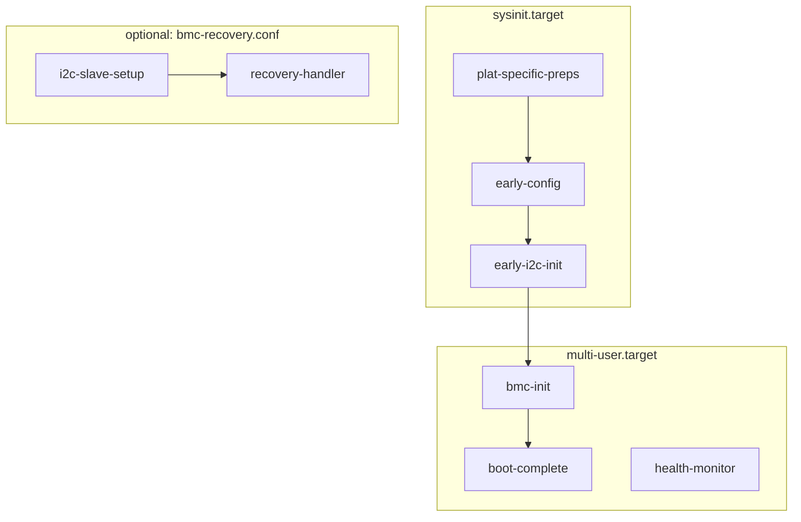

# hw-management BMC (SONiC BMC / Microsoft Sonic BMC OS)

This directory contains the BMC-side components for building the **hw-management-bmc** Debian package for systems using **AST2700** with **Microsoft Sonic BMC OS** (instead of OpenBMC).

The layout mirrors the main `hw-mgmt` tree so the same packaging approach (e.g. `debian/rules` copying from `bmc/usr/`) can be used when building the BMC variant of the package.

## Repository tree (`bmc/`)

Top-level files and everything under `usr/` as tracked in this branch:

```
bmc/
├── copy-from-openbmc.sh          # Helper: pull OpenBMC meta-nvidia files into bmc/ with naming rules
├── FILE_MAPPING.md               # OpenBMC path → bmc/ checklist
├── README.md                     # This file
└── usr/
    ├── etc/
    │   └── HI193/                # Example platform ID (add HI162, HI176, … as needed)
    │       ├── 71-hw-management-events.rules
    │       ├── hw-management-a2d-leakage-config.json
    │       ├── hw-management-bmc.conf
    │       ├── hw-management-bmc-early-i2c-devices.json
    │       ├── hw-management-bmc-ready.sh
    │       ├── hw-management-events.sh
    │       └── hw-management-platform.conf
    ├── lib/
    │   ├── systemd/system/
    │   │   ├── hw-management-bmc-boot-complete.service
    │   │   ├── hw-management-bmc-early-config.service
    │   │   ├── hw-management-bmc-early-i2c-init.service
    │   │   ├── hw-management-bmc-health-monitor.service
    │   │   ├── hw-management-bmc-init.service
    │   │   ├── hw-management-bmc-i2c-slave-setup.service
    │   │   ├── hw-management-bmc-plat-specific-preps.service
    │   │   ├── hw-management-bmc-recovery-handler.service
    │   │   └── hw-management-bmc-reset-cause-logger.service
    │   └── udev/rules.d/
    │       └── 99-mctp.rules     # Optional: installed to /lib/udev/rules.d by the package; may be dropped later
    └── usr/bin/
        ├── hw-management-bmc-devtree-check.sh
        ├── hw-management-bmc-devtree.sh
        ├── hw-management-bmc-early-config.sh
        ├── hw-management-bmc-early-i2c-init.sh
        ├── hw-management-bmc-gpio-set.sh
        ├── hw-management-bmc-health-monitor.sh
        ├── hw-management-bmc-helpers.sh
        ├── hw-management-bmc-i2c-boot-progress.sh
        ├── hw-management-bmc-i2c-slave-config.sh
        ├── hw-management-bmc-i2c-slave-setup.sh
        ├── hw-management-bmc-plat-specific-preps.sh
        ├── hw-management-bmc-powerctrl.sh
        ├── hw-management-bmc-ready-common.sh
        ├── hw-management-bmc-recovery-handler.sh
        ├── hw-management-bmc-reset-cause-logger.sh
        ├── hw-management-bmc-set-extra-params.sh
        └── hw-management-bmc.sh
```

On the target system, **`usr/etc/<PLATFORM_ID>/`** is installed as **`/usr/etc/<PLATFORM_ID>/`** (not under `/etc/`). Additional platform directories (e.g. **HI162**, **HI176**) follow the same pattern as **HI193**.

Optional trees (kernel patches, U-Boot) may live under **`recipes-kernel/`** in other branches; they are not present in all checkouts.

## systemd units: scripts, dependencies, and boot order

Units are installed to **`/lib/systemd/system/`**. Below: **`ExecStart`** / **`ExecStartPre`**, ordering keywords, and **`WantedBy`** (when enabled).

### Boot timeline (summary)

1. **Before / at sysinit:** reset-cause logger runs very early (`Before=sysinit.target`).
2. **Sysinit chain (`WantedBy=sysinit.target`):** plat-specific deploy → early-config → early I2C init (strict order via **`After=`** / **`Before=`**).
3. **Multi-user:** BMC init (ready script) → boot-complete (ready-common + I2C boot progress), plus health monitor; optional I2C recovery stack if **`/etc/bmc-recovery.conf`** exists.



### Unit reference

| Unit | Type | Main script(s) | Install target | Ordering / dependencies |
|------|------|----------------|----------------|-------------------------|
| **hw-management-bmc-reset-cause-logger** | oneshot | `/usr/bin/hw-management-bmc-reset-cause-logger.sh` | `WantedBy=sysinit.target` | **`After=local-fs.target`**, **`Before=sysinit.target`**. **`ConditionPathExists=`** the script. |
| **hw-management-bmc-plat-specific-preps** | oneshot | `/usr/bin/hw-management-bmc-plat-specific-preps.sh` | `WantedBy=sysinit.target` | **`After=local-fs.target`**. **`Before=`** `hw-management-bmc-early-config`, **`systemd-modules-load`**, **`basic.target`**, **`systemd-udevd`**. Deploys **`/usr/etc/<HID>/`** → `/etc/`, `/etc/modprobe.d/`, `/usr/bin/`, `/lib/udev/rules.d/`. |
| **hw-management-bmc-early-config** | oneshot | `/usr/bin/hw-management-bmc-early-config.sh` | `WantedBy=sysinit.target` | **`After=`** `local-fs` **and** `hw-management-bmc-plat-specific-preps`. **`Before=`** `systemd-modules-load`, **`hw-management-bmc-early-i2c-init`**. Copies from **`/usr/etc/<HID>/`** (legacy **`/etc/<HID>/`**) into **`/etc/hw-management-bmc/`**, early I2C JSON, **`/usr/bin/*.sh`**. |
| **hw-management-bmc-early-i2c-init** | oneshot | `/usr/bin/hw-management-bmc-early-i2c-init.sh` | `WantedBy=sysinit.target` | **`After=`** `hw-management-bmc-early-config`. **`Before=`** `nvidia_update_mac.service`. Creates early I2C devices from **`/etc/hw-management-bmc-early-i2c-devices.json`**. |
| **hw-management-bmc-init** | oneshot | `/bin/bash /usr/bin/hw-management-bmc-ready.sh` | `WantedBy=multi-user.target` | **`After=`** `local-fs`, **`hw-management-bmc-early-i2c-init`**. **`Requires=`** early-i2c-init. **`Before=`** `hw-management-bmc-boot-complete`. **`ConditionPathExists=`** `/usr/bin/hw-management-bmc-ready.sh`. |
| **hw-management-bmc-boot-complete** | simple | **`ExecStartPre=`** `/usr/bin/env hw-management-bmc-ready-common.sh`; **`ExecStart=`** `/usr/bin/env hw-management-bmc-i2c-boot-progress.sh` | `WantedBy=multi-user.target` | **`After=`** `hw-management-bmc-early-i2c-init`, **`hw-management-bmc-init`**. **`Requires=`** early-i2c-init. **`Wants=`** bmc-init (ordering without hard-failing if init is disabled). |
| **hw-management-bmc-health-monitor** | simple | `/usr/bin/hw-management-bmc-health-monitor.sh` | `WantedBy=multi-user.target` | **`After=multi-user.target`**, **`Wants=syslog.target`**. **`Restart=always`**. |
| **hw-management-bmc-i2c-slave-setup** | oneshot | `/usr/bin/hw-management-bmc-i2c-slave-setup.sh` | `WantedBy=multi-user.target` | **`After=multi-user.target`**. **`Before=`** `hw-management-bmc-recovery-handler`. **`ConditionPathExists=/etc/bmc-recovery.conf`**. |
| **hw-management-bmc-recovery-handler** | simple | `/usr/bin/hw-management-bmc-recovery-handler.sh` | `WantedBy=multi-user.target` | **`After=`** `multi-user.target`, **`hw-management-bmc-i2c-slave-setup`**. **`Requires=`** i2c-slave-setup. **`EnvironmentFile=/etc/bmc-recovery.conf`**. **`ConditionPathExists=/etc/bmc-recovery.conf`**. **`Restart=always`**. |

Scripts **`hw-management-bmc-powerctrl.sh`**, **`hw-management-bmc-devtree.sh`**, **`hw-management-bmc-gpio-set.sh`**, etc., are invoked by other scripts, **udev**, or operators; they are not tied 1:1 to a dedicated systemd unit in this package.

### Platform deploy (what plat-specific-preps does)

Early in boot, **`hw-management-bmc-plat-specific-preps.sh`** copies packaged files from **`/usr/etc/<HID>/`** (e.g. **HI193** from device-tree **hid193**) into:

- **`/etc/`** — all **`*.json`**, **`hw-management-platform.conf`**
- **`/etc/modprobe.d/hw-management-bmc.conf`** — from **`hw-management-bmc.conf`**
- **`/usr/bin/`** — all **`*.sh`**
- **`/lib/udev/rules.d/`** — all **`*.rules`** (e.g. **`71-hw-management-events.rules`**)

Add more platform trees as **`/usr/etc/HIxxx/`** for other boards.

### Early config service (`hw-management-bmc-early-config.service`)

Runs **before** kernel modules load. It reads **`/usr/etc/<HID>/`** (fallback **`/etc/<HID>/`**) and copies into hw-management runtime paths:

| Source under `/usr/etc/<HID>/` | Runtime location |
|--------------------------------|------------------|
| hw-management-a2d-leakage-config.json | /etc/hw-management-bmc/a2d-leakage-config.json |
| hw-management-platform.conf | /etc/hw-management-bmc/platform.conf |
| hw-management-bmc-early-i2c-devices.json (or legacy path under hw-management-spc6-ast2700-a1-bmc/) | /etc/hw-management-bmc-early-i2c-devices.json |
| Any **`*.sh`** in the platform dir | /usr/bin/ (basename preserved) |

Optional long-name OpenBMC platform scripts (**`hw-management-spc6-ast2700-a1-*.sh`**) are also copied when present.

**HID** defaults to **HI193** in **`hw-management-bmc-early-config.sh`**; override with env **`HID=<id>`**. Later: detect HID from BMC EEPROM.

### Power control (`hw-management-bmc-powerctrl.sh`)

Host/board power actions (power_on, power_off, reset, reset_board, grace_off, grace_reset) via sysfs. Not started by a dedicated unit here; callable from other automation. OpenBMC-style host-state D-Bus updates are not used on SONiC BMC (helpers are no-ops / defaults).

## Source mapping (OpenBMC → bmc/)

| OpenBMC path | bmc/ destination |
|--------------|------------------|
| meta-nvidia/meta-switch/recipes-nvidia/**health-monitor**/files/*.service | usr/lib/systemd/system/ |
| meta-nvidia/meta-switch/recipes-nvidia/**bmc-post-boot-cfg**/files/*.service | usr/lib/systemd/system/ |
| meta-nvidia/meta-switch/meta-ast2700/meta-**spc6-ast2700-a1**/.../71-hw-management-events.rules | usr/etc/HI193/ (→ `/lib/udev/rules.d/` via plat-specific-preps at boot) |
| meta-nvidia/meta-switch/meta-ast2700/meta-**spc6-ast2700-a1**/.../a2d_leakage_config.json (as **hw-management-a2d-leakage-config.json**), platform_config (as **hw-management-platform.conf**), spc6-bmc.conf (as **hw-management-bmc.conf**), spc6-ast2700-a1-bmc/ | usr/etc/HI193/ |
| meta-nvidia/.../bmc-post-boot-cfg/files/*.sh, spc6-ast2700-a1/.../*.sh, hw-management*.sh, etc. | usr/usr/bin/ |

See **FILE_MAPPING.md** in this directory for the full list and copy/update steps.

## Related deliverables (for Microsoft SONiC BMC)

- Platform-specific kernel patches (when present under **`recipes-kernel/`**)
- DTS (device tree)
- Low-level Debian package (this tree)
- Leakage detection service
- Power control
- Networking: USB host–BMC interface
- MCTP: MCTP over I3C to Spectrum-6 ASICs, MCTP over IRoT for BMC

See **doc/SONiC_BMC_NVIDIA_Deliverables.md** in the repo for the high-level doc aimed at the Microsoft team.
