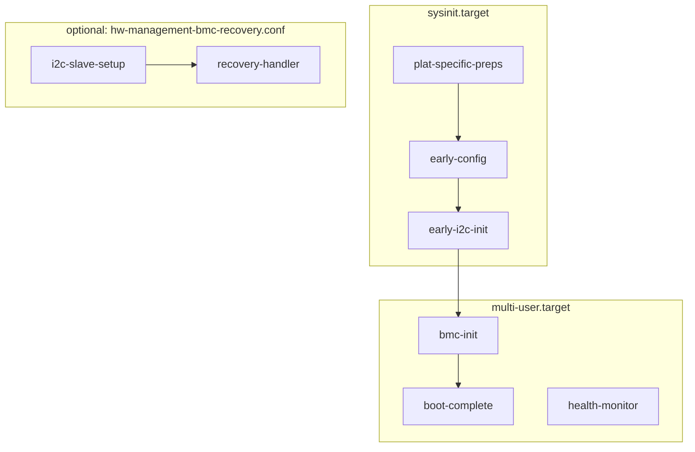

<!-- SPDX-FileCopyrightText: NVIDIA CORPORATION & AFFILIATES -->

# hw-management BMC (SONiC BMC / Microsoft Sonic BMC OS)

This directory contains the BMC-side components for building the **hw-management-bmc** Debian package for systems using **AST2700** with **Microsoft Sonic BMC OS** (instead of OpenBMC).

The layout mirrors the main `hw-mgmt` tree so the same packaging approach (e.g. `debian/rules` copying from `bmc/usr/`) can be used when building the BMC variant of the package.

**Adding a new platform (`HINNN`):** see **`bmc/DEVELOPER_GUIDE.md`** (mandatory vs optional files under **`bmc/usr/etc/HINNN/`**, kernel baseline, **`debian/rules`**).

**SPDX / JSON (future):** Shell scripts and comment-friendly configs under `bmc/usr/etc/<HID>/` (e.g. `*.conf`, `*.rules`) use `# SPDX-FileCopyrightText: NVIDIA CORPORATION & AFFILIATES` where appropriate. JSON in those directories (GPIO, A2D, early I2C, etc.) does not carry SPDX metadata yet—JSON has no `#` comments; if needed later, add a policy-approved SPDX field (e.g. top-level string or SPDX JSON) in those files.

## Building the `hw-management-bmc` Debian package

Build from the **hw-management source root** — the directory that contains **`debian/`**, **`usr/`** (host payload), and **`bmc/`** (BMC payload). **`debian/control`** defines two binary packages; **`debian/rules`** selects which ones are produced using **Debian build profiles** (see the comment block at the top of **`debian/rules`** and **`.github/workflows/build-release.yml`** when present).

| `DEB_BUILD_PROFILES` / `dpkg-buildpackage -P` | Binary package(s) built |
|-------------------------------------------------|-------------------------|
| *(unset — default)* | **`hw-management`** (host) **and** **`hw-management-bmc`** (BMC) |
| **`pkg.hw-mgmt.bmc-only`** | **`hw-management-bmc`** only |
| **`pkg.hw-mgmt.cpu-only`** | **`hw-management`** only |

**Control-file wiring:** **`hw-management`** uses **`Build-Profiles: <!pkg.hw-mgmt.bmc-only>`** (dropped when the **`bmc-only`** profile is active). **`hw-management-bmc`** uses **`Build-Profiles: <!pkg.hw-mgmt.cpu-only>`** (dropped when **`cpu-only`** is active).

**Prerequisites (typical):** `build-essential`, **`debhelper` (≥ 10)**, **`fakeroot`**.

**Example — BMC package only:**

```bash
cd /path/to/hw-mgmt    # repository root; must contain debian/ and bmc/

# Either pass the profile to dpkg-buildpackage:
dpkg-buildpackage -us -uc -b -Ppkg.hw-mgmt.bmc-only

# Or set the environment variable (also honored by debuild / some wrappers):
DEB_BUILD_PROFILES=pkg.hw-mgmt.bmc-only dpkg-buildpackage -us -uc -b
```

Built **`*.deb`** files appear in the **parent** of the build directory (e.g. **`../hw-management-bmc_<version>_<arch>.deb`**).

**What `debian/rules` installs into `hw-management-bmc` today** (under **`override_dh_auto_install`**, when **`with_bmc=1`**): **`bmc/usr/lib/systemd/system/*.service`** → **`/lib/systemd/system/`**; **`bmc/usr/lib/udev/rules.d/*`** → **`/lib/udev/rules.d/`**; **`bmc/usr/usr/bin/*`** → **`/usr/bin/`**; **`bmc/usr/etc/HI189/*`** → **`/etc/HI189/`** (source tree keeps **`bmc/usr/etc/<HID>/`**; on the image that becomes **`/etc/<HID>/`**). Extend **`debian/rules`** when new trees under **`bmc/usr/`** must be shipped (e.g. additional **`etc/<HID>/`** or **`usr/etc/systemd/network/`**).

## Deployment of BMC kernel patches

Vendor kernel patches for the BMC live under **`recipes-kernel/linux/linux-<kver>/`** in the **hw-mgmt** repository (same tree as **`debian/`**). Integration uses **`recipes-kernel/linux/deploy_kernel_patches.py`**, which copies patches into the customer’s kernel tree and can append to a **`series`** file.

| Argument | Meaning |
|----------|---------|
| *(omit)* **`--patch_table`** | Load **`recipes-kernel/linux/Patch_Status_Table.txt`** (resolved under **`--src_folder`**, which defaults to the script directory). |
| **`--patch_table Patch_BMC_Status_Table.txt`** | Load that table instead (same path rules; use for a second deploy pass). |

Patch order follows the **rows in the active table**, not the numeric prefix in the filename.

**SONiC BMC (Linux 6.12 and similar):** some NVIDIA patches depend on SONiC’s common Aspeed/JTAG baseline already applied in the kernel tree. Use two steps:

1. Run **`deploy_kernel_patches.py`** with the default table (**`Patch_Status_Table.txt`**) and your usual **`--kernel_version`**, destination, and **`--series_file`** arguments.
2. Apply SONiC’s Aspeed (and related) patches in that tree.
3. Run **`deploy_kernel_patches.py`** again with **`--patch_table Patch_BMC_Status_Table.txt`** (same kernel version and destinations) so entries listed only there—e.g. JTAG header/mux and BMC DTS—are copied **after** the baseline.

See the comment block at the top of **`recipes-kernel/linux/Patch_BMC_Status_Table.txt`** for the same flow in brief.

## Repository tree (`bmc/`)

Top-level files and everything under `usr/` as tracked in this branch:

```
bmc/
├── DEVELOPER_GUIDE.md            # New HINNN platform: files, kernel baseline, packaging
├── copy-from-openbmc.sh          # Helper: pull OpenBMC meta-nvidia files into bmc/ with naming rules
├── examples/                     # Reference layouts / sample JSON (not installed as-is unless packaged)
│   ├── hw-management-bmc-a2d-leakage-config-example.json
│   ├── hw-management-bmc-bom-example.json
│   ├── hw-management-bmc-gpio-config-example.json
│   ├── hw-management-bmc-eeprom-sysfs.txt
│   ├── hw-management-bmc-eeprom-config.txt
│   ├── hw-management-bmc-system-sysfs.txt
│   ├── hw-management-bmc-leakage-sysfs.txt
│   ├── hw-management-bmc-platform-config.txt
│   ├── hw-management-bmc-thermal-sysfs.txt
│   ├── hw-management-bmc-boot-complete-config.txt
│   └── README.md                 # Index of these files
├── FILE_MAPPING.md               # OpenBMC path → bmc/ checklist
├── README.md                     # This file
└── usr/
    ├── etc/
    │   ├── systemd/
    │   │   └── network/
    │   │       └── 00-hw-management-bmc-usb0.network   # template; Address=__USB0_ADDRESS__ filled at boot
    │   └── HI189/                # Reference platform (device-tree hid189 → /etc/HI189/ on target); add HI162, HI176, … as needed
    │       ├── 5-hw-management-bmc-events.rules
    │       ├── 99-hw-management-bmc-mctp.rules   # IRoT MCTP (mctpirot*); symlinked to /lib/udev/rules.d by plat-specific-preps
    │       ├── hw-management-bmc-a2d-leakage-config.json
    │       ├── hw-management-bmc-bom.json   # SMBIOS BOM alternates → /etc/hw-management-bmc-bom.json (hw-management-bmc-devtree.sh)
    │       ├── hw-management-bmc-boot-complete.conf   # → /etc/hw-management-bmc-boot-complete.conf (boot gate)
    │       ├── hw-management-bmc-gpio-pins.json   # GPIO sysfs init → /etc/hw-management-bmc-gpio-pins.json
    │       ├── hw-management-bmc.conf
    │       ├── hw-management-bmc-early-i2c-devices.json
    │       ├── hw-management-bmc-events.sh
    │       ├── hw-management-bmc-network.conf   # USB0_ADDRESS=… → /etc/hw-management-bmc-usb0.conf + .network
    │       └── hw-management-bmc-platform.conf
    ├── lib/
    │   └── systemd/system/
    │       ├── hw-management-bmc-boot-complete.service
    │       ├── hw-management-bmc-early-config.service
    │       ├── hw-management-bmc-early-i2c-init.service
    │       ├── hw-management-bmc-health-monitor.service
    │       ├── hw-management-bmc-init.service
    │       ├── hw-management-bmc-i2c-slave-setup.service
    │       ├── hw-management-bmc-plat-specific-preps.service
    │       ├── hw-management-bmc-recovery-handler.service
    │       └── hw-management-bmc-reset-cause-logger.service
    └── usr/bin/
        ├── hw-management-bmc-a2d-leakage-config.sh
        ├── hw-management-bmc-a2d-leakage-read.sh
        ├── hw-management-bmc-bios-recovery-flash.sh
        ├── hw-management-bmc-devtree-check.sh
        ├── hw-management-bmc-devtree.sh
        ├── hw-management-bmc-early-config.sh
        ├── hw-management-bmc-early-i2c-init.sh
        ├── hw-management-bmc-gpio-set.sh
        ├── hw-management-bmc-health-monitor.sh
        ├── hw-management-bmc-helpers-common.sh
        ├── hw-management-bmc-helpers.sh
        ├── hw-management-bmc-boot-complete.sh
        ├── hw-management-bmc-cpld-dump.sh
        ├── hw-management-bmc-generate-dump.sh
        ├── hw-management-bmc-i2c-slave-config.sh
        ├── hw-management-bmc-i2c-slave-setup.sh
        ├── hw-management-bmc-json-parser.sh
        ├── hw-management-bmc-leakage-handler.sh
        ├── hw-management-bmc-max1363-force-alarm.sh
        ├── hw-management-bmc-max1363-read-status.sh
        ├── hw-management-bmc-plat-specific-preps.sh
        ├── hw-management-bmc-powerctrl.sh
        ├── hw-management-bmc-ready.sh
        ├── hw-management-bmc-ready-common.sh
        ├── hw-management-bmc-recovery-handler.sh
        ├── hw-management-bmc-reset-cause-logger.sh
        ├── hw-management-bmc-set-extra-params.sh
        └── hw-management-bmc.sh
```

On the target system, **`bmc/usr/etc/<PLATFORM_ID>/`** from the package is installed as **`/etc/<PLATFORM_ID>/`** (alongside other **`/etc`** config). Additional platform directories (e.g. **HI162**, **HI176**) follow the same pattern as **HI189**.

Optional trees (kernel patches, U-Boot) may live under **`recipes-kernel/`** in other branches; they are not present in all checkouts.

### Examples (`bmc/examples/`)

Documentation and sample data only. Nothing here is required at runtime unless your image recipe explicitly installs a file (e.g. the JSON is a **reference** for building **`/etc/hw-management-bmc-a2d-leakage-config.json`**).

| File | Contents |
|------|----------|
| **`hw-management-bmc-a2d-leakage-config-example.json`** | Field reference, **`example_leak_detectors`**, and **`deployment_note`** for A2D leakage JSON consumed by **`hw-management-bmc-a2d-leakage-config.sh`**. |
| **`hw-management-bmc-bom-example.json`** | Shape-only reference for **`/etc/hw-management-bmc-bom.json`**: top-level arrays **`swb`**, **`platform`**, **`pwr`** of **`{"key","spec"}`** objects; each **`spec`** is four space-separated fields: driver name, hex I2C address, Linux I2C bus (BMC adapter #), and devtree label. Loaded by **`hw-management-bmc-devtree.sh`** (override with **`HW_MANAGEMENT_BMC_BOM_JSON`**). Shipped per platform as **`usr/etc/<HID>/hw-management-bmc-bom.json`** (e.g. HI189), copied to **`/etc/`** by plat-specific-preps; the **`examples/`** file matches the schema — bus numbers are board-specific. |
| **`hw-management-bmc-gpio-config-example.json`** | Field reference for **`/etc/hw-management-bmc-gpio-pins.json`**: **`bmc_stby_ready`**, **`pins[]`** (**`chip`**, **`offset`**, **`direction`**, **`value`**, **`symlink`**); deployable copy under **`example_platform`**. |
| **`hw-management-bmc-leakage-sysfs.txt`** | ASCII tree and notes for **`/var/run/hw-management/leakage/`** (per-detector dirs, channel **`type`** **`rop`/`flex`**, **`ChnlNames`**, handler **`last_sample`** / **`last_event`**). |
| **`hw-management-bmc-system-sysfs.txt`** | **`/var/run/hw-management/system/`**: reference lists for **mlxreg-io** / **mlxreg-hotplug** attrs (HI189 / **`nvsw_bmc_hid189_*`** in kernel patch for **`nvidia,hid189`**), udev rules, and GPIO **`symlink`** names from **`hw-management-bmc-gpio-pins.json`**. |
| **`hw-management-bmc-eeprom-config.txt`** | **`/etc/hw-management-bmc-eeprom.conf`**: VPD EEPROM shell variables (**`eeprom_file`**, HID/BOM sizes/offsets); packaged under **`usr/etc/<HID>/`**, sourced by **`hw-management-bmc-ready-common.sh`**. |
| **`hw-management-bmc-eeprom-sysfs.txt`** | Example layout for **`/var/run/hw-management/eeprom/`** (**`eeprom_system`**, **`eeprom_bmc`**) from udev **`hw-management-bmc-events.sh`** / **`5-hw-management-bmc-events.rules`**. |
| **`hw-management-bmc-thermal-sysfs.txt`** | Example layout for **`/var/run/hw-management/thermal/`** (CPU/BMC **`temp1_*`** symlinks). |
| **`hw-management-bmc-boot-complete-config.txt`** | Reference for **`/etc/hw-management-bmc-boot-complete.conf`**: **`SYSFS_SYSTEM_COUNTER`**, **`SYSFS_THERMAL_COUNTER`**, **`SYSFS_EEPROM_COUNTER`**, and optional timeout/poll for **`hw-management-bmc-boot-complete.sh`**. |
| **`hw-management-bmc-platform-config.txt`** | Reference for **`/etc/hw-management-bmc-platform.conf`** (from **`usr/etc/<HID>/hw-management-bmc-platform.conf`**): **`POWER_ON_POLICY`** (**`AlwaysOff`** / **`AlwaysOn`** / **`Restore`**), **`POWER_POLICY_DELAY`** (seconds → microseconds in **`get_power_restore_delay()`**), **`CPLD_I2C_BUS`**, **`MGMT_IF_NUM`**; consumed by **`hw-management-bmc-helpers.sh`** and **`hw-management-bmc-helpers-common.sh`**. |
| **`README.md`** | Short index of the **`examples/`** directory (this table in brief form). |

### Helper libraries (`usr/usr/bin/`)

| Script | Role |
|--------|------|
| **`hw-management-bmc-helpers-common.sh`** | From OpenBMC **`hw-management-helpers-common.sh`**: shared routines (**`log_event`**, **`log_cpld_dump`** — compact CPLD read for events), PHY **`mdio`** helpers, **`bmc_init_eth`**, **`get_mgmt_board_revision`**, etc.). **`hw-management-bmc-ready.sh`** sources it before **`hw-management-bmc-helpers.sh`**. Requires **bash** (uses **`[[ ]]`, `(( ))`, …). |
| **`hw-management-bmc-cpld-dump.sh`** | **Merged** from OpenBMC **`recipes-phosphor/dump/files/cpld_dump.sh`** and **`dump_utils.sh`** (**`take_cpld_dump_internal`**, **`take_cpld_dump`** only). Full **grid** CPLD register dump, optional **`.tar.xz`** packaging (**`-p`**, **`-i`**). Uses **`log_message`** and **`${HW_MANAGEMENT_BMC_PLATFORM_CONF:-/etc/hw-management-bmc-platform.conf}`** (via **`hw-management-bmc-helpers-common.sh`**); no **`switch-erots-info.sh`**, no Phosphor **`add_copy_file`**. Requires **bash**. |
| **`hw-management-bmc-generate-dump.sh`** | SONiC BMC debug bundle (same idea as host **`hw-management-generate-dump.sh`**). Collects **`dmesg`**, **`proc/`**, **`network/`**, **`i2c/`** (non-mux buses), CPLD (**`take_cpld_dump`**), **`systemctl/`** for **`hw-management-bmc*`**, **`systemd-analyze/`** (boot timing, **`blame`**, **`critical-chain`** — see below), and **`var_run_hw-management/`** (runtime tree + values; EEPROM via **`hexdump -C`**). Default output **`/tmp/hw-mgmt-bmc-dump.tar.gz`**. Requires **bash**. |
| **`hw-management-bmc-json-parser.sh`** | From OpenBMC **`switch_json_parser.sh`**: **`json_validate`**, **`json_get_nested_array_element`**, etc. (awk/BusyBox). Sourced by **`hw-management-bmc-a2d-leakage-config.sh`**, **`hw-management-bmc-early-i2c-init.sh`**, **`hw-management-bmc-gpio-set.sh`** (**`bmc_init_sysfs_gpio`**). |
| **`hw-management-bmc-helpers.sh`** | Platform / ASIC helpers; sources **`hw-management-bmc-helpers-common.sh`** by absolute path. |
| **`hw-management-bmc-a2d-leakage-read.sh`** | From OpenBMC **`a2d_leakage_read.sh`**: walks **`/var/run/hw-management/leakage/<idx>/<bus>-<addr>/`** (after **`hw-management-bmc-a2d-leakage-config.sh`**), reads **ADS1015** channels via **`i2ctransfer`** and writes per-channel **`value`** (volts); **MAX1363** path is still a placeholder. Requires **`bash`**, **`bc`**, **`i2ctransfer`**. |
| **`hw-management-bmc-max1363-force-alarm.sh`** | From OpenBMC **`max1363_force_alarm.sh`**: debug — programs tight/safe per-channel thresholds so selected channels hit alarm (**`i2ctransfer`**). **`#!/bin/sh`**. |
| **`hw-management-bmc-max1363-read-status.sh`** | From OpenBMC **`max1363_read_status.sh`**: debug — prints first read bytes / decoded status flags (**`i2ctransfer`**, **`awk`**). **`#!/bin/sh`**. |
| **`hw-management-bmc-bios-recovery-flash.sh`** | From OpenBMC **`bios-recovery-flash.sh`**: BMC-side host BIOS recovery — writes CPLD **`spi_chnl_select`** then **`flashcp`** to **`spidev`** (default **`/dev/spidev1.0`**). Requires **`mtd-utils`**, hw-management runtime (**`/var/run/hw-management/system/spi_chnl_select`**). **`#!/bin/bash`**. |

### BIOS recovery flash (`hw-management-bmc-bios-recovery-flash.sh`)

Stand-alone operator tool — **no** **`systemd`** unit; invoke from the shell when you need to program the host BIOS from the BMC while the CPU is unavailable.

| Topic | Notes |
|-------|--------|
| **Purpose** | Select the host BIOS SPI path via CPLD (**`spi_chnl_select`**) and copy an image to the **`spidev`** that muxes to that flash (same idea as manual **`echo … > spi_chnl_select`** then **`flashcp`**). |
| **Prerequisites** | **`mtd-utils`** (**`flashcp`** on **`PATH`**); **`/var/run/hw-management/system/spi_chnl_select`** writable (hw-management / udev has created the **`mlxreg-io`** / sysfs link); **`spidev`** device matches your board (default **`/dev/spidev1.0`** is only valid if the DTS exposes that node for the recovery path). |
| **Usage** | **`hw-management-bmc-bios-recovery-flash.sh <bios_image> [spidev] [channel]`** — **`channel`** is **`0`** or **`1`** for CPLD mux (default **`1`**). Run with no arguments to print a short usage summary. |
| **Safety** | Use a verified image and the correct **`spidev`** / channel for your SKU; flashing the wrong device or a bad image can brick the host flash path. |

### BMC debug bundle (`hw-management-bmc-generate-dump.sh`)

Archive default path: **`/tmp/hw-mgmt-bmc-dump.tar.gz`**. Top-level entries include **`dmesg.txt`**, **`uname.txt`**, **`proc/`** (**`interrupts.txt`**), **`network/`** (**`ifconfig.txt`** or **`ip addr`** fallback), **`i2c/`** (**`i2cdetect -l`**, **`i2cdetect-l_grep-v-mux.txt`**, per-bus **`i2cdetect-y_<N>.txt`**), **`systemctl/`** (**`list-units`**, **`list-unit-files`**, per-unit **`.status.txt`** / **`.show.txt`**), **`cpld/`**, **`var_run_hw-management/`** (**`tree/`**, **`values/`**).

**`systemd-analyze/`** — best-effort; if **`systemd-analyze`** is not in **`PATH`**, **`skipped.txt`** is written and the rest of the bundle is unchanged.

| File / directory | Contents |
|------------------|----------|
| **`time.txt`** | **`systemd-analyze time`** — firmware / loader / kernel / userspace summary. |
| **`blame.txt`** | **`systemd-analyze blame`** — units sorted by startup time (includes **oneshot** services in the boot graph). |
| **`blame_hw-management-bmc_only.txt`** | Lines from **`blame.txt`** containing **`hw-management-bmc`**. |
| **`critical-chain_default.target.txt`** | **`systemd-analyze critical-chain default.target`**. |
| **`critical-chain_sysinit.target.txt`** | **`systemd-analyze critical-chain sysinit.target`**. |
| **`critical-chain_per_unit/`** | **`systemd-analyze critical-chain <unit>`** for each **`hw-management-bmc*.service`** (filename = unit with **`/` `@` `:`** → **`_`**). Capped count per run; if truncated, **`README_cap.txt`** notes the limit. |

### Shell portability (BusyBox `ash` vs bash)

SONiC BMC images often ship **BusyBox** (`/bin/sh` → **ash**) and may also include **bash**. Scripts were checked with **`busybox ash -n`** (syntax parse):

| Script | BusyBox `ash` | Notes |
|--------|---------------|--------|
| **`hw-management-bmc-a2d-leakage-config.sh`** | Yes | **`#!/bin/sh`** — POSIX-style, no bash arrays / `[[ ]]`. |
| **`hw-management-bmc-a2d-leakage-read.sh`** | **bash** | Associative arrays, **`[[`**, **`declare -A`**; requires **`bc`** for voltage math. |
| **`hw-management-bmc-max1363-force-alarm.sh`**, **`hw-management-bmc-max1363-read-status.sh`** | Yes | **`#!/bin/sh`** — POSIX **`[`** and **`i2ctransfer`**. |
| **`hw-management-bmc-leakage-handler.sh`** | Yes | Uses `[`, `awk`; **`shopt -s nullglob`** is supported by BusyBox ash. |
| **`hw-management-bmc-early-config.sh`**, **`hw-management-bmc-plat-specific-preps.sh`**, **`hw-management-bmc-early-i2c-init.sh`**, **`hw-management-bmc-recovery-handler.sh`**, and most other **`usr/usr/bin/*.sh`** helpers | Parse OK under ash | Shebang may still say **`#!/bin/bash`**; runtime is fine on ash-heavy systems if invoked via **`sh`** or **`ash`**. |
| **`hw-management-bmc-devtree.sh`**, **`hw-management-bmc-devtree-check.sh`**, **`hw-management-bmc.sh`** | **bash** | Associative arrays / bash-only syntax; require **`bash`**. |
| **`hw-management-bmc-powerctrl.sh`** | **bash** | **`#!/bin/bash`**, **`set -euo pipefail`**, **`logger`** for journal messages; requires **`bash`**. |
| **`hw-management-bmc-boot-complete.sh`** | Yes | **`#!/bin/sh`**: waits on **`/var/run/hw-management/`** entry counts vs **`/etc/hw-management-bmc-boot-complete.conf`**. |
| **`hw-management-bmc-cpld-dump.sh`** | **bash** | **`#!/bin/bash`**: **`[[`**, **`BASH_SOURCE`**, brace expansion in **`take_cpld_dump_internal`**, sourced **`return`** guard for **`timeout bash -c '. …; take_cpld_dump_internal'`**. |
| **`hw-management-bmc-generate-dump.sh`** | **bash** | **`#!/bin/bash`**: **`[[`**, **`source`** **`hw-management-bmc-cpld-dump.sh`** (**`take_cpld_dump`**), **`find`**, **`timeout`**, **`systemd-analyze`** (optional). Uses **`tar cf - \| gzip -9`** (not GNU **`tar -I`**) and **`ls -ld`** per path (not GNU **`find -ls`**) so BusyBox **tar/find** work; **`readlink_canonical`** if **`readlink -f`** missing. Needs **`gzip`** in **`PATH`** (BusyBox or GNU). |
| **`hw-management-bmc-bios-recovery-flash.sh`** | **bash** | **`#!/bin/bash`**, **`set -e`**: **`flashcp`** (**`mtd-utils`**), **`spi_chnl_select`** sysfs. |

If **`/usr/bin/hw-management-bmc-helpers.sh`** is sourced, it is written for bash but parses under BusyBox ash; some code paths use bash-style arithmetic — prefer **`bash`** where the full helper API is used.

## systemd units: scripts, dependencies, and boot order

Units are installed to **`/lib/systemd/system/`**. Below: **`ExecStart`** / **`ExecStartPre`**, ordering keywords, and **`WantedBy`** (when enabled).

### Boot timeline (summary)

1. **Before / at sysinit:** reset-cause logger runs very early (`Before=sysinit.target`).
2. **Sysinit chain (`WantedBy=sysinit.target`):** plat-specific deploy → early-config → early I2C init (strict order via **`After=`** / **`Before=`**).
3. **Multi-user:** BMC init (ready script) → boot-complete (ready-common + sysfs entry-count gate), plus health monitor; optional I2C recovery stack if **`/etc/hw-management-bmc-recovery.conf`** exists.



### Unit reference

| Unit | Type | Main script(s) | Install target | Ordering / dependencies |
|------|------|----------------|----------------|-------------------------|
| **hw-management-bmc-reset-cause-logger** | oneshot | `/usr/bin/hw-management-bmc-reset-cause-logger.sh` | `WantedBy=sysinit.target` | **`After=local-fs.target`**, **`Before=sysinit.target`**. **`ConditionPathExists=`** the script. |
| **hw-management-bmc-plat-specific-preps** | oneshot | `/usr/bin/hw-management-bmc-plat-specific-preps.sh` | `WantedBy=sysinit.target` | **`After=local-fs.target systemd-udevd.service`** (avoids sysinit ordering cycles with **`local-fs` / NVMe-FC helpers / udev**). **`Before=`** `hw-management-bmc-early-config`, **`systemd-networkd`**. Script runs **`udevadm control --reload-rules`** and targeted **`udevadm trigger`** after installing udev rules. Deploys **`/etc/<HID>/`** (fallback **`/usr/etc/<HID>/`** on older images): **symlinks** **`*.sh`** → **`/usr/bin/`**, **`*.rules`** → **`/lib/udev/rules.d/`**, **`hw-management-bmc.conf`** → **`/etc/modprobe.d/hw-management-bmc.conf`**; **copies** **`*.json`**, **`hw-management-bmc-platform.conf`**, eeprom/boot-complete conf into **`/etc/`** (see **Platform deploy**). Also copies or generates **`hw-management-bmc-network.conf`** / **`/etc/hw-management-bmc-usb0.conf`** and renders **`/etc/systemd/network/00-hw-management-bmc-usb0.network`** (see **USB0 / systemd-networkd** below). |
| **hw-management-bmc-early-config** | oneshot | `/usr/bin/hw-management-bmc-early-config.sh` | `WantedBy=sysinit.target` | **`After=`** `local-fs` **and** `hw-management-bmc-plat-specific-preps`. **`Before=`** `systemd-modules-load`, **`hw-management-bmc-early-i2c-init`**. **Copies** A2D leakage JSON; optional files under **`/etc/hw-management-bmc/`**; early I2C JSON to **`/etc/`**; **symlinks** **`/etc/<HID>/*.sh`** → **`/usr/bin/`** (same targets as plat-specific-preps). Platform **`hw-management-bmc-platform.conf`** is deployed to **`/etc/`** by plat-specific-preps only. |
| **hw-management-bmc-early-i2c-init** | oneshot | `/usr/bin/hw-management-bmc-early-i2c-init.sh` | `WantedBy=sysinit.target` | **`After=`** `hw-management-bmc-early-config`. **`Before=`** `nvidia_update_mac.service`. Creates early I2C devices from **`/etc/hw-management-bmc-early-i2c-devices.json`**. |
| **hw-management-bmc-init** | oneshot | `/bin/bash /usr/bin/hw-management-bmc-ready.sh` | `WantedBy=multi-user.target` | **`After=`** `local-fs`, **`hw-management-bmc-early-i2c-init`**. **`Requires=`** early-i2c-init. **`Before=`** `hw-management-bmc-boot-complete`. **`ConditionPathExists=`** `/usr/bin/hw-management-bmc-ready.sh`. |
| **hw-management-bmc-boot-complete** | simple | **`ExecStartPre=`** `/usr/bin/env hw-management-bmc-ready-common.sh`; **`ExecStart=`** `/usr/bin/env hw-management-bmc-boot-complete.sh` | `WantedBy=multi-user.target` | **`After=`** `hw-management-bmc-early-i2c-init`, **`hw-management-bmc-init`**. **`Requires=`** early-i2c-init. **`Wants=`** bmc-init (ordering without hard-failing if init is disabled). When **`hw-management-bmc-boot-complete.service`** exits successfully, SONiC BMC may treat hw-management runtime as ready for dependent services. |
| **hw-management-bmc-health-monitor** | simple | `/usr/bin/hw-management-bmc-health-monitor.sh` | `WantedBy=multi-user.target` | **`After=multi-user.target`**, **`Wants=syslog.target`**. **`Restart=always`**. |
| **hw-management-bmc-i2c-slave-setup** | oneshot | `/usr/bin/hw-management-bmc-i2c-slave-setup.sh` | `WantedBy=multi-user.target` | **`After=multi-user.target`**. **`Before=`** `hw-management-bmc-recovery-handler`. **`ConditionPathExists=/etc/hw-management-bmc-recovery.conf`**. |
| **hw-management-bmc-recovery-handler** | simple | `/usr/bin/hw-management-bmc-recovery-handler.sh` | `WantedBy=multi-user.target` | **`After=`** `multi-user.target`, **`hw-management-bmc-i2c-slave-setup`**. **`Requires=`** i2c-slave-setup. **`EnvironmentFile=/etc/hw-management-bmc-recovery.conf`**. **`ConditionPathExists=/etc/hw-management-bmc-recovery.conf`**. **`Restart=always`**. |

Scripts **`hw-management-bmc-powerctrl.sh`**, **`hw-management-bmc-devtree.sh`**, **`hw-management-bmc-gpio-set.sh`**, **`hw-management-bmc-leakage-handler.sh`**, etc., are invoked by other scripts, **udev**, or operators; they are not tied 1:1 to a dedicated systemd unit in this package.

### Platform deploy (what plat-specific-preps does)

Early in boot, **`hw-management-bmc-plat-specific-preps.sh`** installs packaged files from **`/etc/<HID>/`** (e.g. **HI189** from device-tree **hid189**; fallback **`/usr/etc/<HID>/`** on older installs) as follows:

- **`/etc/`** — **copy** all **`*.json`**, **`hw-management-bmc-platform.conf`** (allows local edits without touching the package tree on read-only **`/usr`**)
- **`/etc/modprobe.d/hw-management-bmc.conf`** — **symlink** to **`hw-management-bmc.conf`** under **`/etc/<HID>/`**
- **`/usr/bin/`** — **symlinks** to each **`*.sh`** under **`/etc/<HID>/`** except **`hw-management-bmc-ready.sh`** (that script is common and ships only as **`/usr/bin/hw-management-bmc-ready.sh`** in the package)
- **`/lib/udev/rules.d/`** — **symlinks** for each **`*.rules`** (e.g. **`5-hw-management-bmc-events.rules`**, **`99-hw-management-bmc-mctp.rules`** when present)

**Why not symlink everything?** Writable **`/etc`** is often used for operator overrides and for files this script rewrites (e.g. default **`USB0_ADDRESS`**). Packaged content lives under **`/etc/<HID>/`** so it is on the writable config path; copies to **`/etc/*.json`** etc. allow operator overrides without fighting symlinks into read-only **`/usr`**. **RAM / OOM:** symlinks avoid duplicating file *content* in the overlay and reduce boot-time **writes** to writable storage; they do not materially change peak **RAM** use (short `cp` buffers are tiny compared to system RAM).
- **`/etc/hw-management-bmc-usb0.conf`** — populated by plat-specific-preps from **`hw-management-bmc-network.conf`** when packaged, or created with a default / preserved from **`/etc`** (see **BMC usb0 / systemd-networkd** below)
- **`/etc/systemd/network/00-hw-management-bmc-usb0.network`** — generated at boot (see below)
- **`/etc/hw-management-bmc-boot-complete.conf`** — from **`hw-management-bmc-boot-complete.conf`** under **`/etc/<HID>/`** when present; consumed by **`hw-management-bmc-boot-complete.sh`** (minimum entry counts under **`/var/run/hw-management/system`**, **`…/thermal`**, **`…/eeprom`** before **`hw-management-bmc-boot-complete.service`** completes)

Add more platform trees as **`/etc/HIxxx/`** on the target (built from **`bmc/usr/etc/HIxxx/`** in this tree) as needed.

#### Plat-specific-preps: HID detection and troubleshooting

- **Detection:** **`hw-management-bmc-plat-specific-preps.sh`** finds the hardware ID by walking **`/proc/device-tree`** and **`/sys/firmware/devicetree/base`** for directories named **`nvsw*`** (e.g. **`nvsw_bmc_hid189@31`** on SPC6 AST2700 BMC), then extracts **`hidNNN`** from the directory name → uses **`/etc/HINNN/`** (or **`/usr/etc/HINNN/`** on older images). The old **`find | xargs basename | grep`** pipeline was fragile (no matches, or multiple nodes); use **`systemctl status hw-management-bmc-plat-specific-preps.service`** and **`journalctl -b -u hw-management-bmc-plat-specific-preps`** to see the resolved **`sku`** line or errors.
- **Why `systemctl | grep` may omit it:** The unit is **Type=oneshot** with **`RemainAfterExit=yes`**. It often shows as **`loaded active exited`**. Query it explicitly: **`systemctl status hw-management-bmc-plat-specific-preps.service`**.
- **Missing udev rules under `/lib/udev/rules.d/`:** Usually means either HID was not detected (**`sku` empty**) or **`/etc/HINNN/`** (or legacy **`/usr/etc/HINNN/`**) was missing so the script logged **`no packaged platform dir … skip deploy`**. Install the matching **`hw-management-bmc`** package or platform directory. **Override (debug):** set **`HW_MANAGEMENT_BMC_HID_OVERRIDE=hid189`** in the unit’s **`Environment=`** or a drop-in if device-tree walk fails on your image.
- **`/var/run/hw-management/system` (and thermal/eeprom) stay empty; boot-complete counts stay at 0:** The **`5-hw-management-bmc-events.rules`** symlink must exist under **`/lib/udev/rules.d/`** after plat-specific-preps. If devices probed before rules were installed, run **`udevadm control --reload-rules && udevadm trigger`** (or reboot). Ensure the packaged **`hw-management-bmc-ready.sh`** matches this repository (SONiC BMC does not use OpenBMC **`check_rw_filesystems`** / **`check_rofs`**).
- **`hw-management-bmc-boot-complete` waits forever but eeprom/thermal already show met in the journal:** The line **`waiting system=A/B thermal=C/D eeprom=E/F`** requires **all three** **`A≥B`**, **`C≥D`**, **`E≥F`**. Example: **`eeprom=2/2`** and **`thermal=5/4`** are satisfied; if **`system=145/180`**, the gate is **`SYSFS_SYSTEM_COUNTER`** vs **`/var/run/hw-management/system/`** entry count — not the eeprom folder. After a stable boot, run **`ls -A /var/run/hw-management/system | wc -l`** and set **`SYSFS_SYSTEM_COUNTER`** in **`/etc/hw-management-bmc-boot-complete.conf`** to a minimum your platform **reliably** reaches, or fix missing **`add regio` / `add hotplug`** / GPIO links so the count increases.

### BMC usb0 / systemd-networkd (internal CPU link)

Static addressing for the BMC↔host **`usb0`** gadget interface (out-of-band link, typically link-local). **`systemd-networkd`** applies the generated **`.network`** unit; the image must ship **`systemd-networkd`** enabled if this path is used.

| Artifact | Location | Role |
|----------|----------|------|
| Template | **`usr/etc/systemd/network/00-hw-management-bmc-usb0.network`** | Shipped on the image as **`/usr/etc/systemd/network/…`**; contains **`Address=__USB0_ADDRESS__`**. Not read by networkd until rendered into **`/etc/systemd/network/`**. |
| Platform params (optional) | **`usr/etc/<HID>/hw-management-bmc-network.conf`** | One line: **`USB0_ADDRESS=<addr>/<prefix>`** (e.g. **`169.254.0.1/16`**). Copied to **`/etc/hw-management-bmc-usb0.conf`** when present. |
| Runtime params | **`/etc/hw-management-bmc-usb0.conf`** | Effective source for substitution; may be written by plat-specific-preps (packaged copy, default fallback, or left as an operator-maintained file). |
| Generated unit | **`/etc/systemd/network/00-hw-management-bmc-usb0.network`** | Written by **`hw-management-bmc-plat-specific-preps.sh`** before **`systemd-networkd`** starts. |
| SONiC **`dhclient`** guard | **`/usr/lib/systemd/system/sonic-usb-network-init.service.d/10-hw-management-bmc.conf`** | When the generated **`.network`** file exists, **`sonic-usb-network-init`** is skipped so it does not run **`dhclient`** on **`usb0`**. That avoids fighting **`systemd-networkd`** (our unit sets **`DHCP=no`** and a static **`Address=`**) and avoids AppArmor denials on **`dhclient`**. If **`.network`** generation is skipped (invalid **`USB0_ADDRESS`**), SONiC’s service can still run. |

**Boot order:** **`hw-management-bmc-plat-specific-preps.service`** has **`Before=systemd-networkd.service`**, so the **`/etc/systemd/network/`** file exists before networkd loads configuration. No race on first boot for this unit.

**Still no `usb0` address:** Confirm **`systemd-networkd`** is **enabled** and running (**`networkctl status usb0`**). This path does not use **`dhclient`**; masking **`sonic-usb-network-init`** alone is not enough if networkd is off.

**`00-` prefix:** Lexicographic ordering under **`/etc/systemd/network/`** only affects which **`.network`** file wins when several match the same interface; it does not control systemd start order. Ordering vs networkd is entirely the unit **`Before=`** dependency above.

**Defaults and overrides**

- If **`hw-management-bmc-network.conf`** is **packaged** under **`/etc/<HID>/`**, it is copied to **`/etc/hw-management-bmc-usb0.conf`** and **`USB0_ADDRESS`** is read from there. If **`USB0_ADDRESS`** is missing or fails validation (conservative **`grep -E`** CIDR pattern, BusyBox-safe), **`.network`** generation is **skipped** for that boot (fix the platform file).
- If the packaged **`hw-management-bmc-network.conf`** is **absent**: use a valid **`USB0_ADDRESS`** from existing **`/etc/hw-management-bmc-usb0.conf`** if present; otherwise apply default **`169.254.0.1/16`** and write **`/etc/hw-management-bmc-usb0.conf`** with a comment so the active value is visible.

**Changing address after install:** Edit **`/etc/hw-management-bmc-usb0.conf`** (when no packaged file overrides it each boot), or add **`hw-management-bmc-network.conf`** under the correct **`/etc/<HID>/`**. Then **`networkctl reload`** or restart **`systemd-networkd`** as usual for **`.network`** edits.

**OpenBMC sync:** **`bmc/copy-from-openbmc.sh`** can refresh the template from **`nvidia-internal-network-config`** **`00-bmc-usb0.network`**, rewriting **`Address=`** to **`Address=__USB0_ADDRESS__`**. See **Source mapping** at the end of this file.

### Early config service (`hw-management-bmc-early-config.service`)

Runs **before** kernel modules load. It reads **`/etc/<HID>/`** (fallback **`/usr/etc/<HID>/`**) and copies into hw-management runtime paths:

| Source under `/etc/<HID>/` | Runtime location |
|--------------------------------|------------------|
| hw-management-bmc-a2d-leakage-config.json | /etc/hw-management-bmc-a2d-leakage-config.json |
| hw-management-bmc-platform.conf | /etc/hw-management-bmc-platform.conf |
| hw-management-bmc-early-i2c-devices.json (or legacy path under hw-management-spc6-ast2700-a1-bmc/) | /etc/hw-management-bmc-early-i2c-devices.json |
| Any **`*.sh`** in the platform dir | /usr/bin/ (basename preserved) |

Optional long-name OpenBMC platform scripts (**`hw-management-spc6-ast2700-a1-*.sh`**) are also copied when present.

**HID** defaults to **HI189** in **`hw-management-bmc-early-config.sh`**; override with env **`HID=<id>`**. Later: detect HID from BMC EEPROM.

### A2D leakage configuration (`hw-management-bmc-a2d-leakage-config.sh`)

Platform JSON **`hw-management-bmc-a2d-leakage-config.json`** is installed as **`/etc/hw-management-bmc-a2d-leakage-config.json`**. The script reads that file, probes each leak-detector’s **`Device`** alternatives (I2C bus/address), configures registers via **`i2ctransfer`**, and publishes a small runtime tree under **`/var/run/hw-management/`** (requires **`hw-management-bmc-json-parser.sh`** on the image, installed as **`/usr/bin/hw-management-bmc-json-parser.sh`**).

**Invocation:** called from **`hw-management-bmc-ready.sh`** after I2C adapters exist — not a dedicated systemd unit by itself.

**Runtime layout** (detector index **`N`** is the 1-based position of the object in the top-level JSON array; there is **no** I2C address folder under **`leakage/`**):

| Path | Meaning |
|------|---------|
| `/var/run/hw-management/leakage/N/device_type` | Selected **`DeviceType`** string |
| `/var/run/hw-management/leakage/N/<j>/` | Per-channel directory; **`j`** = `1` … **`NumChnl`** |
| `/var/run/hw-management/leakage/N/<j>/input` | If **`Probe`** is true: symlink to the kernel IIO raw attribute (e.g. **`in_voltage*_raw`**) for that channel — **unscaled** sample |
| `/var/run/hw-management/leakage/N/<j>/min` | Low threshold from **`LoThreshRegVal`** (bytes → unsigned, big-endian) × **`Scale`** |
| `/var/run/hw-management/leakage/N/<j>/max` | High threshold from **`HiThreshRegVal`** × **`Scale`** (same rules as **`min`**) |
| `/var/run/hw-management/leakage/N/<j>/crit` | **`CriticalMax`** from JSON (engineering / config units) |
| `/var/run/hw-management/leakage/N/<j>/emerg` | **`EmergencyMax`** from JSON |
| `/var/run/hw-management/leakage/N/<j>/lcrit` | **`CriticalMin`** from JSON (optional; low-side critical bound, same units as **`crit`**) |
| `/var/run/hw-management/leakage/N/<j>/lemerg` | **`EmergencyMin`** from JSON (optional; low-side emergency bound) |
| `/var/run/hw-management/leakage/N/<j>/type` | **`Type`** from JSON (optional; sensor kind label, e.g. **`rop`**, **`flex`**) |
| `/var/run/hw-management/leakage/N/<j>/scale` | **`Scale`** from JSON |
| `/var/run/hw-management/leakage/N/<ChnlNames[i]>` | Symlink to channel index `i+1` when **`ChnlNames`** is set |

**Per-`Device` JSON (optional):** **`Device`** is an ordered list of alternatives — the first entry whose presence probe and **`configure_device`** step succeed is used (remaining entries are skipped). Put the BOM you want to win first (e.g. **`MAX1363`** before **`ADS1015`** when both can bind at the same address). Optional **`HW_MANAGEMENT_BMC_A2D_USE_ADS_HEURISTIC=1`** restores legacy behavior: skip **`MAX1363`** when the bus looks like **ADS1015** by register read. **`Probe`** — when **`true`**, the kernel driver is bound via **`/sys/bus/i2c/devices/i2c-<bus>/new_device`** *before* **`CfgReg`** / threshold **`i2ctransfer`** writes so the driver does not overwrite programmed values afterward. **`Scale`**, **`CriticalMax`**, **`EmergencyMax`**, **`CriticalMin`**, **`EmergencyMin`**, **`Type`**, **`LoThreshRegVal`**, **`HiThreshRegVal`** feed the channel files above (thresholds from registers are scaled by **`Scale`**; user limits **`Critical*`** / **`Emergency*`** are stored as given in configuration units). Driver names: **`MAX1363`** → `max1363`, **`ADS1015`** → `ads1015` (adjust for your kernel). **`input`** symlinks are created only after configuration; if sysfs names differ on your board, extend **`find_iio_channel_raw`** in the script.

Example JSON with field notes: **`bmc/examples/hw-management-bmc-a2d-leakage-config-example.json`** (includes **`field_reference`** and **`example_leak_detectors`**; deploy the bare array to **`/etc/hw-management-bmc-a2d-leakage-config.json`** — see **`deployment_note`** in that file).

### Per-leakage hotplug handler (`hw-management-bmc-leakage-handler.sh`)

Installed to **`/usr/bin/hw-management-bmc-leakage-handler.sh`**. HID-agnostic: the number of leak detectors (A2Ds) and per-detector channels is defined only by the runtime tree under **`/var/run/hw-management/leakage/`** (from **`hw-management-bmc-a2d-leakage-config.sh`**) and by platform udev rules — not by this script.

**Invocation:** **`hw-management-bmc-events.sh`** (deployed from **`/etc/<HID>/` → `/usr/bin/`** via plat-specific-preps) runs the handler in the background when udev delivers a **`hotplug-event`** whose name matches **`LEAKAGE<n>`** (digits only, e.g. **`LEAKAGE1`**, **`LEAKAGE2`**, …). **`LEAKAGE_AGGR`** and other non-numeric names are handled elsewhere.

**Arguments:**

| Arg | Meaning |
|-----|---------|
| `1` | Leak-detector index **`n`** — same **`n`** as **`/var/run/hw-management/leakage/n/`** |
| `2` | Monotonic time in milliseconds (caller uses boot-based ms from **`/proc/uptime`**) for debounce metadata |

**Behavior:** For each numeric channel subdirectory **`j`** under **`leakage/n/`**, read **`input`**, **`min`**, and **`max`**. If the raw sample is below **`min`** or above **`max`**, write **`last_sample`** (12-bit aligned code from **`input`**) and **`last_event`** (the passed-in timestamp) into that channel directory. Channels without **`input`** / thresholds are skipped.

Platform differences are limited to which **`LEAKAGE<n>`** lines appear in **`5-hw-management-bmc-events.rules`** (or equivalent) and how many detectors/channels the JSON configures; keep the generic **`LEAKAGE<n>`** branch in each HID’s **`hw-management-bmc-events.sh`** in sync when adding platforms.

### Power control (`hw-management-bmc-powerctrl.sh`)

CLI tool for host and board power transitions on SONiC BMC. It drives **mlxreg-io** sysfs attributes under the platform **hwmon** instance (resolved at runtime under **`…/i2c-14/14-0031/mlxreg-io/hwmon/hwmon*`**). Operational messages go to the system journal via **`logger -t hw-management-bmc-powerctrl`**. There is no dedicated systemd unit; call **`/usr/bin/hw-management-bmc-powerctrl.sh`** from automation, **Redfish** handlers, or operators. OpenBMC-style host-state **D-Bus** updates are not used (stub hooks **`set_host_powerstate_*`** / **`set_requested_host_transition`** are reserved for future integration).

**Invocation**

```text
/usr/bin/hw-management-bmc-powerctrl.sh <power_on|power_off|reset|reset_board|grace_off|grace_reset>
```

| Command | Effect |
|---------|--------|
| **`power_on`** | Clears **`pwr_down`**, optional **`pwr_button_halt`**, clears **`bmc_to_cpu_ctrl`**; intended host on path. |
| **`power_off`** | Sets **`pwr_down`**, clears **`uart_sel`**, sets **`bmc_to_cpu_ctrl`**; immediate host off. |
| **`reset`** | Sets **`pwr_cycle`**; immediate host power cycle. |
| **`reset_board`** | Runs **`wait_for_cpu_shutdown`** (see below), then sets **`aux_pwr_cycle`** (board-level cycle after host shutdown handshake). If **`/var/reset_bypass`** exists, logs “Power Cycle Bypass Board” semantics; otherwise “Power Cycle Board”. |
| **`grace_off`** | If **`/var/grace_reset_bypass`** exists, removes it and skips graceful off (calls **`set_requested_host_transition`** stub). Otherwise **`wait_for_cpu_shutdown`**, then **`pwr_down`**, **`uart_sel`** clear, host off. |
| **`grace_reset`** | **`wait_for_cpu_shutdown`**, then **`pwr_cycle`**. |

**Shared behavior**

- **`wait_for_cpu_shutdown`**: writes **`graceful_power_off`**, then polls **`cpu_power_off_ready`** once per second, up to **`RETRIES`** (20). Proceeds when the attribute reads **`1`** or the retry limit is hit.
- **Sysfs paths** are always under the resolved **`hwmon`** directory; attribute names include **`pwr_down`**, **`pwr_button_halt`**, **`bmc_to_cpu_ctrl`**, **`uart_sel`**, **`pwr_cycle`**, **`aux_pwr_cycle`**, **`graceful_power_off`**, **`cpu_power_off_ready`**.

## Source mapping (OpenBMC → bmc/)

| OpenBMC path | bmc/ destination |
|--------------|------------------|
| meta-nvidia/meta-switch/recipes-nvidia/**health-monitor**/files/*.service | usr/lib/systemd/system/ |
| meta-nvidia/meta-switch/recipes-nvidia/**bmc-post-boot-cfg**/files/*.service | usr/lib/systemd/system/ |
| meta-nvidia/meta-switch/meta-ast2700/recipes-nvidia/**nvidia-internal-network-config**/files/00-bmc-usb0.network | usr/etc/systemd/network/**00-hw-management-bmc-usb0.network** (via **`copy-from-openbmc.sh`**: **`Address=`** replaced by **`Address=__USB0_ADDRESS__`**) |
| meta-nvidia/meta-switch/meta-ast2700/meta-**spc6-ast2700-a1**/.../71-hw-management-events.rules | **`bmc/usr/etc/HI189/5-hw-management-bmc-events.rules`** in tree; package **`/etc/HI189/5-…`** (→ `/lib/udev/rules.d/` via plat-specific-preps at boot) |
| meta-nvidia/meta-switch/meta-ast2700/meta-**spc6-ast2700-a1**/.../a2d_leakage_config.json (as **hw-management-bmc-a2d-leakage-config.json**), platform_config (as **hw-management-bmc-platform.conf**), spc6-bmc.conf (as **hw-management-bmc.conf**), spc6-ast2700-a1-bmc/ | **`bmc/usr/etc/HI189/`** in tree → **`/etc/HI189/`** on target |
| meta-nvidia/.../bmc-post-boot-cfg/files/**switch_json_parser.sh** | usr/usr/bin/**hw-management-bmc-json-parser.sh** |
| meta-nvidia/.../bmc-post-boot-cfg/files/**hw-management-helpers-common.sh** | usr/usr/bin/**hw-management-bmc-helpers-common.sh** |
| meta-nvidia/.../bmc-post-boot-cfg/files/**a2d_leakage_read.sh** | usr/usr/bin/**hw-management-bmc-a2d-leakage-read.sh** |
| meta-nvidia/.../bmc-post-boot-cfg/files/**max1363_force_alarm.sh** | usr/usr/bin/**hw-management-bmc-max1363-force-alarm.sh** |
| meta-nvidia/.../bmc-post-boot-cfg/files/**max1363_read_status.sh** | usr/usr/bin/**hw-management-bmc-max1363-read-status.sh** |
| meta-nvidia/.../bmc-post-boot-cfg/files/**bios-recovery-flash.sh** | usr/usr/bin/**hw-management-bmc-bios-recovery-flash.sh** |
| meta-nvidia/.../bmc-post-boot-cfg/files/*.sh, spc6-ast2700-a1/.../*.sh, hw-management*.sh, etc. | usr/usr/bin/ |
| meta-nvidia/meta-switch/recipes-phosphor/**dump**/files/**cpld_dump.sh** + **dump_utils.sh** (partial; see **FILE_MAPPING.md**) | usr/usr/bin/**hw-management-bmc-cpld-dump.sh** |
| *(SONiC BMC; see **FILE_MAPPING.md** — host analog **`hw-management-generate-dump.sh`**)* | usr/usr/bin/**hw-management-bmc-generate-dump.sh** |

See **FILE_MAPPING.md** in this directory for the full list and copy/update steps.

## Related deliverables (for Microsoft SONiC BMC)

- Platform-specific kernel patches (when present under **`recipes-kernel/`**)
- DTS (device tree)
- Low-level Debian package (this tree)
- Leakage detection service
- Power control
- Networking: USB host–BMC interface
- MCTP (optional): MCTP over I3C to Spectrum-6 ASICs and MCTP over IRoT for BMC are only in scope when the customer requires PLDM-over-MCTP support; packaging, udev, and services may be omitted otherwise.
